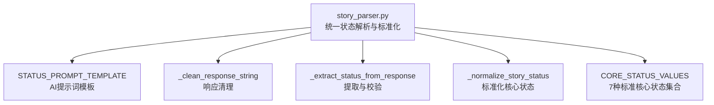
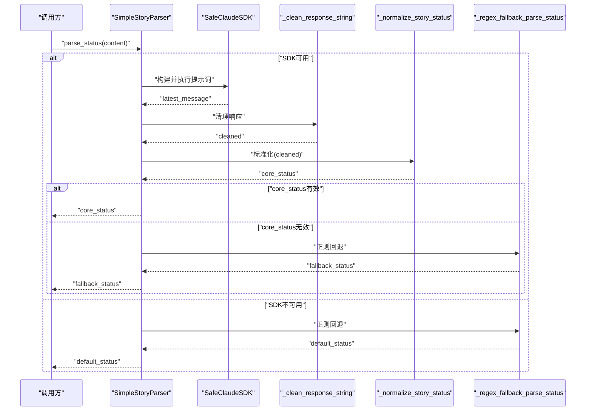
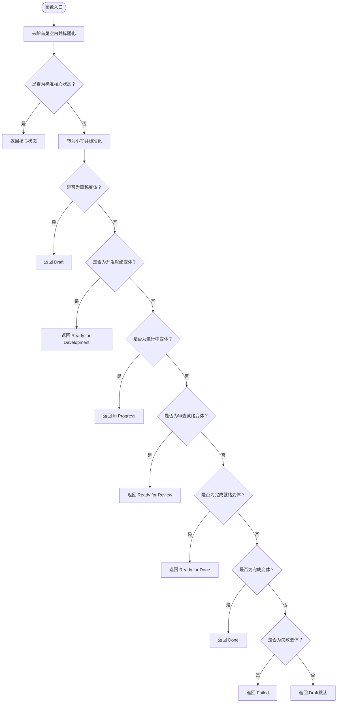
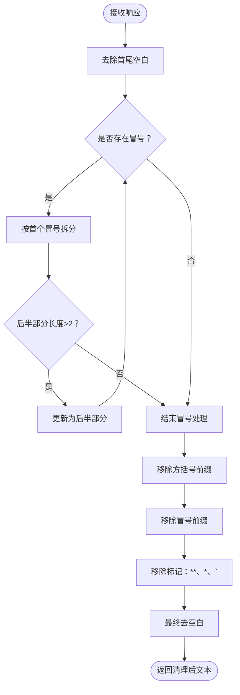
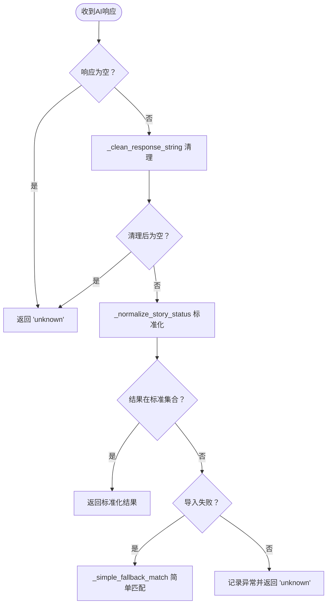
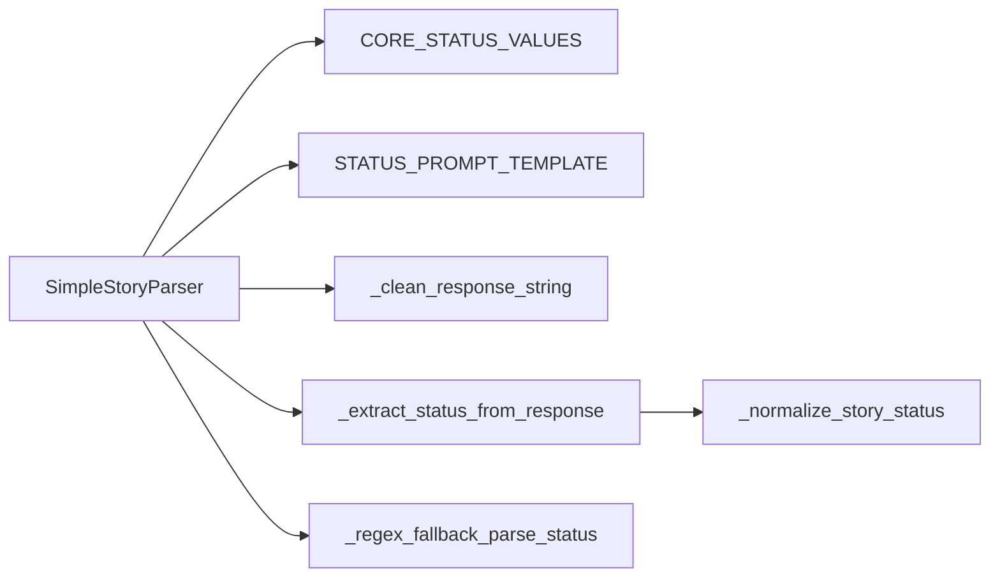

# 状态解析与标准化

<cite>
**本文引用的文件**
- [story_parser.py](file://autoBMAD/epic_automation/story_parser.py)
- [STATUS_IMPLEMENTATION.md](file://autoBMAD/epic_automation/STATUS_IMPLEMENTATION.md)
- [STANDARD_STATUS.md](file://autoBMAD/epic_automation/STANDARD_STATUS.md)
- [test_status_mapping.py](file://test_status_mapping.py)
- [REFACTORING_20260109.md](file://docs/REFACTORING_20260109.md)
- [状态系统重构实施方案.md](file://状态系统重构实施方案.md)
</cite>

## 目录
1. [引言](#引言)
2. [项目结构](#项目结构)
3. [核心组件](#核心组件)
4. [架构总览](#架构总览)
5. [详细组件分析](#详细组件分析)
6. [依赖关系分析](#依赖关系分析)
7. [性能考量](#性能考量)
8. [故障排查指南](#故障排查指南)
9. [结论](#结论)

## 引言
本文件聚焦“状态解析与标准化”主题，围绕以下目标展开：
- 解释 _normalize_story_status 如何将多种状态变体映射到7种标准核心状态值之一
- 说明 AI 优先解析策略中 STATUS_PROMPT_TEMPLATE 的设计思路与语义引导
- 描述 _clean_response_string 如何深度清理 AI 响应中的标记与噪声
- 展示 _extract_status_from_response 如何结合清理与标准化逻辑，确保返回结果有效，并在 AI 响应为空或无效时进行回退

## 项目结构
状态解析与标准化相关的关键文件位于 autoBMAD/epic_automation 目录，核心类为 SimpleStoryParser，其中包含状态解析、清理与回退逻辑；同时提供统一的标准状态常量与映射。

图表来源
- [story_parser.py](file://autoBMAD/epic_automation/story_parser.py#L143-L166)
- [story_parser.py](file://autoBMAD/epic_automation/story_parser.py#L363-L422)
- [story_parser.py](file://autoBMAD/epic_automation/story_parser.py#L424-L483)
- [story_parser.py](file://autoBMAD/epic_automation/story_parser.py#L822-L875)
- [story_parser.py](file://autoBMAD/epic_automation/story_parser.py#L59-L77)

章节来源
- [story_parser.py](file://autoBMAD/epic_automation/story_parser.py#L59-L77)
- [story_parser.py](file://autoBMAD/epic_automation/story_parser.py#L143-L166)

## 核心组件
- 标准核心状态集合：Draft、Ready for Development、In Progress、Ready for Review、Ready for Done、Done、Failed
- AI 提示词模板 STATUS_PROMPT_TEMPLATE：指导 Claude SDK 进行语义判断，限定只返回标准状态值
- 响应清理 _clean_response_string：去除方括号标记、冒号前缀、粗体/斜体/代码标记等噪声
- 状态提取 _extract_status_from_response：输入校验 → 清理 → 标准化 → 结果校验 → 回退策略
- 标准化函数 _normalize_story_status：将输入规范化为标准核心状态，支持中英文与多种变体

章节来源
- [story_parser.py](file://autoBMAD/epic_automation/story_parser.py#L59-L77)
- [story_parser.py](file://autoBMAD/epic_automation/story_parser.py#L143-L166)
- [story_parser.py](file://autoBMAD/epic_automation/story_parser.py#L363-L422)
- [story_parser.py](file://autoBMAD/epic_automation/story_parser.py#L424-L483)
- [story_parser.py](file://autoBMAD/epic_automation/story_parser.py#L822-L875)

## 架构总览
AI 优先解析流程与回退策略如下：

图表来源
- [story_parser.py](file://autoBMAD/epic_automation/story_parser.py#L234-L317)
- [story_parser.py](file://autoBMAD/epic_automation/story_parser.py#L318-L361)
- [story_parser.py](file://autoBMAD/epic_automation/story_parser.py#L363-L422)
- [story_parser.py](file://autoBMAD/epic_automation/story_parser.py#L424-L483)

## 详细组件分析

### 组件A：_normalize_story_status 标准化函数
- 设计目标：将任意输入（含中英文、大小写、下划线、常见变体）统一映射到7种标准核心状态之一
- 关键策略：
  - 标题化清洗：首尾空白去除，标题格式化
  - 快速命中：若已是标准核心状态，直接返回
  - 小写匹配：覆盖草稿、开发就绪、进行中、审查就绪、完成就绪、完成、失败等多语言/变体
  - 默认回退：若均不匹配，返回 Draft
- 复杂度：O(1)（固定数量的字符串比较与一次集合查找）

图表来源
- [story_parser.py](file://autoBMAD/epic_automation/story_parser.py#L822-L875)

章节来源
- [story_parser.py](file://autoBMAD/epic_automation/story_parser.py#L822-L875)
- [test_status_mapping.py](file://test_status_mapping.py#L15-L57)
- [STATUS_IMPLEMENTATION.md](file://autoBMAD/epic_automation/STATUS_IMPLEMENTATION.md#L229-L245)
- [STANDARD_STATUS.md](file://autoBMAD/epic_automation/STANDARD_STATUS.md#L204-L213)

### 组件B：STATUS_PROMPT_TEMPLATE 提示词设计
- 目标：引导 Claude SDK 仅返回标准状态值，避免多余解释与上下文噪声
- 设计要点：
  - 明确列出7种标准状态选项
  - 强制“只返回状态值，不要解释”
  - 要求关注 Status 字段或相关描述，结合上下文判断真实状态
  - 限定输入内容长度，保证模型聚焦关键信息
- 作用：在 AI 优先解析路径中，确保 Claude 的输出具备可解析性与一致性

章节来源
- [story_parser.py](file://autoBMAD/epic_automation/story_parser.py#L143-L166)
- [REFACTORING_20260109.md](file://docs/REFACTORING_20260109.md#L1-L105)

### 组件C：_clean_response_string 响应清理
- 目标：去除 SDK 响应中的各类前缀与标记，保留核心状态文本
- 清理步骤：
  - 多层级冒号处理：逐层剥离，直到后半部分有效
  - 方括号标记：移除 [SUCCESS]、[ERROR]、[Thinking] 等
  - 冒号前缀：移除 Success:、Error:、Result: 等
  - 其他标记：去除 **、*、` 等
  - 最终 strip
- 复杂度：O(n)，n 为响应长度

图表来源
- [story_parser.py](file://autoBMAD/epic_automation/story_parser.py#L363-L422)

章节来源
- [story_parser.py](file://autoBMAD/epic_automation/story_parser.py#L363-L422)
- [REFACTORING_20260109.md](file://docs/REFACTORING_20260109.md#L53-L71)

### 组件D：_extract_status_from_response 提取与回退
- 输入校验：空响应直接返回 unknown
- 清理：调用 _clean_response_string
- 标准化：调用 _normalize_story_status
- 结果校验：仅当结果属于 CORE_STATUS_VALUES 时才返回
- 回退策略：
  - 导入失败：回退到内置简单匹配 _simple_fallback_match
  - 其他异常：记录详细错误并返回 unknown
- 与正则回退的关系：当 AI 解析失败或不可用时，parse_status 会调用 _regex_fallback_parse_status，形成完整的回退链路

图表来源
- [story_parser.py](file://autoBMAD/epic_automation/story_parser.py#L424-L483)

章节来源
- [story_parser.py](file://autoBMAD/epic_automation/story_parser.py#L234-L317)
- [story_parser.py](file://autoBMAD/epic_automation/story_parser.py#L318-L361)
- [story_parser.py](file://autoBMAD/epic_automation/story_parser.py#L424-L483)

### 组件E：正则回退解析 _regex_fallback_parse_status
- 当 AI 解析失败或 SDK 不可用时，使用正则表达式从文档中提取状态
- 支持的模式：Status 字段、中文“状态”、加粗/非加粗格式
- 若仍无法匹配，默认返回 Draft

章节来源
- [story_parser.py](file://autoBMAD/epic_automation/story_parser.py#L318-L361)

## 依赖关系分析
- SimpleStoryParser 依赖：
  - 标准状态集合 CORE_STATUS_VALUES
  - 提示词模板 STATUS_PROMPT_TEMPLATE
  - 清理函数 _clean_response_string
  - 标准化函数 _normalize_story_status
  - 正则回退函数 _regex_fallback_parse_status
- 状态系统重构：
  - 统一核心状态与处理状态，禁止处理状态反向影响核心状态
  - 保留单向转换函数，确保数据流方向明确

图表来源
- [story_parser.py](file://autoBMAD/epic_automation/story_parser.py#L59-L77)
- [story_parser.py](file://autoBMAD/epic_automation/story_parser.py#L143-L166)
- [story_parser.py](file://autoBMAD/epic_automation/story_parser.py#L363-L422)
- [story_parser.py](file://autoBMAD/epic_automation/story_parser.py#L424-L483)
- [story_parser.py](file://autoBMAD/epic_automation/story_parser.py#L318-L361)

章节来源
- [状态系统重构实施方案.md](file://状态系统重构实施方案.md#L105-L203)
- [STATUS_IMPLEMENTATION.md](file://autoBMAD/epic_automation/STATUS_IMPLEMENTATION.md#L229-L245)

## 性能考量
- 标准化函数 _normalize_story_status 为 O(1) 比较，开销极低
- 响应清理 _clean_response_string 为线性扫描，适合短文本（提示词与响应通常较小）
- 正则回退在 AI 失败时启用，避免昂贵的模型调用
- 建议：
  - 控制提示词长度，减少模型上下文负担
  - 对于大规模批量解析，考虑缓存 SDK 响应与清理结果（视业务需求）

## 故障排查指南
- AI 响应为空或无效
  - 现象：返回 "unknown"
  - 排查：确认 SDK 初始化与 message_tracker 是否存在；检查提示词构建与执行是否成功
  - 参考路径：[parse_status 错误处理](file://autoBMAD/epic_automation/story_parser.py#L234-L317)
- 标准化结果不在标准集合
  - 现象：记录警告并回退
  - 排查：检查 _normalize_story_status 的匹配覆盖是否满足输入
  - 参考路径：[标准化函数](file://autoBMAD/epic_automation/story_parser.py#L822-L875)
- 导入异常导致回退
  - 现象：记录错误并使用简单匹配
  - 排查：确认模块导入路径与依赖
  - 参考路径：[提取函数异常分支](file://autoBMAD/epic_automation/story_parser.py#L424-L483)
- 正则回退未命中
  - 现象：默认返回 "Draft"
  - 排查：确认文档中 Status 字段格式是否符合预期
  - 参考路径：[正则回退函数](file://autoBMAD/epic_automation/story_parser.py#L318-L361)

章节来源
- [story_parser.py](file://autoBMAD/epic_automation/story_parser.py#L234-L317)
- [story_parser.py](file://autoBMAD/epic_automation/story_parser.py#L424-L483)
- [story_parser.py](file://autoBMAD/epic_automation/story_parser.py#L822-L875)
- [story_parser.py](file://autoBMAD/epic_automation/story_parser.py#L318-L361)

## 结论
通过“AI 优先 + 正则回退”的双通道设计，配合严格的响应清理与标准化流程，系统能够稳定地将多样化的状态输入映射到统一的7种核心状态。STATUS_PROMPT_TEMPLATE 为 Claude SDK 提供了清晰的语义边界，_clean_response_string 有效消除了噪声，_normalize_story_status 则确保了映射的一致性与可维护性。在 AI 失败或不可用时，正则回退与简单匹配进一步保障了解析的鲁棒性。