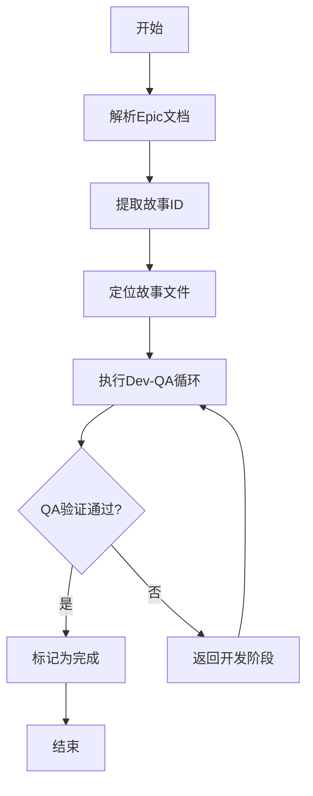

# 核心工作流

<cite>
**本文档引用的文件**   
- [epic_driver.py](file://autoBMAD/epic_automation/epic_driver.py)
- [story_parser.py](file://autoBMAD/epic_automation/story_parser.py)
- [state_manager.py](file://autoBMAD/epic_automation/state_manager.py)
- [qa_agent.py](file://autoBMAD/epic_automation/qa_agent.py)
- [dev_agent.py](file://autoBMAD/epic_automation/dev_agent.py)
</cite>

## 目录
1. [简介](#简介)
2. [工作流概述](#工作流概述)
3. [Epic解析机制](#epic解析机制)
4. [故事处理循环](#故事处理循环)
5. [状态管理](#状态管理)
6. [QA验证流程](#qa验证流程)
7. [迭代控制机制](#迭代控制机制)
8. [结论](#结论)

## 简介
SM-Dev-QA核心工作流是一个自动化软件开发流程，它通过循环执行机制将Epic文档解析、故事创建、开发实现和QA验证等阶段有机地结合起来。该工作流旨在提高开发效率，确保代码质量，并通过状态同步和迭代控制机制来保证流程的稳定性和可靠性。

**Section sources**
- [epic_driver.py](file://autoBMAD/epic_automation/epic_driver.py#L1-L50)

## 工作流概述
SM-Dev-QA工作流从解析Epic文档开始，提取其中的故事ID，并定位相应的故事文件。然后，工作流进入循环执行阶段，协调开发代理（Dev Agent）和质量保证代理（QA Agent）完成开发和验证任务。整个流程由状态管理器（StateManager）跟踪每个故事的进度，并通过迭代控制机制确保流程不会无限循环。



**Diagram sources**
- [epic_driver.py](file://autoBMAD/epic_automation/epic_driver.py#L680-L863)
- [story_parser.py](file://autoBMAD/epic_automation/story_parser.py#L673-L693)

## Epic解析机制
`parse_epic`函数是工作流的入口点，负责解析Epic文档并提取故事ID。该函数首先读取Epic文档内容，然后使用正则表达式从文档中提取故事ID。提取的故事ID用于在`docs/stories/`目录下搜索对应的故事文件。

```python
async def parse_epic(self) -> list[dict[str, Any]]:
    """
    Parse epic markdown file and extract story information.
    """
    logger.info(f"Parsing epic: {self.epic_path}")

    if not self.epic_path.exists():
        logger.error(f"Epic file not found: {self.epic_path}")
        return []

    try:
        with open(self.epic_path, encoding="utf-8") as f:
            content = f.read()

        # Step 1: Extract story IDs from Epic document
        story_ids = self._extract_story_ids_from_epic(content)

        if not story_ids:
            logger.warning("No stories found in epic document")
            return []
```

**Section sources**
- [epic_driver.py](file://autoBMAD/epic_automation/epic_driver.py#L680-L708)

## 故事处理循环
`process_story`函数协调开发代理和质量保证代理，执行开发和验证任务。该函数首先检查故事的状态，如果故事已经完成，则跳过处理。否则，它进入一个循环，执行开发和QA验证，直到故事完成或达到最大迭代次数。

```python
async def process_story(self, story: "dict[str, Any]") -> bool:
    """
    Process a single story through Dev-QA cycle.
    """
    story_path = story["path"]
    story_id = story["id"]
    logger.info(f"Processing story {story_id}: {story_path}")

    try:
        return await self._process_story_impl(story)
    except asyncio.CancelledError:
        logger.info(f"Story processing cancelled for {story_path}")
        return False
```

**Section sources**
- [epic_driver.py](file://autoBMAD/epic_automation/epic_driver.py#L1264-L1287)

## 状态管理
状态管理器（StateManager）负责跟踪每个故事的进度。它使用SQLite数据库存储故事的状态信息，包括故事路径、状态、迭代次数、QA结果等。状态管理器还提供了同步故事状态到Markdown文件的功能，确保数据库和文件系统中的状态保持一致。

```python
class StateManager:
    """修复后的SQLite-based状态管理器，用于跟踪故事进度。"""

    def __init__(self, db_path: str = "progress.db", use_connection_pool: bool = True):
        """
        初始化状态管理器。
        """
        self.db_path = Path(db_path)
        self._lock = asyncio.Lock()
        self._deadlock_detector = DeadlockDetector()
        self._connection_pool = (
            DatabaseConnectionPool() if use_connection_pool else None
        )
```

**Section sources**
- [state_manager.py](file://autoBMAD/epic_automation/state_manager.py#L97-L119)

## QA验证流程
QA代理（QA Agent）负责执行质量保证验证。它首先解析故事文档的状态，然后执行QA验证。如果QA验证通过，故事状态被更新为“completed”；如果失败，状态被更新为“in_progress”，并返回开发阶段进行修复。

```python
async def execute_qa_phase(self, story_path: str) -> bool:
    """
    Execute QA (Quality Assurance) phase for a story.
    """
    logger.info(f"Executing QA phase for {story_path}")

    try:
        with open(story_path, encoding="utf-8") as f:
            story_content = f.read()

        qa_result: dict[str, Any] = await self.qa_agent.execute(
            story_path=story_path,
        )

        if qa_result.get("passed", False):
            logger.info(f"QA phase passed for {story_path}")
            completion_state_update_success = (
                await self.state_manager.update_story_status(
                    story_path=story_path, status="completed"
                )
            )
            return True
        else:
            logger.info(f"QA phase failed for {story_path}, setting in_progress")
            await self.state_manager.update_story_status(
                story_path=story_path, status="in_progress"
            )
            return True
    except Exception as e:
        logger.error(f"QA phase failed for {story_path}: {e}")
        await self.state_manager.update_story_status(
            story_path=story_path, status="error", error=str(e)
        )
        return False
```

**Section sources**
- [epic_driver.py](file://autoBMAD/epic_automation/epic_driver.py#L1211-L1263)

## 迭代控制机制
迭代控制机制通过`max_iterations`参数来防止无限循环。在每次迭代开始时，工作流检查当前迭代次数是否超过最大迭代次数。如果超过，则标记故事为失败并退出循环。

```python
async def execute_dev_phase(self, story_path: str, iteration: int = 1) -> bool:
    """
    Execute Dev (Development) phase for a story.
    """
    logger.info(f"Executing Dev phase for {story_path} (iteration {iteration})")

    # Safety guard against infinite loops
    if iteration > self.max_iterations:
        logger.error(
            f"Max iterations ({self.max_iterations}) reached for {story_path}"
        )
        await self.state_manager.update_story_status(
            story_path=story_path, status="failed", error="Max iterations exceeded"
        )
        return False
```

**Section sources**
- [epic_driver.py](file://autoBMAD/epic_automation/epic_driver.py#L1153-L1175)

## 结论
SM-Dev-QA核心工作流通过循环执行机制实现了从Epic文档解析到QA验证的完整自动化流程。`parse_epic`函数负责提取故事ID并定位故事文件，`process_story`函数协调开发和QA代理完成开发和验证任务。状态管理器跟踪每个故事的进度，并通过迭代控制机制确保流程的稳定性。该工作流不仅提高了开发效率，还通过严格的QA验证确保了代码质量。