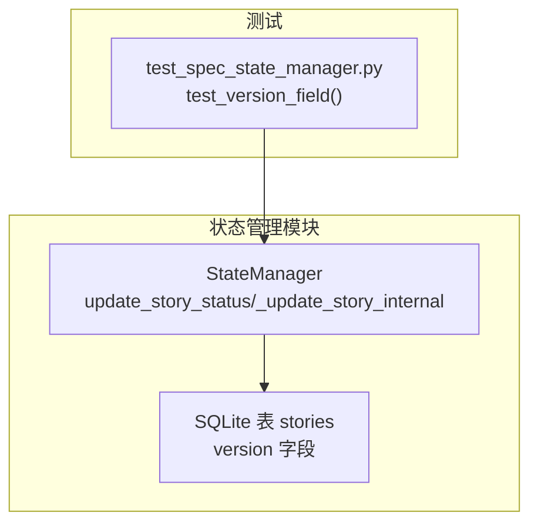
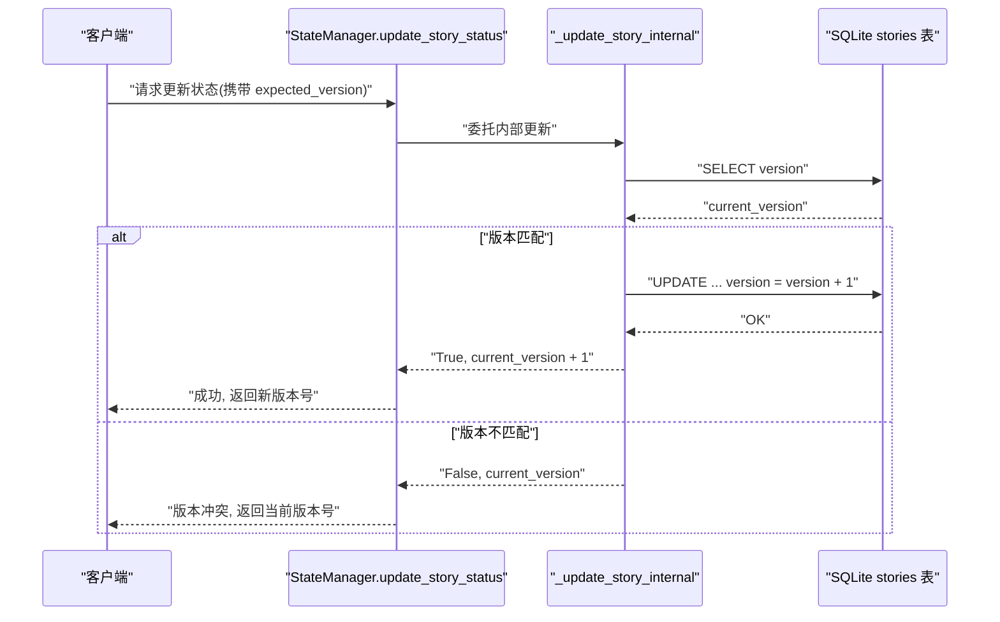
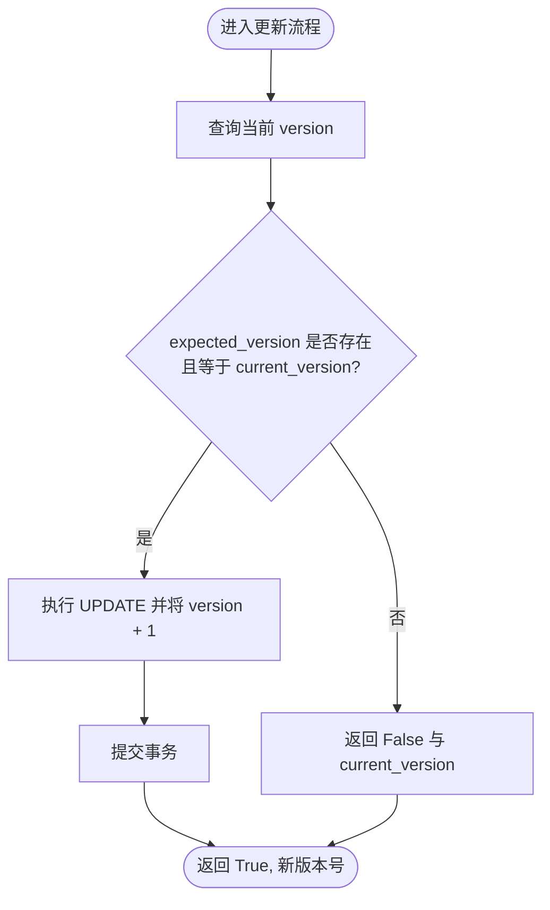
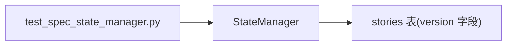

# 乐观锁机制

<cite>
**本文引用的文件**
- [state_manager.py](file://autoBMAD/epic_automation/state_manager.py)
- [state_manager_fixed.py](file://BUGFIX_20260107/fixed_modules/state_manager_fixed.py)
- [test_spec_state_manager.py](file://spec_automation/tests/test_spec_state_manager.py)
- [STANDARD_STATUS.md](file://autoBMAD/epic_automation/STANDARD_STATUS.md)
- [retry-mechanism-design.md](file://docs-copy/evaluation/retry-mechanism-design.md)
- [状态系统重构实施方案.md](file://状态系统重构实施方案.md)
</cite>

## 目录
1. [简介](#简介)
2. [项目结构](#项目结构)
3. [核心组件](#核心组件)
4. [架构总览](#架构总览)
5. [详细组件分析](#详细组件分析)
6. [依赖关系分析](#依赖关系分析)
7. [性能考量](#性能考量)
8. [故障排查指南](#故障排查指南)
9. [结论](#结论)
10. [附录](#附录)

## 简介
本文围绕仓库中的乐观锁机制展开，重点解释 version 字段在并发控制中的作用，详述 _update_story_internal 如何在更新前检查 expected_version 参数并在版本不匹配时返回“版本冲突”错误；同时给出在 SM、Dev 和 QA 阶段更新状态时如何传递和验证版本号的实践建议；最后说明该机制如何防止并发更新丢失，并讨论在发生版本冲突时的重试策略与最佳实践。

## 项目结构
与乐观锁相关的关键文件集中在状态管理模块中，核心为 SQLite 表 stories 的 version 字段与状态更新流程。测试文件验证了 version 字段的存在与初始值行为。

图表来源
- [state_manager.py](file://autoBMAD/epic_automation/state_manager.py#L140-L177)
- [state_manager.py](file://autoBMAD/epic_automation/state_manager.py#L262-L348)
- [test_spec_state_manager.py](file://spec_automation/tests/test_spec_state_manager.py#L364-L374)

章节来源
- [state_manager.py](file://autoBMAD/epic_automation/state_manager.py#L140-L177)
- [test_spec_state_manager.py](file://spec_automation/tests/test_spec_state_manager.py#L364-L374)

## 核心组件
- StateManager：负责故事状态的读写、并发控制与乐观锁校验。
- stories 表：持久化存储故事状态及 version 字段。
- 测试用例：验证 version 字段存在与初始值为 1。

章节来源
- [state_manager.py](file://autoBMAD/epic_automation/state_manager.py#L140-L177)
- [state_manager.py](file://autoBMAD/epic_automation/state_manager.py#L262-L348)
- [test_spec_state_manager.py](file://spec_automation/tests/test_spec_state_manager.py#L364-L374)

## 架构总览
乐观锁通过数据库层 version 字段与应用层 expected_version 参数协同工作：客户端在发起更新时携带上次查询到的 version，服务端在更新前比对当前数据库中的 version 与期望值，若不一致则判定为版本冲突，拒绝更新并返回当前 version，供客户端进行后续重试或合并。

图表来源
- [state_manager.py](file://autoBMAD/epic_automation/state_manager.py#L203-L261)
- [state_manager.py](file://autoBMAD/epic_automation/state_manager.py#L262-L348)

## 详细组件分析

### 乐观锁与 version 字段
- 数据模型：stories 表包含 version 字段，默认值为 1；当新增记录时 version 为 1；每次成功更新后 version 自增 1。
- 并发控制：更新前先查询当前 version，再根据 expected_version 判断是否允许更新；若不匹配则返回 False 与当前 version，避免覆盖他人更新。

图表来源
- [state_manager.py](file://autoBMAD/epic_automation/state_manager.py#L291-L324)

章节来源
- [state_manager.py](file://autoBMAD/epic_automation/state_manager.py#L140-L177)
- [state_manager.py](file://autoBMAD/epic_automation/state_manager.py#L291-L324)

### _update_story_internal 的版本检查逻辑
- 查询现有记录并读取 current_version；
- 若 expected_version 存在且与 current_version 不相等，则记录警告并返回 False 与 current_version；
- 若匹配，则执行 UPDATE 并将 version + 1，随后返回 True 与新版本号。

章节来源
- [state_manager.py](file://autoBMAD/epic_automation/state_manager.py#L291-L324)

### 版本号在每次成功更新时自动递增的设计
- 新增记录：version = 1；
- 成功更新：version = version + 1；
- 该设计确保每次成功写入都会产生新的版本号，便于后续乐观锁校验与冲突检测。

章节来源
- [state_manager.py](file://autoBMAD/epic_automation/state_manager.py#L324-L348)

### 返回当前版本号帮助客户端进行下一次更新
- 当发生版本冲突时，服务端返回 False 与 current_version，客户端据此刷新本地视图并重试时携带最新 version，从而避免覆盖他人更新。

章节来源
- [state_manager.py](file://autoBMAD/epic_automation/state_manager.py#L291-L324)

### SM、Dev、QA 阶段更新状态时的版本号传递与验证
- SM（故事管理）：在状态迁移或批量同步时，建议先通过 get_story_status 获取当前 version，再调用 update_story_status 传入 expected_version，以保证并发安全。
- Dev（开发）：在完成开发后，通常将状态推进到“就绪评审”，此时同样建议携带 expected_version，避免被其他 Dev/QA 流程覆盖。
- QA（质量保证）：在 QA 结束后，将状态推进到“就绪完成”或“完成”，同样建议携带 expected_version，防止并发更新丢失。

章节来源
- [STANDARD_STATUS.md](file://autoBMAD/epic_automation/STANDARD_STATUS.md#L46-L99)
- [state_manager.py](file://autoBMAD/epic_automation/state_manager.py#L405-L460)
- [state_manager.py](file://autoBMAD/epic_automation/state_manager.py#L203-L261)

### 防止并发更新丢失
- 通过 expected_version 与 current_version 的严格比对，阻止“写后读”或“竞态条件”下的覆盖；
- 每次成功更新后 version 自增，形成线性演进的版本序列，便于客户端感知最新状态。

章节来源
- [state_manager.py](file://autoBMAD/epic_automation/state_manager.py#L291-L324)

### 发生版本冲突时的重试策略
- 基于仓库中的重试机制设计文档，建议采用“外部重试 + 内部循环保护”的组合策略：
  - 外部重试：由 Epic 级别控制最大重试次数；
  - 内部循环保护：Dev-QA 循环设置最大轮次，避免无限循环；
  - SDK 级别：限制对话轮数，避免长时间阻塞。
- 在乐观锁冲突场景下，客户端应在捕获“版本冲突”后，拉取最新状态与 version，修正本地数据后再重试。

章节来源
- [retry-mechanism-design.md](file://docs-copy/evaluation/retry-mechanism-design.md#L128-L209)
- [retry-mechanism-design.md](file://docs-copy/evaluation/retry-mechanism-design.md#L337-L357)

### 与状态系统重构的关系
- 状态系统重构方案强调“单向数据流”与“统一状态处理”，这与乐观锁的“版本演进”理念一致：状态变化应可追踪、可比较、可重试。
- 在重构后，SM/Dev/QA 三类代理均应遵循同一状态更新协议，包括携带 expected_version 的更新流程。

章节来源
- [状态系统重构实施方案.md](file://状态系统重构实施方案.md#L460-L537)
- [状态系统重构实施方案.md](file://状态系统重构实施方案.md#L538-L620)

## 依赖关系分析
- StateManager 依赖 SQLite 数据库的 stories 表，version 字段作为乐观锁的依据；
- 测试用例验证 version 字段的存在与初始值行为，确保乐观锁机制可用。

图表来源
- [state_manager.py](file://autoBMAD/epic_automation/state_manager.py#L140-L177)
- [test_spec_state_manager.py](file://spec_automation/tests/test_spec_state_manager.py#L364-L374)

章节来源
- [state_manager.py](file://autoBMAD/epic_automation/state_manager.py#L140-L177)
- [test_spec_state_manager.py](file://spec_automation/tests/test_spec_state_manager.py#L364-L374)

## 性能考量
- WAL 模式与连接池：仓库中使用 WAL 模式与连接池以提升并发读写性能，有助于降低乐观锁冲突带来的锁竞争压力。
- 锁超时与死锁检测：在修复版本中引入死锁检测器与锁超时，避免长时间阻塞导致的资源占用。

章节来源
- [state_manager.py](file://autoBMAD/epic_automation/state_manager.py#L70-L95)
- [state_manager.py](file://autoBMAD/epic_automation/state_manager.py#L31-L57)

## 故障排查指南
- 版本冲突频繁出现：
  - 检查客户端是否正确携带 expected_version；
  - 确认客户端在收到 False 与 current_version 后是否及时刷新并重试；
  - 观察是否存在多个客户端同时更新同一故事，必要时增加重试间隔或限流。
- 锁超时或死锁：
  - 查看死锁检测器日志，确认是否存在长时间持有锁的情况；
  - 调整 lock_timeout 或优化业务流程，减少长事务。
- 数据库性能问题：
  - 确认 WAL 模式与连接池配置是否生效；
  - 关注索引使用情况与查询计划。

章节来源
- [state_manager.py](file://autoBMAD/epic_automation/state_manager.py#L31-L57)
- [state_manager.py](file://autoBMAD/epic_automation/state_manager.py#L203-L261)

## 结论
仓库通过 stories 表的 version 字段与应用层的 expected_version 参数，构建了可靠的乐观锁机制。该机制在并发更新场景下有效防止“更新丢失”，并通过返回当前版本号帮助客户端进行后续重试与合并。结合仓库中的重试与循环保护策略，可在保证数据一致性的前提下提升整体稳定性与用户体验。

## 附录
- 测试验证：测试用例验证 version 字段存在且初始值为 1，确保乐观锁基础能力可用。

章节来源
- [test_spec_state_manager.py](file://spec_automation/tests/test_spec_state_manager.py#L364-L374)