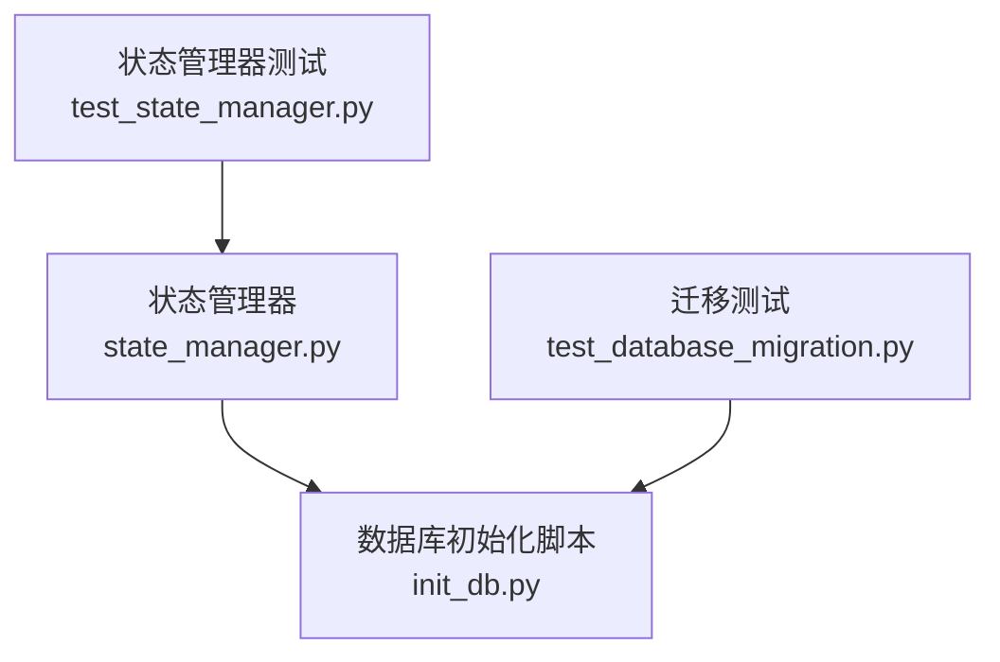
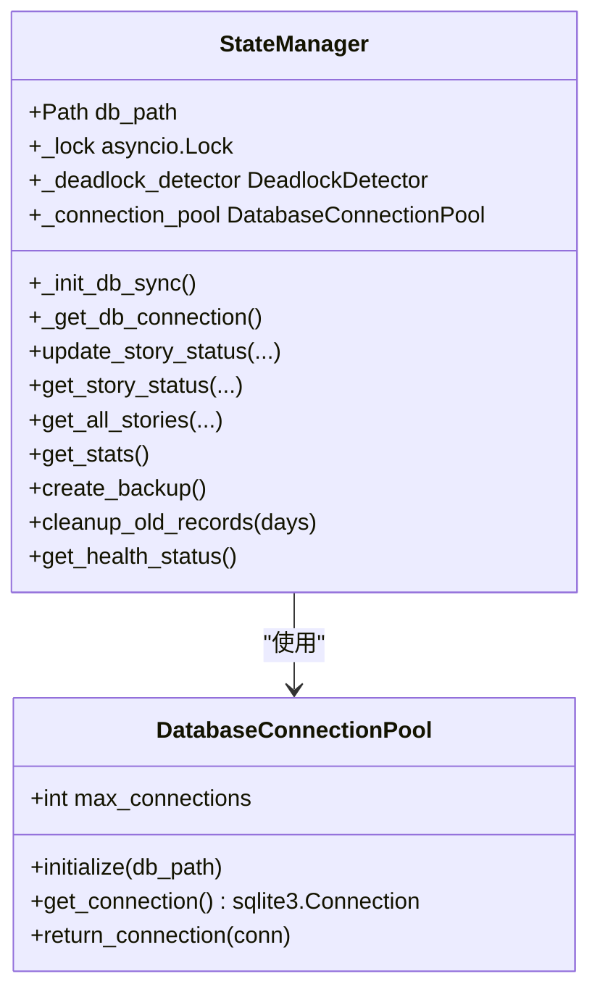
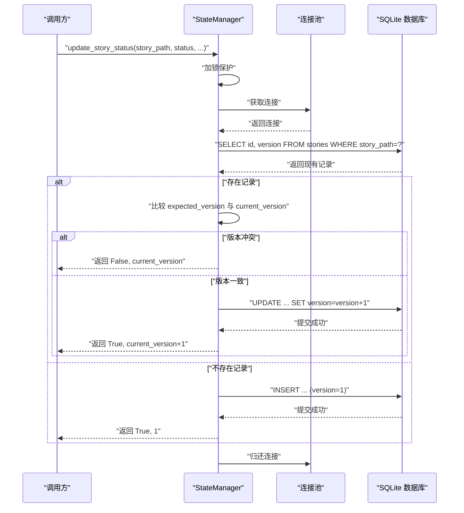
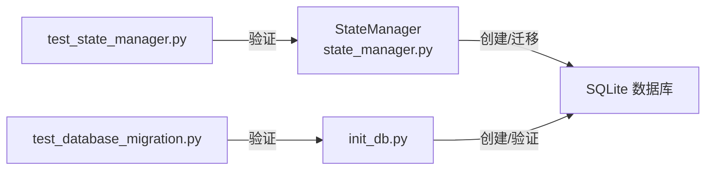

# 数据库模式

<cite>
**本文引用的文件**
- [state_manager.py](file://autoBMAD/epic_automation/state_manager.py)
- [init_db.py](file://autoBMAD/epic_automation/init_db.py)
- [test_database_migration.py](file://tests-copy/unit/test_database_migration.py)
- [test_state_manager.py](file://tests-copy/test_state_manager.py)
</cite>

## 目录
1. [简介](#简介)
2. [项目结构](#项目结构)
3. [核心组件](#核心组件)
4. [架构总览](#架构总览)
5. [详细组件分析](#详细组件分析)
6. [依赖关系分析](#依赖关系分析)
7. [性能考量](#性能考量)
8. [故障排查指南](#故障排查指南)
9. [结论](#结论)
10. [附录](#附录)

## 简介
本文件聚焦于状态管理数据库模式，特别是 stories 表的结构与索引设计。我们将系统性地解释每个字段的用途与约束，说明 idx_story_path 与 idx_status 索引如何优化查询性能；给出 SQL 创建语句的代码示例路径；阐述数据库迁移逻辑（尤其是 version 字段的添加过程）；并解释 PRAGMA 设置（WAL 模式、同步模式、缓存大小、临时表存储）如何提升并发性能与数据完整性。

## 项目结构
围绕数据库模式与初始化的关键文件如下：
- autoBMAD/epic_automation/state_manager.py：定义数据库连接池、PRAGMA 设置、stories 表创建与索引、version 列迁移逻辑，以及乐观锁更新流程。
- autoBMAD/epic_automation/init_db.py：独立的数据库初始化脚本，负责创建 stories 表、索引及关联表，并进行结构验证。
- tests-copy/unit/test_database_migration.py：覆盖迁移脚本执行、备份/回滚、向前兼容性、外键约束等测试。
- tests-copy/test_state_manager.py：验证 stories 表存在、索引存在、列存在等基础校验。

图表来源
- [state_manager.py](file://autoBMAD/epic_automation/state_manager.py#L70-L95)
- [init_db.py](file://autoBMAD/epic_automation/init_db.py#L33-L60)
- [test_database_migration.py](file://tests-copy/unit/test_database_migration.py#L116-L160)
- [test_state_manager.py](file://tests-copy/test_state_manager.py#L60-L102)

章节来源
- [state_manager.py](file://autoBMAD/epic_automation/state_manager.py#L70-L95)
- [init_db.py](file://autoBMAD/epic_automation/init_db.py#L33-L60)
- [test_database_migration.py](file://tests-copy/unit/test_database_migration.py#L116-L160)
- [test_state_manager.py](file://tests-copy/test_state_manager.py#L60-L102)

## 核心组件
- 数据库连接池与 PRAGMA 设置
  - WAL 模式：提升并发读写能力，降低写入阻塞。
  - synchronous=NORMAL：平衡性能与安全性。
  - cache_size=10000：增大页缓存，减少磁盘 IO。
  - temp_store=MEMORY：临时表放在内存中，加速临时操作。
- stories 表结构与索引
  - 主键 id、唯一 story_path、status、iteration、qa_result、error_message、created_at、updated_at、phase、version。
  - idx_story_path：按故事路径快速定位。
  - idx_status：按状态过滤与统计。
- 迁移与版本控制
  - 自动检测并补全 version 列，保证乐观锁可用。
  - 迁移脚本具备幂等性与回滚能力（测试覆盖）。

章节来源
- [state_manager.py](file://autoBMAD/epic_automation/state_manager.py#L70-L95)
- [state_manager.py](file://autoBMAD/epic_automation/state_manager.py#L143-L177)
- [init_db.py](file://autoBMAD/epic_automation/init_db.py#L33-L60)
- [test_database_migration.py](file://tests-copy/unit/test_database_migration.py#L201-L232)

## 架构总览
下面的类图展示了数据库层与状态管理器的关系，以及 PRAGMA 设置对连接的影响。

图表来源
- [state_manager.py](file://autoBMAD/epic_automation/state_manager.py#L70-L95)
- [state_manager.py](file://autoBMAD/epic_automation/state_manager.py#L97-L131)

## 详细组件分析

### stories 表结构与字段说明
- id：整型自增主键，唯一标识每条记录。
- epic_path：文本，非空，指向 Epic 文件路径。
- story_path：文本，非空且唯一，作为故事的唯一标识符。
- status：文本，非空，表示当前状态。
- iteration：整型，默认 0，记录迭代次数。
- qa_result：文本，存储 QA 结果（JSON 序列化字符串）。
- error_message：文本，存储错误信息。
- created_at：时间戳，默认当前时间，记录创建时间。
- updated_at：时间戳，默认当前时间，记录最近更新时间。
- phase：文本，记录当前阶段。
- version：整型，默认 1，用于乐观锁。

上述字段定义与索引创建均来自以下文件路径：
- [stories 表创建与索引](file://autoBMAD/epic_automation/state_manager.py#L143-L168)
- [stories 表创建与索引（初始化脚本）](file://autoBMAD/epic_automation/init_db.py#L33-L60)

章节来源
- [state_manager.py](file://autoBMAD/epic_automation/state_manager.py#L143-L168)
- [init_db.py](file://autoBMAD/epic_automation/init_db.py#L33-L60)

### 索引设计与查询优化
- idx_story_path：在 story_path 上建立索引，用于按故事路径快速检索与更新。
- idx_status：在 status 上建立索引，用于按状态过滤、统计与报表。

这些索引在初始化时创建，且测试验证了其存在性与有效性：
- [索引创建逻辑](file://autoBMAD/epic_automation/state_manager.py#L160-L168)
- [索引创建逻辑（初始化脚本）](file://autoBMAD/epic_automation/init_db.py#L49-L59)
- [索引存在性测试](file://tests-copy/test_state_manager.py#L70-L86)

章节来源
- [state_manager.py](file://autoBMAD/epic_automation/state_manager.py#L160-L168)
- [init_db.py](file://autoBMAD/epic_automation/init_db.py#L49-L59)
- [test_state_manager.py](file://tests-copy/test_state_manager.py#L70-L86)

### 乐观锁与 version 字段迁移
- version 字段默认 1，用于乐观锁冲突检测。
- 更新流程：
  - 查询当前记录的 id 与 version。
  - 若传入 expected_version 且不匹配，则拒绝更新并返回当前版本。
  - 否则更新 status、phase、iteration、qa_result、error_message、updated_at，并将 version 自增 1。
- 迁移逻辑：
  - 初始化时尝试读取 version 列，若不存在则通过 ALTER TABLE 添加该列并设置默认值 1。
- 代码路径：
  - [version 初始定义](file://autoBMAD/epic_automation/state_manager.py#L143-L156)
  - [version 列迁移](file://autoBMAD/epic_automation/state_manager.py#L170-L177)
  - [乐观锁更新逻辑](file://autoBMAD/epic_automation/state_manager.py#L280-L339)

图表来源
- [state_manager.py](file://autoBMAD/epic_automation/state_manager.py#L203-L339)
- [state_manager.py](file://autoBMAD/epic_automation/state_manager.py#L170-L177)

章节来源
- [state_manager.py](file://autoBMAD/epic_automation/state_manager.py#L143-L156)
- [state_manager.py](file://autoBMAD/epic_automation/state_manager.py#L170-L177)
- [state_manager.py](file://autoBMAD/epic_automation/state_manager.py#L280-L339)

### PRAGMA 设置与并发性能
- journal_mode=WAL：启用预写日志模式，允许多读并发写入，显著提升并发场景下的吞吐量。
- synchronous=NORMAL：在性能与安全性之间取得平衡，适合大多数应用场景。
- cache_size=10000：增大缓存页数量，减少磁盘访问频率。
- temp_store=MEMORY：临时表存储在内存中，避免临时文件 IO。

这些设置在连接池初始化时应用，确保每次连接都具备一致的性能与可靠性配置：
- [PRAGMA 设置](file://autoBMAD/epic_automation/state_manager.py#L72-L77)

章节来源
- [state_manager.py](file://autoBMAD/epic_automation/state_manager.py#L72-L77)

### 数据库迁移逻辑（version 字段）
- 场景：老版本数据库可能缺少 version 列。
- 迁移策略：
  - 初始化时尝试查询 version 列，若失败（OperationalError），则通过 ALTER TABLE 添加该列并设置默认值 1。
- 测试覆盖：
  - 迁移幂等性（多次运行安全）。
  - 非存在数据库的迁移处理。
  - 兼容性：保留已有 stories 表结构与数据。

参考路径：
- [version 列迁移逻辑](file://autoBMAD/epic_automation/state_manager.py#L170-L177)
- [迁移幂等性测试](file://tests-copy/unit/test_database_migration.py#L201-L232)
- [非存在数据库迁移测试](file://tests-copy/unit/test_database_migration.py#L237-L241)
- [兼容性测试（保留旧表）](file://tests-copy/unit/test_database_migration.py#L246-L294)

章节来源
- [state_manager.py](file://autoBMAD/epic_automation/state_manager.py#L170-L177)
- [test_database_migration.py](file://tests-copy/unit/test_database_migration.py#L201-L232)
- [test_database_migration.py](file://tests-copy/unit/test_database_migration.py#L237-L241)
- [test_database_migration.py](file://tests-copy/unit/test_database_migration.py#L246-L294)

### SQL 创建语句示例路径
- 创建 stories 表（含索引）：
  - [CREATE TABLE 与索引（状态管理器）](file://autoBMAD/epic_automation/state_manager.py#L143-L168)
  - [CREATE TABLE 与索引（初始化脚本）](file://autoBMAD/epic_automation/init_db.py#L33-L60)
- 创建 code_quality_phase 与 test_automation_phase 表（关联索引）：
  - [关联表与索引（初始化脚本）](file://autoBMAD/epic_automation/init_db.py#L61-L116)

章节来源
- [state_manager.py](file://autoBMAD/epic_automation/state_manager.py#L143-L168)
- [init_db.py](file://autoBMAD/epic_automation/init_db.py#L33-L60)
- [init_db.py](file://autoBMAD/epic_automation/init_db.py#L61-L116)

## 依赖关系分析
- 状态管理器依赖 SQLite 连接池与 PRAGMA 设置，确保并发安全与性能。
- 初始化脚本独立负责表与索引创建，便于手动或 CI 执行。
- 迁移测试覆盖了备份、回滚、兼容性与外键约束，保障演进过程的稳定性。

图表来源
- [state_manager.py](file://autoBMAD/epic_automation/state_manager.py#L70-L95)
- [init_db.py](file://autoBMAD/epic_automation/init_db.py#L122-L195)
- [test_database_migration.py](file://tests-copy/unit/test_database_migration.py#L113-L160)
- [test_state_manager.py](file://tests-copy/test_state_manager.py#L60-L102)

章节来源
- [state_manager.py](file://autoBMAD/epic_automation/state_manager.py#L70-L95)
- [init_db.py](file://autoBMAD/epic_automation/init_db.py#L122-L195)
- [test_database_migration.py](file://tests-copy/unit/test_database_migration.py#L113-L160)
- [test_state_manager.py](file://tests-copy/test_state_manager.py#L60-L102)

## 性能考量
- 并发读写：WAL 模式显著提升多读并发写入场景的吞吐量。
- 缓存命中：cache_size 增大可减少磁盘 IO，提升热点数据访问速度。
- 临时操作：temp_store=MEMORY 减少临时文件 IO，提升排序与聚合性能。
- 索引选择：idx_story_path 与 idx_status 分别针对“按故事路径查询”和“按状态过滤/统计”的高频场景优化。

章节来源
- [state_manager.py](file://autoBMAD/epic_automation/state_manager.py#L72-L77)
- [state_manager.py](file://autoBMAD/epic_automation/state_manager.py#L160-L168)
- [init_db.py](file://autoBMAD/epic_automation/init_db.py#L49-L59)

## 故障排查指南
- 索引缺失
  - 现象：按 story_path 或 status 的查询变慢。
  - 排查：确认 idx_story_path 与 idx_status 是否存在。
  - 参考：[索引存在性测试](file://tests-copy/test_state_manager.py#L70-L86)
- 版本冲突
  - 现象：更新返回 False 并返回当前版本。
  - 排查：检查 expected_version 与数据库中 current_version 是否一致。
  - 参考：[乐观锁更新逻辑](file://autoBMAD/epic_automation/state_manager.py#L294-L303)
- 迁移失败或重复迁移
  - 现象：数据库升级后仍报列不存在或重复添加。
  - 排查：确认 version 列迁移逻辑是否执行；测试覆盖了幂等性。
  - 参考：[version 列迁移](file://autoBMAD/epic_automation/state_manager.py#L170-L177)、[幂等性测试](file://tests-copy/unit/test_database_migration.py#L201-L232)
- 备份与回滚
  - 现象：升级失败或需要回滚。
  - 排查：迁移测试包含备份与回滚流程验证。
  - 参考：[迁移测试（备份/回滚）](file://tests-copy/unit/test_database_migration.py#L35-L111)、[回滚测试](file://tests-copy/unit/test_database_migration.py#L423-L470)

章节来源
- [test_state_manager.py](file://tests-copy/test_state_manager.py#L70-L86)
- [state_manager.py](file://autoBMAD/epic_automation/state_manager.py#L294-L303)
- [state_manager.py](file://autoBMAD/epic_automation/state_manager.py#L170-L177)
- [test_database_migration.py](file://tests-copy/unit/test_database_migration.py#L35-L111)
- [test_database_migration.py](file://tests-copy/unit/test_database_migration.py#L423-L470)

## 结论
stories 表的设计围绕“唯一标识、状态追踪、迭代与版本控制”展开，配合 idx_story_path 与 idx_status 索引，满足高频查询与统计需求。通过 WAL、synchronous、cache_size、temp_store 等 PRAGMA 设置，系统在并发性能与数据完整性之间取得良好平衡。迁移逻辑确保了向前兼容与幂等性，测试覆盖了备份、回滚、外键约束与兼容性，为生产环境提供了稳健的演进路径。

## 附录
- 关键实现与测试路径汇总
  - [stories 表创建与索引（状态管理器）](file://autoBMAD/epic_automation/state_manager.py#L143-L168)
  - [stories 表创建与索引（初始化脚本）](file://autoBMAD/epic_automation/init_db.py#L33-L60)
  - [PRAGMA 设置（连接池）](file://autoBMAD/epic_automation/state_manager.py#L72-L77)
  - [version 列迁移](file://autoBMAD/epic_automation/state_manager.py#L170-L177)
  - [乐观锁更新流程](file://autoBMAD/epic_automation/state_manager.py#L280-L339)
  - [索引存在性测试](file://tests-copy/test_state_manager.py#L70-L86)
  - [迁移幂等性与兼容性测试](file://tests-copy/unit/test_database_migration.py#L201-L294)
  - [备份与回滚测试](file://tests-copy/unit/test_database_migration.py#L35-L111)