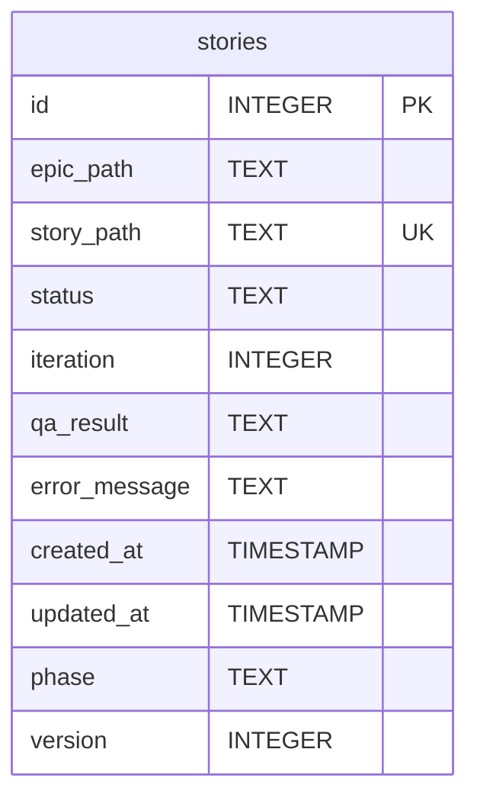
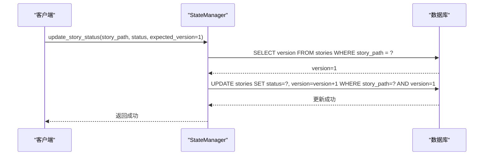
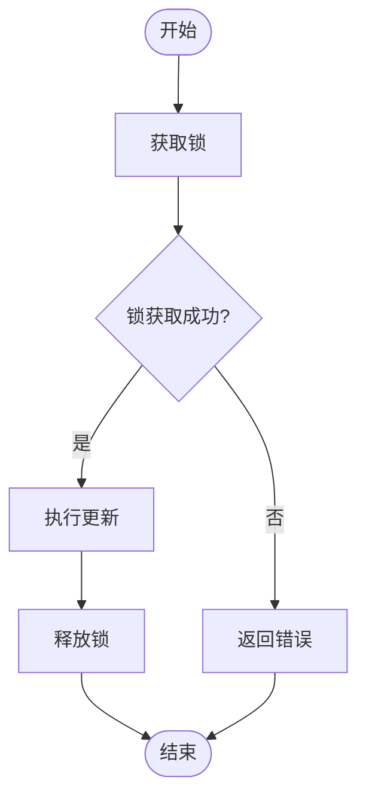
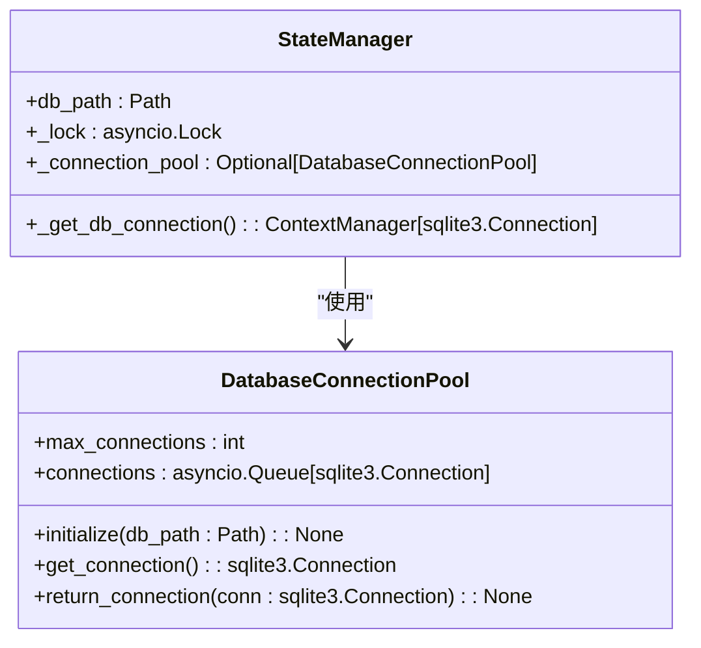

# 状态管理

<cite>
**本文档引用的文件**   
- [state_manager.py](file://autoBMAD/epic_automation/state_manager.py)
- [init_db.py](file://autoBMAD/epic_automation/init_db.py)
- [sm_agent.py](file://autoBMAD/epic_automation/sm_agent.py)
- [dev_agent.py](file://autoBMAD/epic_automation/dev_agent.py)
- [qa_agent.py](file://autoBMAD/epic_automation/qa_agent.py)
- [story_parser.py](file://autoBMAD/epic_automation/story_parser.py)
</cite>

## 目录
1. [状态管理](#状态管理)
2. [核心工作流中的状态更新](#核心工作流中的状态更新)
3. [数据库持久化存储](#数据库持久化存储)
4. [乐观锁机制](#乐观锁机制)
5. [锁保护机制](#锁保护机制)
6. [实际应用示例](#实际应用示例)
7. [数据库连接池](#数据库连接池)

## 核心工作流中的状态更新

`update_story_status`函数是状态管理的核心，它在SM、Dev和QA阶段的工作流中被调用，用于更新故事的状态。该函数通过`StateManager`类的实例调用，确保状态的更新是原子的，并且能够处理并发更新。

**Section sources**
- [state_manager.py](file://autoBMAD/epic_automation/state_manager.py#L203-L261)

## 数据库持久化存储

`StateManager`使用SQLite数据库来持久化存储故事的进度。`stories`表是存储故事状态的主要表，其结构设计考虑了故事的各个属性，包括故事路径、状态、阶段、迭代次数、QA结果、错误消息、创建时间和更新时间等。

**Diagram sources **
- [init_db.py](file://autoBMAD/epic_automation/init_db.py#L34-L46)

## 乐观锁机制

为了防止并发更新冲突，`StateManager`使用了乐观锁机制。乐观锁通过在`stories`表中添加`version`字段来实现。每次更新故事状态时，`version`字段的值会递增。当尝试更新一个故事时，如果数据库中的`version`值与期望的`version`值不匹配，则更新失败，从而避免了并发更新导致的数据不一致问题。

**Diagram sources **
- [state_manager.py](file://autoBMAD/epic_automation/state_manager.py#L294-L303)

## 锁保护机制

`_update_story_internal`函数使用`asyncio.Lock`来保护数据库操作，确保同一时间只有一个协程可以更新故事状态。此外，还设置了超时处理，以防止长时间的锁等待导致系统阻塞。

**Diagram sources **
- [state_manager.py](file://autoBMAD/epic_automation/state_manager.py#L275-L276)

## 实际应用示例

在SM、Dev和QA阶段，`update_story_status`函数被用来更新不同的状态值。例如，在SM阶段，故事状态可能从"pending"更新为"in_progress"；在Dev阶段，状态可能从"in_progress"更新为"review"；在QA阶段，状态可能从"review"更新为"completed"或"failed"。

**Section sources**
- [sm_agent.py](file://autoBMAD/epic_automation/sm_agent.py#L109-L128)
- [dev_agent.py](file://autoBMAD/epic_automation/dev_agent.py#L252-L303)
- [qa_agent.py](file://autoBMAD/epic_automation/qa_agent.py#L222-L320)

## 数据库连接池

`StateManager`使用数据库连接池来管理数据库连接，提高性能和资源利用率。通过`_get_db_connection`上下文管理器，可以安全地获取和归还数据库连接，确保连接的正确使用和释放。

**Diagram sources **
- [state_manager.py](file://autoBMAD/epic_automation/state_manager.py#L59-L95)