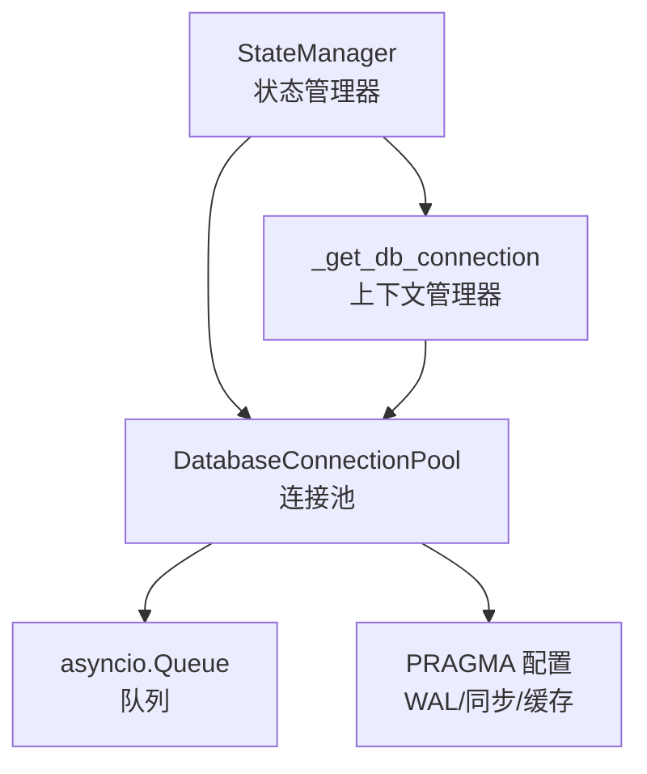
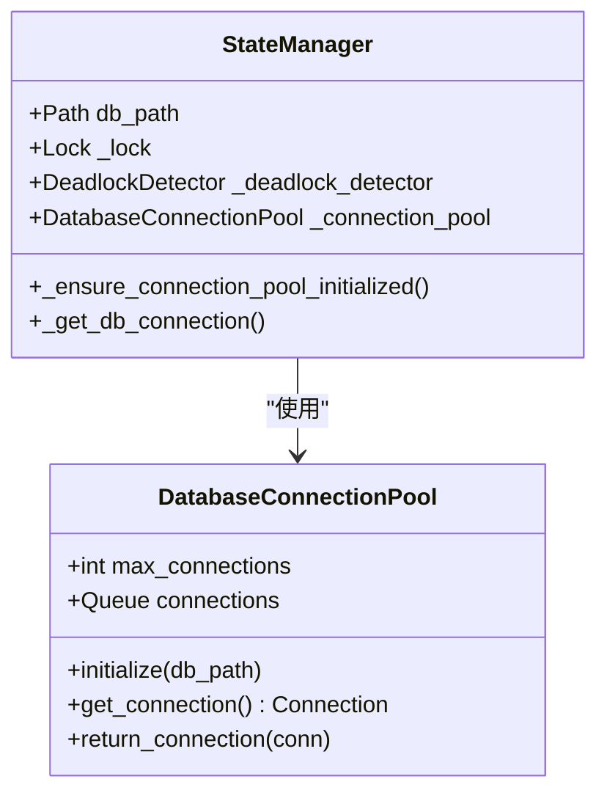
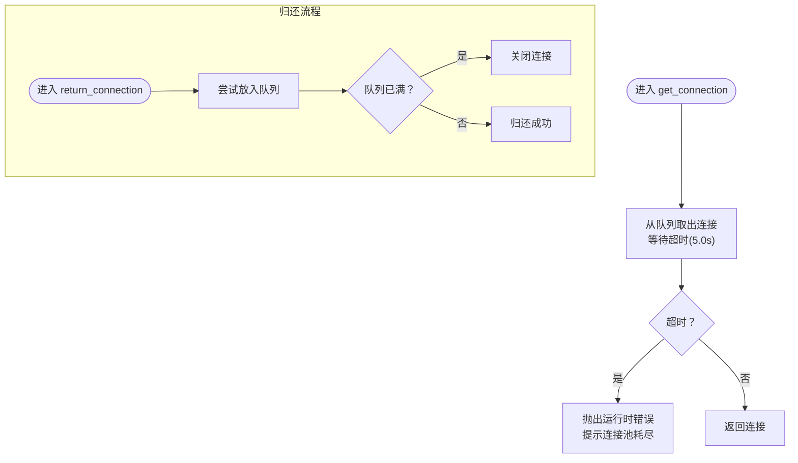
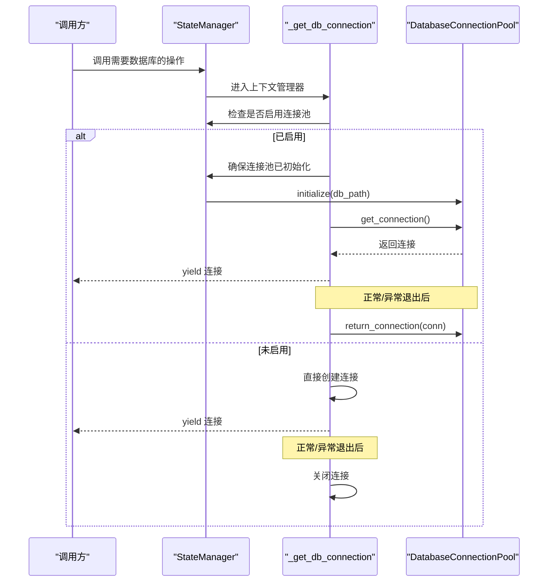
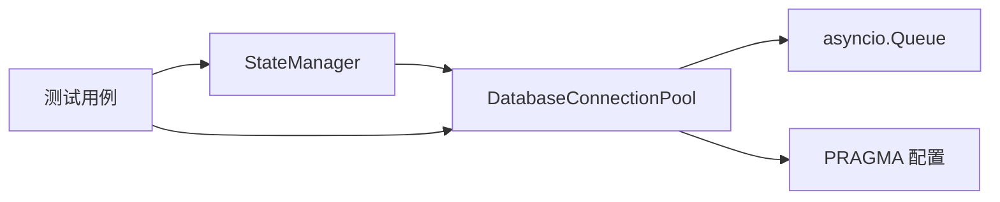

# 连接池管理

<cite>
**本文引用的文件**
- [state_manager.py](file://autoBMAD/epic_automation/state_manager.py)
- [state_manager_fixed.py](file://BUGFIX_20260107/fixed_modules/state_manager_fixed.py)
- [test_resource_cleanup.py](file://BUGFIX_20260107/tests/test_resource_cleanup.py)
</cite>

## 目录
1. [简介](#简介)
2. [项目结构](#项目结构)
3. [核心组件](#核心组件)
4. [架构总览](#架构总览)
5. [组件详解](#组件详解)
6. [依赖关系分析](#依赖关系分析)
7. [性能考量](#性能考量)
8. [故障排查指南](#故障排查指南)
9. [结论](#结论)

## 简介
本文件聚焦于数据库连接池管理，围绕 DatabaseConnectionPool 类的设计与使用展开，详细说明：
- 如何通过 max_connections 限制并发连接数；
- 如何使用 asyncio.Queue 管理可用连接；
- initialize 方法如何为每个连接配置 WAL 模式、同步设置与缓存大小以优化性能；
- get_connection 与 return_connection 的实现细节，包括超时处理与队列满时的连接关闭策略；
- _get_db_connection 上下文管理器如何与连接池集成；
- StateManager 初始化时如何延迟初始化连接池。

## 项目结构
本次分析涉及以下文件：
- autoBMAD/epic_automation/state_manager.py：包含 DatabaseConnectionPool 与 StateManager 的实现，以及连接池延迟初始化与上下文管理器集成。
- BUGFIX_20260107/fixed_modules/state_manager_fixed.py：另一个实现版本，展示了不同的初始化方式与上下文管理器用法。
- BUGFIX_20260107/tests/test_resource_cleanup.py：测试用例，验证连接池耗尽与超时行为。

图表来源
- [state_manager.py](file://autoBMAD/epic_automation/state_manager.py#L183-L202)
- [state_manager.py](file://autoBMAD/epic_automation/state_manager.py#L59-L95)

章节来源
- [state_manager.py](file://autoBMAD/epic_automation/state_manager.py#L59-L95)
- [state_manager.py](file://autoBMAD/epic_automation/state_manager.py#L183-L202)

## 核心组件
- DatabaseConnectionPool：负责创建、维护与回收 SQLite 连接，使用 asyncio.Queue 控制并发。
- StateManager：封装数据库操作，提供延迟初始化连接池与上下文管理器获取连接的能力。
- _get_db_connection：异步上下文管理器，自动获取与归还连接，保证资源正确释放。

章节来源
- [state_manager.py](file://autoBMAD/epic_automation/state_manager.py#L59-L95)
- [state_manager.py](file://autoBMAD/epic_automation/state_manager.py#L183-L202)

## 架构总览
下面的类图展示了 DatabaseConnectionPool 与 StateManager 的关系，以及连接池与队列之间的交互。

图表来源
- [state_manager.py](file://autoBMAD/epic_automation/state_manager.py#L59-L95)
- [state_manager.py](file://autoBMAD/epic_automation/state_manager.py#L97-L131)

## 组件详解

### DatabaseConnectionPool 设计与实现
- 并发控制：通过构造函数参数 max_connections 限制最大连接数；内部使用 asyncio.Queue(maxsize=max_connections) 作为可用连接池。
- 初始化配置：initialize(db_path) 会预先创建 max_connections 个连接，并对每个连接执行 PRAGMA 配置以优化性能：
  - journal_mode=WAL：启用 WAL 模式以提升并发读写性能；
  - synchronous=NORMAL：平衡性能与安全性；
  - cache_size=10000：增大缓存大小；
  - temp_store=memory：将临时表存储在内存中。
- 获取连接：get_connection() 从队列取出一个连接，若队列为空则等待直到超时；超时后抛出运行时错误，提示“连接池耗尽”。
- 归还连接：return_connection(conn) 将连接放回队列；若队列已满（并发过高），则直接关闭该连接，防止泄漏。

图表来源
- [state_manager.py](file://autoBMAD/epic_automation/state_manager.py#L69-L95)

章节来源
- [state_manager.py](file://autoBMAD/epic_automation/state_manager.py#L69-L95)

### StateManager 中的延迟初始化与上下文管理器
- 延迟初始化：StateManager 在构造时仅保存 db_path、锁与连接池引用，不立即初始化连接池；首次使用时通过 _ensure_connection_pool_initialized() 调用连接池的 initialize() 完成一次性初始化，避免在同步上下文中创建任务。
- 上下文管理器：_get_db_connection() 是一个异步上下文管理器，内部：
  - 若启用连接池，则先确保连接池已初始化；
  - 从连接池获取连接；
  - 在 try/finally 中确保无论正常退出还是异常，都会调用 return_connection 归还连接；
  - 若未启用连接池，则直接创建本地连接并在 finally 中关闭。
- 与业务方法的集成：StateManager 的数据库操作（如更新状态）通常在持有锁的前提下，通过 _get_db_connection 获取连接，从而保证线程安全与资源正确释放。

图表来源
- [state_manager.py](file://autoBMAD/epic_automation/state_manager.py#L126-L131)
- [state_manager.py](file://autoBMAD/epic_automation/state_manager.py#L183-L202)
- [state_manager.py](file://autoBMAD/epic_automation/state_manager.py#L59-L95)

章节来源
- [state_manager.py](file://autoBMAD/epic_automation/state_manager.py#L126-L131)
- [state_manager.py](file://autoBMAD/epic_automation/state_manager.py#L183-L202)

### 另一实现版本对比（fixed_modules）
- fixed_modules/state_manager_fixed.py 展示了另一种实现风格：
  - StateManager 构造时可选择直接创建连接池任务进行初始化；
  - _get_db_connection 的实现与上述一致，均通过 get_connection()/return_connection() 与队列交互；
  - 两版本在 PRAGMA 配置与超时行为上保持一致。

章节来源
- [state_manager_fixed.py](file://BUGFIX_20260107/fixed_modules/state_manager_fixed.py#L111-L137)
- [state_manager_fixed.py](file://BUGFIX_20260107/fixed_modules/state_manager_fixed.py#L208-L222)
- [state_manager_fixed.py](file://BUGFIX_20260107/fixed_modules/state_manager_fixed.py#L77-L109)

## 依赖关系分析
- StateManager 依赖 DatabaseConnectionPool 提供连接复用与并发控制；
- DatabaseConnectionPool 依赖 asyncio.Queue 实现 FIFO 的连接分配；
- PRAGMA 配置由连接池在初始化阶段统一设置，影响后续所有连接的性能特征；
- 测试用例验证了连接池耗尽时的超时行为与资源回收。

图表来源
- [state_manager.py](file://autoBMAD/epic_automation/state_manager.py#L59-L95)
- [test_resource_cleanup.py](file://BUGFIX_20260107/tests/test_resource_cleanup.py#L312-L353)

章节来源
- [test_resource_cleanup.py](file://BUGFIX_20260107/tests/test_resource_cleanup.py#L312-L353)

## 性能考量
- WAL 模式：启用 WAL 可显著提升并发读写场景下的吞吐量，减少锁竞争。
- 同步级别：synchronous=NORMAL 在性能与可靠性之间取得平衡，适合大多数应用场景。
- 缓存大小：cache_size=10000 提升查询与写入性能，但需结合系统内存情况评估。
- 临时存储：temp_store=memory 将临时表置于内存，降低磁盘 IO 开销。
- 并发上限：max_connections 限制同时活跃连接数，避免过度并发导致资源争用与内存压力。

章节来源
- [state_manager.py](file://autoBMAD/epic_automation/state_manager.py#L69-L78)

## 故障排查指南
- 连接池耗尽与超时
  - 现象：get_connection() 抛出运行时错误，提示“连接池耗尽”。
  - 原因：队列已空且等待超时（默认约 5.0 秒）。
  - 处理建议：增加 max_connections 或缩短单次事务时间；确认业务层正确归还连接（使用上下文管理器）。
- 队列满导致连接关闭
  - 现象：高并发下 return_connection() 可能触发连接关闭。
  - 原因：队列已满，为避免泄漏，直接关闭多余连接。
  - 处理建议：调整 max_connections 或优化并发策略。
- 资源泄漏
  - 现象：锁长时间占用或连接未归还。
  - 建议：始终通过 _get_db_connection 上下文管理器获取连接，确保 finally 分支归还连接；必要时使用 managed_operation 等工具保障锁释放。

章节来源
- [state_manager.py](file://autoBMAD/epic_automation/state_manager.py#L79-L95)
- [state_manager.py](file://autoBMAD/epic_automation/state_manager.py#L183-L202)
- [test_resource_cleanup.py](file://BUGFIX_20260107/tests/test_resource_cleanup.py#L312-L353)

## 结论
DatabaseConnectionPool 通过 max_connections 与 asyncio.Queue 实现了可控的并发连接管理，并在初始化阶段对 SQLite 进行关键 PRAGMA 配置以优化性能。StateManager 的延迟初始化与上下文管理器确保了连接的生命周期安全与资源回收。在高并发场景下，应合理设置 max_connections，并遵循上下文管理器的使用规范，以获得稳定与高性能的数据库访问体验。