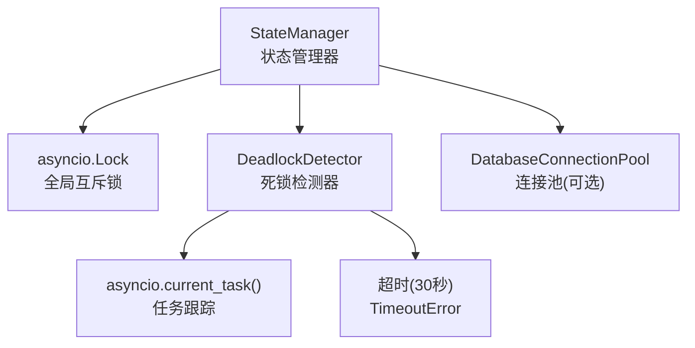
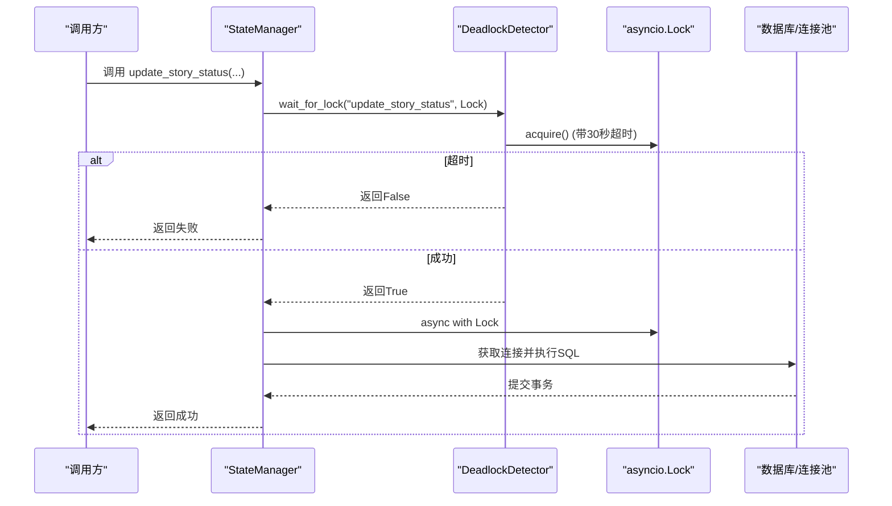
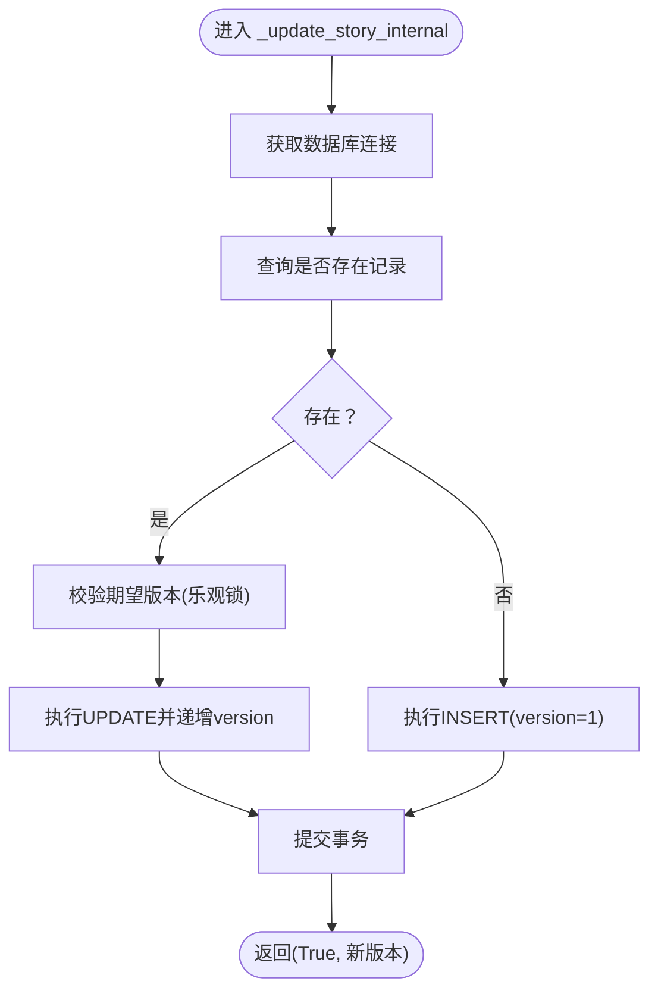
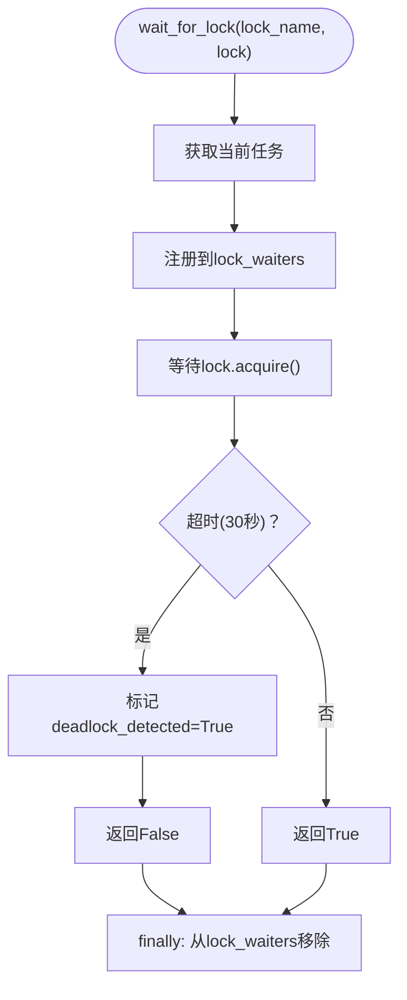
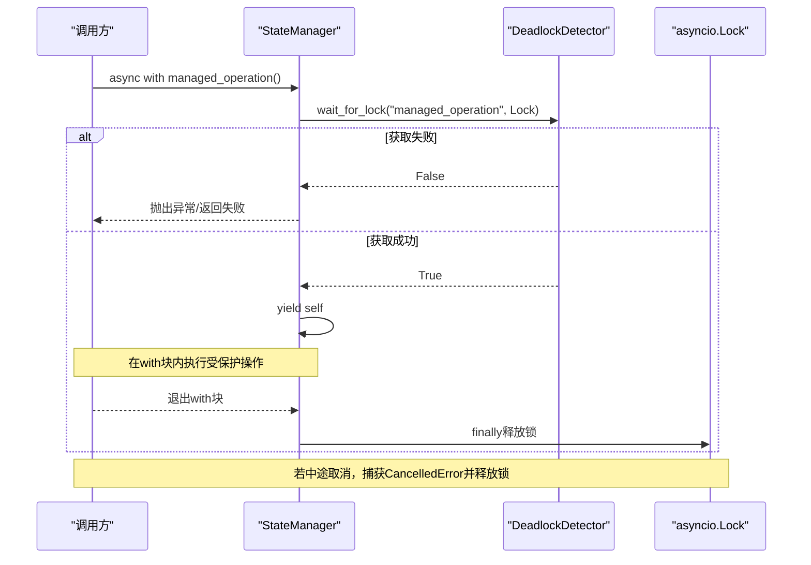
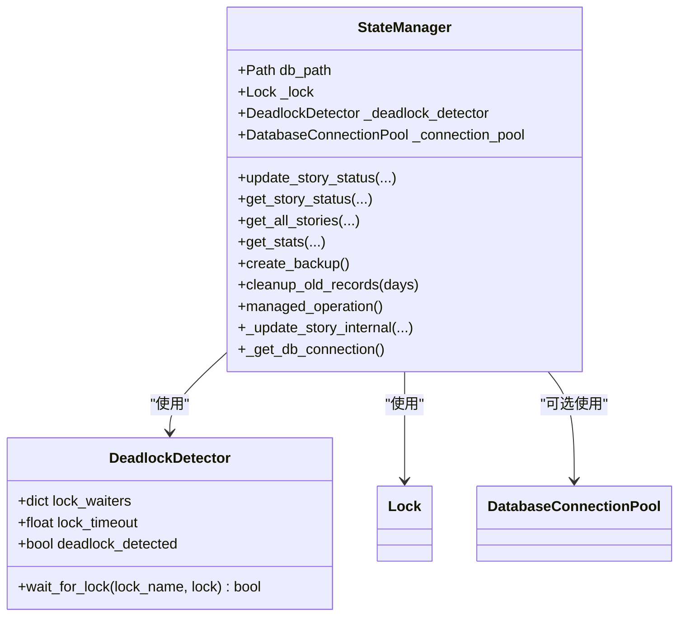

# 锁管理机制

<cite>
**本文引用的文件**
- [state_manager.py](file://autoBMAD/epic_automation/state_manager.py)
- [test_resource_cleanup.py](file://BUGFIX_20260107/tests/test_resource_cleanup.py)
</cite>

## 目录
1. [简介](#简介)
2. [项目结构与定位](#项目结构与定位)
3. [核心组件](#核心组件)
4. [架构总览](#架构总览)
5. [详细组件分析](#详细组件分析)
6. [依赖关系分析](#依赖关系分析)
7. [性能与并发特性](#性能与并发特性)
8. [故障排查指南](#故障排查指南)
9. [结论](#结论)

## 简介
本节聚焦于状态管理器的锁管理机制，围绕以下目标展开：
- 解释 asyncio.Lock 在 StateManager 中的保护作用，确保数据库操作的原子性。
- 说明 _update_story_internal 如何通过 async with self._lock 保证数据库事务的互斥执行。
- 介绍 DeadlockDetector 类如何通过 wait_for_lock 方法实现死锁检测，包括 30 秒超时与任务跟踪。
- 解释 managed_operation 上下文管理器如何结合死锁检测器安全地管理锁的获取与释放，尤其在取消操作时确保锁被正确释放。
- 提供在状态更新、备份创建、记录清理等操作中锁使用的模式示例与最佳实践。

## 项目结构与定位
- 锁管理相关代码集中在状态管理器模块中，包含：
  - 死锁检测器 DeadlockDetector
  - 状态管理器 StateManager 及其内部方法
  - 测试用例验证锁在取消、异常、并发竞争下的正确释放

图表来源
- [state_manager.py](file://autoBMAD/epic_automation/state_manager.py#L31-L60)
- [state_manager.py](file://autoBMAD/epic_automation/state_manager.py#L97-L120)

章节来源
- [state_manager.py](file://autoBMAD/epic_automation/state_manager.py#L31-L60)
- [state_manager.py](file://autoBMAD/epic_automation/state_manager.py#L97-L120)

## 核心组件
- asyncio.Lock：StateManager 的全局互斥锁，用于保护数据库操作的原子性。
- DeadlockDetector：封装等待锁的逻辑，内置 30 秒超时与任务跟踪，检测潜在死锁。
- StateManager：
  - 提供 update_story_status、get_story_status、get_all_stories、get_stats、cleanup_old_records、create_backup 等方法。
  - 所有涉及数据库读写的公共方法均通过 async with self._lock 保护。
- managed_operation：上下文管理器，结合 DeadlockDetector 安全地获取/释放锁，确保取消或异常时锁能被正确释放。

章节来源
- [state_manager.py](file://autoBMAD/epic_automation/state_manager.py#L97-L120)
- [state_manager.py](file://autoBMAD/epic_automation/state_manager.py#L31-L60)
- [state_manager.py](file://autoBMAD/epic_automation/state_manager.py#L370-L410)

## 架构总览
下面的图展示了 StateManager 的锁保护与死锁检测的整体流程，以及关键方法的调用关系。

图表来源
- [state_manager.py](file://autoBMAD/epic_automation/state_manager.py#L203-L260)
- [state_manager.py](file://autoBMAD/epic_automation/state_manager.py#L31-L60)

章节来源
- [state_manager.py](file://autoBMAD/epic_automation/state_manager.py#L203-L260)
- [state_manager.py](file://autoBMAD/epic_automation/state_manager.py#L31-L60)

## 详细组件分析

### 1) asyncio.Lock 在 StateManager 中的保护作用
- 全局互斥锁：StateManager 在构造时初始化 asyncio.Lock，并在所有数据库读写方法中使用 async with self._lock 保护。
- 原子性保障：在锁范围内，数据库查询、更新、删除、提交等操作不会被其他协程打断，从而避免竞态条件与不一致状态。
- 典型位置：
  - 状态更新：update_story_status 内部调用 _update_story_internal，后者在锁内执行 SQL。
  - 查询与统计：get_story_status、get_all_stories、get_stats。
  - 清理与备份：cleanup_old_records、create_backup。

章节来源
- [state_manager.py](file://autoBMAD/epic_automation/state_manager.py#L203-L260)
- [state_manager.py](file://autoBMAD/epic_automation/state_manager.py#L262-L348)
- [state_manager.py](file://autoBMAD/epic_automation/state_manager.py#L405-L461)
- [state_manager.py](file://autoBMAD/epic_automation/state_manager.py#L462-L512)
- [state_manager.py](file://autoBMAD/epic_automation/state_manager.py#L514-L542)
- [state_manager.py](file://autoBMAD/epic_automation/state_manager.py#L569-L603)

### 2) _update_story_internal 如何使用 async with self._lock 保证原子性
- 锁范围内的完整流程：
  - 获取连接（支持连接池或直连）。
  - 查询是否存在记录，决定更新还是插入。
  - 可选的乐观锁校验（基于 version 字段）。
  - 执行更新或插入 SQL。
  - 提交事务后返回结果。
- 该方法是所有状态更新的核心，确保“读取-判断-写入-提交”四步操作的原子性。

图表来源
- [state_manager.py](file://autoBMAD/epic_automation/state_manager.py#L262-L348)

章节来源
- [state_manager.py](file://autoBMAD/epic_automation/state_manager.py#L262-L348)

### 3) DeadlockDetector 的死锁检测与 30 秒超时
- 任务跟踪：wait_for_lock 会将当前任务注册到 lock_waiters 字典中，键为 lock_name，值为当前任务。
- 超时策略：使用 asyncio.wait_for(lock.acquire(), timeout=30.0)，若超过 30 秒仍未获得锁，则判定为死锁，设置 deadlock_detected 标志并返回 False。
- 资源清理：finally 分支移除对应 lock_name，避免悬挂条目。
- 使用场景：update_story_status 与 managed_operation 在获取锁前先调用 wait_for_lock，以提前发现潜在死锁。

图表来源
- [state_manager.py](file://autoBMAD/epic_automation/state_manager.py#L31-L60)

章节来源
- [state_manager.py](file://autoBMAD/epic_automation/state_manager.py#L31-L60)

### 4) managed_operation 如何结合死锁检测器安全管理锁
- 获取锁：先通过 DeadlockDetector.wait_for_lock 获取锁，若失败则抛出异常或返回失败。
- 上下文产出：成功获取锁后 yield self，允许调用方在 with 块内执行受保护的操作。
- 取消处理：捕获 CancelledError，若已持有锁则主动 release，避免锁泄漏；不重新抛出以避免取消作用域错误。
- 异常处理：捕获其他异常时同样确保已持有锁则 release，再向上抛出。
- finally 保障：无论正常退出还是异常退出，最终都会确保锁被释放。

图表来源
- [state_manager.py](file://autoBMAD/epic_automation/state_manager.py#L370-L410)

章节来源
- [state_manager.py](file://autoBMAD/epic_automation/state_manager.py#L370-L410)

### 5) 锁使用模式示例（状态更新、备份创建、记录清理）
- 状态更新（原子性与乐观锁）：
  - 调用 update_story_status，内部通过 asyncio.wait_for 控制整体超时（默认 30 秒），并在 _update_story_internal 中使用 async with self._lock 保护数据库操作。
  - _update_story_internal 内部执行查询、乐观锁校验、INSERT/UPDATE、commit，保证原子性。
- 备份创建（文件级备份）：
  - create_backup 通过文件复制实现热备份，虽然不直接访问数据库，但作为状态管理器的一部分，仍遵循统一的错误日志与异常处理规范。
- 记录清理（批量删除）：
  - cleanup_old_records 在锁保护下执行 DELETE，限定只清理特定状态且超过保留期的记录，完成后 commit。

章节来源
- [state_manager.py](file://autoBMAD/epic_automation/state_manager.py#L203-L260)
- [state_manager.py](file://autoBMAD/epic_automation/state_manager.py#L262-L348)
- [state_manager.py](file://autoBMAD/epic_automation/state_manager.py#L544-L567)
- [state_manager.py](file://autoBMAD/epic_automation/state_manager.py#L569-L603)

## 依赖关系分析
- 组件耦合：
  - StateManager 依赖 asyncio.Lock 与 DeadlockDetector，二者共同保证锁的安全获取与死锁检测。
  - StateManager 通过 _get_db_connection 获取数据库连接，支持连接池或直连。
- 外部依赖：
  - asyncio：提供 Lock、wait_for、current_task 等异步原语。
  - sqlite3：提供数据库连接与事务提交。
  - logging：统一的日志输出，便于诊断锁超时与死锁。

图表来源
- [state_manager.py](file://autoBMAD/epic_automation/state_manager.py#L31-L60)
- [state_manager.py](file://autoBMAD/epic_automation/state_manager.py#L97-L120)
- [state_manager.py](file://autoBMAD/epic_automation/state_manager.py#L183-L201)

章节来源
- [state_manager.py](file://autoBMAD/epic_automation/state_manager.py#L31-L60)
- [state_manager.py](file://autoBMAD/epic_automation/state_manager.py#L97-L120)
- [state_manager.py](file://autoBMAD/epic_automation/state_manager.py#L183-L201)

## 性能与并发特性
- 串行化保护：全局锁确保数据库操作串行化，避免并发写导致的数据竞争。
- 超时控制：DeadlockDetector 的 30 秒超时与 update_story_status 的整体超时（默认 30 秒）防止长时间阻塞。
- 连接池：可选的 DatabaseConnectionPool 提升并发读写能力，但注意与全局锁配合使用，避免连接池耗尽引发的额外等待。
- 建议：
  - 对长事务尽量缩短持有锁的时间，仅在必要时持有。
  - 对高并发场景，优先考虑分段加锁或按资源键加锁（如按 story_path）以降低争用。
  - 结合业务需求调整 lock_timeout 与 asyncio.wait_for 的超时参数。

[本节为通用建议，无需列出具体文件来源]

## 故障排查指南
- 死锁检测与超时：
  - DeadlockDetector 在 acquire 超时后会设置 deadlock_detected 标志并返回 False，调用方应据此重试或降级处理。
  - update_story_status 默认 30 秒超时，超时会记录警告并返回失败。
- 取消与异常：
  - managed_operation 在捕获 CancelledError 时会主动释放锁，避免锁泄漏；同时不再重新抛出以避免取消作用域错误。
  - 测试用例验证了在取消、异常、并发竞争情况下锁都能被正确释放，可通过 get_health_status 检查 lock_locked 状态。
- 健康检查：
  - get_health_status 返回 db_path、db_exists、lock_locked、deadlock_detected、连接池启用状态等信息，便于快速定位问题。

章节来源
- [state_manager.py](file://autoBMAD/epic_automation/state_manager.py#L31-L60)
- [state_manager.py](file://autoBMAD/epic_automation/state_manager.py#L203-L260)
- [state_manager.py](file://autoBMAD/epic_automation/state_manager.py#L370-L410)
- [state_manager.py](file://autoBMAD/epic_automation/state_manager.py#L605-L625)
- [test_resource_cleanup.py](file://BUGFIX_20260107/tests/test_resource_cleanup.py#L470-L520)

## 结论
- asyncio.Lock 为 StateManager 提供了可靠的互斥保护，确保数据库操作的原子性与一致性。
- DeadlockDetector 通过 30 秒超时与任务跟踪，帮助提前发现潜在死锁，提升系统的鲁棒性。
- managed_operation 将死锁检测与取消/异常处理整合，确保在各种异常情况下锁都能被正确释放。
- 在状态更新、备份创建、记录清理等操作中，遵循“先检测/获取锁，再执行数据库操作，最后释放锁”的模式，可有效避免竞态与资源泄漏。