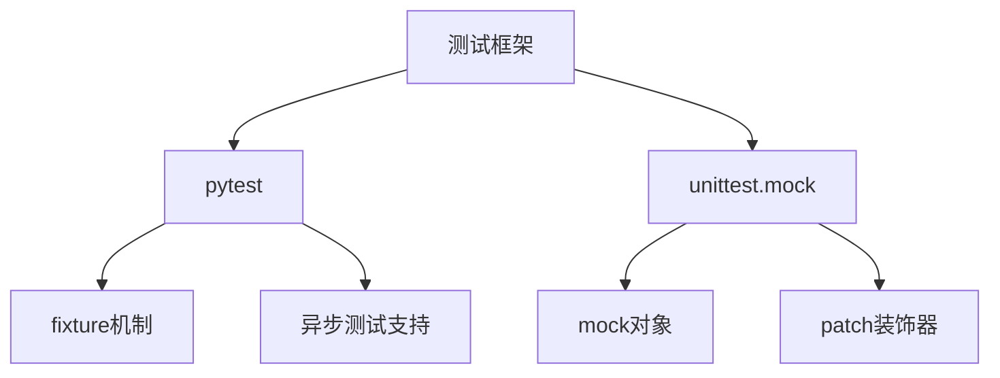
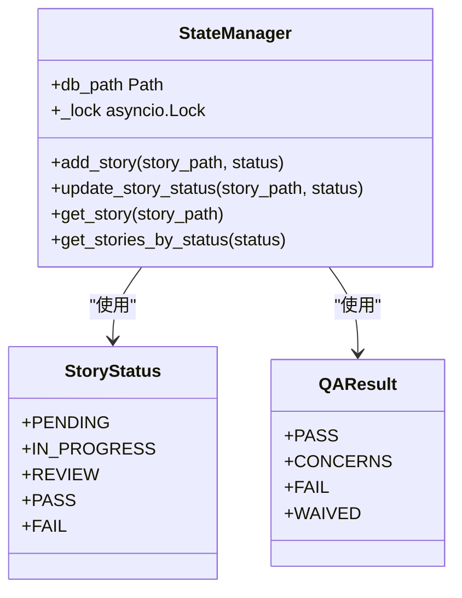
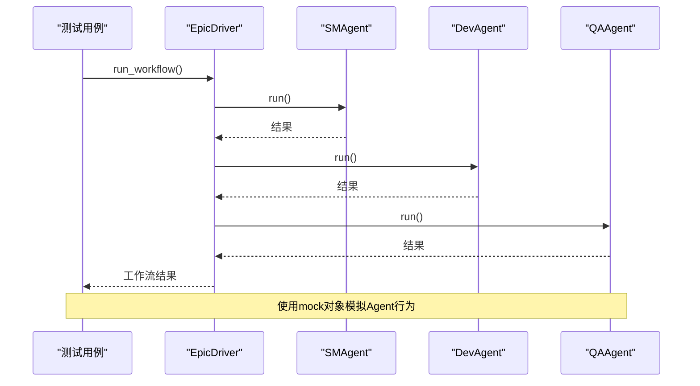
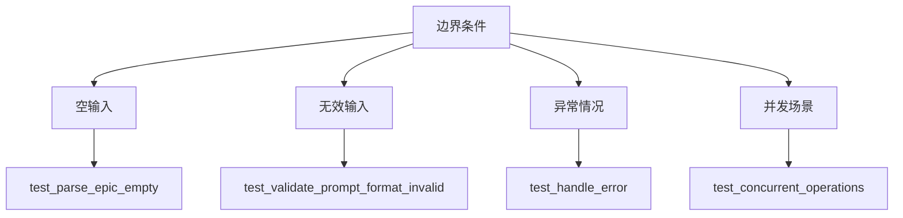

# 单元测试

<cite>
**本文档中引用的文件**   
- [test_epic_driver.py](file://tests-copy/unit/test_epic_driver.py)
- [test_state_manager.py](file://tests-copy/unit/test_state_manager.py)
- [test_dev_agent.py](file://tests-copy/unit/test_dev_agent.py)
- [test_qa_agent.py](file://tests-copy/unit/test_qa_agent.py)
- [test_sm_agent.py](file://tests-copy/unit/test_sm_agent.py)
- [test_agents.py](file://tests-copy/unit/test_agents.py)
- [test_sdk_wrapper.py](file://tests-copy/unit/test_sdk_wrapper.py)
- [test_qa_tools_integration.py](file://tests-copy/unit/test_qa_tools_integration.py)
- [test_test_automation_agent.py](file://tests-copy/unit/test_test_automation_agent.py)
- [conftest.py](file://spec_automation/tests/conftest.py)
- [epic_driver.py](file://autoBMAD/epic_automation/epic_driver.py)
- [state_manager.py](file://autoBMAD/epic_automation/state_manager.py)
</cite>

## 目录
1. [简介](#简介)
2. [测试框架与工具](#测试框架与工具)
3. [核心模块测试实现](#核心模块测试实现)
4. [Mocking技术应用](#mocking技术应用)
5. [异步函数测试方法](#异步函数测试方法)
6. [边界条件覆盖策略](#边界条件覆盖策略)
7. [测试用例设计目的](#测试用例设计目的)
8. [最佳实践](#最佳实践)

## 简介
本项目在`tests-copy/unit`目录下实现了全面的单元测试，重点覆盖了核心模块如epic_driver、state_manager以及各Agent类。测试框架采用unittest和pytest组合，通过隔离测试确保各组件的独立性和可靠性。测试用例设计注重验证状态转换逻辑、错误处理机制等关键功能，同时应用了mocking技术来模拟外部依赖，确保测试的可重复性和稳定性。

**Section sources**
- [test_epic_driver.py](file://tests-copy/unit/test_epic_driver.py#L1-L328)
- [test_state_manager.py](file://tests-copy/unit/test_state_manager.py#L1-L273)

## 测试框架与工具
项目采用pytest作为主要测试框架，结合unittest.mock进行mock操作。测试文件位于`tests-copy/unit`目录下，每个核心模块都有对应的测试文件。pytest的fixture机制被广泛用于创建测试数据和初始化测试环境，如`sample_epic_content`和`temp_db`等fixture提供了可重用的测试资源。

**Diagram sources **
- [conftest.py](file://spec_automation/tests/conftest.py#L1-L663)

**Section sources**
- [conftest.py](file://spec_automation/tests/conftest.py#L1-L663)

## 核心模块测试实现
### epic_driver模块测试
epic_driver模块的测试主要验证其初始化、工作流执行和状态管理功能。测试用例通过mock对象模拟依赖组件，确保测试的隔离性。例如，`test_run_workflow`用例通过mock`initialize_agents`和`process_stories`方法，验证工作流的正确执行。

**Section sources**
- [test_epic_driver.py](file://tests-copy/unit/test_epic_driver.py#L1-L328)
- [epic_driver.py](file://autoBMAD/epic_automation/epic_driver.py#L1-L200)

### state_manager模块测试
state_manager模块的测试重点验证数据库操作的正确性。通过`temp_db` fixture创建临时数据库，测试用例验证了表创建、数据增删改查等功能。`test_concurrent_operations`用例特别验证了并发操作下的数据一致性。

**Diagram sources **
- [test_state_manager.py](file://tests-copy/unit/test_state_manager.py#L1-L273)
- [state_manager.py](file://autoBMAD/epic_automation/state_manager.py#L1-L200)

### Agent类测试
各Agent类（DevAgent、QAAgent、SMAgent）的测试采用相似的模式：通过mock内部方法，验证执行流程的正确性。例如，`test_execute_basic`用例验证了Agent执行的基本流程，包括需求提取、验证和任务执行等步骤。

**Section sources**
- [test_dev_agent.py](file://tests-copy/unit/test_dev_agent.py#L1-L380)
- [test_qa_agent.py](file://tests-copy/unit/test_qa_agent.py#L1-L356)
- [test_sm_agent.py](file://tests-copy/unit/test_sm_agent.py#L1-L424)

## Mocking技术应用
项目中广泛使用unittest.mock的patch装饰器和Mock对象来模拟外部依赖。例如，在`test_execute_sm_dev_qa_cycle`用例中，通过patch装饰器mock了SM、Dev和QA Agent的run方法，验证了工作流的正确执行顺序。

**Diagram sources **
- [test_epic_driver.py](file://tests-copy/unit/test_epic_driver.py#L1-L328)

**Section sources**
- [test_epic_driver.py](file://tests-copy/unit/test_epic_driver.py#L1-L328)

## 异步函数测试方法
由于项目大量使用异步编程，测试用例通过`@pytest.mark.asyncio`装饰器支持异步测试。测试异步函数时，使用`await`关键字调用被测函数，并通过asyncio.gather等方法测试并发操作。例如，`test_concurrent_operations`用例验证了state_manager在并发环境下的正确性。

**Section sources**
- [test_state_manager.py](file://tests-copy/unit/test_state_manager.py#L1-L273)

## 边界条件覆盖策略
测试用例设计充分考虑了各种边界条件，包括：
- 空输入：如`test_parse_epic`测试空内容的解析
- 无效输入：如`test_validate_prompt_format_invalid`测试无效提示格式
- 异常情况：如`test_handle_error`测试错误处理逻辑
- 并发场景：如`test_concurrent_operations`测试并发操作

**Diagram sources **
- [test_epic_driver.py](file://tests-copy/unit/test_epic_driver.py#L1-L328)
- [test_state_manager.py](file://tests-copy/unit/test_state_manager.py#L1-L273)

**Section sources**
- [test_epic_driver.py](file://tests-copy/unit/test_epic_driver.py#L1-L328)
- [test_state_manager.py](file://tests-copy/unit/test_state_manager.py#L1-L273)

## 测试用例设计目的
### 验证状态转换逻辑
测试用例如`test_update_story_status`和`test_update_qa_result`专门验证state_manager的状态转换逻辑，确保状态变更的正确性和持久化。

**Section sources**
- [test_state_manager.py](file://tests-copy/unit/test_state_manager.py#L1-L273)

### 验证错误处理机制
通过`test_handle_error`和`test_record_error`等用例，验证系统在遇到错误时的处理能力，包括错误记录和恢复机制。

**Section sources**
- [test_epic_driver.py](file://tests-copy/unit/test_epic_driver.py#L1-L328)
- [test_state_manager.py](file://tests-copy/unit/test_state_manager.py#L1-L273)

## 最佳实践
### 提高测试可维护性
- 使用fixture复用测试资源
- 保持测试用例的独立性和原子性
- 清晰的测试命名和组织结构

### 提高执行效率
- 使用临时数据库避免持久化数据污染
- 并行执行独立的测试用例
- 合理使用mock减少外部依赖

**Section sources**
- [test_epic_driver.py](file://tests-copy/unit/test_epic_driver.py#L1-L328)
- [test_state_manager.py](file://tests-copy/unit/test_state_manager.py#L1-L273)
- [test_dev_agent.py](file://tests-copy/unit/test_dev_agent.py#L1-L380)