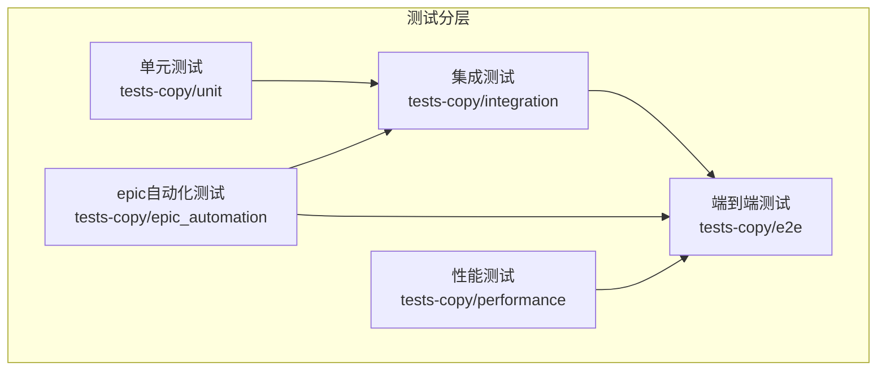
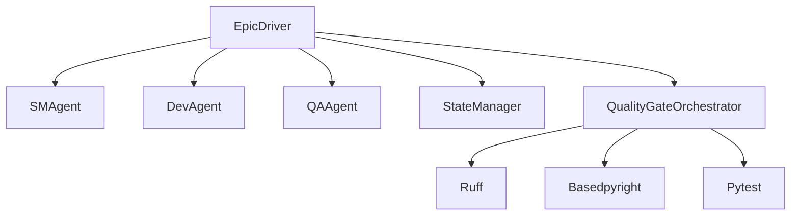
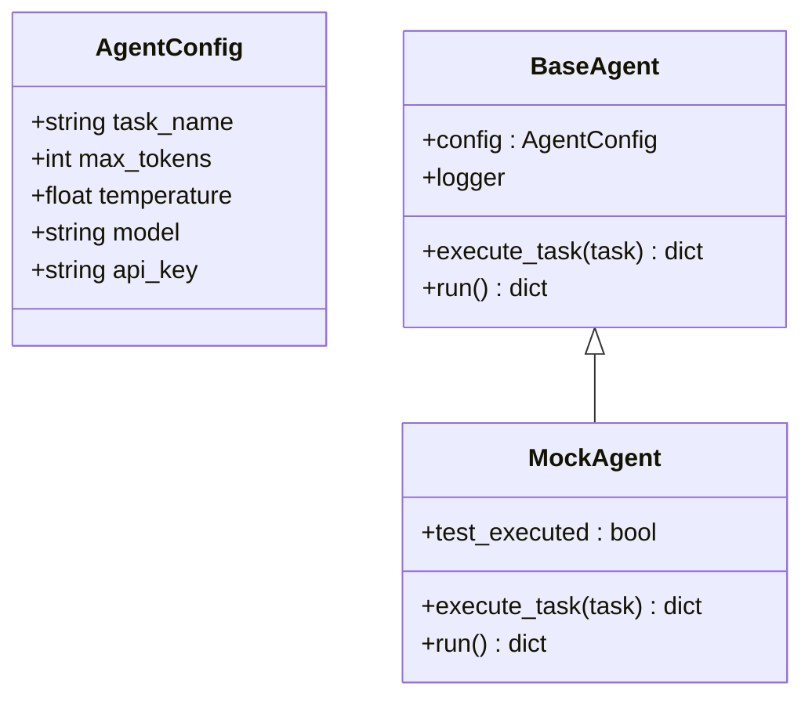
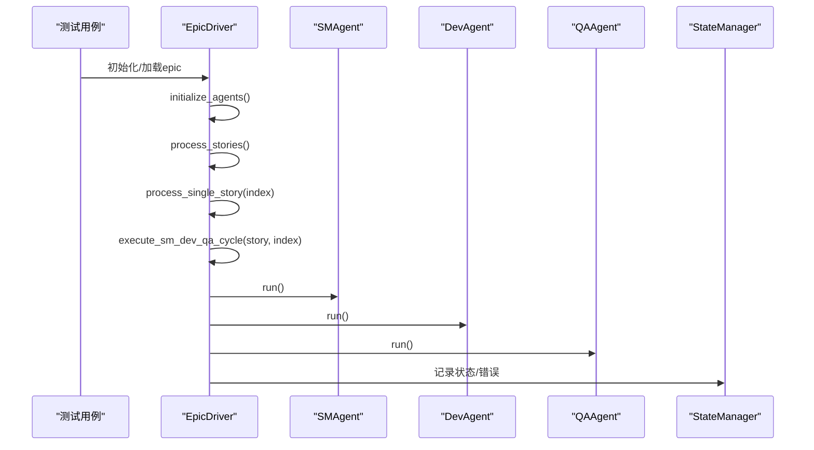
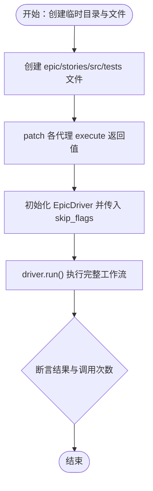
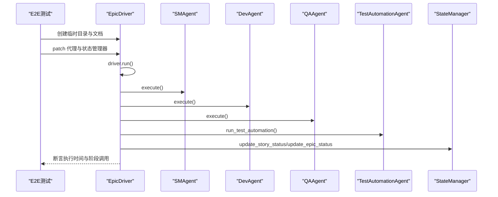
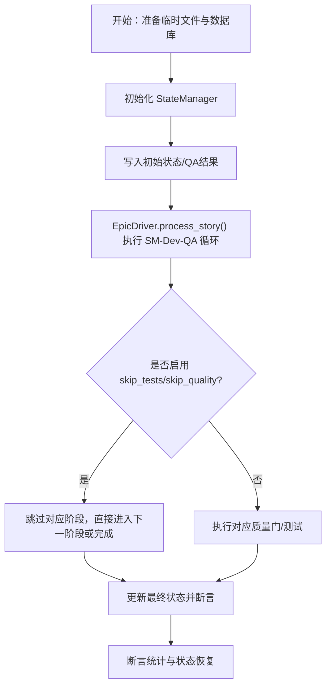
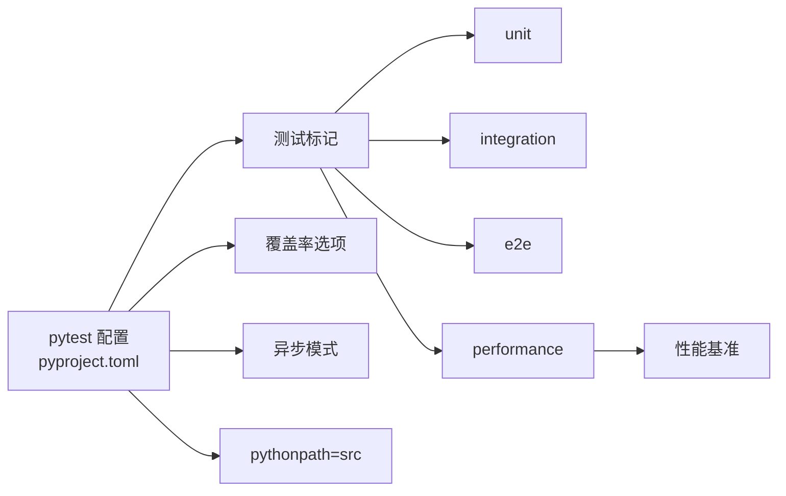

# 测试策略

<cite>
**本文引用的文件**
- [pyproject.toml](file://pyproject.toml)
- [tests-copy/unit/test_agents.py](file://tests-copy/unit/test_agents.py)
- [tests-copy/unit/test_epic_driver.py](file://tests-copy/unit/test_epic_driver.py)
- [tests-copy/integration/test_complete_workflow.py](file://tests-copy/integration/test_complete_workflow.py)
- [tests-copy/integration/test_workflow_integration.py](file://tests-copy/integration/test_workflow_integration.py)
- [tests-copy/e2e/test_epic_processing.py](file://tests-copy/e2e/test_epic_processing.py)
- [tests-copy/epic_automation/test_epic_driver.py](file://tests-copy/epic_automation/test_epic_driver.py)
- [tests-copy/test_epic_automation.py](file://tests-copy/test_epic_automation.py)
- [tests-copy/performance/test_benchmarks.py](file://tests-copy/performance/test_benchmarks.py)
- [spec_automation/tests/conftest.py](file://spec_automation/tests/conftest.py)
</cite>

## 目录
1. [引言](#引言)
2. [项目结构](#项目结构)
3. [核心组件](#核心组件)
4. [架构总览](#架构总览)
5. [详细组件分析](#详细组件分析)
6. [依赖关系分析](#依赖关系分析)
7. [性能考量](#性能考量)
8. [故障排查指南](#故障排查指南)
9. [结论](#结论)
10. [附录](#附录)

## 引言
本文件系统化阐述该仓库的测试策略，覆盖单元测试、集成测试与端到端测试（E2E），并深入解析 epic 自动化相关测试设计，特别是针对“最大迭代安全”等关键测试用例的原理与实现要点。同时提供编写新测试的指导原则与测试覆盖率最佳实践，帮助开发者在保证质量的同时提升测试效率与可维护性。

## 项目结构
测试目录按层次划分：
- tests-copy/unit：面向模块与类的单元测试，验证函数行为与类接口
- tests-copy/integration：验证组件间协作与跨模块流程
- tests-copy/e2e：模拟真实工作流，覆盖多故事、错误恢复与性能基准
- tests-copy/performance：性能基准与回归检测
- tests-copy/epic_automation：epic 驱动与质量门集成测试
- tests-copy/agents、tests-copy/bmad_agents：代理类与状态管理相关测试

图表来源
- [pyproject.toml](file://pyproject.toml#L52-L68)
- [tests-copy/unit/test_agents.py](file://tests-copy/unit/test_agents.py#L1-L220)
- [tests-copy/integration/test_complete_workflow.py](file://tests-copy/integration/test_complete_workflow.py#L1-L595)
- [tests-copy/e2e/test_epic_processing.py](file://tests-copy/e2e/test_epic_processing.py#L1-L478)
- [tests-copy/performance/test_benchmarks.py](file://tests-copy/performance/test_benchmarks.py#L1-L468)
- [tests-copy/epic_automation/test_epic_driver.py](file://tests-copy/epic_automation/test_epic_driver.py#L1-L559)

章节来源
- [pyproject.toml](file://pyproject.toml#L52-L68)

## 核心组件
- EpicDriver：epic 工作流编排器，负责加载 epic、解析故事、驱动 SM-Dev-QA 循环、状态持久化与重试机制
- StateManager：SQLite 状态管理，记录故事状态、迭代次数、QA 结果与错误信息
- SMAgent/DevAgent/QAAgent：三阶段代理，分别处理需求梳理、开发与质量验收
- QualityGateOrchestrator：质量门编排器，协调 Ruff/Basedpyright/Pytest 质量检查
- 测试标记与运行配置：pytest 标记（unit/integration/e2e/performance/epic）与覆盖率选项

章节来源
- [tests-copy/test_epic_automation.py](file://tests-copy/test_epic_automation.py#L1-L789)
- [tests-copy/epic_automation/test_epic_driver.py](file://tests-copy/epic_automation/test_epic_driver.py#L1-L559)
- [pyproject.toml](file://pyproject.toml#L52-L68)

## 架构总览
下图展示 epic 自动化测试所覆盖的关键组件与交互路径，包括工作流编排、状态管理、质量门与工具链集成。

图表来源
- [tests-copy/test_epic_automation.py](file://tests-copy/test_epic_automation.py#L1-L789)
- [tests-copy/epic_automation/test_epic_driver.py](file://tests-copy/epic_automation/test_epic_driver.py#L1-L559)

## 详细组件分析

### 单元测试：代理与配置
- AgentConfig 与 BaseAgent 行为验证：默认参数、自定义参数、字符串表示、日志、错误处理、异步执行、独立实例与生命周期
- 使用 patch/magic mock 验证外部依赖（如 Anthropic 客户端初始化）与异常传播
- 关键断言点：返回值结构、异常类型匹配、异步并发任务结果一致性

图表来源
- [tests-copy/unit/test_agents.py](file://tests-copy/unit/test_agents.py#L1-L220)

章节来源
- [tests-copy/unit/test_agents.py](file://tests-copy/unit/test_agents.py#L1-L220)

### 单元测试：EpicDriver 初始化与流程桩
- 默认属性与参数初始化校验
- 加载 epic、解析故事、初始化代理、处理故事列表、单故事处理、SM-Dev-QA 循环调用顺序、错误处理与重试逻辑、并发模式开关、清理流程
- 使用 patch 对外部依赖进行隔离，确保仅验证 EpicDriver 的职责边界

图表来源
- [tests-copy/unit/test_epic_driver.py](file://tests-copy/unit/test_epic_driver.py#L1-L328)

章节来源
- [tests-copy/unit/test_epic_driver.py](file://tests-copy/unit/test_epic_driver.py#L1-L328)

### 集成测试：完整工作流与跳过标志
- 覆盖 5 阶段完整工作流、跳过质量门、跳过测试、多故事处理、QA 失败与重试、进度跟踪准确性
- 使用临时目录与 patch 模拟各代理执行，断言各阶段被正确调用且结果符合预期
- 关注 skip_flags 对流程的影响与状态管理更新

图表来源
- [tests-copy/integration/test_complete_workflow.py](file://tests-copy/integration/test_complete_workflow.py#L1-L595)

章节来源
- [tests-copy/integration/test_complete_workflow.py](file://tests-copy/integration/test_complete_workflow.py#L1-L595)

### 集成测试：组件协作与状态管理
- SM-Dev-QA 循环集成验证、状态管理器数据读写、EpicDriver 与各组件集成、代理间协调、并发处理、错误记录与迭代计数、文件系统操作验证、终止清理

章节来源
- [tests-copy/integration/test_workflow_integration.py](file://tests-copy/integration/test_workflow_integration.py#L1-L376)

### 端到端测试：真实工作流与性能基准
- 质量门端到端执行、多故事处理、错误恢复（含重试）、性能基准（执行时间阈值）、向后兼容性（CLI 参数）
- 使用临时目录与 patch 模拟各代理与状态管理器，断言各阶段调用与执行时间约束

图表来源
- [tests-copy/e2e/test_epic_processing.py](file://tests-copy/e2e/test_epic_processing.py#L1-L478)

章节来源
- [tests-copy/e2e/test_epic_processing.py](file://tests-copy/e2e/test_epic_processing.py#L1-L478)

### 质量门编排测试：Ruff/Basedpyright/Pytest
- 质量门编排器初始化与 skip_flags 行为、各阶段执行结果断言、失败场景（Ruff/Basedpyright/Pytest）与错误收集、进度跟踪字段验证
- CLI 参数解析与 EpicDriver 初始化参数验证

章节来源
- [tests-copy/epic_automation/test_epic_driver.py](file://tests-copy/epic_automation/test_epic_driver.py#L1-L559)

### epic 自动化核心测试：状态管理与循环
- StateManager 数据库初始化、增删改查、统计与 QA 结果存储
- SMAgent/DevAgent/QAAgent 功能验证（解析、校验、执行）
- EpicDriver 解析 epic、执行各阶段、状态持久化与恢复、错误处理与恢复、最大迭代安全保护

图表来源
- [tests-copy/test_epic_automation.py](file://tests-copy/test_epic_automation.py#L1-L789)

章节来源
- [tests-copy/test_epic_automation.py](file://tests-copy/test_epic_automation.py#L1-L789)

### 性能测试：工具链与工作流
- 基于基于型检查、Ruff 检查/格式化、Pytest 执行时间与覆盖率执行时间的基准断言
- 文件创建速度、内存使用（可选）与基线指标文档化
- 回归检测思路与历史对比建议

章节来源
- [tests-copy/performance/test_benchmarks.py](file://tests-copy/performance/test_benchmarks.py#L1-L468)

## 依赖关系分析
- 测试标记与运行配置
  - pytest 标记：unit/integration/e2e/performance/epic/gui/documentation/acceptance
  - 覆盖率：开启 --cov=src，并输出 JSON 报告
  - 异步模式：auto
  - pythonpath：src
- 工具链与质量门
  - Ruff/Basedpyright/Pytest 作为质量门工具，通过子进程调用或代理执行模拟
- 测试夹具与共享资源
  - spec_automation 测试夹具提供示例文档与临时目录，便于集成测试复用

图表来源
- [pyproject.toml](file://pyproject.toml#L52-L68)

章节来源
- [pyproject.toml](file://pyproject.toml#L52-L68)
- [spec_automation/tests/conftest.py](file://spec_automation/tests/conftest.py#L1-L663)

## 性能考量
- 工具链性能
  - 基于型检查：每文件耗时阈值与最大阈值断言
  - Ruff 检查/格式化：每文件耗时阈值断言
  - Pytest：总耗时与每测试耗时断言，覆盖率执行时间断言
- 工作流性能
  - 端到端执行时间阈值断言（如多故事场景）
  - 文件创建速度与内存使用（可选）
- 基线与回归
  - 文档化基线指标与回归检测方法，定期比较历史结果

章节来源
- [tests-copy/performance/test_benchmarks.py](file://tests-copy/performance/test_benchmarks.py#L1-L468)

## 故障排查指南
- 最大迭代安全保护
  - 当 QA 在首轮失败时触发重试，但受 max_iterations 限制，避免无限循环
  - 通过设置 driver.max_iterations 并断言流程在达到上限后停止重试
- 错误处理与恢复
  - StateManager 记录错误消息；EpicDriver 在异常时调用 handle_error 并持久化
  - 状态恢复：中断后重启，从已持久化的状态继续执行
- 质量门失败
  - Ruff/Basedpyright/Pytest 失败场景断言，确认错误收集与 success 字段
- 跳过标志影响
  - skip_quality/skip_tests 导致对应阶段不执行或返回占位结果，需关注调用次数与流程分支

章节来源
- [tests-copy/test_epic_automation.py](file://tests-copy/test_epic_automation.py#L568-L586)
- [tests-copy/epic_automation/test_epic_driver.py](file://tests-copy/epic_automation/test_epic_driver.py#L1-L559)
- [tests-copy/integration/test_complete_workflow.py](file://tests-copy/integration/test_complete_workflow.py#L1-L595)

## 结论
该测试体系以“单元-集成-E2E-性能”四层递进构建，配合质量门编排与状态管理，确保 epic 自动化流程的正确性、鲁棒性与可观测性。通过严格的断言与标记化运行，既能快速定位问题，又能保障回归质量。建议持续完善覆盖率与性能基线，结合 CI/CD 实施自动化质量门。

## 附录

### 编写新测试的指南
- 分层选择
  - 单元测试：聚焦函数/类内部行为，使用 patch/magic mock 隔离外部依赖
  - 集成测试：验证组件协作与跨模块流程，使用临时目录与最小化桩
  - 端到端测试：模拟真实工作流，断言整体结果与性能阈值
  - 性能测试：设定基线断言，定期回归检测
- 断言策略
  - 明确输入/输出契约，覆盖正常路径与边界条件
  - 对异常路径进行类型与消息断言
  - 对异步流程使用 asyncio.gather 或 AsyncMock
- 标记与运行
  - 使用 pytest 标记区分测试类型，便于选择性运行
  - 利用 --cov 与 JSON 报告监控覆盖率变化
- 夹具与共享资源
  - 使用临时目录与文件，确保测试隔离与自动清理
  - 在 spec_automation 测试夹具基础上扩展示例文档与测试数据

章节来源
- [pyproject.toml](file://pyproject.toml#L52-L68)
- [spec_automation/tests/conftest.py](file://spec_automation/tests/conftest.py#L1-L663)

### 测试覆盖率最佳实践
- 覆盖率目标
  - 以 pytest 配置的 --cov=src 为基础，结合 JSON 报告追踪趋势
- 覆盖率驱动的改进
  - 优先补齐关键路径与异常分支
  - 对异步与并发逻辑单独补充测试
- 质量门
  - 将覆盖率纳入 CI 质量门，未达标禁止合并
- 可视化与报告
  - 使用终端缺失报告与 JSON 报告，定期导出并归档

章节来源
- [pyproject.toml](file://pyproject.toml#L52-L68)