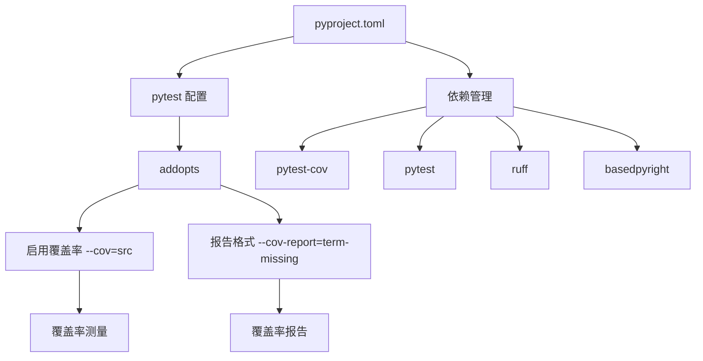
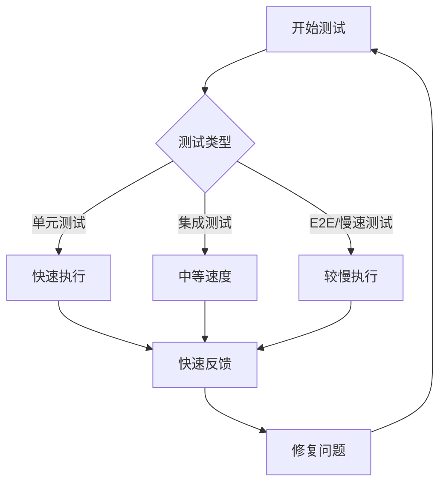

# 测试覆盖率与最佳实践

<cite>
**本文档引用的文件**
- [pyproject.toml](file://pyproject.toml)
- [requirements-dev.txt](file://requirements-dev.txt)
- [test_bubble_sort.py](file://tests/test_bubble_sort.py)
- [test_cli.py](file://tests/test_cli.py)
- [conftest.py](file://spec_automation/tests/conftest.py)
- [testing_guide.md](file://claude_docs/testing_guide.md)
- [development_rules.md](file://claude_docs/development_rules.md)
- [coding-standards.md](file://docs-copy/architecture/coding-standards.md)
- [test_benchmarks.py](file://tests-copy/performance/test_benchmarks.py)
- [user-guide/test-automation.md](file://docs-copy/user-guide/test-automation.md)
</cite>

## 目录
1. [引言](#引言)
2. [测试工具链配置](#测试工具链配置)
3. [代码覆盖率测量与阈值](#代码覆盖率测量与阈值)
4. [测试用例编写规范](#测试用例编写规范)
5. [测试的可重复性、独立性与快速反馈](#测试的可重复性独立性与快速反馈)
6. [避免脆弱测试的建议](#避免脆弱测试的建议)
7. [性能基准与测试执行时间](#性能基准与测试执行时间)
8. [结论](#结论)

## 引言
本文档旨在为 `pytQt_template` 项目提供关于测试覆盖率和最佳实践的全面指导。基于项目中的 `pyproject.toml` 和 `requirements-dev.txt` 等配置文件，我们将深入探讨如何使用 `pytest` 和 `pytest-cov` 等工具链来测量代码覆盖率，并设定合理的质量目标。同时，本文档将详细阐述编写高效、可读性强的测试用例的编码规范，包括命名约定、断言清晰度和文档注释要求。我们还将强调测试的可重复性、独立性和快速反馈原则，并提供具体的建议来避免创建脆弱的测试。

**Section sources**
- [pyproject.toml](file://pyproject.toml)
- [requirements-dev.txt](file://requirements-dev.txt)

## 测试工具链配置
项目的测试工具链在 `pyproject.toml` 文件中进行了集中配置，确保了开发环境的一致性和可重复性。核心工具包括 `pytest` 作为测试框架，`pytest-cov` 用于代码覆盖率分析，以及 `ruff` 和 `basedpyright` 用于代码质量和类型检查。

### 核心依赖
在 `requirements-dev.txt` 文件中，明确列出了所有开发和测试依赖项。这包括：
- **测试框架**: `pytest>=7.0.0`, `pytest-asyncio>=0.21.0`, `pytest-json-report>=1.5.0`
- **代码覆盖率**: `pytest-cov>=4.0.0`
- **GUI测试**: `pytest-qt>=4.2.0`
- **超时控制**: `pytest-timeout>=2.1.0`
- **模拟对象**: `pytest-mock>=3.11.0`
- **代码质量**: `ruff>=0.1.0`, `basedpyright>=1.1.0`

### pytest 配置
`pyproject.toml` 文件中的 `[tool.pytest.ini_options]` 部分定义了 `pytest` 的全局行为：
- **最小版本**: `minversion = "7.0"`
- **默认选项**: `addopts = "-ra -q --strict-markers --cov=src --cov-report=term-missing --json-report --json-report-file=test_results.json"`。这行配置是关键，它指定了运行 `pytest` 时自动启用覆盖率报告（`--cov=src`），并以简洁的文本格式显示缺失的行（`--cov-report=term-missing`）。
- **测试路径**: `testpaths = ["tests"]` 指定了测试文件所在的目录。
- **异步模式**: `asyncio_mode = "auto"` 支持异步测试。
- **Python路径**: `pythonpath = ["src"]` 确保测试可以正确导入源代码。
- **标记系统**: 定义了丰富的标记（如 `unit`, `integration`, `e2e`, `performance`），允许通过命令行筛选执行特定类型的测试。



**Diagram sources**
- [pyproject.toml](file://pyproject.toml)
- [requirements-dev.txt](file://requirements-dev.txt)

**Section sources**
- [pyproject.toml](file://pyproject.toml)
- [requirements-dev.txt](file://requirements-dev.txt)

## 代码覆盖率测量与阈值
代码覆盖率是衡量测试完整性的重要指标。本项目通过 `pytest-cov` 插件与 `pytest` 无缝集成，可以轻松测量和报告覆盖率。

### 测量方法
根据 `pyproject.toml` 中的配置，当运行 `pytest` 命令时，覆盖率测量会自动启动。具体命令如下：
```bash
# 运行所有测试并生成覆盖率报告
pytest

# 或者显式运行（与配置中的 addopts 等效）
pytest --cov=src --cov-report=term-missing
```
此命令会执行 `tests/` 目录下的所有测试，并生成一个文本报告，显示 `src/` 目录下哪些代码行未被执行。

### 覆盖率阈值目标
项目文档中明确设定了覆盖率目标。在 `docs-copy/architecture/coding-standards.md` 文件的“测试标准”部分提到：
- **最低覆盖率**: 关键路径的测试覆盖率必须达到 **80%**。
- **测试类型**: 覆盖率要求涵盖单元测试、集成测试和端到端测试（E2E）。

此外，`test_benchmarks.py` 文件中的性能测试也间接反映了覆盖率的重要性。它包含一个名为 `test_pytest_with_coverage_performance` 的测试，该测试明确要求带覆盖率的测试套件执行时间必须在合理范围内（预期 < 8 分钟，最大 < 20 分钟），这表明覆盖率测试是CI/CD流程中的常规操作。

**Section sources**
- [pyproject.toml](file://pyproject.toml)
- [docs-copy/architecture/coding-standards.md](file://docs-copy/architecture/coding-standards.md)
- [tests-copy/performance/test_benchmarks.py](file://tests-copy/performance/test_benchmarks.py)

## 测试用例编写规范
高质量的测试用例是软件可靠性的基石。本项目遵循一系列最佳实践来确保测试的可读性、可维护性和有效性。

### AAA 模式
所有测试用例都应遵循 **AAA (Arrange, Act, Assert)** 模式：
1.  **Arrange (准备)**: 设置测试所需的所有前提条件和输入数据。
2.  **Act (执行)**: 执行要测试的操作或调用函数。
3.  **Assert (断言)**: 验证操作结果是否符合预期。

例如，在 `test_bubble_sort.py` 中，`test_original_not_modified` 函数清晰地体现了这一模式：
```python
# Arrange
original = [5, 2, 8, 1]
# Act
result = bubble_sort(original)
# Assert
assert original == [5, 2, 8, 1]  # 原始列表未被修改
assert result == [1, 2, 5, 8]    # 返回结果正确
```

### 命名约定
- **测试类**: 以 `Test` 开头，后接被测试的类或模块名，采用 `PascalCase`，例如 `TestBubbleSortBasic`。
- **测试函数**: 以 `test_` 开头，后接描述性名称，采用 `snake_case`。名称应清晰地说明测试的意图，例如 `test_empty_list` 或 `test_none_input_raises_type_error`。

### 断言清晰度
断言应尽可能具体和明确。使用 `pytest` 的 `assert` 语句，它能提供丰富的错误信息。对于异常测试，应使用 `pytest.raises` 上下文管理器，并指定预期的异常类型和消息，以确保捕获的是正确的错误。

### 文档注释要求
- **模块级文档字符串**: 每个测试文件都应包含一个模块级文档字符串，概述该文件测试的范围和目的。
- **类级文档字符串**: 每个测试类应有文档字符串，解释该类测试的特定功能或场景。
- **函数级文档字符串**: 每个测试函数应有简短的文档字符串，描述测试的具体行为。例如，`test_cli.py` 中的 `"""Test array input parsing functionality."""`。

### 使用 pytest fixtures
`pytest` 的 `fixture` 机制用于管理测试的依赖和状态。在 `spec_automation/tests/conftest.py` 中，定义了多个 `fixture`，如 `mock_sdk`、`temp_dir` 和 `sample_story_path`。这些 `fixture` 可以在多个测试文件中复用，避免了代码重复，并确保了测试环境的一致性。

**Section sources**
- [test_bubble_sort.py](file://tests/test_bubble_sort.py)
- [test_cli.py](file://tests/test_cli.py)
- [spec_automation/tests/conftest.py](file://spec_automation/tests/conftest.py)
- [claude_docs/testing_guide.md](file://claude_docs/testing_guide.md)

## 测试的可重复性、独立性与快速反馈
为了保证测试的可靠性，每个测试都必须是可重复和独立的。

### 可重复性与独立性
- **独立执行**: 每个测试用例都应能独立运行，不依赖于其他测试的执行顺序或状态。`pytest` 通过在每次测试前重新创建 `fixture` 来帮助实现这一点。
- **隔离外部依赖**: 使用 `unittest.mock` 库（如 `@patch` 装饰器）来模拟外部依赖，如文件系统、网络请求或数据库。在 `test_cli.py` 中，`test_read_valid_file` 使用 `@patch("src.cli.Path")` 来模拟文件读取，确保测试不依赖于真实的文件系统。
- **临时资源**: 使用 `tempfile` 或 `tmp_path` fixture 来创建临时文件和目录，这些资源在测试结束后会自动清理。

### 快速反馈
- **测试分类**: 使用 `pytest` 的标记（markers）将测试分为 `unit`（单元测试）、`integration`（集成测试）和 `slow`（慢速测试）。这允许开发者在开发过程中快速运行轻量级的单元测试。
- **Makefile 集成**: 项目可以通过 `Makefile` 提供便捷的命令，如 `make test-fast` 来运行所有非慢速测试，从而获得快速反馈。



**Diagram sources**
- [test_cli.py](file://tests/test_cli.py)
- [docs-copy/user-guide/test-automation.md](file://docs-copy/user-guide/test-automation.md)

**Section sources**
- [test_cli.py](file://tests/test_cli.py)
- [docs-copy/user-guide/test-automation.md](file://docs-copy/user-guide/test-automation.md)

## 避免脆弱测试的建议
脆弱的测试（Fragile Tests）是指那些容易因非功能性代码变更而失败的测试。以下是避免创建脆弱测试的具体建议：

1.  **测试行为而非实现**: 专注于测试函数的输入和输出（黑盒测试），而不是其内部实现细节。如果重构了函数的内部逻辑但保持了相同的输入/输出，测试不应失败。
2.  **避免过度模拟**: 只模拟那些真正需要隔离的外部依赖。过度模拟会使测试变得复杂且难以维护。
3.  **使用稳定的测试数据**: 在 `conftest.py` 中使用 `fixture` 提供稳定、可预测的测试数据，避免在测试中硬编码复杂的数据结构。
4.  **避免测试私有方法**: 私有方法（以 `_` 开头）是实现细节，可能会频繁变更。应通过测试其所属的公共方法来间接测试私有方法。
5.  **处理非确定性**: 对于涉及时间、随机数或网络延迟的测试，使用 `fixture` 或 `mock` 来固定这些值，确保测试结果的确定性。

**Section sources**
- [spec_automation/tests/conftest.py](file://spec_automation/tests/conftest.py)
- [test_bubble_sort.py](file://tests/test_bubble_sort.py)

## 性能基准与测试执行时间
除了功能正确性，测试套件的性能也至关重要。缓慢的测试会阻碍开发者的快速反馈循环。

### 性能要求
在 `tests-copy/performance/test_benchmarks.py` 文件中，定义了明确的性能基准：
- **无覆盖率测试**: 执行时间应小于 300 秒（5 分钟）。
- **带覆盖率测试**: 执行时间应小于 480 秒（8 分钟），最大不超过 1200 秒（20 分钟）。

这些基准测试确保了测试套件的可扩展性，即使在代码库增长时，也能保持合理的执行速度。

**Section sources**
- [tests-copy/performance/test_benchmarks.py](file://tests-copy/performance/test_benchmarks.py)

## 结论
本项目建立了一套全面且严格的测试实践体系。通过 `pyproject.toml` 进行标准化的工具链配置，利用 `pytest-cov` 实现自动化覆盖率测量，并设定了 80% 的覆盖率阈值目标。测试用例的编写遵循 AAA 模式、清晰的命名约定和详尽的文档注释。通过 `fixture` 和 `mock` 保证了测试的独立性和可重复性，并通过测试分类和性能基准确保了快速的反馈循环。遵循这些最佳实践，可以有效提升代码质量，减少缺陷，并为项目的长期维护提供坚实保障。