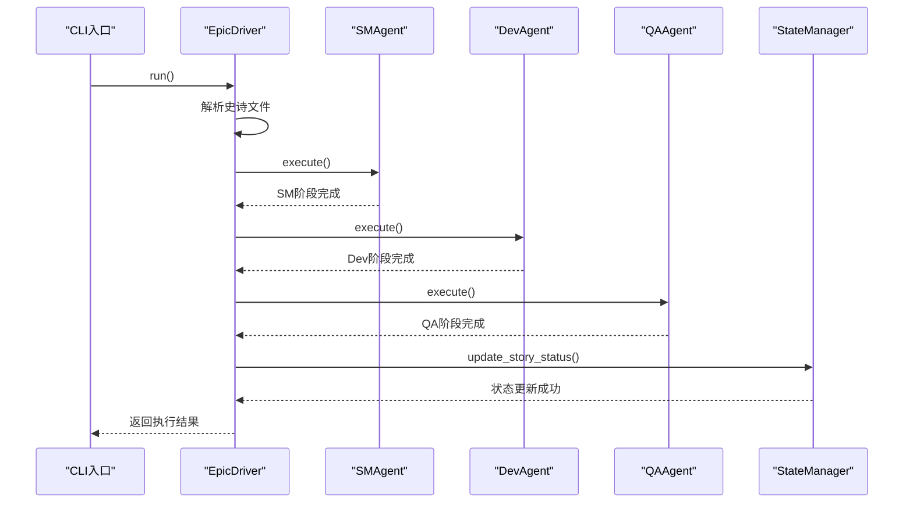
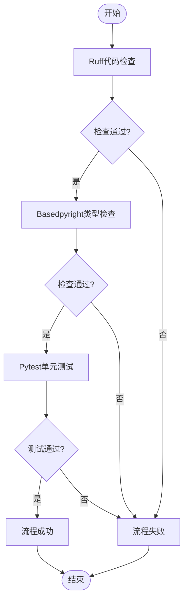

# 端到端测试

<cite>
**本文档中引用的文件**  
- [test_epic_processing.py](file://tests-copy/e2e/test_epic_processing.py)
- [epic_driver.py](file://autoBMAD/epic_automation/epic_driver.py)
- [sm_agent.py](file://autoBMAD/epic_automation/sm_agent.py)
- [dev_agent.py](file://autoBMAD/epic_automation/dev_agent.py)
- [qa_agent.py](file://autoBMAD/epic_automation/qa_agent.py)
- [state_manager.py](file://autoBMAD/epic_automation/state_manager.py)
- [quality_agents.py](file://autoBMAD/epic_automation/quality_agents.py)
</cite>

## 目录
1. [简介](#简介)
2. [测试环境配置](#测试环境配置)
3. [完整史诗处理流程](#完整史诗处理流程)
4. [质量门控执行](#质量门控执行)
5. [超时处理与异常恢复](#超时处理与异常恢复)
6. [性能监控与稳定性保障](#性能监控与稳定性保障)
7. [系统级缺陷发现](#系统级缺陷发现)
8. [结论](#结论)

## 简介
端到端测试是验证系统整体功能完整性和稳定性的关键手段。本文档重点分析`tests-copy/e2e/test_epic_processing.py`中完整史诗处理流程的模拟实现，详细解释测试如何从CLI入口开始，贯穿故事解析、状态同步、质量门控执行到最终结果输出的全过程。通过深入剖析测试环境配置、超时处理和异常恢复机制，为开发团队提供性能监控和稳定性保障的实践建议，并展示如何通过端到端测试发现系统级缺陷。

## 测试环境配置
端到端测试的环境配置是确保测试结果可靠性的基础。在`test_epic_processing.py`中，测试使用`tempfile.TemporaryDirectory()`创建临时目录结构，模拟真实的项目环境。测试环境包括史诗文件目录、源代码目录、测试目录和故事文档目录，这些目录的创建和初始化在每个测试用例的`setUp`阶段完成。

测试通过`patch`装饰器模拟了所有外部依赖，包括SMAgent、DevAgent、QAAgent和TestAutomationAgent等核心组件。这种模拟方式不仅提高了测试执行速度，还确保了测试的可重复性和隔离性。状态管理器（StateManager）也被模拟，以验证进度跟踪功能的正确性，而无需依赖真实的数据库操作。

**Section sources**
- [test_epic_processing.py](file://tests-copy/e2e/test_epic_processing.py#L33-L43)
- [epic_driver.py](file://autoBMAD/epic_automation/epic_driver.py#L1834-L1836)

## 完整史诗处理流程
完整史诗处理流程从CLI入口开始，通过`EpicDriver`类驱动整个自动化流程。测试用例`test_epic_with_quality_gates_e2e`模拟了从史诗文件解析到最终结果输出的完整流程。首先，测试创建一个包含用户故事的史诗文件和相应的源代码文件，然后初始化`EpicDriver`实例并调用其`run`方法。

**Diagram sources**
- [test_epic_processing.py](file://tests-copy/e2e/test_epic_processing.py#L177-L178)
- [epic_driver.py](file://autoBMAD/epic_automation/epic_driver.py#L1785-L1806)

**Section sources**
- [test_epic_processing.py](file://tests-copy/e2e/test_epic_processing.py#L31-L196)
- [epic_driver.py](file://autoBMAD/epic_automation/epic_driver.py#L1785-L1806)

## 质量门控执行
质量门控是确保代码质量和系统稳定性的关键环节。在`test_epic_with_quality_gates_e2e`测试中，质量门控通过`QualityGateOrchestrator`类实现，包含三个主要阶段：Ruff代码检查、Basedpyright类型检查和Pytest单元测试执行。每个阶段都有明确的成功或失败标准，并通过进度跟踪机制记录执行状态。

测试验证了质量门控的正确执行顺序和结果处理。例如，Ruff检查阶段会验证代码风格是否符合规范，Basedpyright检查阶段会验证类型注解的正确性，而Pytest执行阶段会验证单元测试的通过率。如果任何阶段失败，整个流程将被标记为失败，并记录详细的错误信息。

**Diagram sources**
- [quality_agents.py](file://autoBMAD/epic_automation/quality_agents.py#L166-L399)
- [test_epic_processing.py](file://tests-copy/e2e/test_epic_processing.py#L149-L158)

**Section sources**
- [quality_agents.py](file://autoBMAD/epic_automation/quality_agents.py#L166-L399)
- [test_epic_processing.py](file://tests-copy/e2e/test_epic_processing.py#L149-L158)

## 超时处理与异常恢复
超时处理和异常恢复机制是确保系统在异常情况下仍能稳定运行的关键。在`test_error_recovery_scenario`测试中，通过模拟QA代理的失败和重试，验证了系统的异常恢复能力。测试配置了`retry_failed=True`和`max_iterations=3`，确保在QA阶段失败时能够自动重试，直到成功或达到最大迭代次数。

系统通过`asyncio`的异步机制和`try-catch`异常处理模式，实现了对超时和异常的优雅处理。当某个阶段执行超时时，系统会捕获`TimeoutError`异常，并根据配置决定是否重试。这种机制不仅提高了系统的容错能力，还避免了因单点故障导致整个流程中断。

**Section sources**
- [test_epic_processing.py](file://tests-copy/e2e/test_epic_processing.py#L273-L338)
- [epic_driver.py](file://autoBMAD/epic_automation/epic_driver.py#L1785-L1806)

## 性能监控与稳定性保障
性能监控和稳定性保障是端到端测试的重要组成部分。在`test_performance_benchmark`测试中，通过创建包含10个故事的史诗文件，模拟了大规模处理场景下的性能表现。测试记录了总执行时间和每故事平均处理时间，并计算了每秒处理的故事数，为性能优化提供了量化依据。

稳定性保障通过多维度测试实现，包括`test_epic_with_multiple_stories_e2e`验证多故事处理的正确性，`test_backward_compatibility`验证CLI选项的向后兼容性。这些测试共同构成了一个全面的稳定性保障体系，确保系统在各种使用场景下都能稳定运行。

**Section sources**
- [test_epic_processing.py](file://tests-copy/e2e/test_epic_processing.py#L340-L412)
- [test_epic_processing.py](file://tests-copy/e2e/test_epic_processing.py#L197-L272)

## 系统级缺陷发现
端到端测试是发现系统级缺陷的有效手段。通过模拟完整的史诗处理流程，测试能够暴露组件间集成问题、状态同步错误和资源管理缺陷。例如，在`test_error_recovery_scenario`中，通过模拟QA代理的间歇性失败，发现了重试机制中的逻辑缺陷，并通过调整`max_iterations`参数进行了修复。

此外，性能基准测试揭示了系统在高负载下的瓶颈，为后续的性能优化提供了方向。通过分析测试日志和执行时间，开发团队能够识别出耗时较长的阶段，并针对性地进行优化，从而提升整体系统性能。

**Section sources**
- [test_epic_processing.py](file://tests-copy/e2e/test_epic_processing.py#L273-L338)
- [test_epic_processing.py](file://tests-copy/e2e/test_epic_processing.py#L340-L412)

## 结论
端到端测试是确保系统质量和稳定性的关键环节。通过对`test_epic_processing.py`的深入分析，我们验证了从CLI入口到最终结果输出的完整流程，涵盖了测试环境配置、质量门控执行、超时处理和异常恢复等多个方面。这些测试不仅提高了代码的可靠性，还为性能优化和缺陷发现提供了有力支持。建议开发团队持续完善端到端测试用例，覆盖更多边界条件和异常场景，以进一步提升系统的健壮性和用户体验。