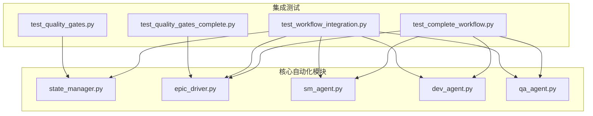
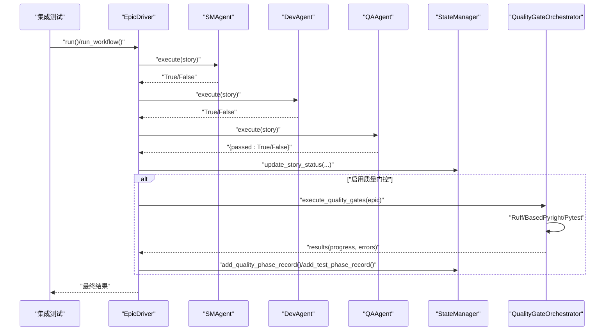
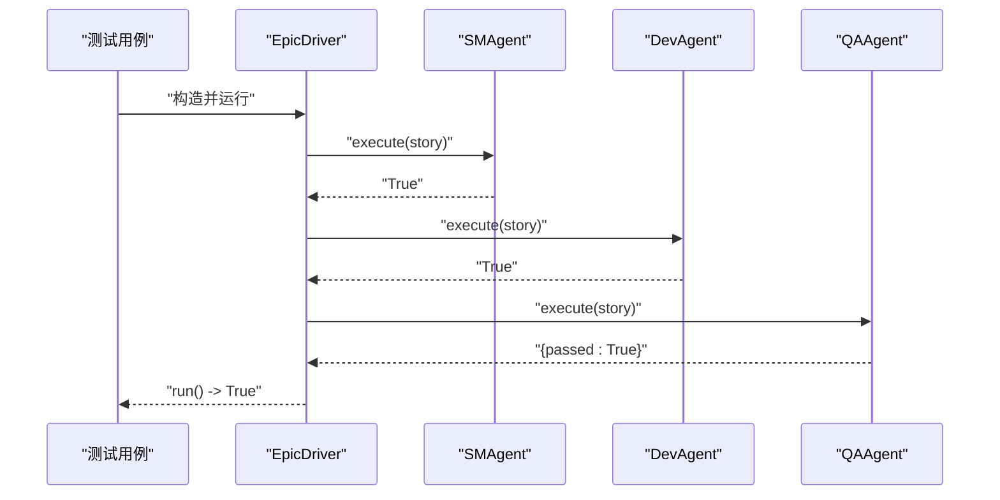
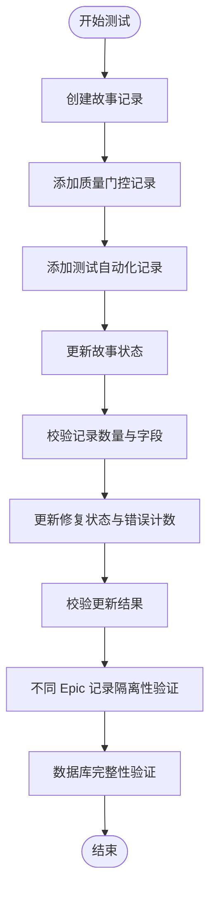
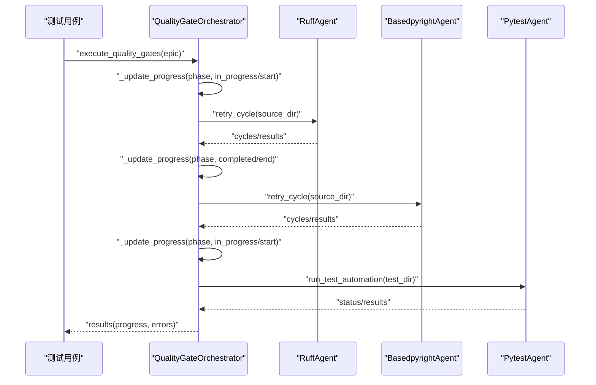
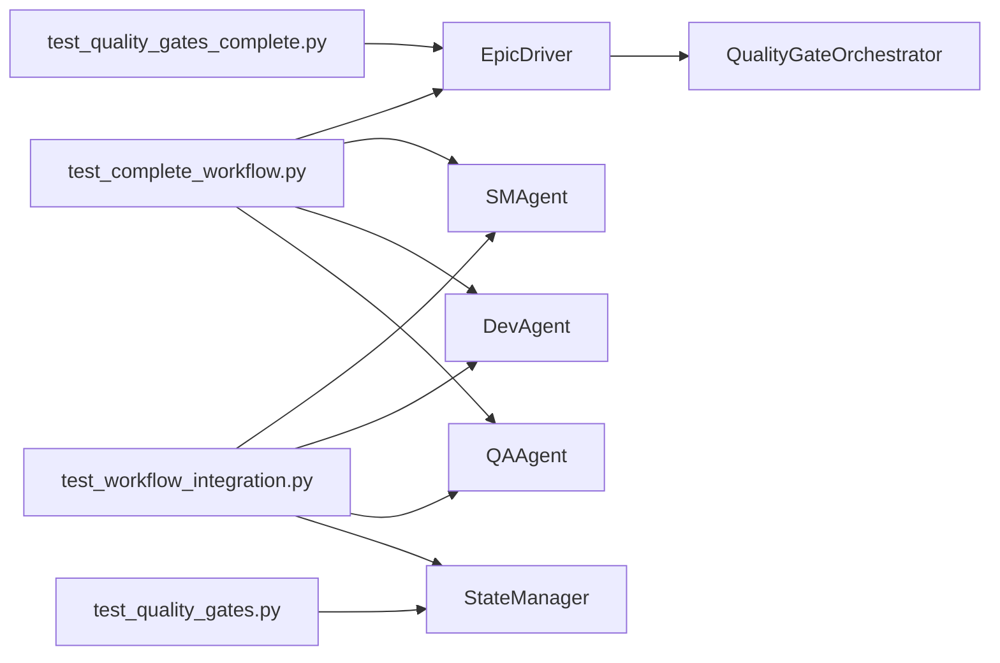

# 集成测试

<cite>
**本文引用的文件**
- [tests-copy/integration/test_complete_workflow.py](file://tests-copy/integration/test_complete_workflow.py)
- [tests-copy/integration/test_workflow_integration.py](file://tests-copy/integration/test_workflow_integration.py)
- [tests-copy/integration/test_quality_gates.py](file://tests-copy/integration/test_quality_gates.py)
- [tests-copy/integration/test_quality_gates_complete.py](file://tests-copy/integration/test_quality_gates_complete.py)
- [autoBMAD/epic_automation/state_manager.py](file://autoBMAD/epic_automation/state_manager.py)
- [autoBMAD/epic_automation/epic_driver.py](file://autoBMAD/epic_automation/epic_driver.py)
- [autoBMAD/epic_automation/sm_agent.py](file://autoBMAD/epic_automation/sm_agent.py)
- [autoBMAD/epic_automation/dev_agent.py](file://autoBMAD/epic_automation/dev_agent.py)
- [autoBMAD/epic_automation/qa_agent.py](file://autoBMAD/epic_automation/qa_agent.py)
</cite>

## 目录
1. [简介](#简介)
2. [项目结构](#项目结构)
3. [核心组件](#核心组件)
4. [架构总览](#架构总览)
5. [详细组件分析](#详细组件分析)
6. [依赖关系分析](#依赖关系分析)
7. [性能考量](#性能考量)
8. [故障排查指南](#故障排查指南)
9. [结论](#结论)
10. [附录](#附录)

## 简介
本文件聚焦于 tests-copy/integration 中的集成测试，系统性阐述以下主题：
- 如何通过测试串联 SM-Dev-QA 循环，验证状态管理器与质量门控之间的数据流；
- 测试夹具（fixtures）与依赖注入模式在集成测试中的使用；
- 跨模块调用的断言逻辑示例路径；
- 测试数据准备与清理的最佳实践；
- 常见集成问题的诊断方法。

## 项目结构
tests-copy/integration 下包含多类集成测试，覆盖端到端工作流、状态管理器与质量门控的协同、以及完整质量门控流水线（含 CLI 标志位）等场景。核心文件如下：
- test_complete_workflow.py：验证完整 5 阶段工作流、跳过标志、重试与进度追踪；
- test_workflow_integration.py：验证 SM-Dev-QA 循环、状态管理器集成、EpicDriver 协作、并发与错误处理；
- test_quality_gates.py：验证质量门控与状态管理器的数据一致性、隔离性、并发安全与进度追踪；
- test_quality_gates_complete.py：验证质量门控完整流水线（Ruff → BasedPyright → Pytest）、CLI 标志位、错误与重试、取消作用域安全要求等。

图表来源
- [tests-copy/integration/test_complete_workflow.py](file://tests-copy/integration/test_complete_workflow.py#L1-L130)
- [tests-copy/integration/test_workflow_integration.py](file://tests-copy/integration/test_workflow_integration.py#L1-L120)
- [tests-copy/integration/test_quality_gates.py](file://tests-copy/integration/test_quality_gates.py#L1-L120)
- [tests-copy/integration/test_quality_gates_complete.py](file://tests-copy/integration/test_quality_gates_complete.py#L1-L120)
- [autoBMAD/epic_automation/state_manager.py](file://autoBMAD/epic_automation/state_manager.py#L97-L200)
- [autoBMAD/epic_automation/epic_driver.py](file://autoBMAD/epic_automation/epic_driver.py#L94-L200)
- [autoBMAD/epic_automation/sm_agent.py](file://autoBMAD/epic_automation/sm_agent.py#L98-L133)
- [autoBMAD/epic_automation/dev_agent.py](file://autoBMAD/epic_automation/dev_agent.py#L114-L200)
- [autoBMAD/epic_automation/qa_agent.py](file://autoBMAD/epic_automation/qa_agent.py#L109-L170)

章节来源
- [tests-copy/integration/test_complete_workflow.py](file://tests-copy/integration/test_complete_workflow.py#L1-L130)
- [tests-copy/integration/test_workflow_integration.py](file://tests-copy/integration/test_workflow_integration.py#L1-L120)
- [tests-copy/integration/test_quality_gates.py](file://tests-copy/integration/test_quality_gates.py#L1-L120)
- [tests-copy/integration/test_quality_gates_complete.py](file://tests-copy/integration/test_quality_gates_complete.py#L1-L120)

## 核心组件
- 状态管理器（StateManager）：负责故事状态、迭代次数、QA 结果、质量门控记录（代码质量与测试自动化）的持久化与查询；提供并发安全与连接池支持。
- EpicDriver：主编排器，驱动 SM-Dev-QA 循环，支持 Epic 级别的故事处理与可选的质量门控流水线。
- SMAgent/DevAgent/QAAgent：分别负责 SM 阶段、开发实现与 QA 审查，提供异步执行与状态解析能力。
- 质量门控编排器（QualityGateOrchestrator）：在 QA 完成后串行执行 Ruff、BasedPyright、Pytest 三阶段，支持跳过标志与进度追踪。

章节来源
- [autoBMAD/epic_automation/state_manager.py](file://autoBMAD/epic_automation/state_manager.py#L97-L200)
- [autoBMAD/epic_automation/epic_driver.py](file://autoBMAD/epic_automation/epic_driver.py#L94-L200)
- [autoBMAD/epic_automation/sm_agent.py](file://autoBMAD/epic_automation/sm_agent.py#L98-L133)
- [autoBMAD/epic_automation/dev_agent.py](file://autoBMAD/epic_automation/dev_agent.py#L114-L200)
- [autoBMAD/epic_automation/qa_agent.py](file://autoBMAD/epic_automation/qa_agent.py#L109-L170)

## 架构总览
下图展示了集成测试中各组件间的交互关系与数据流，重点体现 SM-Dev-QA 循环与质量门控在 EpicDriver 中的协作。

图表来源
- [tests-copy/integration/test_complete_workflow.py](file://tests-copy/integration/test_complete_workflow.py#L120-L135)
- [tests-copy/integration/test_workflow_integration.py](file://tests-copy/integration/test_workflow_integration.py#L59-L113)
- [autoBMAD/epic_automation/epic_driver.py](file://autoBMAD/epic_automation/epic_driver.py#L94-L200)
- [autoBMAD/epic_automation/state_manager.py](file://autoBMAD/epic_automation/state_manager.py#L140-L200)
- [autoBMAD/epic_automation/sm_agent.py](file://autoBMAD/epic_automation/sm_agent.py#L98-L133)
- [autoBMAD/epic_automation/dev_agent.py](file://autoBMAD/epic_automation/dev_agent.py#L114-L200)
- [autoBMAD/epic_automation/qa_agent.py](file://autoBMAD/epic_automation/qa_agent.py#L109-L170)

## 详细组件分析

### 组件 A：SM-Dev-QA 循环与 EpicDriver 协作
- 测试目标：验证从 SM 到 Dev 再到 QA 的完整循环，以及 EpicDriver 在其中的角色。
- 关键断言：
  - 各阶段 execute 返回值符合预期；
  - EpicDriver.run() 返回成功；
  - 跳过标志（skip_tests/skip_quality）对流程的影响；
  - 重试逻辑在 QA 失败场景下的行为。
- 测试夹具与依赖注入：
  - 使用 patch 对 SMAgent、DevAgent、QAAgent 的 execute 进行模拟，注入返回值；
  - 使用 AsyncMock/patch.object 等进行异步方法的模拟与断言；
  - 使用临时目录与临时数据库文件，确保测试隔离与清理。
- 断言逻辑示例路径：
  - [test_full_5_phase_workflow](file://tests-copy/integration/test_complete_workflow.py#L30-L135)
  - [test_workflow_skip_tests](file://tests-copy/integration/test_complete_workflow.py#L197-L255)
  - [test_workflow_with_retry](file://tests-copy/integration/test_complete_workflow.py#L452-L517)
  - [test_sm_dev_qa_cycle](file://tests-copy/integration/test_workflow_integration.py#L59-L113)

图表来源
- [tests-copy/integration/test_complete_workflow.py](file://tests-copy/integration/test_complete_workflow.py#L30-L135)
- [tests-copy/integration/test_workflow_integration.py](file://tests-copy/integration/test_workflow_integration.py#L59-L113)

章节来源
- [tests-copy/integration/test_complete_workflow.py](file://tests-copy/integration/test_complete_workflow.py#L30-L135)
- [tests-copy/integration/test_workflow_integration.py](file://tests-copy/integration/test_workflow_integration.py#L59-L113)

### 组件 B：状态管理器与质量门控的数据流
- 测试目标：验证质量门控记录（代码质量与测试自动化）与故事状态在 StateManager 中的一致性、隔离性与并发安全。
- 关键断言：
  - 新增质量记录与测试记录后，查询数量与字段正确；
  - 更新修复状态与错误计数后，记录被正确更新；
  - 不同 Epic 的记录相互隔离；
  - 数据库完整性与事务一致性（通过直接查询表计数验证）；
  - 并发写入场景下记录完整性。
- 断言逻辑示例路径：
  - [test_complete_workflow_with_quality_tracking](file://tests-copy/integration/test_quality_gates.py#L45-L160)
  - [test_multiple_epics_isolation](file://tests-copy/integration/test_quality_gates.py#L161-L205)
  - [test_database_integrity_across_operations](file://tests-copy/integration/test_quality_gates.py#L283-L362)
  - [test_concurrent_quality_and_test_operations](file://tests-copy/integration/test_quality_gates.py#L411-L458)

图表来源
- [tests-copy/integration/test_quality_gates.py](file://tests-copy/integration/test_quality_gates.py#L45-L160)
- [tests-copy/integration/test_quality_gates.py](file://tests-copy/integration/test_quality_gates.py#L161-L205)
- [tests-copy/integration/test_quality_gates.py](file://tests-copy/integration/test_quality_gates.py#L283-L362)
- [tests-copy/integration/test_quality_gates.py](file://tests-copy/integration/test_quality_gates.py#L411-L458)

章节来源
- [tests-copy/integration/test_quality_gates.py](file://tests-copy/integration/test_quality_gates.py#L45-L160)
- [tests-copy/integration/test_quality_gates.py](file://tests-copy/integration/test_quality_gates.py#L161-L205)
- [tests-copy/integration/test_quality_gates.py](file://tests-copy/integration/test_quality_gates.py#L283-L362)
- [tests-copy/integration/test_quality_gates.py](file://tests-copy/integration/test_quality_gates.py#L411-L458)

### 组件 C：质量门控完整流水线（Ruff → BasedPyright → Pytest）
- 测试目标：验证质量门控流水线的端到端执行、CLI 标志位（--skip-quality/--skip-tests）的行为、进度追踪与取消作用域安全要求。
- 关键断言：
  - 三个阶段均被执行或按标志被跳过；
  - 进度结构包含各阶段起止时间与状态；
  - 成功/失败与错误列表被正确记录；
  - 取消作用域安全要求（不使用外部超时，使用 max_turns 保护）。
- 断言逻辑示例路径：
  - [test_complete_quality_gates_pipeline](file://tests-copy/integration/test_quality_gates_complete.py#L125-L171)
  - [test_skip_quality_flag](file://tests-copy/integration/test_quality_gates_complete.py#L172-L197)
  - [test_skip_tests_flag](file://tests-copy/integration/test_quality_gates_complete.py#L198-L222)
  - [test_progress_tracking](file://tests-copy/integration/test_quality_gates_complete.py#L341-L369)
  - [test_cancel_scope_safety_requirements](file://tests-copy/integration/test_quality_gates_complete.py#L453-L478)

图表来源
- [tests-copy/integration/test_quality_gates_complete.py](file://tests-copy/integration/test_quality_gates_complete.py#L125-L171)
- [tests-copy/integration/test_quality_gates_complete.py](file://tests-copy/integration/test_quality_gates_complete.py#L172-L222)
- [tests-copy/integration/test_quality_gates_complete.py](file://tests-copy/integration/test_quality_gates_complete.py#L341-L369)

章节来源
- [tests-copy/integration/test_quality_gates_complete.py](file://tests-copy/integration/test_quality_gates_complete.py#L125-L171)
- [tests-copy/integration/test_quality_gates_complete.py](file://tests-copy/integration/test_quality_gates_complete.py#L172-L222)
- [tests-copy/integration/test_quality_gates_complete.py](file://tests-copy/integration/test_quality_gates_complete.py#L341-L369)
- [tests-copy/integration/test_quality_gates_complete.py](file://tests-copy/integration/test_quality_gates_complete.py#L453-L478)

### 组件 D：测试夹具与依赖注入模式
- 临时目录与文件：
  - 使用 tempfile.TemporaryDirectory() 创建隔离的测试工作区；
  - 使用 Path 构造目录与文件，写入测试数据；
  - 使用 shutil.rmtree 清理临时目录。
- 临时数据库：
  - 使用 NamedTemporaryFile(suffix='.db') 创建临时数据库文件；
  - 使用 Path.unlink(missing_ok=True) 在 finally 中清理。
- 依赖注入与模拟：
  - 使用 patch/patch.object 对 Agent 的内部方法进行模拟；
  - 使用 AsyncMock/AsyncContextManager 对异步方法进行模拟；
  - 使用 MagicMock 对非异步接口进行模拟。
- 断言与清理：
  - 在 finally 中删除临时文件，避免测试污染；
  - 使用 yield 生成器模式提供临时数据库 fixture，自动清理。

章节来源
- [tests-copy/integration/test_complete_workflow.py](file://tests-copy/integration/test_complete_workflow.py#L30-L135)
- [tests-copy/integration/test_workflow_integration.py](file://tests-copy/integration/test_workflow_integration.py#L17-L30)
- [tests-copy/integration/test_workflow_integration.py](file://tests-copy/integration/test_workflow_integration.py#L118-L161)
- [tests-copy/integration/test_workflow_integration.py](file://tests-copy/integration/test_workflow_integration.py#L241-L269)
- [tests-copy/integration/test_workflow_integration.py](file://tests-copy/integration/test_workflow_integration.py#L353-L376)

## 依赖关系分析
- 组件耦合与内聚：
  - EpicDriver 与 SMAgent/DevAgent/QAAgent 存在松耦合的调用关系，通过 execute 接口进行交互；
  - StateManager 作为共享状态存储，被多个组件读写，需保证并发安全；
  - QualityGateOrchestrator 与 EpicDriver 在质量门控环节形成清晰边界。
- 直接与间接依赖：
  - 测试层依赖 EpicDriver 与各 Agent 类；
  - EpicDriver 依赖状态解析与 SDK 封装；
  - StateManager 依赖 SQLite 与连接池。
- 外部依赖与集成点：
  - CLI 参数解析与质量门控标志位；
  - SDK 会话管理与取消作用域安全；
  - 文件系统操作与临时目录。

图表来源
- [tests-copy/integration/test_complete_workflow.py](file://tests-copy/integration/test_complete_workflow.py#L1-L135)
- [tests-copy/integration/test_workflow_integration.py](file://tests-copy/integration/test_workflow_integration.py#L1-L120)
- [tests-copy/integration/test_quality_gates.py](file://tests-copy/integration/test_quality_gates.py#L1-L120)
- [tests-copy/integration/test_quality_gates_complete.py](file://tests-copy/integration/test_quality_gates_complete.py#L1-L120)
- [autoBMAD/epic_automation/epic_driver.py](file://autoBMAD/epic_automation/epic_driver.py#L94-L200)

章节来源
- [tests-copy/integration/test_complete_workflow.py](file://tests-copy/integration/test_complete_workflow.py#L1-L135)
- [tests-copy/integration/test_workflow_integration.py](file://tests-copy/integration/test_workflow_integration.py#L1-L120)
- [tests-copy/integration/test_quality_gates.py](file://tests-copy/integration/test_quality_gates.py#L1-L120)
- [tests-copy/integration/test_quality_gates_complete.py](file://tests-copy/integration/test_quality_gates_complete.py#L1-L120)
- [autoBMAD/epic_automation/epic_driver.py](file://autoBMAD/epic_automation/epic_driver.py#L94-L200)

## 性能考量
- 并发与锁：
  - StateManager 使用 asyncio.Lock 与死锁检测器，避免长时间持有锁导致阻塞；
  - 连接池采用队列管理，避免连接耗尽与阻塞等待。
- I/O 与数据库：
  - WAL 模式与 PRAGMA 调优提升并发写入性能；
  - 通过连接池复用连接，减少连接建立开销。
- 异步与重试：
  - 质量门控代理采用 retry_cycle，分批次收敛问题，避免单次重试风暴；
  - EpicDriver 中移除外部超时，改用 max_turns 保护，降低取消作用域风险。

章节来源
- [autoBMAD/epic_automation/state_manager.py](file://autoBMAD/epic_automation/state_manager.py#L31-L58)
- [autoBMAD/epic_automation/state_manager.py](file://autoBMAD/epic_automation/state_manager.py#L59-L95)
- [autoBMAD/epic_automation/state_manager.py](file://autoBMAD/epic_automation/state_manager.py#L132-L179)
- [autoBMAD/epic_automation/epic_driver.py](file://autoBMAD/epic_automation/epic_driver.py#L50-L56)

## 故障排查指南
- 跳过标志导致的流程差异：
  - 若 skip_tests 或 skip_quality 为真，对应阶段不会执行，需确认断言中对 execute 的调用是否被模拟；
  - 示例路径：[test_workflow_skip_tests](file://tests-copy/integration/test_complete_workflow.py#L197-L255)、[test_skip_quality_flag](file://tests-copy/integration/test_quality_gates_complete.py#L172-L197)。
- QA 失败与重试：
  - 使用 side_effect 模拟多次调用返回值，验证重试逻辑；
  - 示例路径：[test_workflow_with_retry](file://tests-copy/integration/test_complete_workflow.py#L452-L517)。
- 数据库一致性与隔离：
  - 使用直接 SQL 查询表计数验证一致性；
  - 示例路径：[test_database_integrity_across_operations](file://tests-copy/integration/test_quality_gates.py#L283-L362)。
- 取消作用域安全：
  - 确认代理方法签名不使用 asyncio.wait_for/asyncio.shield，避免外部超时；
  - 示例路径：[test_cancel_scope_safety_requirements](file://tests-copy/integration/test_quality_gates_complete.py#L453-L478)。
- 并发写入问题：
  - 使用 asyncio.gather 并发创建记录，验证最终一致性；
  - 示例路径：[test_concurrent_quality_and_test_operations](file://tests-copy/integration/test_quality_gates.py#L411-L458)。

章节来源
- [tests-copy/integration/test_complete_workflow.py](file://tests-copy/integration/test_complete_workflow.py#L197-L255)
- [tests-copy/integration/test_complete_workflow.py](file://tests-copy/integration/test_complete_workflow.py#L452-L517)
- [tests-copy/integration/test_quality_gates.py](file://tests-copy/integration/test_quality_gates.py#L283-L362)
- [tests-copy/integration/test_quality_gates_complete.py](file://tests-copy/integration/test_quality_gates_complete.py#L453-L478)
- [tests-copy/integration/test_quality_gates.py](file://tests-copy/integration/test_quality_gates.py#L411-L458)

## 结论
tests-copy/integration 中的测试系统性地验证了 SM-Dev-QA 循环与质量门控在 EpicDriver 中的协作，覆盖了跳过标志、重试、进度追踪、数据库一致性与并发安全等多个关键维度。通过 fixtures 与依赖注入模式，测试实现了高内聚、低耦合的组件交互验证，为后续扩展与回归提供了可靠保障。

## 附录
- 测试数据准备最佳实践：
  - 使用临时目录与临时数据库，确保隔离与可重复；
  - 使用 Path 构造文件与目录，写入最小必要数据；
  - 在 finally 中清理临时资源，避免磁盘污染。
- 测试数据清理最佳实践：
  - 使用 NamedTemporaryFile/TemporaryDirectory 自动清理；
  - 使用 Path.unlink(missing_ok=True) 删除临时文件；
  - 使用 shutil.rmtree(temp_dir, ignore_errors=True) 清理临时目录。