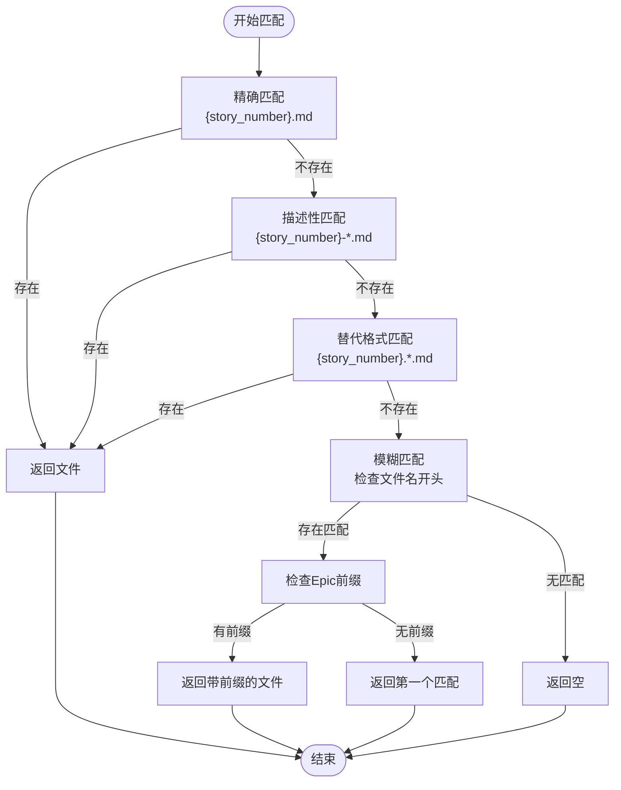
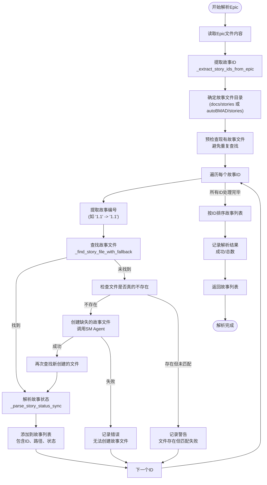

# Epic解析流程

<cite>
**本文档引用的文件**
- [epic_driver.py](file://autoBMAD/epic_automation/epic_driver.py)
- [story_parser.py](file://autoBMAD/epic_automation/story_parser.py)
- [sm_agent.py](file://autoBMAD/epic_automation/sm_agent.py)
- [epic-1-core-algorithm-foundation.md](file://docs/epics/epic-1-core-algorithm-foundation.md)
- [1.1.md](file://docs/stories/1.1.md)
- [WINDOWS_PATH_CONVERSION_SUMMARY.md](file://WINDOWS_PATH_CONVERSION_SUMMARY.md)
</cite>

## 目录
1. [Epic解析概述](#epic解析概述)
2. [核心解析方法](#核心解析方法)
3. [故事ID提取逻辑](#故事id提取逻辑)
4. [文件匹配与回退策略](#文件匹配与回退策略)
5. [缺失文件处理机制](#缺失文件处理机制)
6. [Epic前缀提取](#epic前缀提取)
7. [Windows路径转换](#windows路径转换)
8. [错误处理与日志记录](#错误处理与日志记录)
9. [实际解析示例](#实际解析示例)
10. [解析流程图](#解析流程图)

## Epic解析概述

Epic解析流程是自动化工作流的核心组件，负责从Epic文档中提取故事信息并建立与故事文件的关联。该流程始于`parse_epic`方法的调用，该方法读取Epic Markdown文件，提取其中定义的故事ID，然后在指定目录中搜索匹配的故事文件。整个过程采用多级回退策略确保文件匹配的鲁棒性，并在文件缺失时触发自动创建机制。解析结果包含故事ID、文件路径和当前状态，为后续的开发-质量保证循环提供基础数据。

**Section sources**
- [epic_driver.py](file://autoBMAD/epic_automation/epic_driver.py#L680-L865)

## 核心解析方法

`parse_epic`方法是Epic解析流程的入口点，它协调了从文件读取到故事列表生成的完整过程。该方法首先验证Epic文件的存在性，然后读取其内容。接着，它调用`_extract_story_ids_from_epic`方法从内容中提取所有故事ID。在提取ID后，方法会确定故事文件所在的目录，通常位于`docs/stories`或`autoBMAD/stories`。最后，它遍历所有提取的故事ID，使用`_find_story_file_with_fallback`方法进行文件匹配，并为每个成功匹配的文件解析其状态，最终生成一个包含所有故事信息的列表。

**Section sources**
- [epic_driver.py](file://autoBMAD/epic_automation/epic_driver.py#L680-L865)

## 故事ID提取逻辑

`_extract_story_ids_from_epic`方法负责从Epic文档内容中识别和提取故事ID。它使用两种正则表达式模式来查找ID：
1.  **故事章节模式**：匹配以`### Story X.Y: Title`格式定义的故事，其中`X.Y`是故事ID。
2.  **ID标签模式**：匹配以`**Story ID**: X.Y`格式明确声明的故事ID。

该方法会收集所有匹配的ID，并通过归一化处理（如去除前导零）来消除重复项。当同一个故事ID以不同格式（如带标题和不带标题）出现时，系统会优先保留信息更丰富的版本。例如，如果同时存在`1.1`和`1.1: Basic Implementation`，则会选择后者作为最终ID。

**Section sources**
- [epic_driver.py](file://autoBMAD/epic_automation/epic_driver.py#L874-L962)
- [story_parser.py](file://autoBMAD/epic_automation/story_parser.py#L740-L763)

## 文件匹配与回退策略

`_find_story_file_with_fallback`方法实现了多级回退的文件匹配策略，以应对不同的文件命名约定。匹配优先级从高到低如下：

1.  **精确匹配**：首先尝试`{story_number}.md`格式，例如`1.1.md`。
2.  **描述性匹配**：如果精确匹配失败，则搜索`{story_number}-*.md`或`story-{story_number}-*.md`格式的文件，例如`1.1-implementation.md`。
3.  **替代格式匹配**：接着尝试`{story_number}.*.md`或`story-{story_number}.*.md`格式，例如`1.1.description.md`。
4.  **模糊匹配**：对于简单的数字ID（如`1`），系统会进行模糊匹配，查找文件名以`1.`或`1-`开头的文件。在此阶段，如果存在Epic前缀（如`004`），系统会优先选择包含该前缀的文件（如`004.1.md`），以确保跨Epic的命名空间隔离。

这种分层策略极大地提高了文件匹配的灵活性和成功率。

**Diagram sources**
- [epic_driver.py](file://autoBMAD/epic_automation/epic_driver.py#L1012-L1111)

## 缺失文件处理机制

当`_find_story_file_with_fallback`方法无法找到与故事ID匹配的文件时，系统会触发自动创建机制。该机制首先会检查文件是否真的不存在（通过`existing_stories`集合进行快速验证，避免重复的磁盘I/O）。如果确认文件缺失，系统将调用`SM Agent`的`create_stories_from_epic`方法。此方法会利用Claude AI模型，根据Epic文档的内容生成新的故事文件。文件创建后，系统会再次尝试查找该文件，并解析其初始状态（通常为“Draft”），然后将其添加到故事列表中。如果创建过程失败，系统会记录错误并继续处理下一个故事。

**Section sources**
- [epic_driver.py](file://autoBMAD/epic_automation/epic_driver.py#L786-L832)
- [sm_agent.py](file://autoBMAD/epic_automation/sm_agent.py#L264-L320)

## Epic前缀提取

Epic前缀提取是模糊匹配阶段的关键环节，用于区分不同Epic下的故事，防止ID冲突。`_extract_epic_prefix`方法通过正则表达式`epic[-.](\d+)`从Epic文件名中提取前缀。例如，文件`epic-004-spec_automation-foundation.md`的前缀为`004`。在模糊匹配过程中，如果提供了Epic前缀，系统会优先选择文件名中包含该前缀的匹配项（如`story-004.1-description.md`），从而确保故事文件与正确的Epic关联。

**Section sources**
- [epic_driver.py](file://autoBMAD/epic_automation/epic_driver.py#L996-L1011)

## Windows路径转换

为了确保在Windows环境下与Claude SDK的兼容性，系统实现了路径转换机制。`_convert_to_windows_path`方法负责将WSL/Unix风格的路径转换为Windows绝对路径。其转换规则如下：
- 识别以`/d/`、`/c/`等开头的WSL路径。
- 提取盘符（如`d`）并转换为大写（`D`）。
- 将路径中的所有`/`替换为`\`。
- 重新组合成`D:\path\to\file`格式的Windows路径。

该转换仅应用于故事文件的路径，以确保它们能被正确注入到Claude SDK的提示词中。

**Diagram sources**
- [epic_driver.py](file://autoBMAD/epic_automation/epic_driver.py#L964-L995)
- [WINDOWS_PATH_CONVERSION_SUMMARY.md](file://WINDOWS_PATH_CONVERSION_SUMMARY.md)

## 错误处理与日志记录

整个解析流程集成了全面的错误处理和日志记录策略。每个关键步骤都包含详细的日志输出，使用`logger.info`、`logger.debug`和`logger.warning`等不同级别来记录操作状态、调试信息和潜在问题。例如，文件匹配的每一步都会记录成功或失败的原因。在异常处理方面，主解析方法被包裹在`try-except`块中，捕获任何未预期的错误，记录完整的堆栈跟踪，并返回一个空列表以防止整个流程崩溃。对于文件操作，系统会预检查目录是否存在，并在失败时提供清晰的错误信息和备选搜索路径。

**Section sources**
- [epic_driver.py](file://autoBMAD/epic_automation/epic_driver.py#L867-L872)

## 实际解析示例

以下是一个基于`epic-1-core-algorithm-foundation.md`的解析示例：

1.  **Epic文件**: `docs/epics/epic-1-core-algorithm-foundation.md`
2.  **提取的ID**: `["1.1", "1.2", "1.3", "1.4"]`
3.  **Epic前缀**: `1` (从文件名`epic-1-...`中提取)
4.  **文件匹配**:
    -   `1.1`: 精确匹配到 `docs/stories/1.1.md`。
    -   `1.2`: 描述性匹配到 `docs/stories/1.2-algorithm-implementation.md`。
    -   `1.3`: 精确匹配到 `docs/stories/1.3.md`。
    -   `1.4`: 若`1.4.md`不存在，则通过模糊匹配找到`story-1.4-cli.md`。
5.  **状态解析**: 读取每个`.md`文件，解析其`## Status`字段，例如`1.1.md`中的`Approved`。
6.  **路径转换**: 所有故事文件路径被转换为Windows格式，如`D:\GITHUB\pytQt_template\docs\stories\1.1.md`。
7.  **最终输出**: 一个包含4个故事对象的列表，每个对象包含ID、转换后的路径、文件名和状态。

## 解析流程图

**Diagram sources**
- [epic_driver.py](file://autoBMAD/epic_automation/epic_driver.py#L680-L865)