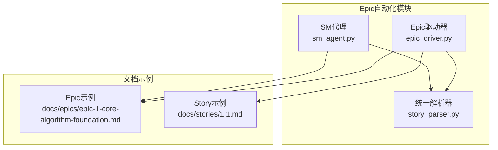
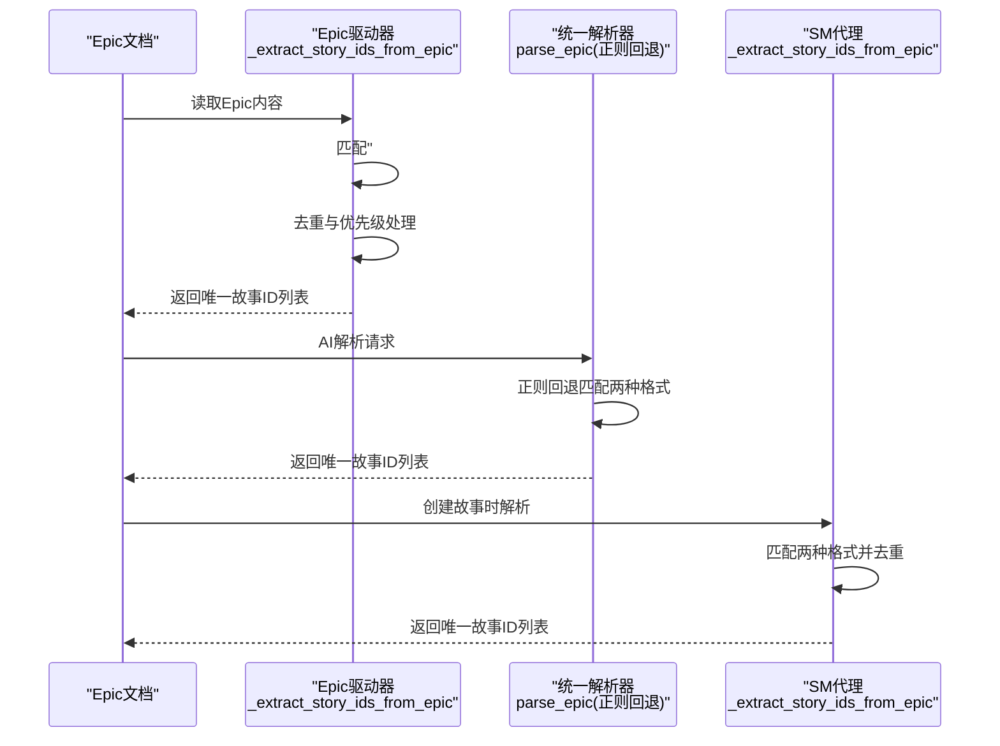
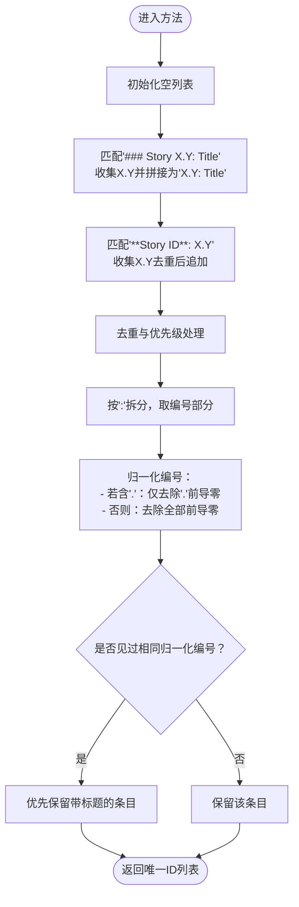
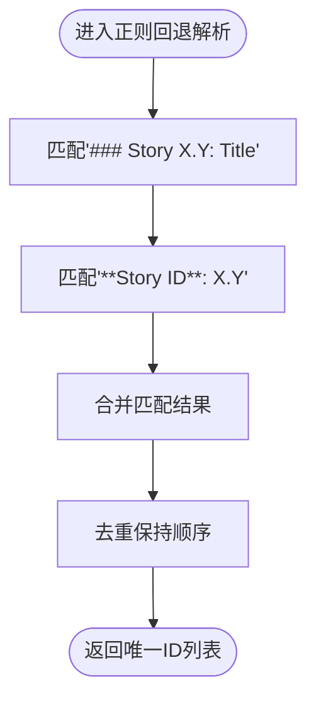
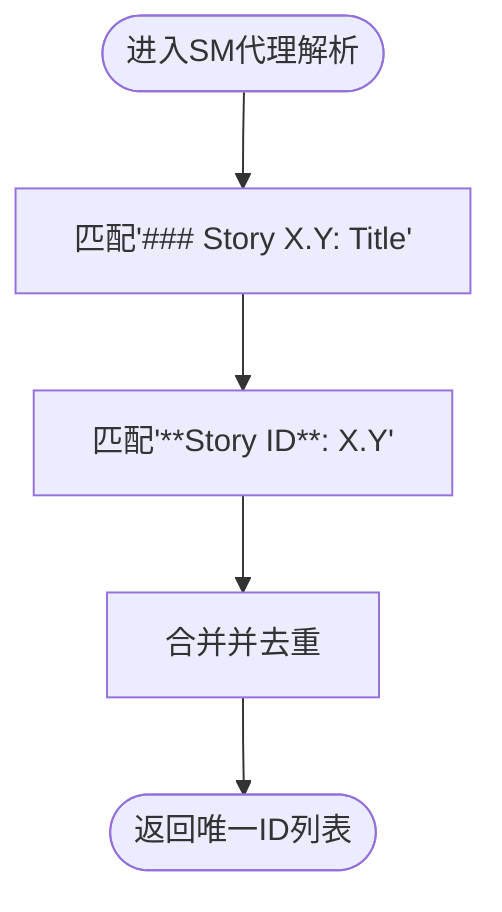
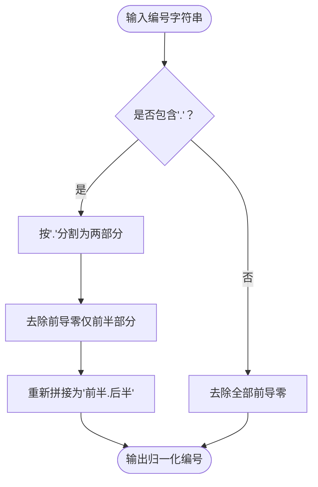
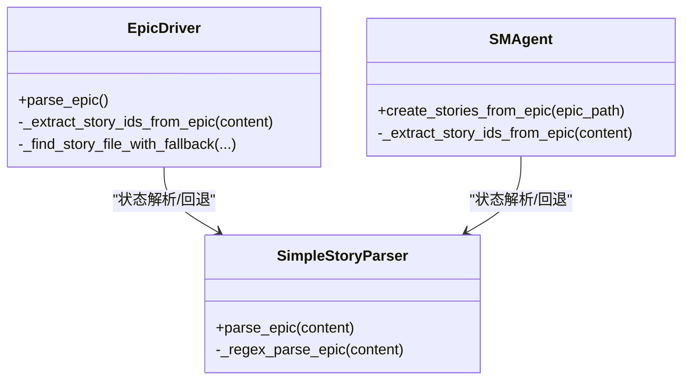
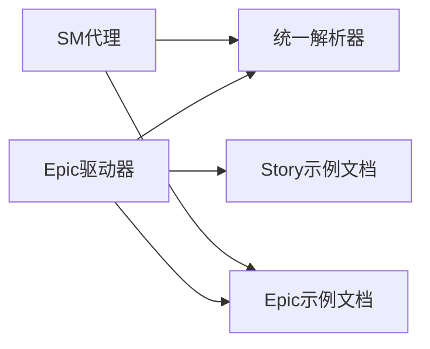

# 故事ID提取

<cite>
**本文引用的文件**
- [epic_driver.py](file://autoBMAD/epic_automation/epic_driver.py)
- [story_parser.py](file://autoBMAD/epic_automation/story_parser.py)
- [sm_agent.py](file://autoBMAD/epic_automation/sm_agent.py)
- [epic-1-core-algorithm-foundation.md](file://docs/epics/epic-1-core-algorithm-foundation.md)
- [1.1.md](file://docs/stories/1.1.md)
</cite>

## 目录
1. [简介](#简介)
2. [项目结构](#项目结构)
3. [核心组件](#核心组件)
4. [架构总览](#架构总览)
5. [详细组件分析](#详细组件分析)
6. [依赖关系分析](#依赖关系分析)
7. [性能考量](#性能考量)
8. [故障排查指南](#故障排查指南)
9. [结论](#结论)
10. [附录](#附录)

## 简介
本文件聚焦“故事ID提取”能力，围绕 Epic 文档中故事ID的识别与规范化流程展开，重点说明以下内容：
- 如何从Epic文档中识别两种典型格式的故事ID：
  - “### Story X.Y: Title”
  - “**Story ID**: X.Y”
- 如何对提取结果进行去重与规范化，包括同一故事以不同格式出现时的优先级处理逻辑。
- 如何通过状态标准化函数处理ID的前导零（例如将“004.1”归一化为“4.1”），并解释其在ID比较中的作用。
- 提供基于仓库现有实现的流程图、序列图与类图，帮助读者快速理解代码结构与数据流。

## 项目结构
与“故事ID提取”直接相关的模块与文件如下：
- Epic驱动器：负责从Epic文档中提取故事ID，并在后续流程中进行匹配与去重。
- 统一解析器：提供AI优先、正则回退的解析策略，其中包含Epic解析与状态标准化。
- SM代理：在创建故事时也使用Epic解析能力，辅助生成与校验故事文件。
- 示例文档：Epic与Story样例，便于理解提取目标与预期输出。

图表来源
- [epic_driver.py](file://autoBMAD/epic_automation/epic_driver.py#L874-L963)
- [story_parser.py](file://autoBMAD/epic_automation/story_parser.py#L673-L765)
- [sm_agent.py](file://autoBMAD/epic_automation/sm_agent.py#L264-L366)
- [epic-1-core-algorithm-foundation.md](file://docs/epics/epic-1-core-algorithm-foundation.md#L25-L101)
- [1.1.md](file://docs/stories/1.1.md#L1-L20)

章节来源
- [epic_driver.py](file://autoBMAD/epic_automation/epic_driver.py#L874-L963)
- [story_parser.py](file://autoBMAD/epic_automation/story_parser.py#L673-L765)
- [sm_agent.py](file://autoBMAD/epic_automation/sm_agent.py#L264-L366)
- [epic-1-core-algorithm-foundation.md](file://docs/epics/epic-1-core-algorithm-foundation.md#L25-L101)
- [1.1.md](file://docs/stories/1.1.md#L1-L20)

## 核心组件
- Epic驱动器中的故事ID提取方法：支持两种匹配模式，并在提取后进行去重与优先级处理。
- 统一解析器中的Epic解析方法：提供AI优先策略，同时保留正则回退；正则回退中包含两种匹配模式。
- 状态标准化函数：虽然主要用于状态值，但其对数字ID的前导零处理思路可借鉴用于ID归一化。

章节来源
- [epic_driver.py](file://autoBMAD/epic_automation/epic_driver.py#L874-L963)
- [story_parser.py](file://autoBMAD/epic_automation/story_parser.py#L673-L765)
- [story_parser.py](file://autoBMAD/epic_automation/story_parser.py#L822-L875)

## 架构总览
下图展示了从Epic文档到最终唯一故事ID列表的关键步骤与模块交互。

图表来源
- [epic_driver.py](file://autoBMAD/epic_automation/epic_driver.py#L874-L963)
- [story_parser.py](file://autoBMAD/epic_automation/story_parser.py#L673-L765)
- [sm_agent.py](file://autoBMAD/epic_automation/sm_agent.py#L327-L366)

## 详细组件分析

### Epic驱动器中的故事ID提取
该方法支持两种匹配模式：
- “### Story X.Y: Title”：提取X.Y作为故事编号，并保留“X.Y: Title”的完整ID条目。
- “**Story ID**: X.Y”：提取X.Y作为纯编号ID。

随后进行去重与优先级处理：
- 对于同一故事的不同条目（如既有“004.1: Title”，也有“004.1”），保留带有标题的条目；若两者都存在，则以“带标题”的条目为准。
- 归一化比较：在比较时，将“004.1”与“1”等不同格式的编号统一为“4.1”、“1”等，从而判定重复。

图表来源
- [epic_driver.py](file://autoBMAD/epic_automation/epic_driver.py#L874-L963)

章节来源
- [epic_driver.py](file://autoBMAD/epic_automation/epic_driver.py#L874-L963)

### 统一解析器中的Epic解析（正则回退）
该方法同样支持两种匹配模式：
- “### Story X.Y: Title”
- “**Story ID**: X.Y”

并在提取后进行去重，保证返回唯一的故事ID列表。

图表来源
- [story_parser.py](file://autoBMAD/epic_automation/story_parser.py#L740-L765)

章节来源
- [story_parser.py](file://autoBMAD/epic_automation/story_parser.py#L740-L765)

### SM代理中的故事ID提取
该方法与统一解析器的正则回退类似，支持两种匹配模式，并进行去重。

图表来源
- [sm_agent.py](file://autoBMAD/epic_automation/sm_agent.py#L327-L366)

章节来源
- [sm_agent.py](file://autoBMAD/epic_automation/sm_agent.py#L327-L366)

### 状态标准化函数与ID前导零处理
虽然状态标准化函数用于状态值，但其对数字ID的前导零处理思路可借鉴：
- 将“004.1”归一化为“4.1”，仅去除“.”之前的前导零。
- 对于“1”等整数，归一化为“1”。

该思路可用于ID归一化比较，确保“004.1”与“4.1”被视为同一编号。

图表来源
- [story_parser.py](file://autoBMAD/epic_automation/story_parser.py#L822-L875)

章节来源
- [story_parser.py](file://autoBMAD/epic_automation/story_parser.py#L822-L875)

### 类关系与职责

图表来源
- [epic_driver.py](file://autoBMAD/epic_automation/epic_driver.py#L874-L963)
- [story_parser.py](file://autoBMAD/epic_automation/story_parser.py#L673-L765)
- [sm_agent.py](file://autoBMAD/epic_automation/sm_agent.py#L264-L366)

章节来源
- [epic_driver.py](file://autoBMAD/epic_automation/epic_driver.py#L874-L963)
- [story_parser.py](file://autoBMAD/epic_automation/story_parser.py#L673-L765)
- [sm_agent.py](file://autoBMAD/epic_automation/sm_agent.py#L264-L366)

## 依赖关系分析
- Epic驱动器依赖统一解析器提供的状态解析能力（导入了状态标准化函数与状态常量），但其故事ID提取逻辑主要由自身实现。
- SM代理在创建故事时也会使用Epic解析能力，二者均采用正则回退策略。
- 示例文档用于验证提取效果：Epic示例中包含“### Story X.Y: Title”与“**Story ID**: X.Y”的混合格式，便于测试两种匹配模式。

图表来源
- [epic_driver.py](file://autoBMAD/epic_automation/epic_driver.py#L874-L963)
- [story_parser.py](file://autoBMAD/epic_automation/story_parser.py#L673-L765)
- [sm_agent.py](file://autoBMAD/epic_automation/sm_agent.py#L264-L366)
- [epic-1-core-algorithm-foundation.md](file://docs/epics/epic-1-core-algorithm-foundation.md#L25-L101)
- [1.1.md](file://docs/stories/1.1.md#L1-L20)

章节来源
- [epic_driver.py](file://autoBMAD/epic_automation/epic_driver.py#L874-L963)
- [story_parser.py](file://autoBMAD/epic_automation/story_parser.py#L673-L765)
- [sm_agent.py](file://autoBMAD/epic_automation/sm_agent.py#L264-L366)
- [epic-1-core-algorithm-foundation.md](file://docs/epics/epic-1-core-algorithm-foundation.md#L25-L101)
- [1.1.md](file://docs/stories/1.1.md#L1-L20)

## 性能考量
- 正则匹配与去重均为线性扫描，时间复杂度近似 O(N)，N为匹配到的ID数量。
- 去重与优先级处理通过哈希集合与一次遍历完成，整体开销较小。
- 在大规模Epic文档中，建议：
  - 控制匹配范围（仅在必要区域执行正则）。
  - 避免重复解析同一文档多次。
  - 对于大量ID的场景，可考虑缓存中间结果。

## 故障排查指南
- 匹配不到任何ID：
  - 检查Epic文档格式是否符合两种模式之一。
  - 确认文档编码与换行符一致。
- 重复ID问题：
  - 确认是否同时出现“004.1: Title”和“004.1”两类条目，系统会保留带标题的条目。
  - 若期望统一为某一格式，可在外部对结果进行二次归一化。
- 前导零显示异常：
  - 系统在比较时会进行归一化（仅去除“.”前导零），不会改变最终返回的原始格式。
  - 若需统一显示，可在外部对结果再次处理。

章节来源
- [epic_driver.py](file://autoBMAD/epic_automation/epic_driver.py#L874-L963)
- [story_parser.py](file://autoBMAD/epic_automation/story_parser.py#L822-L875)

## 结论
- 本项目提供了两条稳定的故事ID提取路径：Epic驱动器自实现与统一解析器的正则回退。
- 两种匹配模式覆盖常见Epic书写习惯，且具备完善的去重与优先级处理机制。
- ID前导零的归一化逻辑有助于跨格式一致性比较，便于后续匹配与排序。
- 建议在外部层面对最终结果进行二次归一化，以满足特定展示需求。

## 附录
- 示例文档位置：
  - Epic示例：[epic-1-core-algorithm-foundation.md](file://docs/epics/epic-1-core-algorithm-foundation.md#L25-L101)
  - Story示例：[1.1.md](file://docs/stories/1.1.md#L1-L20)