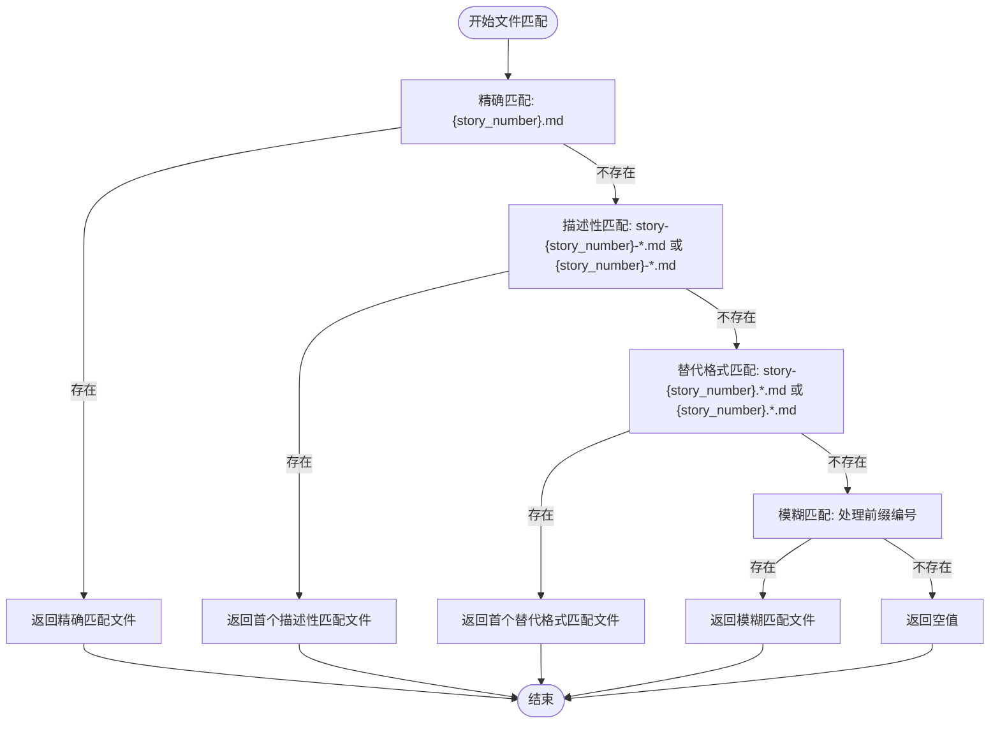
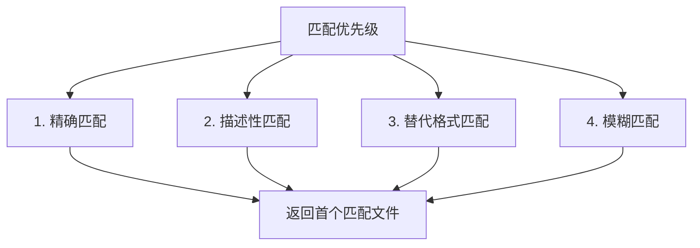
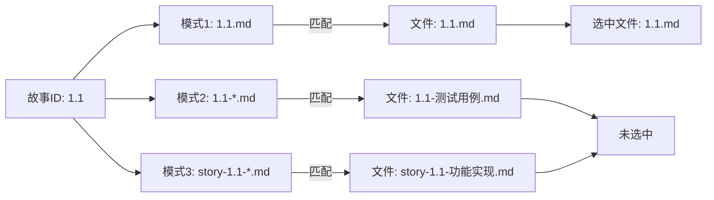
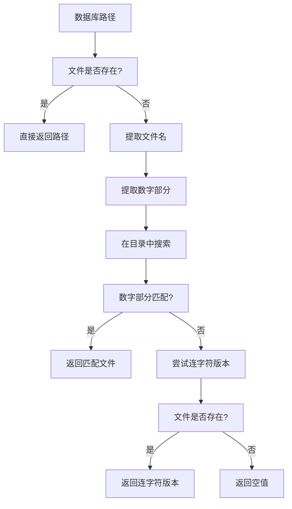

# 描述性匹配

<cite>
**本文档引用的文件**   
- [epic_driver.py](file://autoBMAD/epic_automation/epic_driver.py#L1032-L1049)
- [sm_agent.py](file://autoBMAD/epic_automation/sm_agent.py#L86-L93)
- [story_parser.py](file://autoBMAD/epic_automation/story_parser.py)
- [state_manager.py](file://autoBMAD/epic_automation/state_manager.py#L797-L866)
</cite>

## 目录
1. [简介](#简介)
2. [描述性匹配模式设计](#描述性匹配模式设计)
3. [文件匹配实现机制](#文件匹配实现机制)
4. [glob模式匹配分析](#glob模式匹配分析)
5. [匹配优先级与决策逻辑](#匹配优先级与决策逻辑)
6. [团队协作价值](#团队协作价值)
7. [实际匹配案例](#实际匹配案例)
8. [状态同步与文件查找](#状态同步与文件查找)
9. [结论](#结论)

## 简介
本文档详细说明了在代码库中实现的描述性文件名匹配模式。该模式通过glob模式匹配`{story_number}-*.md`和`story-{story_number}-*.md`格式的文件（例如`004.1-功能描述.md`或`story-004.1-性能优化.md`），支持开发者在文件名中添加描述性后缀以增强可读性。文档分析了`glob()`函数的使用方式及其在文件系统遍历中的效率表现，解释了当存在多个匹配结果时返回首个文件的决策逻辑，并阐述了该模式在团队协作环境中提升文件可识别性的价值。

## 描述性匹配模式设计
描述性匹配模式的设计目的是允许开发者在保持核心标识符（如故事编号）的同时，通过添加描述性后缀来增强文件名的可读性和信息量。这种设计支持两种主要格式：`{story_number}-*.md`和`story-{story_number}-*.md`，使得文件名既能被系统准确识别，又能传达更多上下文信息。

该模式特别适用于敏捷开发环境，其中故事（Story）和史诗（Epic）文档需要频繁创建和引用。通过允许描述性后缀，团队成员可以快速理解文件内容而无需打开文件，从而提高工作效率和协作质量。

**Section sources**
- [epic_driver.py](file://autoBMAD/epic_automation/epic_driver.py#L1040-L1043)

## 文件匹配实现机制
文件匹配机制在`epic_driver.py`中的`_find_story_file`方法中实现，该方法采用多级匹配策略来查找对应的故事文件。匹配过程从精确匹配开始，逐步过渡到更宽松的模式匹配。

匹配策略包括四个层级：
1. **精确匹配**：查找`{story_number}.md`格式的文件
2. **描述性匹配**：查找`story-{story_number}-*.md`或`{story_number}-*.md`格式的文件
3. **替代格式匹配**：查找`story-{story_number}.*.md`或`{story_number}.*.md`格式的文件
4. **模糊匹配**：处理带有前缀的故事编号（如"1"匹配"004.1"）

**Diagram sources **
- [epic_driver.py](file://autoBMAD/epic_automation/epic_driver.py#L1032-L1059)

**Section sources**
- [epic_driver.py](file://autoBMAD/epic_automation/epic_driver.py#L1032-L1083)

## glob模式匹配分析
`glob()`函数在文件系统遍历中被用于模式匹配，其效率表现取决于文件系统的性能和匹配模式的复杂性。在本实现中，`glob()`被用于查找符合特定模式的Markdown文件，通过`stories_dir.glob(f"story-{story_number}-*.md")`和`stories_dir.glob(f"{story_number}-*.md")`两种模式进行搜索。

`glob()`函数的优势在于其简单性和跨平台兼容性，它使用Unix shell风格的通配符进行模式匹配。然而，对于大型目录，`glob()`可能需要遍历所有文件来找到匹配项，这可能导致性能瓶颈。因此，匹配策略从最具体的模式开始，以尽快找到匹配文件并减少不必要的文件系统遍历。

在实现中，`glob()`的结果被转换为列表并通过`list()`函数进行评估，这会一次性加载所有匹配结果到内存中。对于预期只有少量匹配文件的场景，这种做法是合理的，因为它简化了后续的处理逻辑。

**Section sources**
- [epic_driver.py](file://autoBMAD/epic_automation/epic_driver.py#L1041-L1043)

## 匹配优先级与决策逻辑
匹配优先级遵循从精确到模糊的原则，确保最符合预期的文件被优先选择。当存在多个匹配结果时，系统返回首个匹配的文件，这一决策逻辑基于"先到先得"的原则，避免了在多个可能匹配项之间进行复杂决策的需要。

优先级顺序如下：
1. 精确匹配（`{story_number}.md`）
2. 描述性匹配（`story-{story_number}-*.md`或`{story_number}-*.md`）
3. 替代格式匹配（`story-{story_number}.*.md`或`{story_number}.*.md`）
4. 模糊匹配（基于正则表达式的复杂匹配）

这种分层匹配策略确保了系统的可靠性和可预测性。即使在文件命名不规范的情况下，系统也能通过逐步放宽匹配条件来找到合适的文件，同时优先选择最精确的匹配结果。

**Diagram sources **
- [epic_driver.py](file://autoBMAD/epic_automation/epic_driver.py#L1032-L1059)

**Section sources**
- [epic_driver.py](file://autoBMAD/epic_automation/epic_driver.py#L1032-L1083)
- [test_sm_agent.py](file://tests-copy/unit/test_sm_agent.py#L133-L146)

## 团队协作价值
描述性匹配模式在团队协作环境中具有显著价值。它允许团队成员使用更具描述性的文件名，而不会影响系统的自动化处理能力。这种灵活性促进了更好的文档实践，因为开发者可以创建既对人类友好又对机器可读的文件名。

在实际开发中，不同的开发者可能有不同的命名偏好。描述性匹配模式通过支持多种命名约定，减少了因文件命名不一致导致的冲突和错误。此外，当文件被重命名或移动时，只要核心标识符保持不变，系统仍然能够正确识别和处理文件。

该模式还支持渐进式采用，团队可以逐步从简单的命名约定过渡到更丰富的描述性命名，而不会中断现有的工作流程。这种灵活性对于维护大型代码库和长期项目尤为重要。

**Section sources**
- [epic_driver.py](file://autoBMAD/epic_automation/epic_driver.py#L1040-L1043)

## 实际匹配案例
以下是描述性匹配模式的实际应用案例：

- **案例1**：故事编号`1.1`可以匹配`1.1-模块基础.md`、`story-1.1-模块基础.md`或`1.1.md`
- **案例2**：故事编号`004.1`可以匹配`004.1-功能描述.md`、`story-004.1-功能描述.md`或`004.1.md`
- **案例3**：当存在多个匹配时，如`1.1-test.md`、`1.1.other.md`和`story-1-1-test.md`，系统将返回`1.1-test.md`作为首个描述性匹配

这些案例展示了模式的灵活性和实用性。测试用例验证了匹配逻辑的正确性，包括优先级处理和边界情况。例如，当没有匹配文件时，系统正确返回`None`；当存在多个匹配时，系统返回首个匹配文件。

**Diagram sources **
- [epic_driver.py](file://autoBMAD/epic_automation/epic_driver.py#L1041-L1043)
- [test_sm_agent.py](file://tests-copy/unit/test_sm_agent.py#L133-L146)

**Section sources**
- [epic_driver.py](file://autoBMAD/epic_automation/epic_driver.py#L1032-L1049)
- [test_sm_agent.py](file://tests-copy/unit/test_sm_agent.py#L118-L122)

## 状态同步与文件查找
状态管理器中的文件查找逻辑与描述性匹配模式相辅相成。`state_manager.py`中的`_find_actual_story_file`方法实现了更复杂的文件查找策略，包括基于数字部分匹配的模糊查找和文件名格式转换。

当数据库中的故事路径与实际文件系统不一致时，状态管理器会尝试多种转换策略来定位实际文件。这些策略包括：
- 直接路径匹配
- 数字部分匹配（提取文件名中的数字进行比较）
- 连字符与点号格式转换

这种健壮的文件查找机制确保了即使在文件被重命名或移动的情况下，系统仍然能够正确同步状态信息。这对于维护数据一致性和系统可靠性至关重要。

**Diagram sources **
- [state_manager.py](file://autoBMAD/epic_automation/state_manager.py#L797-L866)

**Section sources**
- [state_manager.py](file://autoBMAD/epic_automation/state_manager.py#L797-L866)

## 结论
描述性匹配模式是一种有效的文件名匹配策略，它平衡了人类可读性和机器可处理性。通过支持`{story_number}-*.md`和`story-{story_number}-*.md`格式，该模式允许开发者在文件名中添加描述性信息，同时保持系统的自动化处理能力。

`glob()`函数的使用提供了简单而有效的模式匹配能力，尽管在大型目录中可能存在性能考虑。匹配优先级从精确到模糊的设计确保了系统的可靠性和可预测性，而返回首个匹配文件的决策逻辑简化了处理流程。

在团队协作环境中，该模式显著提升了文件的可识别性和可维护性，支持多种命名约定并减少了因命名不一致导致的问题。结合状态管理器中的健壮文件查找逻辑，整个系统展现了高度的灵活性和可靠性。