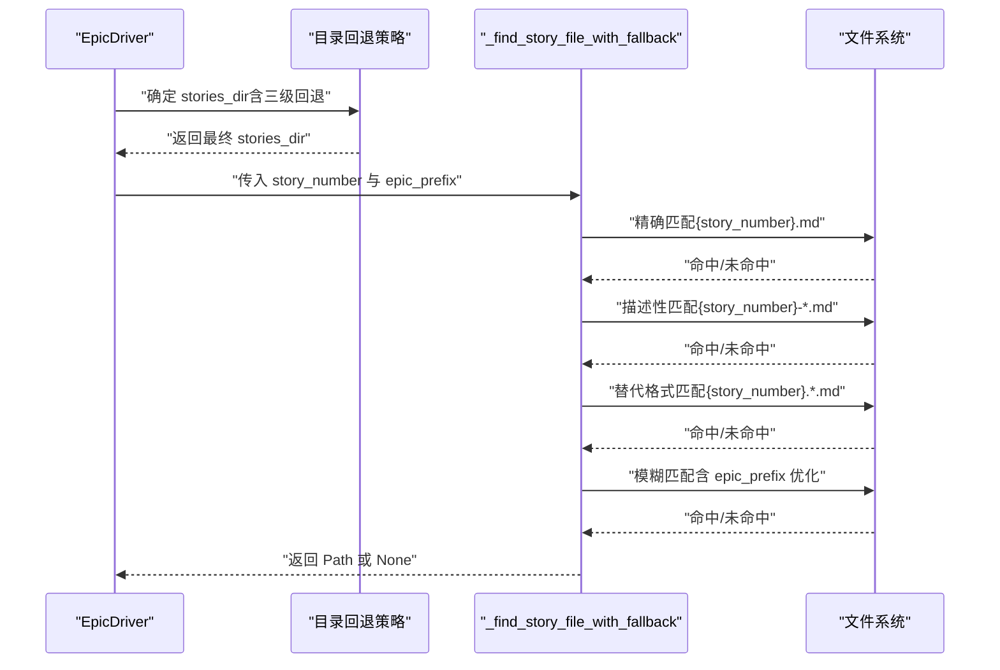
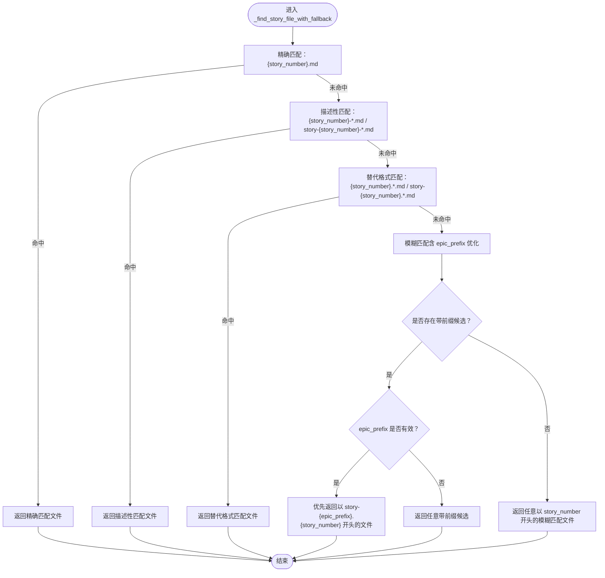
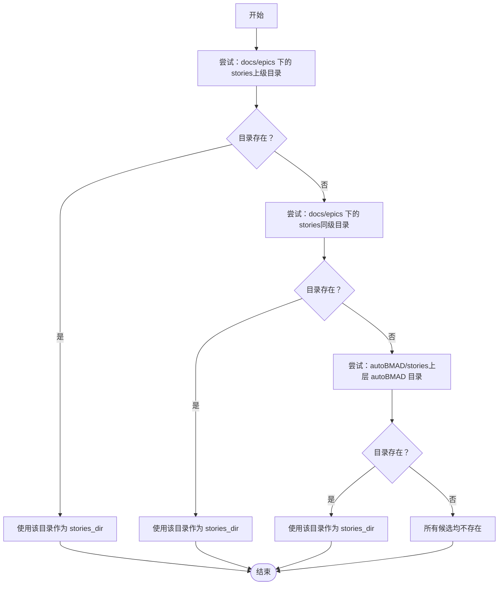
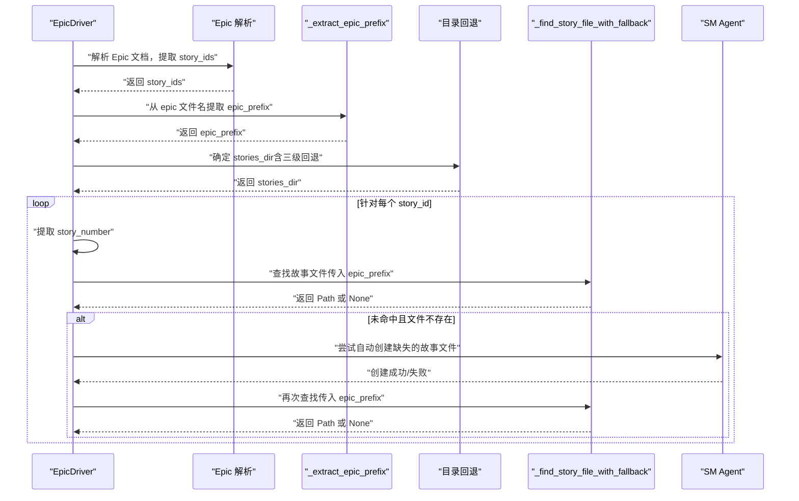
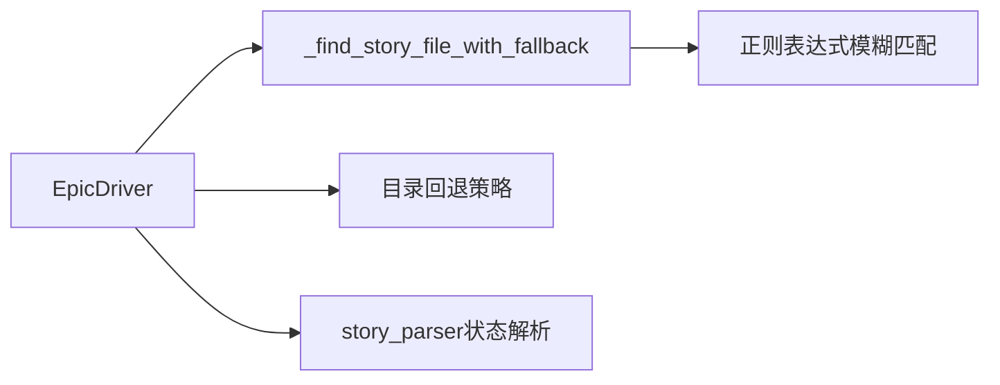

# 故事文件匹配

<cite>
**本文引用的文件**
- [epic_driver.py](file://autoBMAD/epic_automation/epic_driver.py)
- [story_parser.py](file://autoBMAD/epic_automation/story_parser.py)
</cite>

## 目录
1. [简介](#简介)
2. [项目结构](#项目结构)
3. [核心组件](#核心组件)
4. [架构总览](#架构总览)
5. [详细组件分析](#详细组件分析)
6. [依赖关系分析](#依赖关系分析)
7. [性能考量](#性能考量)
8. [故障排查指南](#故障排查指南)
9. [结论](#结论)

## 简介
本文件聚焦于“故事文件匹配”能力，系统性阐述方法 _find_story_file_with_fallback 的多级回退搜索策略与目录回退机制。重点包括：
- 四种匹配模式的优先级与行为：精确匹配、描述性匹配、替代格式匹配、模糊匹配（含前缀场景）
- epic_prefix 参数如何优化匹配结果
- 当 stories_dir 不存在时的三级目录回退策略
- 匹配决策流程图与调用序列图

## 项目结构
围绕“故事文件匹配”的相关代码主要位于 epic_automation 子模块中，核心文件如下：
- autoBMAD/epic_automation/epic_driver.py：包含 _find_story_file_with_fallback 与目录回退逻辑
- autoBMAD/epic_automation/story_parser.py：包含状态解析与辅助工具，便于理解状态提取与匹配结果的后续处理

图表来源
- [epic_driver.py](file://autoBMAD/epic_automation/epic_driver.py#L713-L912)
- [story_parser.py](file://autoBMAD/epic_automation/story_parser.py#L1-L120)

章节来源
- [epic_driver.py](file://autoBMAD/epic_automation/epic_driver.py#L713-L912)
- [story_parser.py](file://autoBMAD/epic_automation/story_parser.py#L1-L120)

## 核心组件
- _find_story_file_with_fallback：按优先级尝试多种文件名模式，最终返回匹配到的文件路径或 None
- 目录回退策略：当 epic_path 所在目录下找不到 stories 目录时，按顺序尝试多个候选路径
- epic_prefix 参数：在模糊匹配阶段，优先选择与 epic 前缀一致的文件，提升准确性

章节来源
- [epic_driver.py](file://autoBMAD/epic_automation/epic_driver.py#L713-L912)
- [epic_driver.py](file://autoBMAD/epic_automation/epic_driver.py#L1012-L1111)

## 架构总览
下面的架构图展示了 EpicDriver 在解析 Epic 文档并定位对应故事文件时的整体流程，以及匹配方法在其中的位置。

图表来源
- [epic_driver.py](file://autoBMAD/epic_automation/epic_driver.py#L713-L912)
- [epic_driver.py](file://autoBMAD/epic_automation/epic_driver.py#L1012-L1111)

## 详细组件分析

### 方法：_find_story_file_with_fallback 的多级回退策略
该方法按以下优先级依次尝试匹配，一旦命中即返回对应文件；若全部未命中则返回 None。

- 精确匹配（优先级最高）
  - 模式：{story_number}.md
  - 适用场景：文件名严格等于 story_number 并以 .md 结尾
  - 优点：最稳定、最快速
- 描述性匹配（次高优先级）
  - 模式：{story_number}-*.md 或 story-{story_number}-*.md
  - 适用场景：文件名包含描述性后缀（如 -spec、-dev 等）
  - 优点：兼顾可读性与稳定性
- 替代格式匹配（再次之）
  - 模式：{story_number}.*.md 或 story-{story_number}.*.md
  - 适用场景：文件名采用点分分隔的替代格式
  - 优点：对命名风格更宽松
- 模糊匹配（最低优先级）
  - 场景：当 story_number 是纯数字且可能带有前缀时（如“1”匹配“004.1”）
  - 行为：
    - 先收集所有以 story_number 开头且以 “.” 或 “-” 分隔的候选文件
    - 若存在带显式前缀（如 004.1、003.1）的候选，则优先返回这些“带前缀”文件
    - 若 epic_prefix 有效，进一步优先返回以 “story-{epic_prefix}.{story_number}” 开头的文件
    - 若无带前缀候选，再返回普通模糊匹配结果
  - 优点：能处理不同命名风格与前缀混用的场景

图表来源
- [epic_driver.py](file://autoBMAD/epic_automation/epic_driver.py#L1012-L1111)

章节来源
- [epic_driver.py](file://autoBMAD/epic_automation/epic_driver.py#L1012-L1111)

### 目录回退策略（stories_dir 不存在时的三级回退）
当 epic_path 所在目录下找不到 stories 目录时，EpicDriver 会按以下顺序尝试定位 stories 目录，直到找到为止或穷尽所有候选。

- 一级回退：epic_path.parent.parent / "stories"
- 二级回退：epic_path.parent / "stories"
- 三级回退：autoBMAD_dir.parent / "autoBMAD" / "stories"（若 epic_path.parent.parent 名称不是 "autoBMAD"）

图表来源
- [epic_driver.py](file://autoBMAD/epic_automation/epic_driver.py#L713-L750)

章节来源
- [epic_driver.py](file://autoBMAD/epic_automation/epic_driver.py#L713-L750)

### epic_prefix 参数的优化作用
在模糊匹配阶段，若 epic_prefix 有效，将优先返回以 “story-{epic_prefix}.{story_number}” 开头的文件，从而在多前缀环境中提高匹配准确率。该逻辑位于模糊匹配分支内，确保“带前缀”的候选优先被考虑。

章节来源
- [epic_driver.py](file://autoBMAD/epic_automation/epic_driver.py#L1085-L1103)

### 匹配决策在 EpicDriver 中的调用链
EpicDriver 在解析 Epic 文档后，会：
- 提取 story_ids
- 通过 _extract_epic_prefix 获取 epic_prefix
- 通过目录回退策略确定 stories_dir
- 针对每个 story_id，提取 story_number 并调用 _find_story_file_with_fallback
- 若未找到且文件确实不存在，尝试通过 SM Agent 自动创建后再匹配

图表来源
- [epic_driver.py](file://autoBMAD/epic_automation/epic_driver.py#L713-L912)
- [epic_driver.py](file://autoBMAD/epic_automation/epic_driver.py#L1012-L1111)

章节来源
- [epic_driver.py](file://autoBMAD/epic_automation/epic_driver.py#L713-L912)
- [epic_driver.py](file://autoBMAD/epic_automation/epic_driver.py#L1012-L1111)

## 依赖关系分析
- EpicDriver 依赖文件系统 API（Path、glob、exists）进行目录与文件扫描
- 匹配方法内部使用正则表达式进行模糊匹配（如识别前缀与分隔符）
- 状态解析与匹配结果的后续处理由 story_parser.py 提供（如状态提取、规范化等）

图表来源
- [epic_driver.py](file://autoBMAD/epic_automation/epic_driver.py#L713-L912)
- [epic_driver.py](file://autoBMAD/epic_automation/epic_driver.py#L1012-L1111)
- [story_parser.py](file://autoBMAD/epic_automation/story_parser.py#L1-L120)

章节来源
- [epic_driver.py](file://autoBMAD/epic_automation/epic_driver.py#L713-L912)
- [epic_driver.py](file://autoBMAD/epic_automation/epic_driver.py#L1012-L1111)
- [story_parser.py](file://autoBMAD/epic_automation/story_parser.py#L1-L120)

## 性能考量
- 精确匹配与描述性匹配使用 glob 快速筛选，复杂度与候选数量线性相关
- 替代格式匹配同样使用 glob，但模式更宽松，可能扩大候选集
- 模糊匹配阶段会遍历目录下的所有 .md 文件，复杂度与文件总数线性相关；epic_prefix 的存在可显著缩小候选范围
- 目录回退最多三次尝试，通常不会引入额外显著开销

## 故障排查指南
- 目录不存在
  - 现象：日志显示 stories 目录不存在，尝试了多个候选路径
  - 排查：确认 epic_path 所在目录结构，或手动创建 docs/stories
  - 参考路径
    - [epic_driver.py](file://autoBMAD/epic_automation/epic_driver.py#L713-L750)
    - [epic_driver.py](file://autoBMAD/epic_automation/epic_driver.py#L839-L850)
- 匹配不到文件
  - 现象：日志显示“匹配失败”，但文件确实存在
  - 排查：检查文件名是否符合任一匹配模式；确认 story_number 是否与文件名前缀一致；确认 epic_prefix 是否正确
  - 参考路径
    - [epic_driver.py](file://autoBMAD/epic_automation/epic_driver.py#L1012-L1111)
- 自动创建后仍无法匹配
  - 现象：创建成功但再次匹配失败
  - 排查：确认创建后的文件名是否符合预期；检查 epic_prefix 是否与创建产物一致
  - 参考路径
    - [epic_driver.py](file://autoBMAD/epic_automation/epic_driver.py#L796-L823)

章节来源
- [epic_driver.py](file://autoBMAD/epic_automation/epic_driver.py#L713-L750)
- [epic_driver.py](file://autoBMAD/epic_automation/epic_driver.py#L839-L850)
- [epic_driver.py](file://autoBMAD/epic_automation/epic_driver.py#L1012-L1111)
- [epic_driver.py](file://autoBMAD/epic_automation/epic_driver.py#L796-L823)

## 结论
- _find_story_file_with_fallback 通过“精确 > 描述性 > 替代格式 > 模糊匹配”的优先级，覆盖了大多数命名约定与前缀场景
- epic_prefix 的引入在模糊匹配阶段提供了强大的定向优化，显著提升了跨 Epic 的匹配准确性
- 目录回退策略确保在不同项目布局下仍能稳定定位 stories 目录
- 建议在团队内统一故事文件命名规范，优先采用“{story_number}.md”或“{story_number}-*.md”格式，减少模糊匹配的必要性