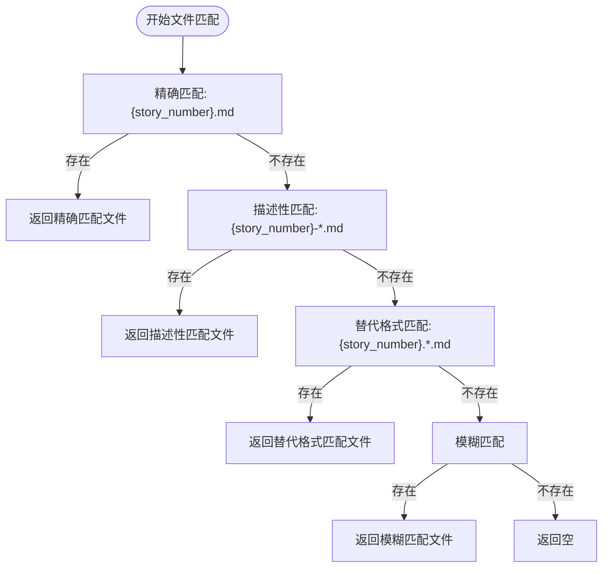

# 替代格式匹配

<cite>
**本文档引用的文件**  
- [epic_driver.py](file://autoBMAD/epic_automation/epic_driver.py#L1032-L1058)
- [story_parser.py](file://autoBMAD/epic_automation/story_parser.py#L1-L800)
- [1.1.module-foundation.md](file://docs-copy/stories/1.1.module-foundation.md)
- [001.1-story-dod-validation.md](file://docs-copy/validation/001.1-story-dod-validation.md)
</cite>

## 目录
1. [简介](#简介)
2. [多段式命名约定支持](#多段式命名约定支持)
3. [替代格式匹配实现](#替代格式匹配实现)
4. [Glob模式与正则表达式的对比](#glob模式与正则表达式的对比)
5. [复杂文档类型的灵活性](#复杂文档类型的灵活性)

## 简介
本文档详细阐述了对`{story_number}.*.md`和`story-{story_number}.*.md`格式的支持实现，重点分析了该模式如何兼容使用点号分隔的多段式文件命名约定，以满足不同项目风格的需求。通过分析代码中两次`glob()`调用合并结果的实现方式，说明其与描述性匹配的相似性与区别。同时提供正则表达式等价形式的对比，强调glob模式在可读性和安全性方面的优势，并指出该模式在处理复杂文档类型扩展时的灵活性。

**Section sources**
- [epic_driver.py](file://autoBMAD/epic_automation/epic_driver.py#L1032-L1058)

## 多段式命名约定支持
系统支持使用点号分隔的多段式文件命名约定，如`004.1.description.md`或`story-004.1.spec.md`。这种命名方式允许将故事编号、描述信息和文档类型通过点号清晰地分隔开来，提高了文件名的可读性和组织性。例如，`004.1.description.md`明确表示这是第004号Epic下的第1个故事的描述文档，而`story-004.1.spec.md`则表示同一故事的技术规范文档。这种约定不仅便于人类阅读和理解，也方便自动化工具进行解析和处理。

**Section sources**
- [epic_driver.py](file://autoBMAD/epic_automation/epic_driver.py#L1050-L1053)

## 替代格式匹配实现
在`epic_driver.py`文件中，通过`_find_story_file_with_fallback`方法实现了对替代格式的支持。该方法首先尝试精确匹配（如`004.1.md`），然后尝试描述性匹配（如`story-004.1-description.md`或`004.1-description.md`），最后尝试替代格式匹配（如`story-004.1.description.md`或`004.1.description.md`）。具体实现中，使用了两次`glob()`调用分别查找`story-{story_number}.*.md`和`{story_number}.*.md`格式的文件，并将结果合并。这种方式与描述性匹配的实现相似，都是通过模式匹配来查找文件，但区别在于替代格式匹配使用点号作为分隔符，而描述性匹配使用连字符。

**Diagram sources**
- [epic_driver.py](file://autoBMAD/epic_automation/epic_driver.py#L1032-L1058)

**Section sources**
- [epic_driver.py](file://autoBMAD/epic_automation/epic_driver.py#L1032-L1058)

## Glob模式与正则表达式的对比
使用glob模式进行文件匹配相比正则表达式具有更高的可读性和安全性。glob模式的语法简单直观，如`*.md`表示所有以`.md`结尾的文件，`?`表示任意单个字符，而正则表达式则需要使用`.*\.md$`和`.`等更复杂的语法。此外，glob模式通常由操作系统级别的文件系统API直接支持，执行效率更高，且不易受到正则表达式注入等安全问题的影响。例如，`{story_number}.*.md`这一glob模式等价于正则表达式`^{story_number}\.[^/]*\.md$`，但前者更易于理解和维护。

**Section sources**
- [epic_driver.py](file://autoBMAD/epic_automation/epic_driver.py#L1050-L1053)

## 复杂文档类型的灵活性
该模式在处理复杂文档类型扩展时表现出极大的灵活性。通过使用点号分隔的多段式命名，可以轻松地为同一故事创建多种类型的文档，如`004.1.description.md`、`004.1.spec.md`、`004.1.test.md`等，每种文档类型都有明确的标识。这种灵活性使得项目可以适应不同的文档需求，而无需修改文件匹配逻辑。例如，当需要添加新的文档类型时，只需遵循相同的命名约定即可，系统会自动识别和处理这些新类型的文件。

**Section sources**
- [epic_driver.py](file://autoBMAD/epic_automation/epic_driver.py#L1050-L1053)
- [1.1.module-foundation.md](file://docs-copy/stories/1.1.module-foundation.md)