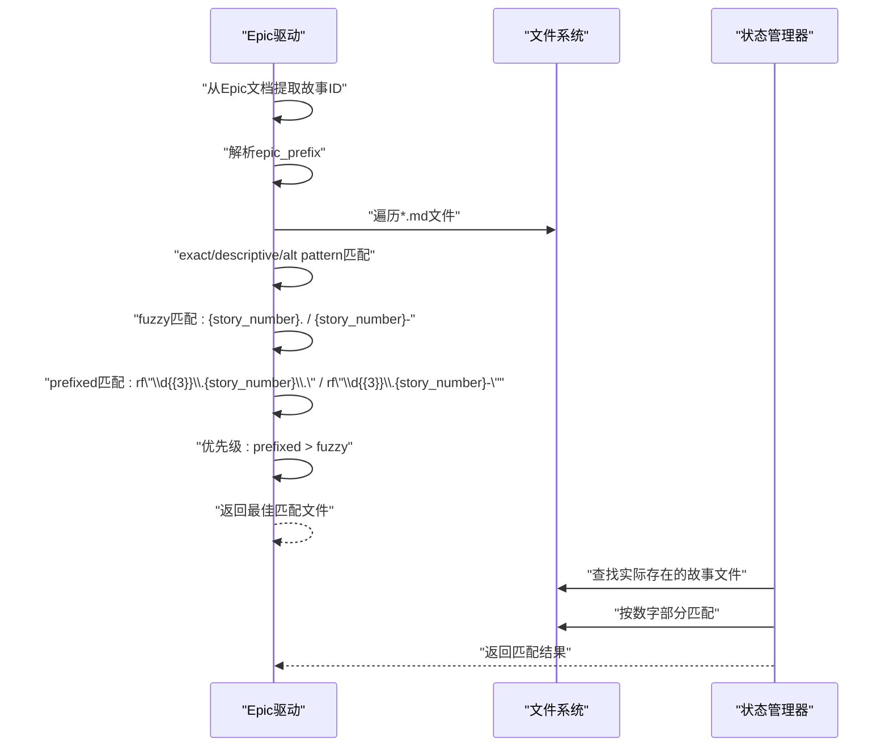
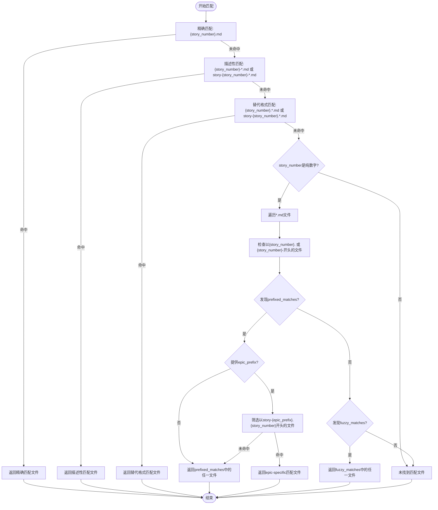
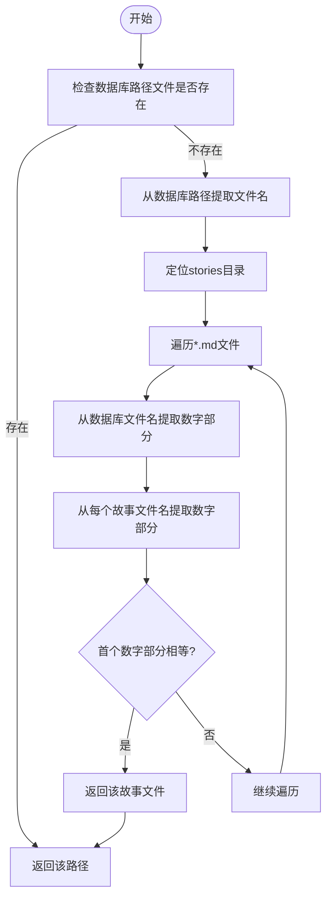
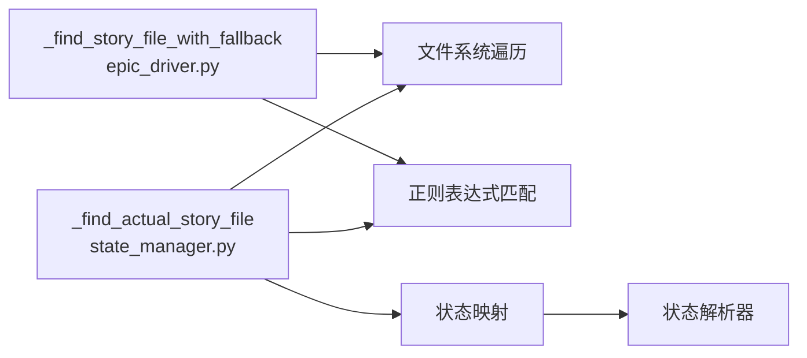

# 模糊匹配

<cite>
**本文引用的文件**
- [epic_driver.py](file://autoBMAD/epic_automation/epic_driver.py)
- [state_manager.py](file://autoBMAD/epic_automation/state_manager.py)
- [story_parser.py](file://autoBMAD/epic_automation/story_parser.py)
- [test_regex.py](file://test_regex.py)
</cite>

## 目录
1. [简介](#简介)
2. [项目结构](#项目结构)
3. [核心组件](#核心组件)
4. [架构总览](#架构总览)
5. [详细组件分析](#详细组件分析)
6. [依赖分析](#依赖分析)
7. [性能考虑](#性能考虑)
8. [故障排查指南](#故障排查指南)
9. [结论](#结论)

## 简介
本文件聚焦“模糊匹配”机制，详细说明当故事ID为纯数字（如“1”）时，如何与带前缀的故事文件名（如“004.1”）实现宽松匹配。该机制通过遍历目标目录下的所有“.md”文件，应用多种条件判断，优先匹配明确带前缀的文件，其次再回退到更宽松的匹配策略。同时，本文解释正则表达式 rf"\d{{3}}\.{story_number}\." 和 rf"\d{{3}}\.{story_number}-" 的作用，阐明 prefixed_matches 与 fuzzy_matches 的优先级关系，以及 epic_prefix 参数如何进一步筛选特定史诗下的故事文件，并给出性能影响评估与使用建议。

## 项目结构
与模糊匹配直接相关的代码位于 autoBMAD/epic_automation 目录，涉及 Epic 驱动、状态管理与故事解析三个模块：
- Epic 驱动负责从 Epic 文档中抽取故事ID，并在 stories 目录中进行文件匹配。
- 状态管理器负责将数据库状态同步到 Markdown 文件，期间也包含针对文件名的宽松查找逻辑。
- 故事解析器提供状态解析能力，虽不直接参与模糊匹配，但与状态同步流程密切相关。

图表来源
- [epic_driver.py](file://autoBMAD/epic_automation/epic_driver.py#L1012-L1111)
- [state_manager.py](file://autoBMAD/epic_automation/state_manager.py#L797-L866)
- [story_parser.py](file://autoBMAD/epic_automation/story_parser.py#L213-L260)

章节来源
- [epic_driver.py](file://autoBMAD/epic_automation/epic_driver.py#L1012-L1111)
- [state_manager.py](file://autoBMAD/epic_automation/state_manager.py#L797-L866)
- [story_parser.py](file://autoBMAD/epic_automation/story_parser.py#L213-L260)

## 核心组件
- Epic 驱动的模糊匹配函数：负责在 stories 目录中根据故事ID（含纯数字）寻找最合适的文件，优先匹配带明确前缀的文件，再回退到宽松匹配。
- 状态管理器的文件查找函数：在数据库状态同步过程中，若 Markdown 文件不存在，会尝试在 stories 目录中查找与数据库记录中故事ID数字部分相等的文件，作为回退策略之一。
- 故事解析器：提供状态解析能力，配合 Epic 驱动与状态管理器共同完成端到端流程。

章节来源
- [epic_driver.py](file://autoBMAD/epic_automation/epic_driver.py#L1012-L1111)
- [state_manager.py](file://autoBMAD/epic_automation/state_manager.py#L797-L866)
- [story_parser.py](file://autoBMAD/epic_automation/story_parser.py#L213-L260)

## 架构总览
Epic 驱动从 Epic 文档中提取故事ID，结合 epic_prefix（来自 Epic 文件名），在 stories 目录中执行多轮匹配策略；状态管理器在同步数据库状态到 Markdown 时，也会进行类似的数字部分匹配查找，作为兜底手段。

图表来源
- [epic_driver.py](file://autoBMAD/epic_automation/epic_driver.py#L1012-L1111)
- [state_manager.py](file://autoBMAD/epic_automation/state_manager.py#L797-L866)

## 详细组件分析

### Epic 驱动的模糊匹配流程
该流程围绕 _find_story_file_with_fallback 展开，包含以下步骤：
- 精确匹配：文件名为 “{story_number}.md”
- 描述性匹配：文件名以 “story-{story_number}-” 或 “{story_number}-” 开头
- 替代格式匹配：文件名以 “story-{story_number}.” 或 “{story_number}.” 开头
- 模糊匹配：当 story_number 为纯数字时，遍历目录，优先检查是否以 “{story_number}.” 或 “{story_number}-” 开头；随后使用正则匹配形如 “XXX.{story_number}.” 或 “XXX.{story_number}-” 的文件（其中 XXX 为三位数字前缀）
- 优先级：prefixed_matches 优先于 fuzzy_matches；若提供了 epic_prefix，则进一步优先选择以 “story-{epic_prefix}.{story_number}” 开头的文件

图表来源
- [epic_driver.py](file://autoBMAD/epic_automation/epic_driver.py#L1012-L1111)

章节来源
- [epic_driver.py](file://autoBMAD/epic_automation/epic_driver.py#L1012-L1111)

### 正则表达式的作用与含义
- rf"\d{{3}}\.{story_number}\."：匹配形如 “004.1.” 的文件名，其中 “004” 是三位数字前缀，“.” 是字面量点号，“1” 是故事编号，“.” 是字面量点号。
- rf"\d{{3}}\.{story_number}-"：匹配形如 “004.1-” 的文件名，其中 “004” 是三位数字前缀，“.” 是字面量点号，“1” 是故事编号，“-” 是字面量连字符。

这些正则用于识别带有明确史诗前缀的文件，从而优先返回更精确的匹配结果。

章节来源
- [epic_driver.py](file://autoBMAD/epic_automation/epic_driver.py#L1068-L1083)

### prefixed_matches 与 fuzzy_matches 的优先级
- 若存在 prefixed_matches（即匹配到明确前缀的文件），则优先返回该集合中的文件；若同时提供 epic_prefix，则进一步优先返回以 “story-{epic_prefix}.{story_number}” 开头的文件。
- 仅当不存在 prefixed_matches 时，才回退到 fuzzy_matches（以 “{story_number}.” 或 “{story_number}-” 开头的文件）。

章节来源
- [epic_driver.py](file://autoBMAD/epic_automation/epic_driver.py#L1085-L1111)

### epic_prefix 参数的筛选作用
- epic_prefix 由 Epic 文件名解析而来（例如从 “epic-004-...” 提取 “004”）。
- 在存在 prefixed_matches 的情况下，若 epic_prefix 非空，将优先选择以 “story-{epic_prefix}.{story_number}” 开头的文件，从而限定匹配范围至特定史诗下的故事文件。

章节来源
- [epic_driver.py](file://autoBMAD/epic_automation/epic_driver.py#L709-L711)
- [epic_driver.py](file://autoBMAD/epic_automation/epic_driver.py#L1000-L1011)
- [epic_driver.py](file://autoBMAD/epic_automation/epic_driver.py#L1085-L1103)

### 状态管理器中的数字部分匹配（回退策略）
在将数据库状态同步到 Markdown 文件时，若数据库中记录的文件路径不存在，状态管理器会在 stories 目录中按“数字部分相等”的规则查找文件，作为兜底策略之一：
- 从数据库路径的文件名中提取数字部分（如 “1.1”、“004.1”）
- 遍历 stories 目录中的所有 .md 文件，提取其文件名中的数字部分
- 若两者首个数字部分相等，则认为可能是同一故事，返回该文件

图表来源
- [state_manager.py](file://autoBMAD/epic_automation/state_manager.py#L797-L866)

章节来源
- [state_manager.py](file://autoBMAD/epic_automation/state_manager.py#L797-L866)

### 故事解析器与状态同步的关系
故事解析器提供状态解析能力，虽然不直接参与模糊匹配，但在状态同步流程中，状态管理器会将数据库状态映射为 Markdown 状态并写回文件。这一流程与 Epic 驱动的匹配结果共同构成端到端的工作流。

章节来源
- [story_parser.py](file://autoBMAD/epic_automation/story_parser.py#L213-L260)
- [state_manager.py](file://autoBMAD/epic_automation/state_manager.py#L677-L795)

## 依赖分析
- Epic 驱动依赖文件系统遍历与正则表达式，用于在 stories 目录中进行多轮匹配。
- 状态管理器依赖文件系统遍历与正则表达式，用于在数据库状态同步时进行数字部分匹配。
- 二者均不直接依赖故事解析器，但状态管理器在写回 Markdown 时会使用状态解析器的映射逻辑。

图表来源
- [epic_driver.py](file://autoBMAD/epic_automation/epic_driver.py#L1012-L1111)
- [state_manager.py](file://autoBMAD/epic_automation/state_manager.py#L797-L866)
- [story_parser.py](file://autoBMAD/epic_automation/story_parser.py#L213-L260)

章节来源
- [epic_driver.py](file://autoBMAD/epic_automation/epic_driver.py#L1012-L1111)
- [state_manager.py](file://autoBMAD/epic_automation/state_manager.py#L797-L866)
- [story_parser.py](file://autoBMAD/epic_automation/story_parser.py#L213-L260)

## 性能考虑
- 目录遍历成本：在大型目录中，glob 与逐文件检查会带来线性时间开销 O(N)，N 为目录中 .md 文件数量。
- 正则匹配成本：每次遍历都会进行多次字符串前缀检查与正则匹配，整体复杂度受 N 影响。
- 优先级优化：prefixed_matches 优先策略可减少不必要的模糊匹配尝试，降低平均匹配成本。
- 建议：
  - 在大型目录中谨慎使用模糊匹配，优先通过明确的文件命名规范（如 “story-{epic_prefix}.{story_number}-...”）减少匹配范围。
  - 若可能，预先过滤目录（例如按 epic_prefix 分离目录），以减少遍历规模。
  - 对于频繁调用的场景，可考虑缓存匹配结果或引入索引结构（如按故事ID建立索引）。

[本节为通用性能讨论，无需列出具体文件来源]

## 故障排查指南
- 匹配不到文件
  - 检查 stories 目录是否存在且路径正确
  - 确认 story_number 是否为纯数字，且与文件名前缀一致
  - 若使用 epic_prefix，请确认 Epic 文件名中包含正确的前缀（如 “epic-004-...”）
- 前缀匹配优先级不符合预期
  - 确认是否存在 prefixed_matches；若存在，系统将优先返回带明确前缀的文件
  - 若 epic_prefix 存在，系统将优先返回以 “story-{epic_prefix}.{story_number}” 开头的文件
- 正则匹配异常
  - 检查正则表达式是否正确转义（\d{3}、\.、-）
  - 可参考测试文件中的正则用法，确保输入与输出符合预期

章节来源
- [epic_driver.py](file://autoBMAD/epic_automation/epic_driver.py#L1068-L1111)
- [test_regex.py](file://test_regex.py)

## 结论
该模糊匹配机制通过多轮策略（精确、描述性、替代格式、模糊与前缀）实现对纯数字故事ID与带前缀文件名的宽松匹配。prefixed_matches 优先于 fuzzy_matches，且 epic_prefix 可进一步限定匹配范围，确保在大型目录中仍能高效、准确地定位目标文件。建议在工程实践中采用明确的命名规范，并在必要时通过目录分离与缓存策略优化性能。