# 精确匹配

<cite>
**本文引用的文件**
- [epic_driver.py](file://autoBMAD/epic_automation/epic_driver.py)
- [state_manager.py](file://autoBMAD/epic_automation/state_manager.py)
- [1.1.md](file://docs/stories/1.1.md)
- [1.1.module-foundation.md](file://docs-copy/stories/1.1.module-foundation.md)
</cite>

## 目录
1. [简介](#简介)
2. [项目结构](#项目结构)
3. [核心组件](#核心组件)
4. [架构总览](#架构总览)
5. [详细组件分析](#详细组件分析)
6. [依赖关系分析](#依赖关系分析)
7. [性能考量](#性能考量)
8. [故障排查指南](#故障排查指南)
9. [结论](#结论)
10. [附录](#附录)

## 简介
本篇文档聚焦于“精确匹配”模式，即在故事文件查找过程中，优先尝试形如 "{story_number}.md" 的文件名（例如 "004.1.md"）进行定位。该模式被设计为最高优先级匹配策略，旨在确保在文件命名规范严格、命名与故事编号一一对应的前提下，实现快速、稳定且可预测的文件定位。文档将解释该模式的设计意图、在性能与确定性方面的优势，并结合实际使用场景说明其适用性；同时，说明当该文件不存在时，系统将自动降级到后续匹配模式的流程。

## 项目结构
与精确匹配相关的代码位于 epic_automation 子模块中，核心方法为 _find_story_file_with_fallback，负责按优先级顺序尝试多种匹配策略，其中精确匹配是第一优先级。此外，state_manager 中也存在类似的精确匹配逻辑，用于在数据库路径附近寻找同名故事文件。


图表来源
- [epic_driver.py](file://autoBMAD/epic_automation/epic_driver.py#L1011-L1111)
- [state_manager.py](file://autoBMAD/epic_automation/state_manager.py#L820-L866)

章节来源
- [epic_driver.py](file://autoBMAD/epic_automation/epic_driver.py#L1011-L1111)
- [state_manager.py](file://autoBMAD/epic_automation/state_manager.py#L820-L866)

## 核心组件
- 精确匹配策略：以 "{story_number}.md" 作为文件名，直接构造路径并检查是否存在。
- 降级策略：若精确匹配未命中，则依次尝试描述性匹配、替代格式匹配、模糊匹配等。
- 确定性与性能：精确匹配为 O(1) 检查，无需遍历目录，具备最佳性能与确定性。

章节来源
- [epic_driver.py](file://autoBMAD/epic_automation/epic_driver.py#L1011-L1111)

## 架构总览
精确匹配在整个故事文件定位流程中处于最前端，作为“直指目标”的策略，一旦命中即可立即返回，避免后续昂贵的遍历与正则匹配。

```mermaid
sequenceDiagram
participant Caller as "调用方"
participant Driver as "EpicDriver"
participant FS as "文件系统"
Caller->>Driver : 请求定位 story_number 的故事文件
Driver->>FS : 构造路径 "{story_number}.md"<br/>并检查 exists()
alt 命中
FS-->>Driver : 存在
Driver-->>Caller : 返回该文件路径
else 未命中
FS-->>Driver : 不存在
Driver->>Driver : 降级到描述性/替代/模糊匹配
Driver-->>Caller : 返回匹配结果或 None
end
```



图表来源
- [epic_driver.py](file://autoBMAD/epic_automation/epic_driver.py#L1011-L1111)

## 详细组件分析

### 精确匹配方法：_find_story_file_with_fallback
- 设计意图
  - 作为最高优先级策略，确保在命名规范严格的环境中，能够以最少的开销直接定位目标文件。
  - 通过显式的文件名构造与 exists() 检查，保证行为可预期、可审计。
- 路径构造与存在性检查
  - 路径构造：将 stories_dir 与 "{story_number}.md" 组合为候选路径。
  - 存在性检查：使用 exists() 判断该路径是否真实存在。
- 性能与确定性
  - 时间复杂度：O(1)，仅一次文件系统存在性检查。
  - 确定性：命中即返回，不会受目录内容影响。
- 降级流程
  - 若精确匹配未命中，系统将依次尝试：
    - 描述性匹配：如 "story-{story_number}-*.md" 或 "{story_number}-*.md"
    - 替代格式匹配：如 "story-{story_number}.*.md" 或 "{story_number}.*.md"
    - 模糊匹配：针对简单数字或带前缀的场景进行启发式匹配
  - 以上降级策略在精确匹配之后执行，确保在大多数情况下仍能稳健定位文件。

```mermaid
flowchart TD
Start(["进入 _find_story_file_with_fallback"]) --> Build["构造候选路径<br/>\"{story_number}.md\""]
Build --> Exists{"文件存在？"}
Exists --> |是| ReturnExact["返回精确匹配文件"]
Exists --> |否| Desc["描述性匹配<br/>glob: story-{story_number}-*.md 或 {story_number}-*.md"]
Desc --> DescHit{"命中？"}
DescHit --> |是| ReturnDesc["返回描述性匹配文件"]
DescHit --> |否| Alt["替代格式匹配<br/>glob: story-{story_number}.*.md 或 {story_number}.*.md"]
Alt --> AltHit{"命中？"}
AltHit --> |是| ReturnAlt["返回替代格式匹配文件"]
AltHit --> |否| Fuzzy["模糊匹配<br/>遍历 *.md 并按规则筛选"]
Fuzzy --> Prefixed{"有带前缀的匹配？"}
Prefixed --> |是| EpicPref["若提供 epic_prefix，优先匹配特定前缀"]
EpicPref --> ReturnFuzzy["返回模糊匹配文件"]
Prefixed --> |否| ReturnNone["返回 None"]
ReturnExact --> End(["结束"])
ReturnDesc --> End
ReturnAlt --> End
ReturnFuzzy --> End
ReturnNone --> End
```

图表来源
- [epic_driver.py](file://autoBMAD/epic_automation/epic_driver.py#L1011-L1111)

章节来源
- [epic_driver.py](file://autoBMAD/epic_automation/epic_driver.py#L1011-L1111)

### 精确匹配在状态管理中的应用
- 在状态管理模块中，也存在类似的精确匹配逻辑：先尝试完全一致的文件名，再尝试将点号替换为连字符后的版本，以适配不同命名风格。
- 该逻辑体现了“精确优先”的一致性设计思想，确保在数据库路径附近也能快速定位到对应的故事文件。

章节来源
- [state_manager.py](file://autoBMAD/epic_automation/state_manager.py#L820-L866)

### 实际使用场景与示例
- 场景一：命名规范严格
  - 当 stories 目录下的文件严格采用 "{story_number}.md" 命名时，精确匹配可直接命中，无需任何额外扫描。
  - 示例文件命名参考：docs/stories/1.1.md、docs-copy/stories/1.1.module-foundation.md。
- 场景二：命名规范宽松
  - 当存在描述性或替代格式命名时，精确匹配未命中，系统将按顺序尝试后续策略，最终仍可定位到目标文件。
- 场景三：文件不存在
  - 当 "{story_number}.md" 不存在时，系统会记录未命中日志，并继续降级到描述性/替代/模糊匹配；若仍未命中，返回 None。

章节来源
- [1.1.md](file://docs/stories/1.1.md#L1-L126)
- [1.1.module-foundation.md](file://docs-copy/stories/1.1.module-foundation.md#L1-L362)
- [epic_driver.py](file://autoBMAD/epic_automation/epic_driver.py#L1011-L1111)

## 依赖关系分析
- 精确匹配依赖于文件系统存在性检查 exists()，该检查为 O(1) 操作，避免了目录扫描与正则匹配的成本。
- 降级策略依赖于 glob 模式匹配与正则表达式，属于更通用但成本更高的策略，仅在精确匹配未命中时启用。
- 状态管理模块的精确匹配逻辑与 epic_driver 的策略相互印证，体现一致的“精确优先”设计。


图表来源
- [epic_driver.py](file://autoBMAD/epic_automation/epic_driver.py#L1011-L1111)
- [state_manager.py](file://autoBMAD/epic_automation/state_manager.py#L820-L866)

章节来源
- [epic_driver.py](file://autoBMAD/epic_automation/epic_driver.py#L1011-L1111)
- [state_manager.py](file://autoBMAD/epic_automation/state_manager.py#L820-L866)

## 性能考量
- 精确匹配为 O(1) 检查，性能最优，且不受目录规模影响。
- 降级策略通常涉及目录扫描与正则匹配，成本更高；但在精确匹配未命中时才触发，整体开销可控。
- 在大规模目录中，优先采用精确匹配可显著减少不必要的 IO 与 CPU 开销。

## 故障排查指南
- 症状：精确匹配未命中
  - 检查 stories 目录下是否存在 "{story_number}.md" 文件。
  - 若文件存在但未被识别，确认 story_number 的格式与大小写是否与文件名一致。
- 症状：降级策略仍未能定位
  - 检查是否存在描述性/替代格式命名，或确认 epic_prefix 是否正确传入以启用前缀优先匹配。
- 症状：日志显示未命中
  - 查看日志输出，确认是否已进入后续降级策略；若仍为 None，需补充相应命名或调整命名规范。

章节来源
- [epic_driver.py](file://autoBMAD/epic_automation/epic_driver.py#L1011-L1111)
- [state_manager.py](file://autoBMAD/epic_automation/state_manager.py#L820-L866)

## 结论
精确匹配模式以 "{story_number}.md" 为核心策略，凭借 O(1) 的存在性检查与明确的文件名约定，在命名规范严格的环境中提供了最佳的性能与确定性。当该文件不存在时，系统会自动降级到描述性、替代格式与模糊匹配，确保在大多数情况下仍能稳健定位目标文件。该设计既满足了高性能需求，又兼顾了灵活性与容错能力。

## 附录
- 代码片段路径（用于定位实现细节）
  - 精确匹配路径构造与存在性检查：[epic_driver.py](file://autoBMAD/epic_automation/epic_driver.py#L1032-L1038)
  - 降级策略（描述性/替代/模糊）：[epic_driver.py](file://autoBMAD/epic_automation/epic_driver.py#L1040-L1111)
  - 状态管理中的精确匹配逻辑：[state_manager.py](file://autoBMAD/epic_automation/state_manager.py#L846-L866)
  - 示例故事文件命名参考：
    - [1.1.md](file://docs/stories/1.1.md#L1-L126)
    - [1.1.module-foundation.md](file://docs-copy/stories/1.1.module-foundation.md#L1-L362)