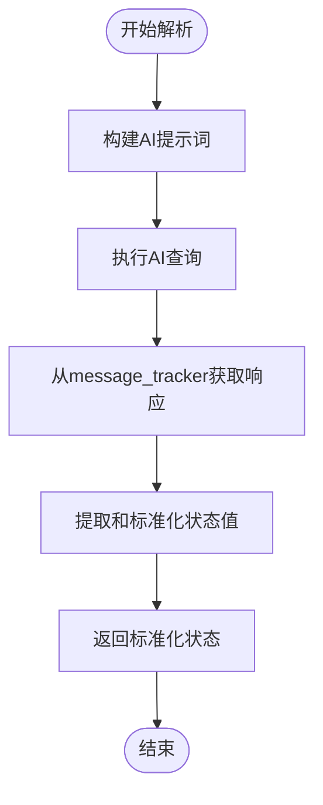
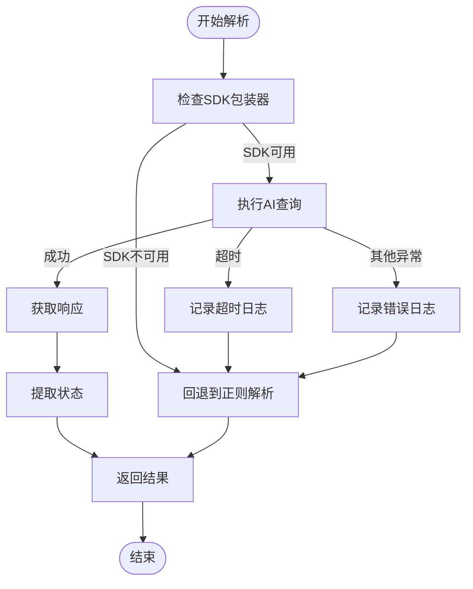

# AI解析

<cite>
**本文档引用的文件**
- [story_parser.py](file://autoBMAD/epic_automation/story_parser.py)
- [sdk_wrapper.py](file://autoBMAD/epic_automation/sdk_wrapper.py)
- [sdk_session_manager.py](file://autoBMAD/epic_automation/sdk_session_manager.py)
- [qa_agent.py](file://autoBMAD/epic_automation/qa_agent.py)
- [epic_driver.py](file://autoBMAD/epic_automation/epic_driver.py)
</cite>

## 目录
1. [简介](#简介)
2. [核心组件](#核心组件)
3. [工作流程](#工作流程)
4. [错误处理机制](#错误处理机制)
5. [提示词模板设计](#提示词模板设计)
6. [使用示例](#使用示例)

## 简介
`SimpleStoryParser`类是系统中用于AI驱动的故事状态解析的核心组件。该类采用AI优先、正则回退的解析策略，通过`SafeClaudeSDK`执行语义理解来提取故事文档中的状态信息。当AI解析不可用或失败时，会自动回退到基于正则表达式的传统解析方法，确保系统的健壮性和可靠性。

**Section sources**
- [story_parser.py](file://autoBMAD/epic_automation/story_parser.py#L1-L100)

## 核心组件

`SimpleStoryParser`类的主要功能是解析故事文档中的状态信息。该类通过`SafeClaudeSDK`与AI模型进行交互，利用语义理解能力从文档中提取标准化的状态值。类中定义了7种标准状态值：`Draft`（草稿）、`Ready for Development`（准备开发）、`In Progress`（进行中）、`Ready for Review`（准备审查）、`Ready for Done`（准备完成）、`Done`（已完成）和`Failed`（失败）。

该类通过`parse_status`方法实现状态解析，该方法首先尝试使用AI进行解析，如果AI解析失败或不可用，则回退到正则表达式解析。解析结果会通过`_normalize_story_status`函数进行标准化，确保返回的状态值符合预定义的标准。

**Section sources**
- [story_parser.py](file://autoBMAD/epic_automation/story_parser.py#L213-L233)
- [story_parser.py](file://autoBMAD/epic_automation/story_parser.py#L59-L77)

## 工作流程

`parse_status`方法的工作流程如下：

1. **构建提示词**：使用`PROMPT_TEMPLATE`模板构建AI查询的提示词。该模板定义了标准状态选项和分析要求，指导AI模型从文档中提取正确的状态值。

2. **执行AI查询**：通过`SafeClaudeSDK`执行AI查询。SDK包装器负责与Claude Agent SDK进行交互，发送查询并接收响应。

3. **获取响应**：从`message_tracker`中获取AI的响应消息。`message_tracker`是SDK包装器的一部分，用于跟踪和管理AI会话中的消息。

4. **提取状态**：通过`_extract_status_from_response`方法从AI响应中提取和标准化状态值。该方法首先清理响应中的各种标记和前缀，然后使用`_normalize_story_status`函数将提取的状态值转换为标准格式。



**Diagram sources**
- [story_parser.py](file://autoBMAD/epic_automation/story_parser.py#L264-L278)
- [sdk_wrapper.py](file://autoBMAD/epic_automation/sdk_wrapper.py#L300-L315)

**Section sources**
- [story_parser.py](file://autoBMAD/epic_automation/story_parser.py#L234-L317)

## 错误处理机制

当AI解析失败时，系统会记录详细的错误日志并回退到正则表达式解析。错误处理机制包括：

- **超时处理**：如果AI解析在30秒内未完成，会抛出`TimeoutError`，系统会记录错误日志并回退到正则解析。
- **异常处理**：对于其他异常情况，系统会记录完整的错误堆栈信息，并回退到正则解析。
- **日志记录**：所有解析过程和错误信息都会被详细记录，便于调试和问题追踪。



**Diagram sources**
- [story_parser.py](file://autoBMAD/epic_automation/story_parser.py#L254-L317)

**Section sources**
- [story_parser.py](file://autoBMAD/epic_automation/story_parser.py#L304-L317)

## 提示词模板设计

`STATUS_PROMPT_TEMPLATE`是用于状态解析的提示词模板，其设计原理如下：

- **明确指令**：模板明确指示AI模型作为"专业的故事状态解析器"，确保AI理解其角色和任务。
- **标准选项**：列出所有可能的标准状态选项，包括英文和中文对照，确保AI理解每个状态的含义。
- **分析要求**：提供详细的分析要求，指导AI如何从文档中提取状态值。
- **输出格式**：明确要求AI只返回标准状态值，不要包含解释或额外信息。

```python
STATUS_PROMPT_TEMPLATE = """
你是一个专业的故事状态解析器。请从以下故事文档中提取标准状态值。

标准状态选项：
- Draft (草稿)
- Ready for Development (准备开发)
- In Progress (进行中)
- Ready for Review (准备审查)
- Ready for Done (准备完成)
- Done (已完成)
- Failed (失败)

分析要求：
1. 仔细阅读整个文档内容
2. 关注 Status 字段或相关描述
3. 根据上下文判断当前真实状态
4. 只返回标准状态值，不要解释

故事文档内容：
{content}

只返回状态值，例如：Ready for Review
"""
```

**Section sources**
- [story_parser.py](file://autoBMAD/epic_automation/story_parser.py#L144-L166)

## 使用示例

`SimpleStoryParser`被多个组件使用，包括QA Agent和Epic Driver。以下是QA Agent中使用该解析器的示例：

```python
# 在QA Agent中初始化状态解析器
self.status_parser = SimpleStoryParser(sdk_wrapper=sdk_instance)

# 解析故事状态
status = await self.status_parser.parse_status(content)
```

当`status_parser`不可用时，系统会自动回退到正则表达式解析，确保功能的连续性。

**Section sources**
- [qa_agent.py](file://autoBMAD/epic_automation/qa_agent.py#L154-L184)
- [epic_driver.py](file://autoBMAD/epic_automation/epic_driver.py#L1400-L1405)