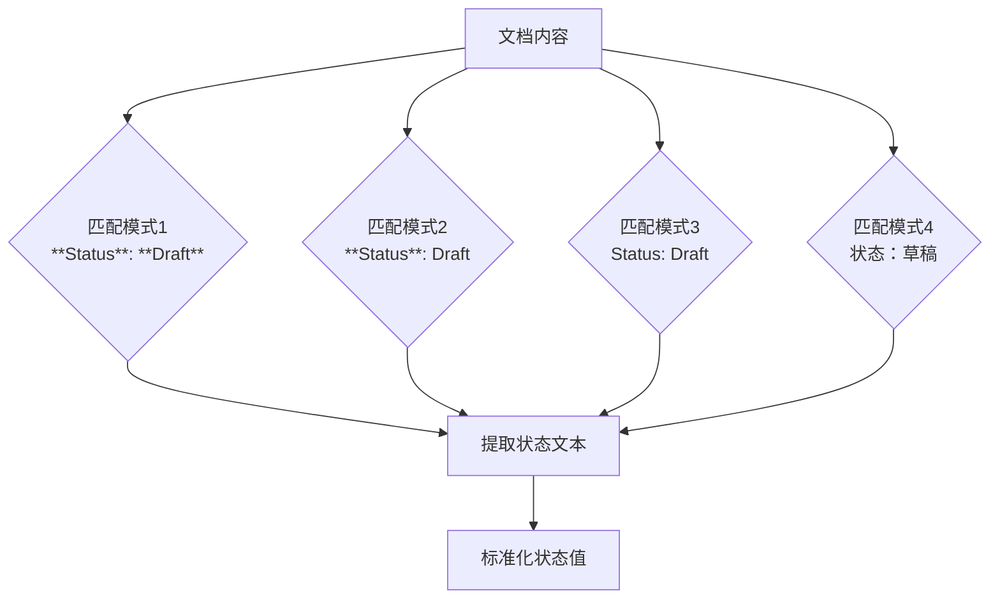
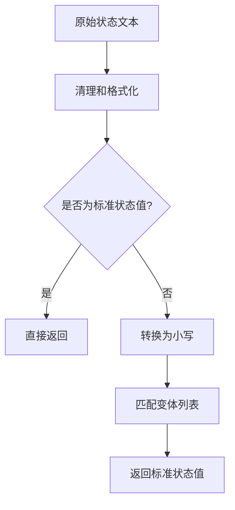

# 正则回退

<cite>
**本文档引用的文件**   
- [story_parser.py](file://autoBMAD/epic_automation/story_parser.py#L318-L361)
- [story_parser.py](file://autoBMAD/epic_automation/story_parser.py#L822-L874)
- [dev_agent.py](file://autoBMAD/epic_automation/dev_agent.py#L844-L848)
- [qa_agent.py](file://autoBMAD/epic_automation/qa_agent.py#L898-L902)
- [STATUS_ANALYSIS_REPORT.md](file://STATUS_ANALYSIS_REPORT.md#L35-L48)
- [状态系统重构实施方案.md](file://状态系统重构实施方案.md#L115-L167)
</cite>

## 目录
1. [正则回退机制概述](#正则回退机制概述)
2. [正则模式匹配](#正则模式匹配)
3. [执行流程与优先级](#执行流程与优先级)
4. [状态标准化](#状态标准化)
5. [默认值设计](#默认值设计)

## 正则回退机制概述

在AI解析不可用或失败时，系统采用正则表达式回退机制来提取故事文档中的状态值。该机制作为AI解析的备用方案，确保在SDK不可用、超时或解析失败的情况下仍能从文档中提取关键状态信息。`_regex_fallback_parse_status`方法是这一机制的核心实现，它通过一系列预定义的正则表达式模式来匹配文档中的状态字段。

该方法的设计遵循奥卡姆剃刀原则，采用最小化修改策略，仅在必要时回退到正则表达式解析，避免了过度工程化。当AI解析失败时，系统会自动切换到这一回退机制，保证了状态解析的可靠性和稳定性。

**Section sources**
- [story_parser.py](file://autoBMAD/epic_automation/story_parser.py#L318-L361)
- [FIX_IMPLEMENTATION_SUMMARY.md](file://FIX_IMPLEMENTATION_SUMMARY.md#L154-L158)

## 正则模式匹配

`_regex_fallback_parse_status`方法支持四种主要的正则表达式模式来匹配状态值，这些模式覆盖了文档中常见的状态表示格式：

1. **`**Status**: **Draft**`** - 匹配双星号包围的Status字段，其中状态值也被双星号包围。这种格式用于强调状态值，使其在文档中更加醒目。
2. **`**Status**: Draft`** - 匹配双星号包围的Status标签，但状态值没有被星号包围。这是最常见的格式，提供了良好的可读性。
3. **`Status: Draft`** - 匹配没有Markdown格式的纯文本状态字段。这种格式简单直接，适用于不需要格式化的场景。
4. **`状态：草稿`** - 匹配中文状态字段，支持国际化需求。这种格式使用中文"状态"作为标签，后面跟着中文状态值。

这些模式通过`re.MULTILINE | re.IGNORECASE`标志进行匹配，确保能够在多行文本中查找，并且不区分大小写，提高了匹配的灵活性和鲁棒性。

**Diagram sources **
- [story_parser.py](file://autoBMAD/epic_automation/story_parser.py#L333-L337)
- [dev_agent.py](file://autoBMAD/epic_automation/dev_agent.py#L844-L848)

**Section sources**
- [story_parser.py](file://autoBMAD/epic_automation/story_parser.py#L333-L337)
- [qa_agent.py](file://autoBMAD/epic_automation/qa_agent.py#L898-L902)

## 执行流程与优先级

正则回退解析的执行流程遵循严格的优先级顺序。系统会按照预定义的顺序依次尝试每个正则表达式模式，一旦某个模式匹配成功，就会立即返回结果，不再尝试后续模式。这种"短路"执行策略确保了最高的匹配效率。

执行流程如下：
1. 首先尝试匹配`**Status**: **Draft**`模式，这是最严格的格式，优先级最高。
2. 如果第一种模式未匹配，则尝试`**Status**: Draft`模式。
3. 如果前两种模式都未匹配，则尝试`Status: Draft`模式。
4. 最后尝试`状态：草稿`模式，以支持中文文档。

这种优先级设计基于格式的明确性和特异性。双星号包围的格式被认为是最明确的状态表示，因此优先级最高；而纯文本格式虽然更通用，但可能与其他文本混淆，因此优先级较低。一旦匹配成功，系统会提取状态文本并进行标准化处理。

**Section sources**
- [story_parser.py](file://autoBMAD/epic_automation/story_parser.py#L341-L343)
- [STATUS_ANALYSIS_REPORT.md](file://STATUS_ANALYSIS_REPORT.md#L35-L48)

## 状态标准化

匹配到状态文本后，系统会调用`_normalize_story_status`函数对提取的状态值进行标准化处理。这个函数负责将各种格式和变体的状态值转换为标准的核心状态值。

标准化过程包括以下步骤：
1. 首先对输入状态值进行清理和格式化，去除多余的空格和Markdown标记。
2. 检查清理后的状态值是否已经是标准核心状态值之一，如果是则直接返回。
3. 如果不是标准值，则将其转换为小写形式，并与预定义的变体列表进行匹配。
4. 根据匹配结果返回对应的标准核心状态值。

该函数支持多种语言和格式的变体，例如"草稿"、"draft"、"Draft"等都会被标准化为"Draft"。这种设计确保了系统能够处理各种可能的输入格式，提高了鲁棒性。

**Diagram sources **
- [状态系统重构实施方案.md](file://状态系统重构实施方案.md#L115-L167)
- [story_parser.py](file://autoBMAD/epic_automation/story_parser.py#L822-L874)

**Section sources**
- [状态系统重构实施方案.md](file://状态系统重构实施方案.md#L115-L167)
- [story_parser.py](file://autoBMAD/epic_automation/story_parser.py#L822-L874)

## 默认值设计

当所有正则表达式模式均无法匹配到状态值时，系统会返回默认值"Draft"。这一设计考虑了以下几个因素：

1. **安全性**：在无法确定状态的情况下，将文档视为"草稿"状态是最安全的选择。这确保了未完成的文档不会被误认为已完成。
2. **工作流连续性**：大多数工作流都从"草稿"状态开始，因此将其作为默认值符合正常的开发流程。
3. **错误恢复**：即使状态解析失败，系统仍能继续处理文档，避免了因单个错误导致整个流程中断。

返回默认值前，系统会记录相应的日志信息，便于后续的调试和问题追踪。这种设计体现了系统的容错性和健壮性，确保在异常情况下仍能保持基本功能的可用性。

**Section sources**
- [story_parser.py](file://autoBMAD/epic_automation/story_parser.py#L359-L361)
- [dev_agent.py](file://autoBMAD/epic_automation/dev_agent.py#L868-L870)