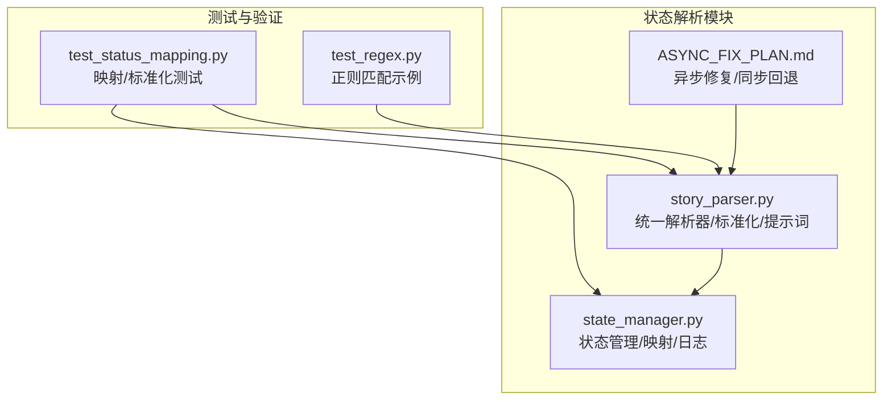
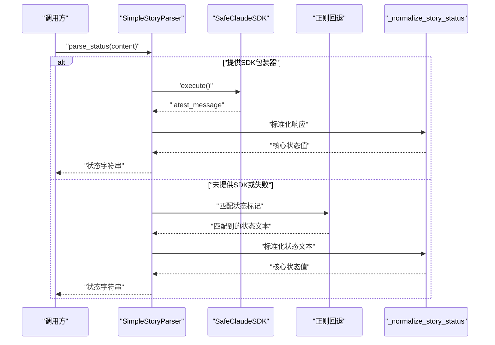
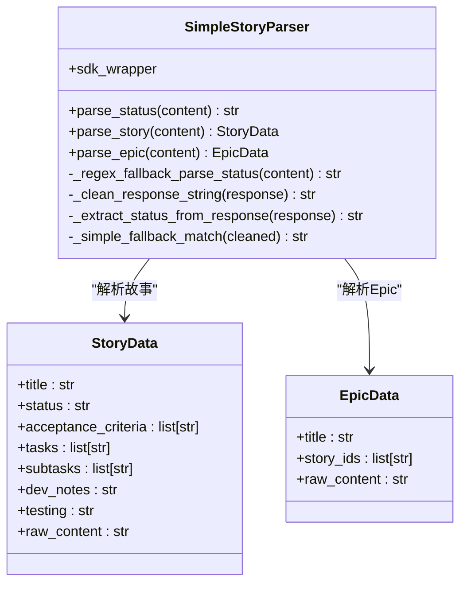
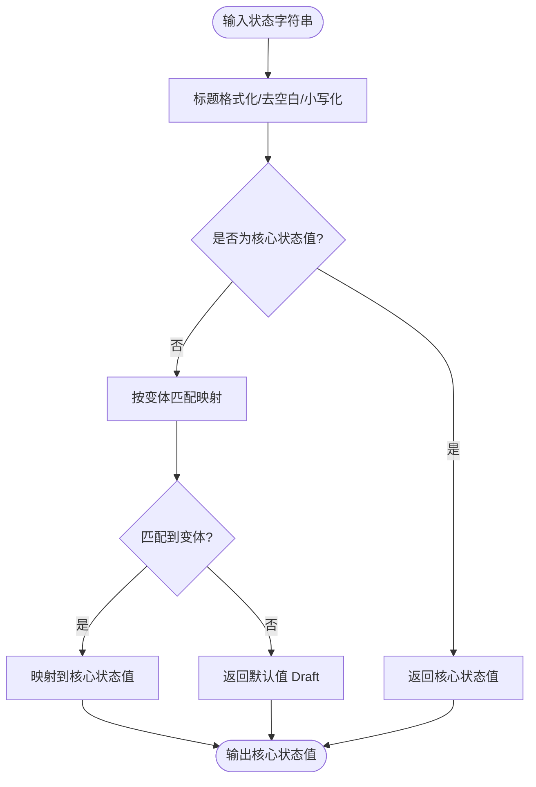
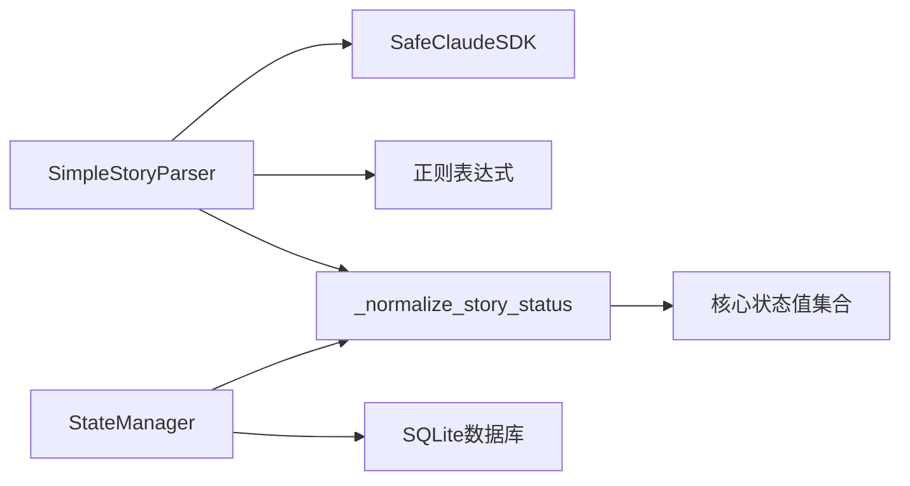

# 状态解析

<cite>
**本文引用的文件**
- [story_parser.py](file://autoBMAD/epic_automation/story_parser.py)
- [state_manager.py](file://autoBMAD/epic_automation/state_manager.py)
- [ASYNC_FIX_PLAN.md](file://ASYNC_FIX_PLAN.md)
- [test_status_mapping.py](file://test_status_mapping.py)
- [test_regex.py](file://test_regex.py)
</cite>

## 目录
1. [简介](#简介)
2. [项目结构](#项目结构)
3. [核心组件](#核心组件)
4. [架构总览](#架构总览)
5. [详细组件分析](#详细组件分析)
6. [依赖关系分析](#依赖关系分析)
7. [性能考量](#性能考量)
8. [故障排查指南](#故障排查指南)
9. [结论](#结论)
10. [附录](#附录)

## 简介
本文件聚焦“故事状态解析”的实现与策略，围绕统一的状态解析器与双层解析策略（AI优先、正则回退）展开，详细说明如何从故事文件中提取状态值，如何识别多种格式的状态标记，以及核心状态值到处理状态值的转换逻辑。同时给出错误处理与日志记录策略，帮助读者在不同环境下正确使用与扩展状态解析能力。

## 项目结构
状态解析相关的关键文件位于 autoBMAD/epic_automation 目录下，核心包括：
- story_parser.py：统一的状态解析器、状态标准化函数、提示词模板与回退策略
- state_manager.py：状态管理与数据库交互，包含状态映射与日志记录
- ASYNC_FIX_PLAN.md：异步上下文与SDK调用相关的修复方案，涉及状态解析的同步回退实现
- test_status_mapping.py：状态映射与标准化的测试脚本
- test_regex.py：正则表达式匹配的示例脚本

图表来源
- [story_parser.py](file://autoBMAD/epic_automation/story_parser.py#L1-L120)
- [state_manager.py](file://autoBMAD/epic_automation/state_manager.py#L620-L760)
- [ASYNC_FIX_PLAN.md](file://ASYNC_FIX_PLAN.md#L211-L252)
- [test_status_mapping.py](file://test_status_mapping.py#L1-L60)
- [test_regex.py](file://test_regex.py#L1-L26)

章节来源
- [story_parser.py](file://autoBMAD/epic_automation/story_parser.py#L1-L120)
- [state_manager.py](file://autoBMAD/epic_automation/state_manager.py#L620-L760)
- [ASYNC_FIX_PLAN.md](file://ASYNC_FIX_PLAN.md#L211-L252)
- [test_status_mapping.py](file://test_status_mapping.py#L1-L60)
- [test_regex.py](file://test_regex.py#L1-L26)

## 核心组件
- 统一解析器 SimpleStoryParser：提供 parse_status、parse_story、parse_epic 等方法，采用“AI优先、正则回退”策略
- 状态标准化函数 _normalize_story_status：将输入状态标准化为核心状态值集合
- 核心状态值与处理状态值映射：定义标准状态集合与核心状态到处理状态的单向映射
- 向后兼容别名 StatusParser/SimpleStatusParser：保持接口一致性
- 同步回退实现（来自异步修复方案）：在异步上下文冲突时，提供同步状态解析的回退路径

章节来源
- [story_parser.py](file://autoBMAD/epic_automation/story_parser.py#L57-L124)
- [story_parser.py](file://autoBMAD/epic_automation/story_parser.py#L213-L362)
- [story_parser.py](file://autoBMAD/epic_automation/story_parser.py#L822-L875)
- [ASYNC_FIX_PLAN.md](file://ASYNC_FIX_PLAN.md#L211-L252)

## 架构总览
状态解析的整体流程如下：
- 输入：故事文件内容
- 优先：使用 AI（SafeClaudeSDK）解析状态
- 失败或不可用：使用正则表达式回退解析
- 标准化：将解析结果标准化为核心状态值
- 映射：核心状态值映射为处理状态值（用于数据库/内部状态）
- 输出：标准状态字符串

图表来源
- [story_parser.py](file://autoBMAD/epic_automation/story_parser.py#L234-L362)
- [story_parser.py](file://autoBMAD/epic_automation/story_parser.py#L424-L484)
- [story_parser.py](file://autoBMAD/epic_automation/story_parser.py#L822-L875)

## 详细组件分析

### 组件A：统一解析器 SimpleStoryParser
- 职责
  - parse_status：AI优先解析状态，失败回退正则
  - parse_story/parse_epic：解析完整故事/Epic文档（同策略）
- AI解析流程
  - 构造提示词模板，调用 SDK.execute()
  - 从 message_tracker.latest_message 获取响应
  - _clean_response_string 清理响应，_extract_status_from_response 标准化并校验
- 正则回退流程
  - 匹配多种状态标记格式（含中文“状态”）
  - 调用 _normalize_story_status 标准化
  - 默认返回 Draft
- 错误处理与日志
  - SDK超时、异常、空响应均回退正则
  - 记录解析摘要、清理过程、匹配细节与默认值选择

图表来源
- [story_parser.py](file://autoBMAD/epic_automation/story_parser.py#L213-L362)
- [story_parser.py](file://autoBMAD/epic_automation/story_parser.py#L363-L525)
- [story_parser.py](file://autoBMAD/epic_automation/story_parser.py#L526-L765)

章节来源
- [story_parser.py](file://autoBMAD/epic_automation/story_parser.py#L213-L362)
- [story_parser.py](file://autoBMAD/epic_automation/story_parser.py#L363-L525)
- [story_parser.py](file://autoBMAD/epic_automation/story_parser.py#L526-L765)

### 组件B：状态标准化与映射
- 核心状态值集合（7种标准状态）
  - Draft、Ready for Development、In Progress、Ready for Review、Ready for Done、Done、Failed
- 核心状态值 → 处理状态值映射（单向）
  - Draft/Ready for Development → pending
  - In Progress → in_progress
  - Ready for Review/Ready for Done → review
  - Done → completed
  - Failed → failed
- 标准化函数 _normalize_story_status
  - 输入先做标题格式化与小写匹配
  - 支持多种变体（如“ready for development”、“in progress”、“done”等）
  - 默认返回 Draft

图表来源
- [story_parser.py](file://autoBMAD/epic_automation/story_parser.py#L57-L124)
- [story_parser.py](file://autoBMAD/epic_automation/story_parser.py#L822-L875)

章节来源
- [story_parser.py](file://autoBMAD/epic_automation/story_parser.py#L57-L124)
- [story_parser.py](file://autoBMAD/epic_automation/story_parser.py#L822-L875)

### 组件C：正则回退策略与状态标记识别
- 支持的常见状态标记格式
  - **Status**: **Draft**
  - **Status**: Ready for Review
  - Status: Done
  - 状态：草稿（中文）
- 匹配顺序与优先级
  - 优先匹配粗体嵌套格式（更明确）
  - 其次匹配普通格式
  - 最后考虑中文“状态”
- 标准化后再校验是否在核心状态值集合内

章节来源
- [story_parser.py](file://autoBMAD/epic_automation/story_parser.py#L318-L362)
- [story_parser.py](file://autoBMAD/epic_automation/story_parser.py#L604-L667)

### 组件D：同步回退实现（异步修复方案）
- 在异步上下文冲突或SDK初始化失败时，提供同步状态解析
- 通过正则表达式快速解析状态，避免跨任务取消范围错误
- 与标准化函数配合，保证结果一致性

章节来源
- [ASYNC_FIX_PLAN.md](file://ASYNC_FIX_PLAN.md#L211-L252)

### 组件E：状态映射到Markdown（状态管理器）
- 数据库状态到Markdown状态的单向映射
  - pending/in_progress/review/completed/failed/cancelled/error → Draft/In Progress/Ready for Review/Done/Failed
  - QA状态映射：qa_pass/qa_concerns/qa_fail/qa_waived → Done/Ready for Review/Failed/Done
- 更新Markdown文件中的Status字段，支持多种格式（含中文“状态”）

章节来源
- [state_manager.py](file://autoBMAD/epic_automation/state_manager.py#L677-L795)

## 依赖关系分析
- SimpleStoryParser 依赖 SafeClaudeSDK（可选）与正则表达式
- _normalize_story_status 依赖核心状态值集合与映射
- StateManager 依赖数据库连接与状态映射，负责持久化与文件更新
- 异步修复方案提供同步回退，降低SDK调用带来的取消范围错误风险

图表来源
- [story_parser.py](file://autoBMAD/epic_automation/story_parser.py#L213-L362)
- [story_parser.py](file://autoBMAD/epic_automation/story_parser.py#L822-L875)
- [state_manager.py](file://autoBMAD/epic_automation/state_manager.py#L620-L760)

章节来源
- [story_parser.py](file://autoBMAD/epic_automation/story_parser.py#L213-L362)
- [story_parser.py](file://autoBMAD/epic_automation/story_parser.py#L822-L875)
- [state_manager.py](file://autoBMAD/epic_automation/state_manager.py#L620-L760)

## 性能考量
- AI解析成本较高，建议在SDK可用时优先使用；当SDK不可用或不稳定时启用正则回退
- 正则匹配顺序与模式数量直接影响解析速度，建议保持模式简洁、命中率高
- 标准化函数为O(1)映射，开销极低
- 状态管理器的数据库操作采用连接池与锁保护，注意批量更新时的事务与索引使用

## 故障排查指南
- SDK不可用或初始化失败
  - 现象：AI解析直接回退正则，日志出现“未提供SDK包装器”警告
  - 处理：检查SDK初始化参数与环境变量；必要时使用同步回退
- AI解析超时或异常
  - 现象：日志记录超时/异常，随后回退正则
  - 处理：增加超时阈值或重试；检查网络与模型服务
- 状态标准化失败
  - 现象：标准化后不在核心状态值集合，返回默认值
  - 处理：确认输入格式是否符合预期；扩展变体匹配
- 正则匹配不到状态
  - 现象：默认返回 Draft
  - 处理：检查文档格式是否包含“Status”或“状态”字段；调整匹配模式
- Markdown状态更新失败
  - 现象：文件不存在或写入失败
  - 处理：确认文件路径与权限；查看状态映射是否覆盖目标状态

章节来源
- [story_parser.py](file://autoBMAD/epic_automation/story_parser.py#L234-L362)
- [story_parser.py](file://autoBMAD/epic_automation/story_parser.py#L363-L525)
- [state_manager.py](file://autoBMAD/epic_automation/state_manager.py#L677-L795)
- [ASYNC_FIX_PLAN.md](file://ASYNC_FIX_PLAN.md#L211-L252)

## 结论
本状态解析体系通过“AI优先、正则回退”的双层策略，结合严格的标准化与映射机制，实现了对多种格式状态标记的稳健解析。在SDK不可用或异步上下文冲突时，同步回退保障了解析的连续性。配合状态管理器的状态映射与日志记录，整体流程具备良好的可维护性与可观测性。

## 附录
- 测试参考
  - 状态映射与标准化测试：[test_status_mapping.py](file://test_status_mapping.py#L1-L60)
  - 正则匹配示例：[test_regex.py](file://test_regex.py#L1-L26)