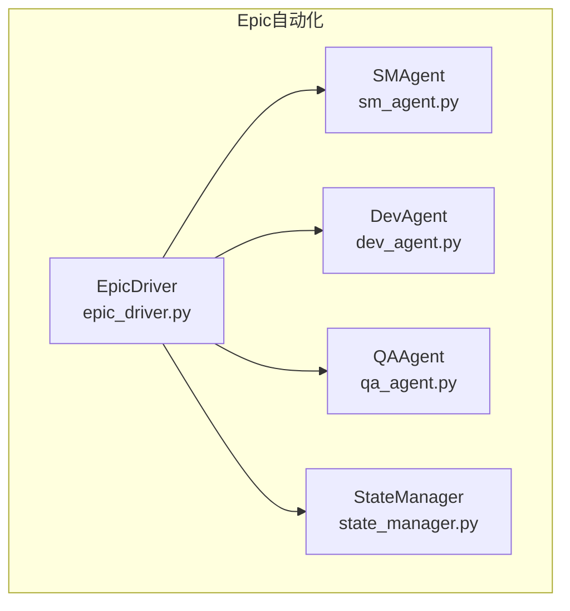
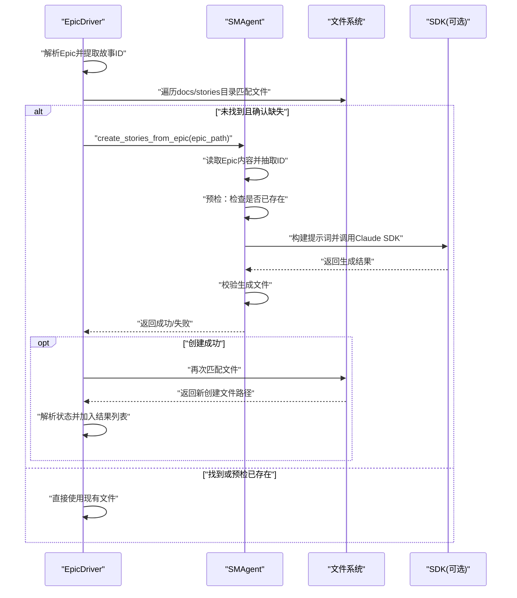
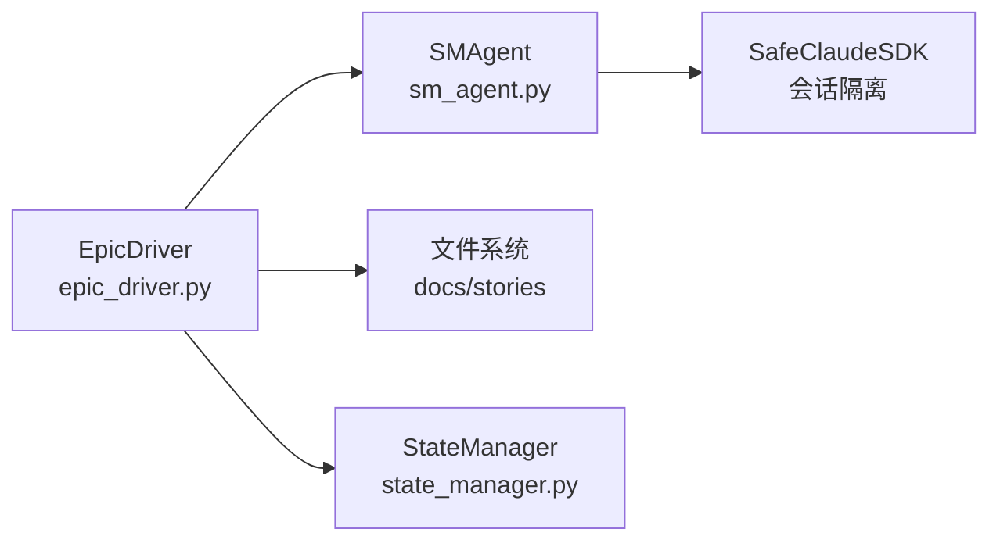

# 缺失文件处理

<cite>
**本文引用的文件**
- [epic_driver.py](file://autoBMAD/epic_automation/epic_driver.py)
- [sm_agent.py](file://autoBMAD/epic_automation/sm_agent.py)
- [test_sm_agent.py](file://tests-copy/unit/test_sm_agent.py)
- [test_epic_driver.py](file://tests-copy/unit/test_epic_driver.py)
- [README.md](file://autoBMAD/epic_automation/README.md)
</cite>

## 目录
1. [简介](#简介)
2. [项目结构](#项目结构)
3. [核心组件](#核心组件)
4. [架构总览](#架构总览)
5. [详细组件分析](#详细组件分析)
6. [依赖关系分析](#依赖关系分析)
7. [性能考量](#性能考量)
8. [故障排查指南](#故障排查指南)
9. [结论](#结论)

## 简介
本文件聚焦“缺失故事文件”的自动化处理机制，围绕以下目标展开：
- 当_epic_driver_在解析Epic文档时未能找到对应故事文件，如何通过_SMAgent_自动创建缺失的故事文件；
- epic_driver如何调用sm_agent.create_stories_from_epic方法，基于原始Epic文档自动生成缺失的故事文件；
- 该机制如何防止因文件缺失导致的工作流中断，并说明创建成功后重新进行文件匹配的闭环流程；
- 错误处理策略，包括SM Agent调用失败或文件创建后仍无法匹配的情况。

## 项目结构
与缺失文件处理直接相关的模块位于autoBMAD/epic_automation包内：
- epic_driver.py：Epic驱动器，负责解析Epic并驱动SM-Dev-QA循环；包含文件匹配与缺失文件自动创建逻辑；
- sm_agent.py：SMAgent，负责从Epic生成故事文件、校验生成结果、更新状态；
- tests-copy/unit/test_sm_agent.py与tests-copy/unit/test_epic_driver.py：覆盖上述两个模块的关键行为与边界场景。

图表来源
- [epic_driver.py](file://autoBMAD/epic_automation/epic_driver.py#L535-L700)
- [sm_agent.py](file://autoBMAD/epic_automation/sm_agent.py#L1-L120)

章节来源
- [epic_driver.py](file://autoBMAD/epic_automation/epic_driver.py#L535-L700)
- [sm_agent.py](file://autoBMAD/epic_automation/sm_agent.py#L1-L120)

## 核心组件
- EpicDriver.parse_epic：解析Epic文档，提取故事ID并尝试匹配现有故事文件；若未找到且确认确实缺失，则调用SMAgent创建缺失文件，再重新匹配。
- SMAgent.create_stories_from_epic：从Epic中抽取故事ID，构建提示词并调用Claude SDK批量生成故事文件；随后校验生成结果并更新状态。
- SMAgent._find_story_file：辅助查找故事文件（简化命名规则），用于生成后的二次匹配。
- SMAgent._verify_story_files：校验生成文件是否存在、内容长度与关键段落是否齐全。
- SMAgent._update_story_statuses：将生成文件的状态从Draft更新为Ready for Development。

章节来源
- [epic_driver.py](file://autoBMAD/epic_automation/epic_driver.py#L790-L866)
- [sm_agent.py](file://autoBMAD/epic_automation/sm_agent.py#L264-L326)
- [sm_agent.py](file://autoBMAD/epic_automation/sm_agent.py#L526-L760)

## 架构总览
缺失文件处理的端到端流程如下：

图表来源
- [epic_driver.py](file://autoBMAD/epic_automation/epic_driver.py#L790-L866)
- [sm_agent.py](file://autoBMAD/epic_automation/sm_agent.py#L264-L326)
- [sm_agent.py](file://autoBMAD/epic_automation/sm_agent.py#L526-L760)

## 详细组件分析

### 文件匹配与回退策略（_find_story_file_with_fallback）
- 匹配优先级与模式：
  1) 精确匹配：story_number.md；
  2) 描述性匹配：story-{story_number}-*.md 或 {story_number}-*.md；
  3) 替代格式：story-{story_number}.*.md 或 {story_number}.*.md；
  4) 模糊匹配：当story_number为简单数字时，按前缀与点/连字符前缀匹配，优先带epic前缀的文件，其次再按简单前缀匹配。
- epic_prefix参数的作用：在模糊匹配中，若存在epic前缀，优先选择与epic前缀一致的文件，提升匹配准确性。
- 返回值：匹配到的文件路径或None。

章节来源
- [epic_driver.py](file://autoBMAD/epic_automation/epic_driver.py#L1020-L1112)

### 缺失文件自动创建与闭环匹配（epic_driver.parse_epic）
- 流程要点：
  - 遍历每个故事ID，先尝试精确/描述性/替代/模糊匹配；
  - 若未找到且确认该ID在现有文件集合中不存在，则调用SMAgent.create_stories_from_epic；
  - 创建成功后，再次使用_fallback_匹配逻辑寻找新创建的文件；
  - 解析状态并加入最终结果列表；若创建失败或创建后仍无法匹配，记录告警并继续处理其他故事。
- 关键日志与容错：
  - 创建成功：记录创建的文件路径与状态；
  - 创建失败：记录错误并给出后续查找建议；
  - 创建后仍无法匹配：记录错误并继续流程，避免阻断整体工作流。

章节来源
- [epic_driver.py](file://autoBMAD/epic_automation/epic_driver.py#L790-L866)

### SMAgent.create_stories_from_epic（SM Agent调用）
- 主要步骤：
  - 读取Epic内容并抽取故事ID；
  - 预检：检查所有目标文件是否已存在，若全部存在则跳过创建；
  - 构建提示词并调用Claude SDK（通过会话隔离与日志封装）；
  - 校验生成文件：检查文件存在、内容长度、关键段落完整性；
  - 成功后更新状态：将Draft更新为Ready for Development。
- SDK可用性与错误处理：
  - 若SDK不可用，返回False；
  - SDK调用异常或超时均视为失败；
  - 校验失败时返回False并记录失败ID列表。

章节来源
- [sm_agent.py](file://autoBMAD/epic_automation/sm_agent.py#L264-L326)
- [sm_agent.py](file://autoBMAD/epic_automation/sm_agent.py#L367-L425)
- [sm_agent.py](file://autoBMAD/epic_automation/sm_agent.py#L426-L525)
- [sm_agent.py](file://autoBMAD/epic_automation/sm_agent.py#L526-L760)

### 自动创建与重新匹配的闭环
- 创建成功后，epic_driver会再次调用_fallback_匹配逻辑，确保新文件能被识别并纳入后续处理；
- 若创建后仍无法匹配，epic_driver会记录错误并继续处理其他故事，保证工作流不被单个故事阻断；
- 该闭环设计使得“文件缺失”不再成为工作流的致命缺陷。

章节来源
- [epic_driver.py](file://autoBMAD/epic_automation/epic_driver.py#L790-L866)

### 错误处理策略
- SM Agent调用失败：
  - 记录失败原因并返回False；
  - epic_driver收到False后，记录错误并继续处理其他故事。
- 文件创建后仍无法匹配：
  - 记录“创建后未匹配”的错误日志；
  - 继续处理其他故事，避免阻断整体流程。
- 预检已存在：
  - 若所有目标文件均已存在，跳过创建，减少不必要的SDK调用与IO开销。

章节来源
- [epic_driver.py](file://autoBMAD/epic_automation/epic_driver.py#L790-L866)
- [sm_agent.py](file://autoBMAD/epic_automation/sm_agent.py#L290-L326)

### 行为验证（单元测试）
- 测试覆盖：
  - SMAgent.create_stories_from_epic：验证从Epic批量创建故事的行为；
  - SMAgent._verify_story_files：验证生成文件的存在性与完整性；
  - SMAgent._update_story_statuses：验证状态更新逻辑；
  - EpicDriver._find_story_file_with_fallback：验证多模式匹配与epic_prefix优先级；
  - EpicDriver.handle_error与重试逻辑：验证错误记录与重试行为。
- 测试文件路径参考：
  - [test_sm_agent.py](file://tests-copy/unit/test_sm_agent.py#L310-L424)
  - [test_epic_driver.py](file://tests-copy/unit/test_epic_driver.py#L213-L248)

章节来源
- [test_sm_agent.py](file://tests-copy/unit/test_sm_agent.py#L310-L424)
- [test_epic_driver.py](file://tests-copy/unit/test_epic_driver.py#L213-L248)

## 依赖关系分析
- EpicDriver依赖SMAgent进行故事文件的生成与校验；
- SMAgent依赖SDK会话管理器与日志封装，确保SDK调用的隔离与可观测性；
- EpicDriver在匹配阶段依赖_fallback_匹配逻辑，兼顾多种命名约定；
- 测试用例覆盖了关键路径与边界条件，保障缺失文件处理的稳定性。

图表来源
- [epic_driver.py](file://autoBMAD/epic_automation/epic_driver.py#L535-L700)
- [sm_agent.py](file://autoBMAD/epic_automation/sm_agent.py#L426-L525)

章节来源
- [epic_driver.py](file://autoBMAD/epic_automation/epic_driver.py#L535-L700)
- [sm_agent.py](file://autoBMAD/epic_automation/sm_agent.py#L426-L525)

## 性能考量
- 预检存在性：在匹配前收集现有文件集合，避免重复扫描；
- SDK调用隔离：通过会话管理器隔离SDK调用，降低取消传播风险；
- 匹配顺序优化：优先精确/描述性/替代匹配，最后模糊匹配，减少全局扫描；
- 日志与可观测性：在关键节点记录耗时与状态，便于定位瓶颈。

[本节为通用指导，无需列出具体文件来源]

## 故障排查指南
- 症状：工作流在某个故事处停滞或报错，提示“未找到故事文件”
  - 排查步骤：
    - 检查docs/stories目录是否存在，文件命名是否符合期望；
    - 使用_fallback_匹配逻辑的模式核对文件命名；
    - 查看epic_driver日志中“创建失败/创建后未匹配”的记录；
    - 确认SDK可用性与网络状况。
- 症状：SM Agent调用失败
  - 排查步骤：
    - 检查claude-agent-sdk安装与可用性；
    - 查看SDK调用异常日志；
    - 确认提示词构建与目标路径是否正确。
- 症状：创建成功但状态未更新
  - 排查步骤：
    - 检查SMAgent._verify_story_files是否通过；
    - 确认状态更新正则表达式是否匹配目标文件格式。

章节来源
- [epic_driver.py](file://autoBMAD/epic_automation/epic_driver.py#L790-L866)
- [sm_agent.py](file://autoBMAD/epic_automation/sm_agent.py#L526-L760)

## 结论
通过“匹配-创建-再匹配”的闭环机制，系统能够在Epic文档中声明但本地缺失故事文件的情况下，自动完成文件生成与状态更新，从而避免工作流被单个文件缺失阻断。SMAgent负责高质量的内容生成与校验，epic_driver负责稳健的匹配与容错处理，二者配合实现了高鲁棒性的自动化流程。测试用例进一步验证了关键路径的正确性与边界行为的可控性。