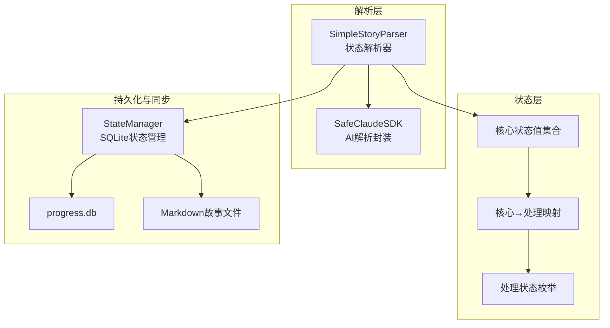
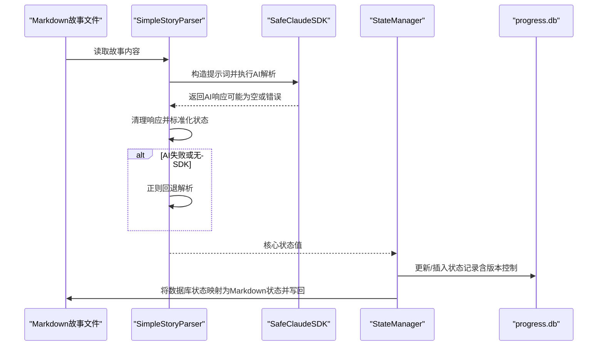
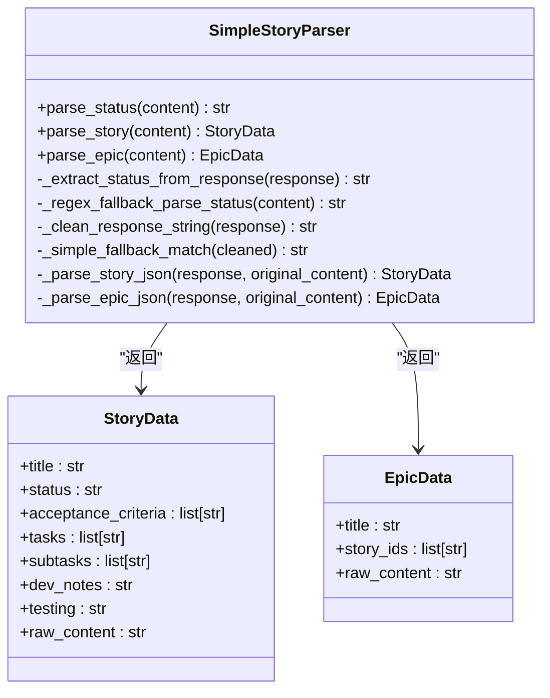
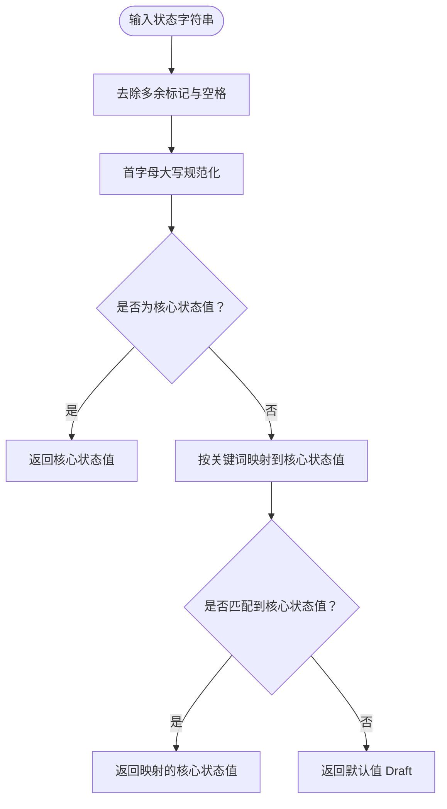
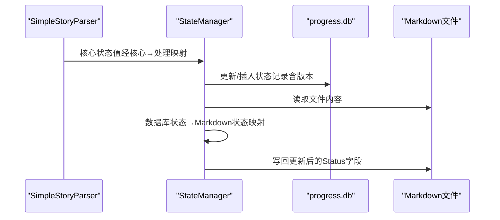
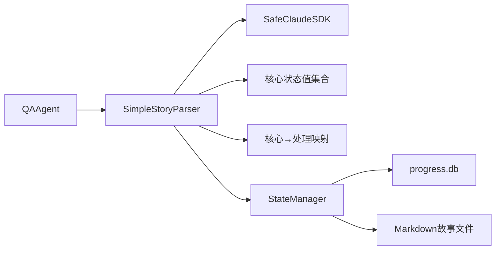

# 故事状态解析

<cite>
**本文引用的文件**
- [autoBMAD/epic_automation/story_parser.py](file://autoBMAD/epic_automation/story_parser.py)
- [autoBMAD/epic_automation/state_manager.py](file://autoBMAD/epic_automation/state_manager.py)
- [autoBMAD/epic_automation/qa_agent.py](file://autoBMAD/epic_automation/qa_agent.py)
- [test_status_mapping.py](file://test_status_mapping.py)
- [test_cached_status_fix.py](file://test_cached_status_fix.py)
- [docs/stories/1.1.md](file://docs/stories/1.1.md)
- [docs/stories/1.2.md](file://docs/stories/1.2.md)
</cite>

## 目录
1. [简介](#简介)
2. [项目结构](#项目结构)
3. [核心组件](#核心组件)
4. [架构总览](#架构总览)
5. [详细组件分析](#详细组件分析)
6. [依赖关系分析](#依赖关系分析)
7. [性能考量](#性能考量)
8. [故障排查指南](#故障排查指南)
9. [结论](#结论)
10. [附录](#附录)

## 简介
本文件聚焦“故事状态解析”机制，系统性说明从Markdown故事文件中提取与解析状态信息的全流程。重点涵盖：
- StatusParser（即 SimpleStoryParser）如何利用 SafeClaudeSDK 进行AI语义解析，并在失败时回退到正则表达式解析。
- 状态值标准化流程，将多样化输入统一为标准核心状态值。
- 核心状态值到处理状态值的映射规则，以及与 StateManager 的协同工作机制（包括数据库状态与Markdown状态之间的双向映射）。
- 回退机制与缓存策略说明（含解析失败时的默认状态处理）。

## 项目结构
围绕故事状态解析的关键文件与职责如下：
- autoBMAD/epic_automation/story_parser.py：统一的状态解析器、核心状态值常量、标准化函数、AI提示词模板、回退解析策略。
- autoBMAD/epic_automation/state_manager.py：状态持久化与同步，负责将数据库中的处理状态映射为Markdown状态并写回文件。
- autoBMAD/epic_automation/qa_agent.py：在QA流程中使用状态解析器，构建SafeClaudeSDK实例以支持AI解析。
- test_status_mapping.py：验证状态标准化与映射逻辑的测试脚本。
- test_cached_status_fix.py：验证移除缓存机制后的状态解析行为（无缓存）。
- docs/stories/1.1.md、docs/stories/1.2.md：示例故事文件，展示Markdown中Status字段的常见格式。

图表来源
- [autoBMAD/epic_automation/story_parser.py](file://autoBMAD/epic_automation/story_parser.py#L57-L111)
- [autoBMAD/epic_automation/state_manager.py](file://autoBMAD/epic_automation/state_manager.py#L627-L796)

章节来源
- [autoBMAD/epic_automation/story_parser.py](file://autoBMAD/epic_automation/story_parser.py#L57-L111)
- [autoBMAD/epic_automation/state_manager.py](file://autoBMAD/epic_automation/state_manager.py#L627-L796)

## 核心组件
- SimpleStoryParser（StatusParser别名）：统一入口，提供 parse_status、parse_story、parse_epic；AI优先、正则回退；包含状态标准化与清理逻辑。
- 核心状态值与处理状态：定义了7种核心状态值与统一的处理状态枚举，并提供核心→处理映射。
- StateManager：负责状态持久化、并发控制、数据库迁移、备份与清理，以及将数据库状态同步回Markdown文件。
- QA Agent：在QA流程中使用状态解析器，构建SafeClaudeSDK以启用AI解析能力。

章节来源
- [autoBMAD/epic_automation/story_parser.py](file://autoBMAD/epic_automation/story_parser.py#L80-L111)
- [autoBMAD/epic_automation/state_manager.py](file://autoBMAD/epic_automation/state_manager.py#L97-L179)
- [autoBMAD/epic_automation/qa_agent.py](file://autoBMAD/epic_automation/qa_agent.py#L128-L158)

## 架构总览
下图展示了从Markdown文件到数据库再到Markdown文件的完整状态流转：

图表来源
- [autoBMAD/epic_automation/story_parser.py](file://autoBMAD/epic_automation/story_parser.py#L234-L317)
- [autoBMAD/epic_automation/state_manager.py](file://autoBMAD/epic_automation/state_manager.py#L203-L349)
- [autoBMAD/epic_automation/state_manager.py](file://autoBMAD/epic_automation/state_manager.py#L627-L796)

## 详细组件分析

### SimpleStoryParser（状态解析器）
- 设计原则：AI优先、正则回退、向后兼容。
- 主要职责：
  - parse_status：从Markdown中提取状态，优先使用SafeClaudeSDK进行语义解析，失败时回退到正则表达式。
  - _extract_status_from_response：从AI响应中清理并标准化状态值。
  - _regex_fallback_parse_status：正则回退解析，支持多种Markdown格式的Status字段。
  - _normalize_story_status：将输入标准化为核心状态值集合中的标准值。
  - parse_story/parse_epic：结构化解析故事与Epic文档（AI优先，正则回退）。

图表来源
- [autoBMAD/epic_automation/story_parser.py](file://autoBMAD/epic_automation/story_parser.py#L213-L765)

章节来源
- [autoBMAD/epic_automation/story_parser.py](file://autoBMAD/epic_automation/story_parser.py#L213-L765)

### 状态标准化与映射
- 核心状态值集合：Draft、Ready for Development、In Progress、Ready for Review、Ready for Done、Done、Failed。
- 处理状态枚举：pending、in_progress、review、completed、failed、cancelled、qa_pass、qa_concerns、qa_fail、qa_waived、error、unknown。
- 核心→处理映射（单向）：Draft/Ready for Development → pending；In Progress → in_progress；Ready for Review/Ready for Done → review；Done → completed；Failed → failed。
- 标准化规则：将输入规范化为首字母大写，再按关键词映射，否则返回Draft。

图表来源
- [autoBMAD/epic_automation/story_parser.py](file://autoBMAD/epic_automation/story_parser.py#L822-L875)
- [autoBMAD/epic_automation/story_parser.py](file://autoBMAD/epic_automation/story_parser.py#L101-L111)

章节来源
- [autoBMAD/epic_automation/story_parser.py](file://autoBMAD/epic_automation/story_parser.py#L57-L111)
- [autoBMAD/epic_automation/story_parser.py](file://autoBMAD/epic_automation/story_parser.py#L822-L875)

### 回退机制与缓存策略
- 回退机制：
  - AI解析失败或SDK不可用时，自动回退到正则表达式解析。
  - 正则回退解析支持多种Markdown格式的Status字段，若仍无法匹配，则返回默认状态Draft。
- 缓存策略：
  - 已移除cached_status机制，状态解析不再缓存，确保每次读取最新文件内容。
  - 测试脚本验证了无缓存场景下的状态解析行为与取消处理。

章节来源
- [autoBMAD/epic_automation/story_parser.py](file://autoBMAD/epic_automation/story_parser.py#L234-L317)
- [autoBMAD/epic_automation/story_parser.py](file://autoBMAD/epic_automation/story_parser.py#L318-L395)
- [test_cached_status_fix.py](file://test_cached_status_fix.py#L1-L220)

### 与StateManager的协同工作机制
- 数据库状态写入：
  - StateManager.update_story_status 接收处理状态字符串，使用锁与连接池保证并发安全，执行乐观锁版本控制，最终写入数据库。
- Markdown状态同步：
  - StateManager.sync_story_statuses_to_markdown 遍历数据库记录，将数据库状态映射为Markdown状态并写回对应故事文件。
  - 数据库状态→Markdown状态映射（单向）：pending/in_progress/review/completed/failed/cancelled → Draft/In Progress/Ready for Review/Done/Failed/Draft；qa_pass/qa_concerns/qa_fail/qa_waived/error → Done/Ready for Review/Failed/Done/Failed。

图表来源
- [autoBMAD/epic_automation/state_manager.py](file://autoBMAD/epic_automation/state_manager.py#L203-L349)
- [autoBMAD/epic_automation/state_manager.py](file://autoBMAD/epic_automation/state_manager.py#L627-L796)

章节来源
- [autoBMAD/epic_automation/state_manager.py](file://autoBMAD/epic_automation/state_manager.py#L203-L349)
- [autoBMAD/epic_automation/state_manager.py](file://autoBMAD/epic_automation/state_manager.py#L627-L796)

### 示例故事文件与状态字段
- 示例故事文件展示了多种Status字段格式，解析器均能识别并标准化：
  - ### Status 下的 **Status**: **值**
  - ### Status 下的 **值**
  - ## Status 下的 **值**
- 通过测试脚本验证，状态解析器能够正确提取并标准化状态值。

章节来源
- [docs/stories/1.1.md](file://docs/stories/1.1.md#L1-L10)
- [docs/stories/1.2.md](file://docs/stories/1.2.md#L1-L10)
- [test_status_mapping.py](file://test_status_mapping.py#L1-L165)

## 依赖关系分析
- SimpleStoryParser 依赖 SafeClaudeSDK（可选），用于AI解析；当SDK不可用时，自动回退至正则解析。
- StateManager 依赖 SQLite 数据库，提供并发锁、连接池、迁移与备份等能力。
- QA Agent 在QA流程中初始化 SafeClaudeSDK 并注入 SimpleStoryParser，以支持AI解析。

图表来源
- [autoBMAD/epic_automation/qa_agent.py](file://autoBMAD/epic_automation/qa_agent.py#L128-L158)
- [autoBMAD/epic_automation/story_parser.py](file://autoBMAD/epic_automation/story_parser.py#L213-L317)
- [autoBMAD/epic_automation/state_manager.py](file://autoBMAD/epic_automation/state_manager.py#L97-L179)

章节来源
- [autoBMAD/epic_automation/qa_agent.py](file://autoBMAD/epic_automation/qa_agent.py#L128-L158)
- [autoBMAD/epic_automation/story_parser.py](file://autoBMAD/epic_automation/story_parser.py#L213-L317)
- [autoBMAD/epic_automation/state_manager.py](file://autoBMAD/epic_automation/state_manager.py#L97-L179)

## 性能考量
- AI解析成本：使用SafeClaudeSDK进行语义解析会引入网络与模型推理开销，建议在批量处理时结合异步并发与合理的超时设置。
- 正则回退：在SDK不可用或解析失败时，正则回退解析具备较低开销，适合快速容错。
- 数据库并发：StateManager 使用 asyncio.Lock 与连接池，减少锁竞争与阻塞；建议在高并发场景下启用连接池并合理设置超时。
- 文件写回：状态同步到Markdown时采用正则替换，注意避免重复写入与竞态条件。

## 故障排查指南
- AI解析失败：
  - 检查SDK实例是否正确初始化（QA Agent中演示了如何构造SafeClaudeSDK）。
  - 观察日志输出，确认是否触发了正则回退。
- 状态标准化异常：
  - 若输入为非核心状态值，标准化函数会返回默认Draft；可通过测试脚本验证映射规则。
- 缓存相关问题：
  - 已移除cached_status机制，若出现状态未更新，请确认文件内容确实已变更且未被缓存。
- 数据库写入失败：
  - 检查StateManager的锁与连接池状态，确认乐观锁版本冲突与超时处理逻辑。

章节来源
- [autoBMAD/epic_automation/qa_agent.py](file://autoBMAD/epic_automation/qa_agent.py#L128-L158)
- [autoBMAD/epic_automation/story_parser.py](file://autoBMAD/epic_automation/story_parser.py#L234-L317)
- [test_status_mapping.py](file://test_status_mapping.py#L1-L165)
- [test_cached_status_fix.py](file://test_cached_status_fix.py#L1-L220)
- [autoBMAD/epic_automation/state_manager.py](file://autoBMAD/epic_automation/state_manager.py#L203-L349)

## 结论
本系统通过“AI优先、正则回退”的双轨策略，实现了对Markdown故事文件状态的稳健解析；借助统一的核心状态值与处理状态值映射，确保了跨模块的一致性；StateManager进一步保障了状态持久化与同步的可靠性。移除缓存机制后，系统在一致性与实时性上得到提升，配合并发控制与错误处理，整体鲁棒性更强。

## 附录

### 状态映射表（核心状态值 → 处理状态值）
- Draft/Ready for Development → pending
- In Progress → in_progress
- Ready for Review/Ready for Done → review
- Done → completed
- Failed → failed

章节来源
- [autoBMAD/epic_automation/story_parser.py](file://autoBMAD/epic_automation/story_parser.py#L101-L111)

### 数据库状态 → Markdown状态映射（单向）
- pending/in_progress/review/completed/failed/cancelled → Draft/In Progress/Ready for Review/Done/Failed/Draft
- qa_pass/qa_concerns/qa_fail/qa_waived/error → Done/Ready for Review/Failed/Done/Failed

章节来源
- [autoBMAD/epic_automation/state_manager.py](file://autoBMAD/epic_automation/state_manager.py#L688-L705)