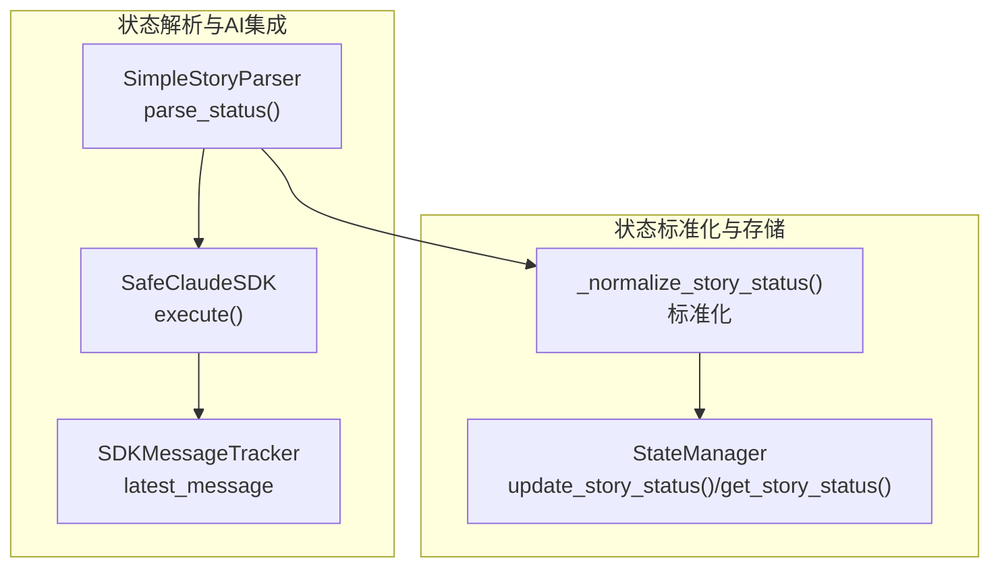
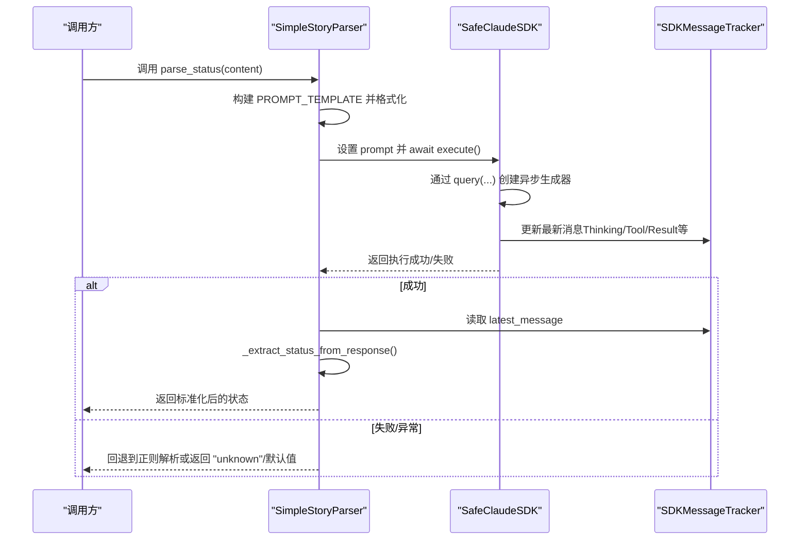
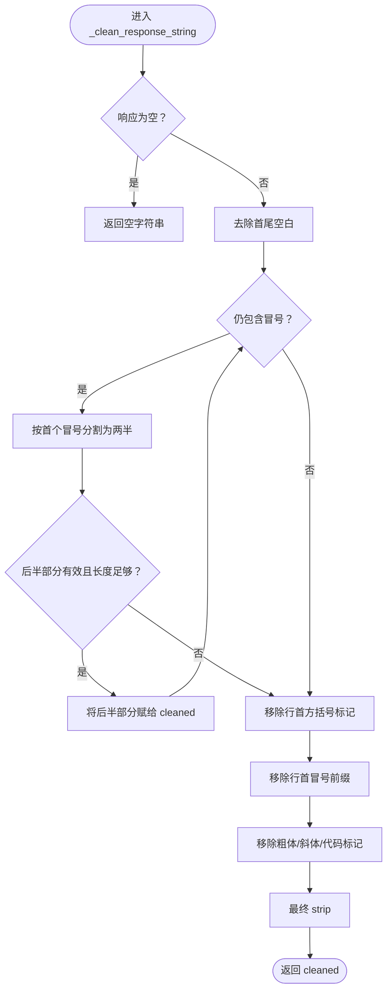
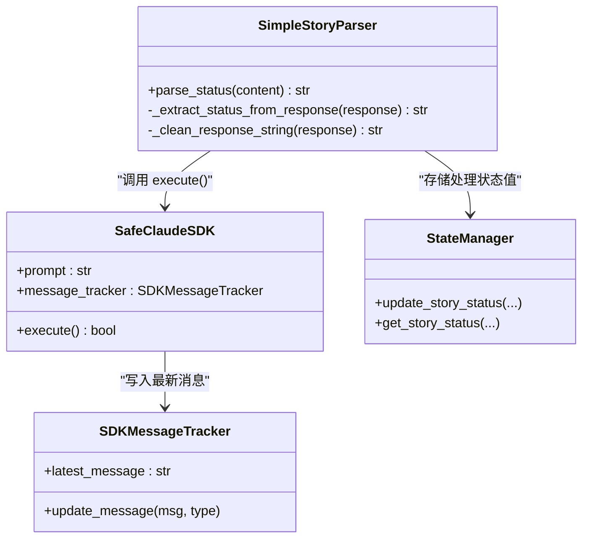

# AI状态解析

<cite>
**本文引用的文件**
- [story_parser.py](file://autoBMAD/epic_automation/story_parser.py)
- [sdk_wrapper.py](file://autoBMAD/epic_automation/sdk_wrapper.py)
- [sdk_session_manager.py](file://autoBMAD/epic_automation/sdk_session_manager.py)
- [state_manager.py](file://autoBMAD/epic_automation/state_manager.py)
- [STATUS_IMPLEMENTATION.md](file://autoBMAD/epic_automation/STATUS_IMPLEMENTATION.md)
- [STANDARD_STATUS.md](file://autoBMAD/epic_automation/STANDARD_STATUS.md)
</cite>

## 目录
1. [简介](#简介)
2. [项目结构](#项目结构)
3. [核心组件](#核心组件)
4. [架构总览](#架构总览)
5. [详细组件分析](#详细组件分析)
6. [依赖关系分析](#依赖关系分析)
7. [性能考量](#性能考量)
8. [故障排查指南](#故障排查指南)
9. [结论](#结论)
10. [附录](#附录)

## 简介
本文件围绕使用 SafeClaudeSDK 进行“语义理解”的故事状态解析流程展开，重点说明：
- parse_status 如何构建提示词并调用 SDK 执行
- PROMPT_TEMPLATE 的结构与内容限制
- AI 解析执行逻辑与异常处理
- 如何通过 _extract_status_from_response 清理与提取响应内容
- 多层级冒号、方括号标记的处理策略
- 成功与失败场景示例
- 超时与异常捕获机制

## 项目结构
本节聚焦与 AI 状态解析直接相关的模块与文件，展示其在整体工程中的定位与协作关系。

图表来源
- [story_parser.py](file://autoBMAD/epic_automation/story_parser.py#L234-L317)
- [sdk_wrapper.py](file://autoBMAD/epic_automation/sdk_wrapper.py#L495-L785)
- [sdk_session_manager.py](file://autoBMAD/epic_automation/sdk_session_manager.py#L244-L341)
- [state_manager.py](file://autoBMAD/epic_automation/state_manager.py#L203-L349)

章节来源
- [story_parser.py](file://autoBMAD/epic_automation/story_parser.py#L1-L120)
- [sdk_wrapper.py](file://autoBMAD/epic_automation/sdk_wrapper.py#L1-L120)
- [state_manager.py](file://autoBMAD/epic_automation/state_manager.py#L1-L120)

## 核心组件
- SimpleStoryParser.parse_status：负责构建提示词、调用 SafeClaudeSDK、提取并标准化状态。
- SafeClaudeSDK.execute：封装 SDK 查询、消息追踪与结果判定。
- SDKMessageTracker：记录 SDK 消息流，提供 latest_message 供解析器使用。
- _normalize_story_status：将非标准状态文本标准化为核心状态值集合。
- StateManager：负责状态的持久化与查询，配合核心状态值进行存储与读取。

章节来源
- [story_parser.py](file://autoBMAD/epic_automation/story_parser.py#L234-L317)
- [sdk_wrapper.py](file://autoBMAD/epic_automation/sdk_wrapper.py#L300-L785)
- [state_manager.py](file://autoBMAD/epic_automation/state_manager.py#L203-L349)

## 架构总览
下面的时序图展示了 parse_status 的完整调用链路与异常处理路径。

图表来源
- [story_parser.py](file://autoBMAD/epic_automation/story_parser.py#L234-L317)
- [sdk_wrapper.py](file://autoBMAD/epic_automation/sdk_wrapper.py#L495-L785)

## 详细组件分析

### PROMPT_TEMPLATE 结构与内容限制
- PROMPT_TEMPLATE（别名 STATUS_PROMPT_TEMPLATE）用于引导 Claude 从故事文档中提取标准状态值。
- 结构要点：
  - 明确列出标准状态选项（Draft、Ready for Development、In Progress、Ready for Review、Ready for Done、Done、Failed）。
  - 强制要求“只返回标准状态值，不要解释”。
  - 提供“故事文档内容：{content}”，并在末尾强调“只返回状态值”。
- 内容限制与建议：
  - 建议传入长度不超过 1000 字符的内容片段，避免超出模型上下文限制。
  - 若内容过长，应在上游截断或分段处理。
  - 保证 content 中包含明确的状态字段或上下文，有助于模型准确提取。

章节来源
- [story_parser.py](file://autoBMAD/epic_automation/story_parser.py#L143-L169)

### parse_status 执行逻辑
- 输入：Markdown 故事文档内容（字符串）。
- 主要步骤：
  1) 参数校验与日志记录。
  2) 构建 PROMPT_TEMPLATE 并格式化，限制内容长度。
  3) 将 prompt 注入 SafeClaudeSDK（若 SDK 支持 prompt 动态更新）。
  4) 调用 sdk.execute() 并等待结果。
  5) 若成功，从 message_tracker.latest_message 读取最新消息。
  6) 调用 _extract_status_from_response 进行清理与标准化。
  7) 记录解析结果并返回；若失败或异常，回退到正则解析或返回默认值。

异常与回退：
- TimeoutError：记录超时并回退到正则解析。
- 其他异常：记录错误详情并回退到正则解析。
- SDK 无 message_tracker：回退到正则解析。
- execute 返回失败：回退到正则解析。

章节来源
- [story_parser.py](file://autoBMAD/epic_automation/story_parser.py#L234-L317)

### _extract_status_from_response 清理与提取策略
该方法负责将 SDK 原始响应标准化为核心状态值集合中的一个，流程如下：
- 输入验证：空响应返回 "unknown"。
- 深度清理：调用 _clean_response_string，处理多层级冒号、方括号标记、粗体/斜体/代码标记等。
- 标准化：调用 _normalize_story_status，将清理后的文本映射为核心状态值集合。
- 结果校验：若标准化结果不在核心状态集合，则回退到简单匹配或返回 "unknown"。

章节来源
- [story_parser.py](file://autoBMAD/epic_automation/story_parser.py#L424-L484)

### _clean_response_string 的多层级冒号与方括号处理
- 多层级冒号处理：循环拆分冒号，保留后半部分，直到不再出现有效冒号分隔或后半部分过短为止，避免“前缀: 分析结果: 状态值”的深层嵌套。
- 方括号标记：移除以 [ 开头的行首标记，如 [Thinking]、[Tool result] 等。
- 冒号前缀：移除类似 Success:、Error:、Result: 等前缀。
- 其他标记：去除粗体、斜体、代码反引号等 Markdown 标记。
- 最终清理：strip 去除多余空白。

图表来源
- [story_parser.py](file://autoBMAD/epic_automation/story_parser.py#L363-L422)

### SafeClaudeSDK 执行与消息追踪
- execute：统一的 SDK 执行入口，通过 SDKCancellationManager 进行取消管理与结果标记。
- 消息分类与提取：对 Assistant/System/User/Result 等消息类型进行分类与内容提取，组装为可读字符串并写入 SDKMessageTracker。
- 结果判定：当收到 ResultMessage 且 is_error 为 False 时，认为执行成功；否则视为失败。
- 异常处理：捕获取消、运行时错误等，记录诊断信息并返回相应结果。

章节来源
- [sdk_wrapper.py](file://autoBMAD/epic_automation/sdk_wrapper.py#L300-L785)

### SDKSessionManager 的隔离与统计
- 会话隔离：为每个 Agent 创建独立的 IsolatedSDKContext，避免 cancel scope 跨任务传播。
- 执行结果：返回 SDKExecutionResult，包含 success、error_type、duration、retry_count 等。
- 健康检查：记录最近若干次会话的健康状态，支持恢复性判断。

章节来源
- [sdk_session_manager.py](file://autoBMAD/epic_automation/sdk_session_manager.py#L193-L341)

### 状态标准化与存储
- 标准化：_normalize_story_status 将非标准文本映射为核心状态值集合中的一个，若无法识别则返回默认 Draft。
- 存储：StateManager 使用处理状态值（pending/in_progress/review/completed/failed/error/cancelled）进行数据库持久化；对外展示与文档使用核心状态值。

章节来源
- [STATUS_IMPLEMENTATION.md](file://autoBMAD/epic_automation/STATUS_IMPLEMENTATION.md#L80-L120)
- [STANDARD_STATUS.md](file://autoBMAD/epic_automation/STANDARD_STATUS.md#L1-L120)
- [state_manager.py](file://autoBMAD/epic_automation/state_manager.py#L203-L349)

## 依赖关系分析
- SimpleStoryParser 依赖 SafeClaudeSDK 的 execute 与 message_tracker。
- SafeClaudeSDK 依赖 SDKCancellationManager 进行统一取消管理，并通过 SDKMessageTracker 记录消息。
- 解析结果经 _normalize_story_status 标准化后，由 StateManager 持久化。

图表来源
- [story_parser.py](file://autoBMAD/epic_automation/story_parser.py#L234-L317)
- [sdk_wrapper.py](file://autoBMAD/epic_automation/sdk_wrapper.py#L300-L785)
- [state_manager.py](file://autoBMAD/epic_automation/state_manager.py#L203-L349)

## 性能考量
- 提示词长度：建议限制 content 长度（如 1000 字符），避免上下文溢出与延迟增加。
- SDK 执行：通过 SDKMessageTracker 实时反馈，便于监控与诊断。
- 标准化成本：_normalize_story_status 为 O(1) 映射，开销极低。
- 回退策略：正则解析作为兜底，避免阻塞主流程。

[本节为通用指导，不涉及具体文件分析]

## 故障排查指南
- AI 解析失败：
  - 检查 SDK 初始化与 options 是否正确。
  - 查看 SDKMessageTracker 的最新消息，确认是否收到 ResultMessage 且 is_error 为 False。
  - 若无 message_tracker 属性，解析器会自动回退到正则解析。
- 超时与取消：
  - parse_status 捕获 TimeoutError 并回退；SDKCancellationManager 会在取消后等待清理完成。
  - SDKSessionManager 对取消与运行时错误进行分类统计，便于定位问题。
- 响应不规范：
  - _clean_response_string 会移除方括号、冒号前缀与 Markdown 标记；若仍无法提取，检查 PROMPT_TEMPLATE 是否清晰，或改用正则回退。

章节来源
- [story_parser.py](file://autoBMAD/epic_automation/story_parser.py#L234-L317)
- [sdk_wrapper.py](file://autoBMAD/epic_automation/sdk_wrapper.py#L495-L785)
- [sdk_session_manager.py](file://autoBMAD/epic_automation/sdk_session_manager.py#L244-L341)

## 结论
通过 SafeClaudeSDK 的统一执行与消息追踪，结合 SimpleStoryParser 的提示词构建与响应清理/标准化流程，系统实现了稳定、可诊断的 AI 状态解析能力。在 SDK 不可用或异常情况下，解析器具备完善的回退策略与日志记录，确保流程的鲁棒性与可观测性。

[本节为总结性内容，不涉及具体文件分析]

## 附录

### 成功与失败场景示例（以路径引用代替代码）
- 成功场景（AI 解析返回标准状态值）：
  - 调用路径参考：[parse_status](file://autoBMAD/epic_automation/story_parser.py#L234-L317)
  - 标准化路径参考：[_normalize_story_status](file://autoBMAD/epic_automation/STATUS_IMPLEMENTATION.md#L80-L120)
  - 存储路径参考：[update_story_status](file://autoBMAD/epic_automation/state_manager.py#L203-L349)
- 失败场景（SDK 无 message_tracker 或 execute 失败）：
  - 回退路径参考：[parse_status 回退分支](file://autoBMAD/epic_automation/story_parser.py#L234-L317)
  - 正则回退路径参考：[正则回退解析](file://autoBMAD/epic_automation/story_parser.py#L318-L361)
- 超时与异常捕获：
  - 超时处理路径参考：[parse_status TimeoutError 分支](file://autoBMAD/epic_automation/story_parser.py#L304-L309)
  - SDK 执行异常路径参考：[execute 异常分支](file://autoBMAD/epic_automation/sdk_wrapper.py#L555-L559)