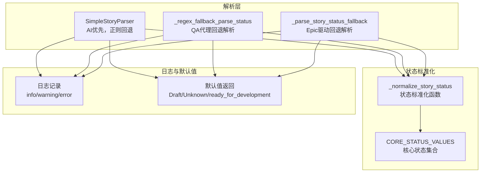
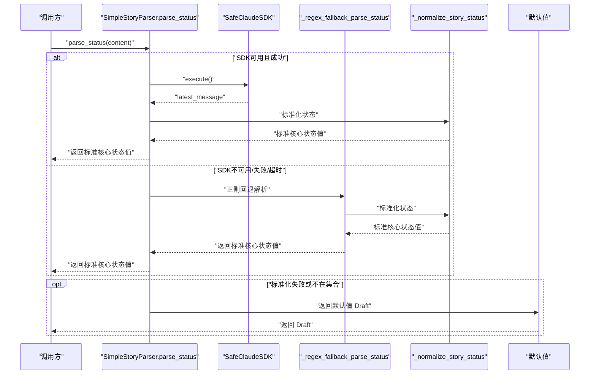
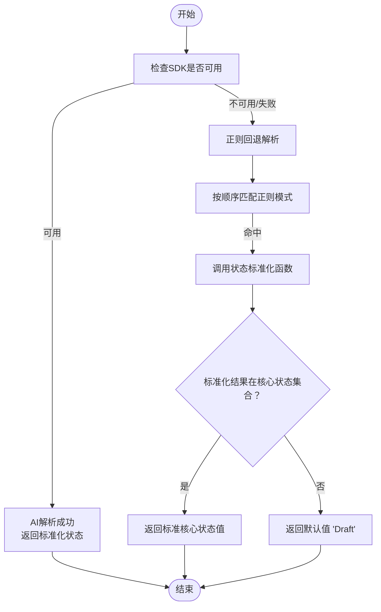
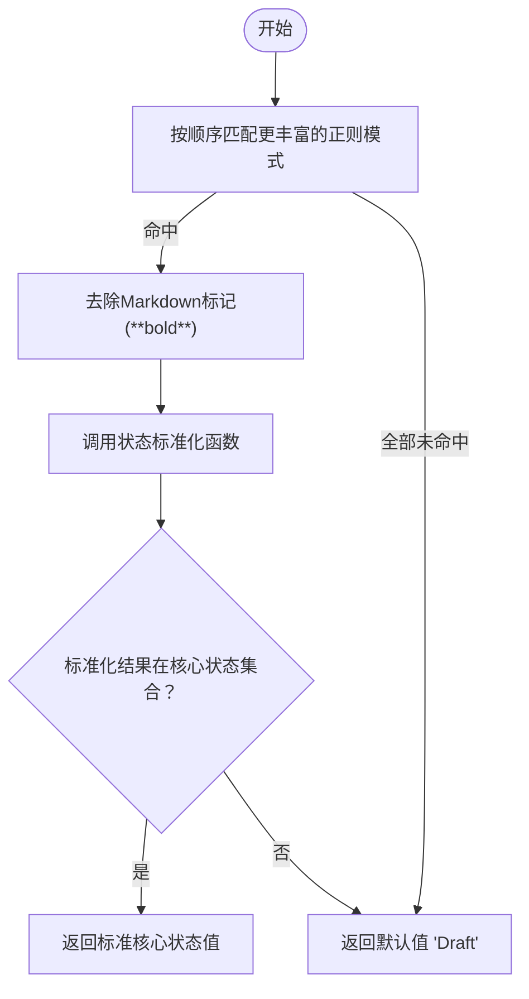
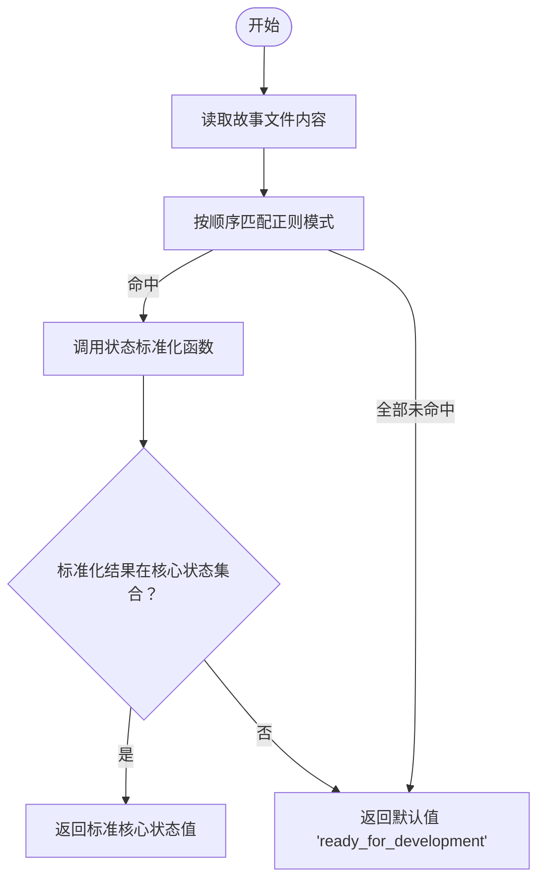
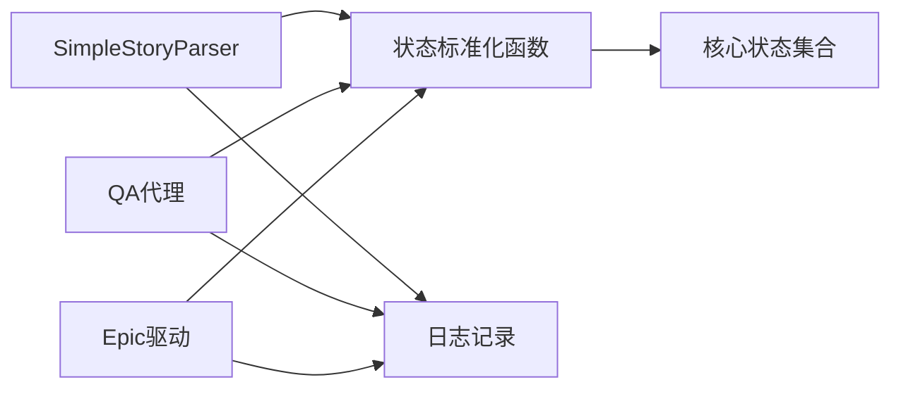

# 正则回退解析

<cite>
**本文引用的文件**
- [story_parser.py](file://autoBMAD/epic_automation/story_parser.py)
- [qa_agent.py](file://autoBMAD/epic_automation/qa_agent.py)
- [epic_driver.py](file://autoBMAD/epic_automation/epic_driver.py)
- [STATUS_IMPLEMENTATION.md](file://autoBMAD/epic_automation/STATUS_IMPLEMENTATION.md)
- [FINAL_ANALYSIS_SUMMARY.md](file://FINAL_ANALYSIS_SUMMARY.md)
- [STATUS_ANALYSIS_REPORT.md](file://STATUS_ANALYSIS_REPORT.md)
</cite>

## 目录
1. [简介](#简介)
2. [项目结构](#项目结构)
3. [核心组件](#核心组件)
4. [架构总览](#架构总览)
5. [详细组件分析](#详细组件分析)
6. [依赖关系分析](#依赖关系分析)
7. [性能考量](#性能考量)
8. [故障排查指南](#故障排查指南)
9. [结论](#结论)

## 简介
本文件聚焦“正则回退解析”机制，详细说明当AI解析不可用或失败时的备用方案。重点围绕以下目标展开：
- 描述多模式匹配策略，覆盖Markdown中常见的状态字段格式，包括但不限于“**Status**: **Draft**”、“**Status**: Draft”、“Status: Draft”和“状态：草稿”等。
- 解释正则表达式模式的优先级执行顺序与匹配逻辑。
- 说明通过标准化函数将提取的原始状态值统一为标准核心状态值的过程。
- 提供不同Markdown格式下的正则匹配流程示例与默认值返回机制、日志记录策略说明。

## 项目结构
本主题涉及的关键模块与文件如下：
- 统一状态解析器：提供AI优先、正则回退的解析策略，负责状态标准化与默认值处理。
- QA代理：在AI解析失败或不可用时，采用更丰富的正则模式进行回退解析，并进行状态标准化。
- Epic驱动：在异步上下文不可用或SDK不可用时，使用同步回退解析策略，保证流程稳定。

图表来源
- [story_parser.py](file://autoBMAD/epic_automation/story_parser.py#L317-L395)
- [qa_agent.py](file://autoBMAD/epic_automation/qa_agent.py#L894-L938)
- [epic_driver.py](file://autoBMAD/epic_automation/epic_driver.py#L1436-L1469)
- [STATUS_IMPLEMENTATION.md](file://autoBMAD/epic_automation/STATUS_IMPLEMENTATION.md#L1-L245)

章节来源
- [story_parser.py](file://autoBMAD/epic_automation/story_parser.py#L317-L395)
- [qa_agent.py](file://autoBMAD/epic_automation/qa_agent.py#L894-L938)
- [epic_driver.py](file://autoBMAD/epic_automation/epic_driver.py#L1436-L1469)
- [STATUS_IMPLEMENTATION.md](file://autoBMAD/epic_automation/STATUS_IMPLEMENTATION.md#L1-L245)

## 核心组件
- 统一状态解析器（SimpleStoryParser）：提供parse_status方法，AI优先；若AI失败或不可用，则进入正则回退解析，并通过状态标准化函数输出标准核心状态值。
- QA代理回退解析：在AI解析失败或不可用时，使用更丰富的正则模式匹配，并进行状态标准化。
- Epic驱动回退解析：在异步上下文不可用时，提供同步回退解析策略，保证流程稳定。
- 状态标准化函数：将输入的任意格式状态值统一为标准核心状态值集合中的一个，否则返回默认值。

章节来源
- [story_parser.py](file://autoBMAD/epic_automation/story_parser.py#L234-L316)
- [story_parser.py](file://autoBMAD/epic_automation/story_parser.py#L317-L395)
- [qa_agent.py](file://autoBMAD/epic_automation/qa_agent.py#L894-L938)
- [epic_driver.py](file://autoBMAD/epic_automation/epic_driver.py#L1436-L1469)
- [STATUS_IMPLEMENTATION.md](file://autoBMAD/epic_automation/STATUS_IMPLEMENTATION.md#L1-L245)

## 架构总览
下图展示了状态解析的整体流程，包括AI解析与正则回退两条路径，以及状态标准化与默认值返回的共同出口。

图表来源
- [story_parser.py](file://autoBMAD/epic_automation/story_parser.py#L234-L316)
- [story_parser.py](file://autoBMAD/epic_automation/story_parser.py#L317-L395)

## 详细组件分析

### 统一状态解析器（AI优先，正则回退）
- AI解析失败或不可用时，自动回退到正则表达式解析。
- 正则模式按顺序匹配，一旦命中即停止后续匹配，返回标准化后的状态值。
- 若标准化后仍不在标准核心状态集合中，则返回默认值“Draft”。

图表来源
- [story_parser.py](file://autoBMAD/epic_automation/story_parser.py#L234-L316)
- [story_parser.py](file://autoBMAD/epic_automation/story_parser.py#L317-L395)

章节来源
- [story_parser.py](file://autoBMAD/epic_automation/story_parser.py#L234-L316)
- [story_parser.py](file://autoBMAD/epic_automation/story_parser.py#L317-L395)

### QA代理回退解析（更丰富的正则模式）
- 在AI解析失败或不可用时，使用更广泛的正则模式匹配，覆盖更多Markdown格式。
- 匹配后去除Markdown标记（如粗体），再进行状态标准化。
- 标准化后验证是否为有效核心状态值，否则返回默认值“Draft”。

图表来源
- [qa_agent.py](file://autoBMAD/epic_automation/qa_agent.py#L894-L938)

章节来源
- [qa_agent.py](file://autoBMAD/epic_automation/qa_agent.py#L894-L938)

### Epic驱动回退解析（同步场景）
- 在异步上下文不可用时，提供同步回退解析策略，读取文件内容后进行正则匹配与标准化。
- 若解析失败，返回默认值“ready_for_development”（注意：该默认值为历史兼容值，当前统一策略推荐返回“Draft”）。

图表来源
- [epic_driver.py](file://autoBMAD/epic_automation/epic_driver.py#L1436-L1469)

章节来源
- [epic_driver.py](file://autoBMAD/epic_automation/epic_driver.py#L1436-L1469)

### 多模式匹配策略与优先级
- 统一解析器（SimpleStoryParser）的正则模式优先级顺序如下：
  1) “**Status**: **Draft**”
  2) “**Status**: Draft”
  3) “Status: Draft”
  4) “状态：草稿”
- QA代理的正则模式优先级顺序如下：
  1) “**Status**: **Draft**”
  2) “**Status**: Draft”
  3) “Status: Draft”
  4) “状态：草稿”
  5) “**Status**: Ready for Review”
  6) “Status: *Ready for Review*”
- Epic驱动的回退解析模式优先级顺序如下：
  1) “**Status**: **Draft**”
  2) “Status: Draft”
  3) “Status: Ready for Development”

章节来源
- [story_parser.py](file://autoBMAD/epic_automation/story_parser.py#L333-L361)
- [qa_agent.py](file://autoBMAD/epic_automation/qa_agent.py#L898-L905)
- [epic_driver.py](file://autoBMAD/epic_automation/epic_driver.py#L1450-L1469)

### 状态标准化与默认值返回机制
- 标准化函数将输入状态值转换为标准核心状态值集合中的一个，若输入已是核心状态值或处理状态值，则直接映射；否则按关键词匹配映射到标准核心状态值；若仍无法识别，则返回默认值“Draft”。
- 统一解析器在标准化后校验结果是否属于核心状态集合，不在集合中则返回“Draft”。
- QA代理在标准化后显式校验核心状态集合，不在集合中则返回“Draft”。
- Epic驱动在回退解析中若未命中任何模式，返回“ready_for_development”（历史兼容值）。

章节来源
- [STATUS_IMPLEMENTATION.md](file://autoBMAD/epic_automation/STATUS_IMPLEMENTATION.md#L1-L245)
- [story_parser.py](file://autoBMAD/epic_automation/story_parser.py#L382-L395)
- [qa_agent.py](file://autoBMAD/epic_automation/qa_agent.py#L916-L934)
- [epic_driver.py](file://autoBMAD/epic_automation/epic_driver.py#L1466-L1469)

### 日志记录策略
- 统一解析器：在AI解析不可用或失败时记录警告；在正则回退解析命中时记录调试信息；在标准化成功或失败时记录信息或警告；在默认值返回时记录信息。
- QA代理：在正则命中、标准化成功/失败、默认值返回时分别记录调试/信息/警告/错误；在SDK不可用时记录警告。
- Epic驱动：在回退解析命中、默认值返回、异常时记录信息/警告/错误。

章节来源
- [story_parser.py](file://autoBMAD/epic_automation/story_parser.py#L254-L316)
- [story_parser.py](file://autoBMAD/epic_automation/story_parser.py#L317-L395)
- [qa_agent.py](file://autoBMAD/epic_automation/qa_agent.py#L894-L938)
- [epic_driver.py](file://autoBMAD/epic_automation/epic_driver.py#L1436-L1469)

## 依赖关系分析
- 统一解析器依赖状态标准化函数与核心状态集合，确保输出为标准核心状态值。
- QA代理与Epic驱动在AI解析失败时依赖统一的正则回退解析策略，保证行为一致性。
- 日志记录贯穿AI解析、正则回退与默认值返回全过程，便于问题定位与审计。

图表来源
- [story_parser.py](file://autoBMAD/epic_automation/story_parser.py#L317-L395)
- [qa_agent.py](file://autoBMAD/epic_automation/qa_agent.py#L894-L938)
- [epic_driver.py](file://autoBMAD/epic_automation/epic_driver.py#L1436-L1469)
- [STATUS_IMPLEMENTATION.md](file://autoBMAD/epic_automation/STATUS_IMPLEMENTATION.md#L1-L245)

章节来源
- [story_parser.py](file://autoBMAD/epic_automation/story_parser.py#L317-L395)
- [qa_agent.py](file://autoBMAD/epic_automation/qa_agent.py#L894-L938)
- [epic_driver.py](file://autoBMAD/epic_automation/epic_driver.py#L1436-L1469)
- [STATUS_IMPLEMENTATION.md](file://autoBMAD/epic_automation/STATUS_IMPLEMENTATION.md#L1-L245)

## 性能考量
- 正则回退解析的时间复杂度与文档长度线性相关，匹配顺序固定，命中后立即返回，整体开销较小。
- 标准化函数为常数时间映射，对性能影响可忽略。
- 在AI解析失败或不可用时，回退解析能快速给出默认值，避免长时间等待或重试。

## 故障排查指南
- AI解析失败或不可用：检查SDK初始化与可用性，确认日志中是否出现“AI解析失败/超时/无结果”的警告；此时应走正则回退解析。
- 正则未命中：确认Markdown中状态字段是否符合预期格式；可在日志中查看“正则命中”与“默认值返回”的信息。
- 标准化结果无效：确认输入状态值是否为标准核心状态值或可映射的关键词；若不在核心状态集合中，将返回默认值“Draft”。
- 历史兼容默认值：Epic驱动在极少数情况下可能返回“ready_for_development”，建议统一为“Draft”以保持一致性。

章节来源
- [story_parser.py](file://autoBMAD/epic_automation/story_parser.py#L254-L316)
- [story_parser.py](file://autoBMAD/epic_automation/story_parser.py#L317-L395)
- [qa_agent.py](file://autoBMAD/epic_automation/qa_agent.py#L894-L938)
- [epic_driver.py](file://autoBMAD/epic_automation/epic_driver.py#L1436-L1469)
- [FINAL_ANALYSIS_SUMMARY.md](file://FINAL_ANALYSIS_SUMMARY.md#L1-L102)
- [STATUS_ANALYSIS_REPORT.md](file://STATUS_ANALYSIS_REPORT.md#L32-L54)

## 结论
- 正则回退解析作为AI解析失败或不可用时的可靠保障，提供了明确的匹配顺序与默认值返回机制。
- 通过状态标准化函数，系统能够将多种格式的状态值统一为标准核心状态值，确保下游业务逻辑的一致性。
- QA代理与Epic驱动在不同场景下均实现了稳健的回退策略，并辅以完善的日志记录，便于问题诊断与流程优化。