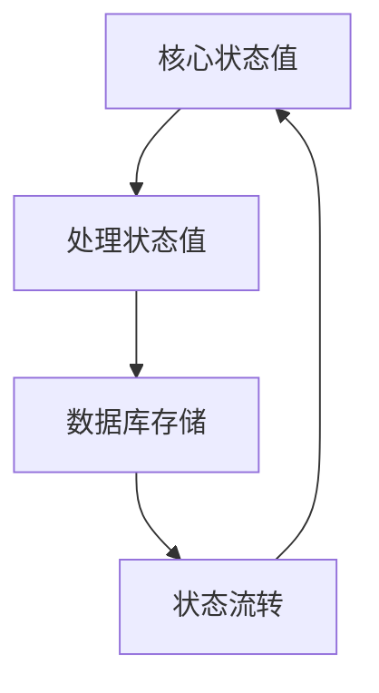
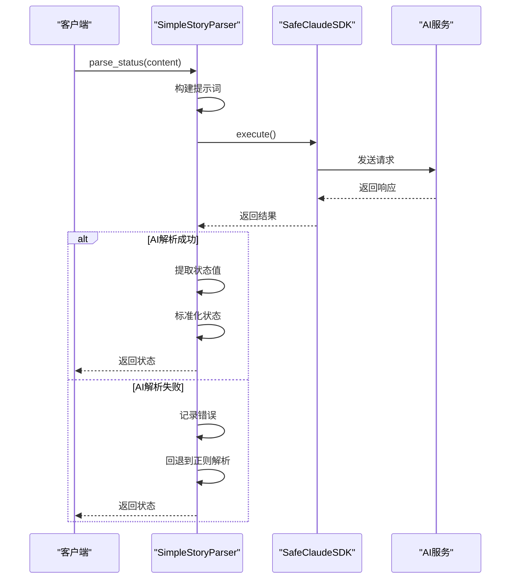
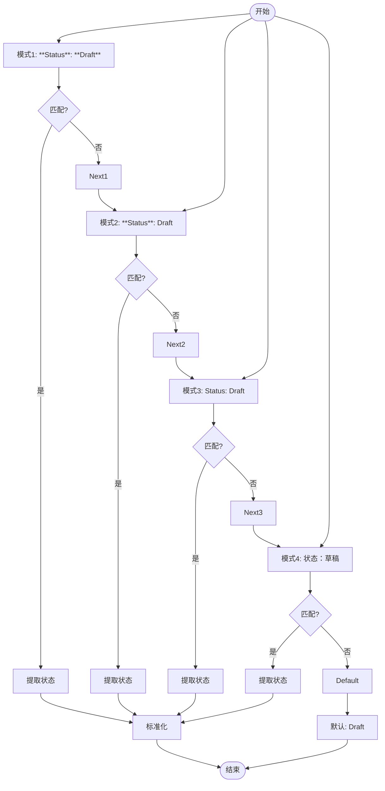
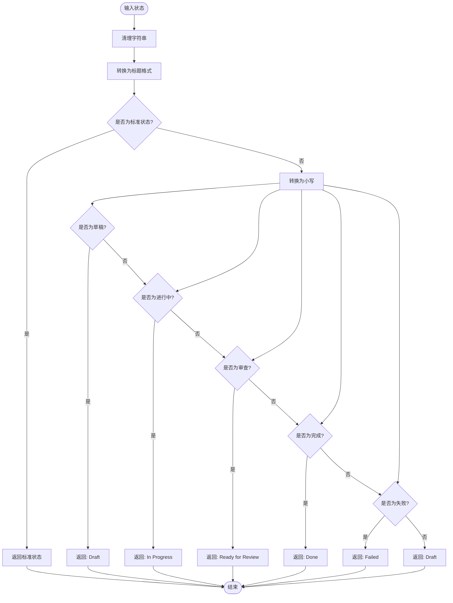
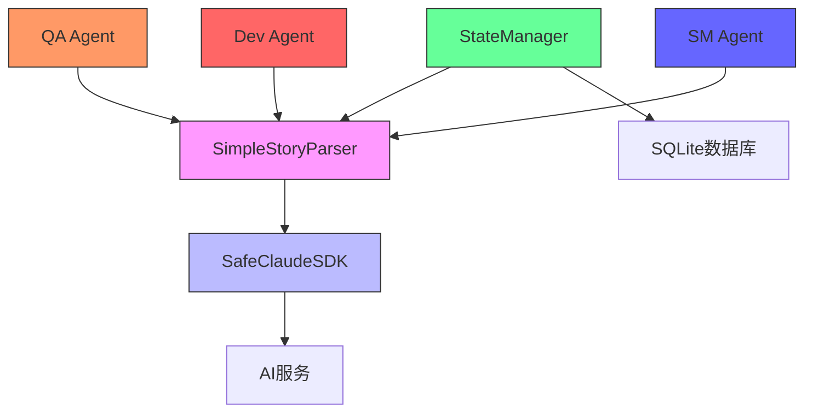

# 状态提取

<cite>
**本文档引用的文件**   
- [story_parser.py](file://autoBMAD/epic_automation/story_parser.py)
- [state_manager.py](file://autoBMAD/epic_automation/state_manager.py)
- [qa_agent.py](file://autoBMAD/epic_automation/qa_agent.py)
- [STATUS_IMPLEMENTATION.md](file://autoBMAD/epic_automation/STATUS_IMPLEMENTATION.md)
- [STANDARD_STATUS.md](file://autoBMAD/epic_automation/STANDARD_STATUS.md)
- [REFACTORING_20260109.md](file://docs/REFACTORING_20260109.md)
</cite>

## 目录
1. [简介](#简介)
2. [核心状态值系统](#核心状态值系统)
3. [AI优先解析流程](#ai优先解析流程)
4. [正则表达式回退解析](#正则表达式回退解析)
5. [状态标准化过程](#状态标准化过程)
6. [错误处理与日志记录](#错误处理与日志记录)
7. [代码示例与用法](#代码示例与用法)
8. [架构与依赖关系](#架构与依赖关系)
9. [结论](#结论)

## 简介

状态提取系统是本项目中用于从Markdown故事文档中提取和解析状态信息的核心组件。该系统采用AI优先、正则回退的双重策略，确保在各种情况下都能准确提取状态值。系统主要由`SimpleStoryParser`类实现，该类提供了统一的接口来解析故事文档中的状态信息。

系统设计遵循奥卡姆剃刀原则，将原本分散在多个模块中的状态解析逻辑统一到一个模块中，提高了代码的可维护性和一致性。通过使用AI智能解析和正则表达式回退的组合策略，系统能够在AI服务不可用或解析失败时，仍然能够通过传统的正则表达式方法提取状态信息。

**Section sources**
- [story_parser.py](file://autoBMAD/epic_automation/story_parser.py#L1-L20)

## 核心状态值系统

系统定义了一套标准化的核心状态值，用于统一文档和显示中的状态表示。这些核心状态值包括：

- **草稿** (Draft)
- **准备开发** (Ready for Development)
- **进行中** (In Progress)
- **准备审查** (Ready for Review)
- **准备完成** (Ready for Done)
- **已完成** (Done)
- **失败** (Failed)

这些状态值不仅用于文档显示，还作为系统内部处理的基础。系统还定义了处理状态值，用于数据库存储和内部跟踪。核心状态值与处理状态值之间存在单向映射关系，确保了状态流转的一致性和可维护性。



**Diagram sources**
- [story_parser.py](file://autoBMAD/epic_automation/story_parser.py#L59-L110)
- [STANDARD_STATUS.md](file://autoBMAD/epic_automation/STANDARD_STATUS.md#L204-L213)

## AI优先解析流程

`SimpleStoryParser`类的`parse_status`方法实现了AI优先的解析策略。该方法首先尝试使用AI进行语义理解，只有在AI解析失败或不可用时，才会回退到正则表达式解析。

AI解析流程如下：
1. 构建AI提示词，包含故事文档内容
2. 调用SafeClaudeSDK执行AI查询
3. 从AI响应中提取状态值
4. 清理和标准化AI响应
5. 返回标准化后的状态值

当AI解析失败时，系统会记录详细的错误信息，并自动回退到正则表达式解析方法。这种设计确保了系统的鲁棒性，即使在AI服务不可用的情况下，仍然能够提取状态信息。



**Diagram sources**
- [story_parser.py](file://autoBMAD/epic_automation/story_parser.py#L234-L317)
- [qa_agent.py](file://autoBMAD/epic_automation/qa_agent.py#L128-L158)

## 正则表达式回退解析

当AI解析失败或不可用时，系统会使用正则表达式回退解析方法。`_regex_fallback_parse_status`方法实现了这一功能，它通过多模式匹配策略来提取状态信息。

正则表达式回退解析支持多种Markdown格式，包括：
- `**Status**: **Draft**`
- `**Status**: Draft`
- `Status: Draft`
- `状态：草稿`

系统使用多模式匹配策略，依次尝试不同的正则表达式模式，直到找到匹配项。这种设计提高了正则表达式解析的灵活性和准确性，能够适应不同格式的Markdown文档。



**Diagram sources**
- [story_parser.py](file://autoBMAD/epic_automation/story_parser.py#L318-L361)
- [qa_agent.py](file://autoBMAD/epic_automation/qa_agent.py#L893-L904)

## 状态标准化过程

状态标准化是确保状态值一致性的关键步骤。`_normalize_story_status`函数负责将各种格式的状态值标准化为核心状态值。

标准化过程包括以下步骤：
1. 清理输入字符串，去除前后空格
2. 转换为标题格式（首字母大写）
3. 检查是否已经是标准核心状态值
4. 处理各种格式变体（小写匹配）
5. 返回标准化后的核心状态值

系统支持中英文状态描述，能够处理"草稿"、"Draft"、"in progress"、"进行中"等多种变体。这种设计提高了系统的灵活性和适应性，能够处理不同语言和格式的输入。



**Diagram sources**
- [story_parser.py](file://autoBMAD/epic_automation/story_parser.py#L822-L875)
- [test_status_mapping.py](file://test_status_mapping.py#L15-L56)

## 错误处理与日志记录

系统实现了完善的错误处理和日志记录机制，确保在各种异常情况下都能提供详细的诊断信息。

错误处理策略包括：
- **超时处理**: 当AI解析超时（30秒）时，自动回退到正则表达式解析
- **异常捕获**: 捕获所有异常，记录详细错误信息，并回退到正则表达式解析
- **空响应处理**: 当AI返回空响应时，记录警告并回退到正则表达式解析
- **SDK检查**: 检查SDK实例和message_tracker属性，确保安全调用

日志记录提供了详细的解析过程信息，包括：
- 开始解析的日志
- AI提示词长度
- 正则表达式匹配结果
- 清理过程
- 最终解析结果

这种设计使得系统在出现问题时能够快速定位和诊断，提高了系统的可维护性和可靠性。

**Section sources**
- [story_parser.py](file://autoBMAD/epic_automation/story_parser.py#L249-L317)
- [REFACTORING_20260109.md](file://docs/REFACTORING_20260109.md#L72-L85)

## 代码示例与用法

以下是`SimpleStoryParser`的典型用法示例：

```python
# 创建状态解析器实例
parser = SimpleStoryParser(sdk_wrapper=sdk_instance)

# 解析故事状态
status = await parser.parse_status(content)

# 解析完整故事文档
story_data = await parser.parse_story(content)

# 解析Epic文档
epic_data = await parser.parse_epic(content)
```

系统还提供了向后兼容的别名和便捷函数，如`StatusParser`和`parse_story_status`，方便在现有代码中使用。

**Section sources**
- [story_parser.py](file://autoBMAD/epic_automation/story_parser.py#L776-L799)
- [qa_agent.py](file://autoBMAD/epic_automation/qa_agent.py#L163-L221)

## 架构与依赖关系

系统架构采用分层设计，各组件职责清晰，耦合度低。主要组件包括：

- **SimpleStoryParser**: 核心解析器，负责状态提取
- **SafeClaudeSDK**: AI服务包装器，提供AI解析能力
- **StateManager**: 状态管理器，负责状态持久化
- **QA Agent**: 质量保证代理，使用状态解析器进行质量检查

各组件之间的依赖关系清晰，`SimpleStoryParser`依赖于`SafeClaudeSDK`进行AI解析，而`QA Agent`和`StateManager`则依赖于`SimpleStoryParser`获取状态信息。



**Diagram sources**
- [story_parser.py](file://autoBMAD/epic_automation/story_parser.py#L213-L233)
- [state_manager.py](file://autoBMAD/epic_automation/state_manager.py#L97-L119)

## 结论

状态提取系统通过AI优先、正则回退的策略，实现了高效、可靠的状态信息提取。系统设计遵循单一职责原则，将状态解析逻辑统一到`SimpleStoryParser`类中，提高了代码的可维护性和一致性。

核心优势包括：
- **鲁棒性**: AI解析失败时自动回退到正则表达式
- **灵活性**: 支持多种Markdown格式和中英文状态描述
- **可维护性**: 统一的状态值系统和清晰的架构设计
- **可扩展性**: 易于添加新的状态值和解析规则

该系统为项目提供了可靠的状态管理基础，确保了状态信息的一致性和准确性。