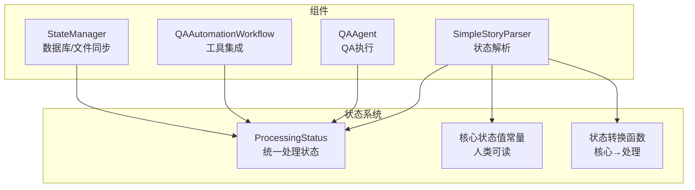
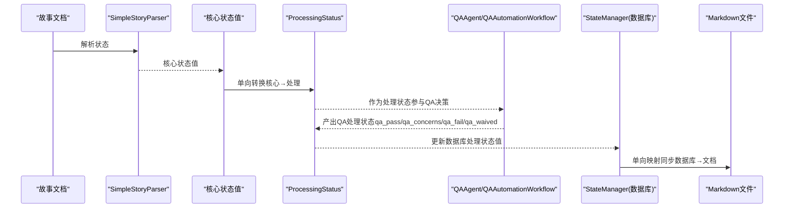
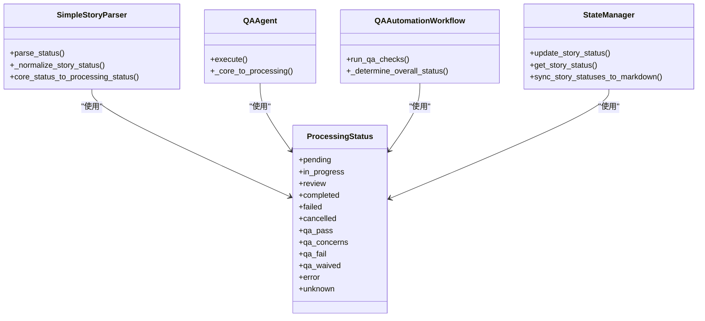

# 处理状态枚举

<cite>
**本文引用的文件**
- [story_parser.py](file://autoBMAD/epic_automation/story_parser.py)
- [state_manager.py](file://autoBMAD/epic_automation/state_manager.py)
- [qa_agent.py](file://autoBMAD/epic_automation/qa_agent.py)
- [qa_tools_integration.py](file://autoBMAD/epic_automation/qa_tools_integration.py)
- [状态系统架构分析报告.md](file://状态系统架构分析报告.md)
- [状态系统重构实施方案.md](file://状态系统重构实施方案.md)
</cite>

## 目录
1. [简介](#简介)
2. [项目结构](#项目结构)
3. [核心组件](#核心组件)
4. [架构总览](#架构总览)
5. [详细组件分析](#详细组件分析)
6. [依赖关系分析](#依赖关系分析)
7. [性能考量](#性能考量)
8. [故障排查指南](#故障排查指南)
9. [结论](#结论)

## 简介
本文件围绕 ProcessingStatus 枚举展开，系统性说明其作为统一处理状态系统的定位与价值，覆盖三类状态域：故事处理状态（如 pending、in_progress、review、completed、failed、cancelled）、QA 相关处理状态（如 qa_pass、qa_concerns、qa_fail、qa_waived）以及特殊状态（如 error、unknown）。文档解释每类状态的含义、使用场景与约束，阐明该枚举如何支撑 SM-Dev-QA 工作流的状态管理，并说明与 StateManager 的协同机制及数据流方向。

## 项目结构
与 ProcessingStatus 直接相关的关键文件与职责如下：
- autoBMAD/epic_automation/story_parser.py：定义 ProcessingStatus 枚举及其核心状态值常量、状态转换辅助函数
- autoBMAD/epic_automation/state_manager.py：数据库状态持久化与 Markdown 同步，使用 ProcessingStatus 作为处理状态值
- autoBMAD/epic_automation/qa_agent.py：QA 执行流程，使用 ProcessingStatus 表达 QA 结果与中间状态
- autoBMAD/epic_automation/qa_tools_integration.py：QA 工具集成，产出 ProcessingStatus 作为工具级结果
- 状态系统架构分析报告.md / 状态系统重构实施方案.md：提供统一状态系统的设计原则、单向数据流与迁移策略

图表来源
- [story_parser.py](file://autoBMAD/epic_automation/story_parser.py#L80-L137)
- [state_manager.py](file://autoBMAD/epic_automation/state_manager.py#L686-L710)
- [qa_agent.py](file://autoBMAD/epic_automation/qa_agent.py#L222-L319)
- [qa_tools_integration.py](file://autoBMAD/epic_automation/qa_tools_integration.py#L646-L741)

章节来源
- [story_parser.py](file://autoBMAD/epic_automation/story_parser.py#L59-L137)
- [state_manager.py](file://autoBMAD/epic_automation/state_manager.py#L686-L710)
- [qa_agent.py](file://autoBMAD/epic_automation/qa_agent.py#L222-L319)
- [qa_tools_integration.py](file://autoBMAD/epic_automation/qa_tools_integration.py#L646-L741)

## 核心组件
- ProcessingStatus 枚举：统一的处理状态值系统，涵盖故事处理状态、QA 相关状态与特殊状态，用于程序内部、数据库存储与 API 输出
- 核心状态值常量：用于文档显示与人类可读，业务决策基于此
- 状态转换函数：核心状态值到处理状态值的单向转换，禁止反向影响
- StateManager：负责数据库状态持久化与 Markdown 文件状态同步，使用 ProcessingStatus 作为处理状态值
- QA Agent 与 QA 工具集成：在 QA 执行过程中产出 ProcessingStatus，驱动后续流程

章节来源
- [story_parser.py](file://autoBMAD/epic_automation/story_parser.py#L80-L137)
- [state_manager.py](file://autoBMAD/epic_automation/state_manager.py#L686-L710)
- [qa_agent.py](file://autoBMAD/epic_automation/qa_agent.py#L222-L319)
- [qa_tools_integration.py](file://autoBMAD/epic_automation/qa_tools_integration.py#L646-L741)

## 架构总览
统一状态系统遵循“文档 → 核心状态 → 处理状态”的单向数据流，禁止处理状态值反向影响核心状态值。QA Agent 与 QA 工具集成同样遵循该原则，使用 ProcessingStatus 表达 QA 结果，最终由 StateManager 将处理状态值写入数据库，并将数据库状态映射回 Markdown 文档状态。

图表来源
- [story_parser.py](file://autoBMAD/epic_automation/story_parser.py#L113-L137)
- [state_manager.py](file://autoBMAD/epic_automation/state_manager.py#L686-L710)
- [qa_agent.py](file://autoBMAD/epic_automation/qa_agent.py#L222-L319)
- [qa_tools_integration.py](file://autoBMAD/epic_automation/qa_tools_integration.py#L646-L741)

## 详细组件分析

### ProcessingStatus 枚举定义与分类
- 故事处理状态
  - pending：故事未开始/草稿
  - in_progress：故事进行中
  - review：故事审查中
  - completed：故事已完成
  - failed：故事失败
  - cancelled：故事取消
- QA 相关处理状态
  - qa_pass：QA 验证通过
  - qa_concerns：QA 发现非关键问题
  - qa_fail：QA 发现关键问题
  - qa_waived：QA 豁免
- 特殊状态
  - error：系统错误
  - unknown：未知状态

上述定义来源于统一的 ProcessingStatus 枚举，确保全系统一致的状态表达。

章节来源
- [story_parser.py](file://autoBMAD/epic_automation/story_parser.py#L80-L100)

### ProcessingStatus 与 SM-Dev-QA 工作流的协同
- 状态解析与转换
  - SimpleStoryParser 从文档解析核心状态值，再通过单向转换函数映射为处理状态值
  - QA Agent 在执行 QA 前先解析核心状态值，随后依据 QA 结果设置相应的 QA 处理状态
- 数据库与文件同步
  - StateManager 使用 ProcessingStatus 更新数据库状态；当同步到 Markdown 文件时，采用单向映射将处理状态值转换为核心状态值写回文档
- 业务决策
  - 业务逻辑始终基于核心状态值进行判断（如 Done/Ready for Review 等），避免处理状态值反向影响核心状态

章节来源
- [story_parser.py](file://autoBMAD/epic_automation/story_parser.py#L113-L137)
- [state_manager.py](file://autoBMAD/epic_automation/state_manager.py#L686-L710)
- [qa_agent.py](file://autoBMAD/epic_automation/qa_agent.py#L222-L319)

### ProcessingStatus 在 QA 工具中的使用
- QA 工具集成模块产出 ProcessingStatus 作为工具级结果，包括：
  - BasedPyrightWorkflowRunner：根据检查结果设置 qa_pass/qa_concerns/qa_fail/qa_waived
  - FixtestWorkflowRunner：根据测试结果设置 qa_pass/qa_concerns/qa_fail/qa_waived
  - QAAutomationWorkflow：综合两个工具结果，按 WAIVED 优先、双 PASS 为 PASS、任一 FAIL 为 FAIL 的规则确定整体 QA 处理状态
- QA Agent 在执行流程中使用 ProcessingStatus 表达 QA 结果，并更新数据库状态

章节来源
- [qa_tools_integration.py](file://autoBMAD/epic_automation/qa_tools_integration.py#L646-L741)
- [qa_agent.py](file://autoBMAD/epic_automation/qa_agent.py#L222-L319)

### ProcessingStatus 与 StateManager 的协作
- StateManager 的数据库表 status 字段存储处理状态值（如 review、qa_pass 等）
- 同步到 Markdown 文件时，使用单向映射将处理状态值转换为核心状态值写回文档（如 qa_pass → Done）
- StateManager 的状态转换映射确保数据库与文档之间的一致性与可追溯性

章节来源
- [state_manager.py](file://autoBMAD/epic_automation/state_manager.py#L686-L710)

### ProcessingStatus 的设计原则与约束
- 单向数据流：核心状态值 → 处理状态值，禁止反向影响
- 统一状态系统：所有 Agent 与模块共享同一套处理状态值
- 可扩展性：新增状态只需在 ProcessingStatus 中添加，无需引入新的状态系统
- 一致性：消除状态循环依赖与分散化问题，降低维护成本

章节来源
- [状态系统架构分析报告.md](file://状态系统架构分析报告.md#L124-L150)
- [状态系统重构实施方案.md](file://状态系统重构实施方案.md#L37-L50)

## 依赖关系分析
- ProcessingStatus 依赖关系
  - SimpleStoryParser 依赖 ProcessingStatus 进行状态转换与标准化
  - QAAgent 与 QAAutomationWorkflow 依赖 ProcessingStatus 表达 QA 结果
  - StateManager 依赖 ProcessingStatus 作为数据库与文件同步的处理状态值
- 双向映射的移除
  - 原有 PROCESSING_TO_CORE_MAPPING 已移除，仅保留单向转换（核心→处理）

图表来源
- [story_parser.py](file://autoBMAD/epic_automation/story_parser.py#L80-L137)
- [qa_agent.py](file://autoBMAD/epic_automation/qa_agent.py#L222-L319)
- [qa_tools_integration.py](file://autoBMAD/epic_automation/qa_tools_integration.py#L646-L741)
- [state_manager.py](file://autoBMAD/epic_automation/state_manager.py#L686-L710)

章节来源
- [story_parser.py](file://autoBMAD/epic_automation/story_parser.py#L80-L137)
- [qa_agent.py](file://autoBMAD/epic_automation/qa_agent.py#L222-L319)
- [qa_tools_integration.py](file://autoBMAD/epic_automation/qa_tools_integration.py#L646-L741)
- [state_manager.py](file://autoBMAD/epic_automation/state_manager.py#L686-L710)

## 性能考量
- 状态转换为 O(1) 字典查找，性能稳定
- 数据库存储处理状态值（短字符串）与核心状态值（较长字符串）相比，存储与索引略有增加，但现代数据库优化良好，影响在可接受范围
- Markdown 同步采用单向映射，避免双向转换带来的额外开销

章节来源
- [状态系统架构分析报告.md](file://状态系统架构分析报告.md#L616-L678)

## 故障排查指南
- 状态值解析失败
  - 现象：解析返回 unknown 或无法识别核心状态值
  - 排查：确认文档中 Status 字段格式与 SimpleStoryParser 的解析策略；检查 _normalize_story_status 的输入清洗逻辑
- QA 结果状态异常
  - 现象：QA 工具返回 qa_waived 或 qa_concerns 导致流程中断
  - 排查：检查 BasedPyright/Fixtest 工具输出与解析逻辑；确认 QAAutomationWorkflow 的综合判定规则
- 数据库状态不同步
  - 现象：数据库与 Markdown 文件状态不一致
  - 排查：核对 DATABASE_TO_MARKDOWN_MAPPING 的映射；确认 StateManager 的同步流程与文件路径

章节来源
- [story_parser.py](file://autoBMAD/epic_automation/story_parser.py#L234-L317)
- [qa_tools_integration.py](file://autoBMAD/epic_automation/qa_tools_integration.py#L646-L741)
- [state_manager.py](file://autoBMAD/epic_automation/state_manager.py#L686-L710)

## 结论
ProcessingStatus 作为统一处理状态系统，为 SM-Dev-QA 工作流提供了清晰、一致且可扩展的状态表达。通过单向数据流与严格的职责划分，系统消除了状态循环依赖与分散化问题，降低了维护成本并提升了可追溯性。配合 StateManager 的数据库与 Markdown 同步机制，ProcessingStatus 在全流程中发挥着关键作用，确保状态一致性与业务决策的稳定性。