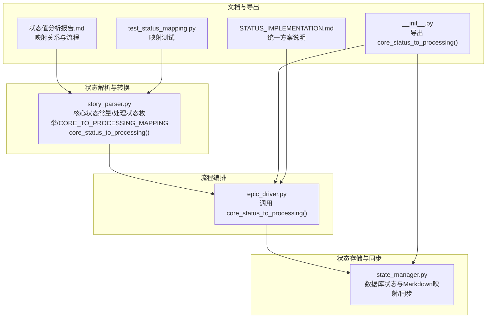
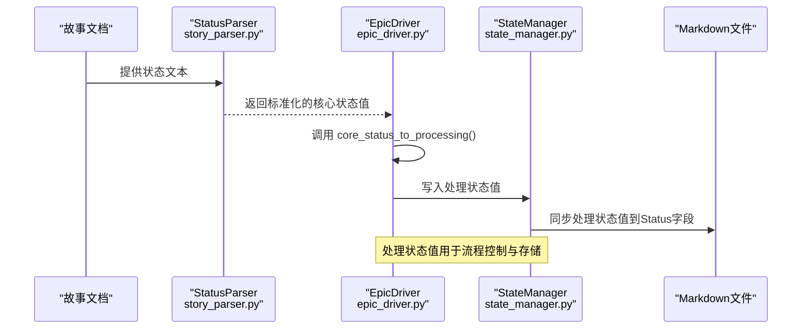
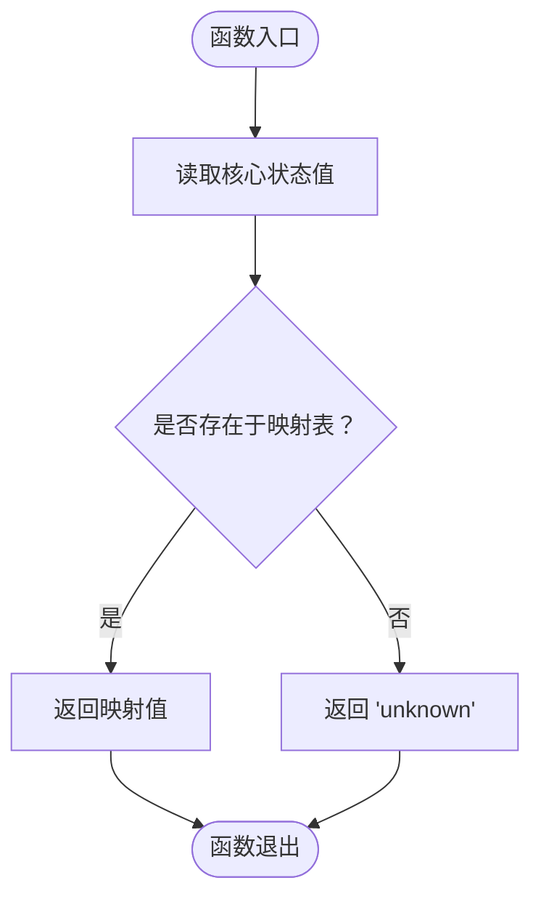
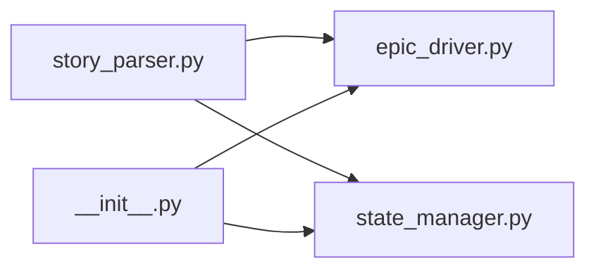

# 核心状态到处理状态映射

<cite>
**本文引用的文件**
- [story_parser.py](file://autoBMAD/epic_automation/story_parser.py)
- [STATUS_IMPLEMENTATION.md](file://autoBMAD/epic_automation/STATUS_IMPLEMENTATION.md)
- [状态值分析报告.md](file://状态值分析报告.md)
- [state_manager.py](file://autoBMAD/epic_automation/state_manager.py)
- [epic_driver.py](file://autoBMAD/epic_automation/epic_driver.py)
- [test_status_mapping.py](file://test_status_mapping.py)
- [__init__.py](file://autoBMAD/epic_automation/__init__.py)
</cite>

## 目录
1. [简介](#简介)
2. [项目结构](#项目结构)
3. [核心组件](#核心组件)
4. [架构总览](#架构总览)
5. [详细组件分析](#详细组件分析)
6. [依赖分析](#依赖分析)
7. [性能考虑](#性能考虑)
8. [故障排查指南](#故障排查指南)
9. [结论](#结论)
10. [附录](#附录)

## 简介
本文件聚焦于“核心状态到处理状态”的单向映射机制，围绕 CORE_TO_PROCESSING_MAPPING 字典及其转换函数 core_status_to_processing 展开，系统阐述其在 SM-Dev-QA 工作流中的作用、映射规则与设计原则，并提供完整的映射表与流程图示，帮助读者快速理解并正确使用该映射。

## 项目结构
与“核心状态到处理状态映射”直接相关的核心文件与职责如下：
- autoBMAD/epic_automation/story_parser.py：定义核心状态常量、处理状态枚举、CORE_TO_PROCESSING_MAPPING 映射字典与 core_status_to_processing 转换函数。
- autoBMAD/epic_automation/state_manager.py：负责数据库状态与 Markdown 文件状态之间的双向映射与同步，其中包含数据库到 Markdown 的映射逻辑。
- autoBMAD/epic_automation/STATUS_IMPLEMENTATION.md：对状态值统一方案的实施内容、使用示例与流程进行系统说明。
- autoBMAD/epic_automation/epic_driver.py：在驱动流程中调用 core_status_to_processing，将解析得到的核心状态转换为处理状态，参与整体流程控制。
- autoBMAD/epic_automation/__init__.py：导出 core_status_to_processing 等工具函数，便于外部模块按需导入。
- 状态值分析报告.md：提供了更全面的状态值分类、映射关系与工作流程说明。
- test_status_mapping.py：包含针对状态标准化与映射的测试用例，验证映射正确性。

图表来源
- [story_parser.py](file://autoBMAD/epic_automation/story_parser.py#L59-L124)
- [epic_driver.py](file://autoBMAD/epic_automation/epic_driver.py#L120-L160)
- [state_manager.py](file://autoBMAD/epic_automation/state_manager.py#L760-L866)
- [STATUS_IMPLEMENTATION.md](file://autoBMAD/epic_automation/STATUS_IMPLEMENTATION.md#L1-L245)
- [__init__.py](file://autoBMAD/epic_automation/__init__.py#L23-L62)
- [test_status_mapping.py](file://test_status_mapping.py#L1-L165)
- [状态值分析报告.md](file://状态值分析报告.md#L160-L210)

章节来源
- [story_parser.py](file://autoBMAD/epic_automation/story_parser.py#L59-L124)
- [STATUS_IMPLEMENTATION.md](file://autoBMAD/epic_automation/STATUS_IMPLEMENTATION.md#L1-L245)

## 核心组件
- 核心状态值（用于文档与人类可读）：Draft、Ready for Development、In Progress、Ready for Review、Ready for Done、Done、Failed。
- 处理状态值（用于数据库存储与内部处理）：pending、in_progress、review、completed、failed、cancelled、error。
- 单向映射字典 CORE_TO_PROCESSING_MAPPING：将核心状态值映射到统一的处理状态值。
- 转换函数 core_status_to_processing：提供核心状态到处理状态的转换入口。

章节来源
- [story_parser.py](file://autoBMAD/epic_automation/story_parser.py#L59-L124)
- [状态值分析报告.md](file://状态值分析报告.md#L1-L40)

## 架构总览
SM-Dev-QA 工作流中的状态流转与映射关系如下：
- 文档状态（核心状态值）经解析后，由 EpicDriver 调用 core_status_to_processing 转换为处理状态值，随后写入数据库。
- 数据库状态在需要时同步回 Markdown 文件，遵循数据库到 Markdown 的映射规则。
- QA Agent 与 Dev Agent 在各自阶段使用处理状态值进行流程控制与判断。

图表来源
- [story_parser.py](file://autoBMAD/epic_automation/story_parser.py#L113-L124)
- [epic_driver.py](file://autoBMAD/epic_automation/epic_driver.py#L120-L160)
- [state_manager.py](file://autoBMAD/epic_automation/state_manager.py#L760-L866)

章节来源
- [STATUS_IMPLEMENTATION.md](file://autoBMAD/epic_automation/STATUS_IMPLEMENTATION.md#L116-L140)

## 详细组件分析

### CORE_TO_PROCESSING_MAPPING 字典与 core_status_to_processing 函数
- 字典结构与映射规则
  - Draft → pending
  - Ready for Development → pending
  - In Progress → in_progress
  - Ready for Review → review
  - Ready for Done → review
  - Done → completed
  - Failed → failed
- 转换函数行为
  - 接收核心状态字符串，返回对应的处理状态字符串。
  - 若输入不在映射表中，默认返回“unknown”，便于上层进行容错处理。

图表来源
- [story_parser.py](file://autoBMAD/epic_automation/story_parser.py#L102-L124)

章节来源
- [story_parser.py](file://autoBMAD/epic_automation/story_parser.py#L102-L124)

### 单向映射在 SM-Dev-QA 工作流中的重要性
- 统一存储与显示
  - 处理状态值用于数据库存储与跨组件通信，核心状态值用于文档与人类可读，避免混用带来的歧义。
- 简化流程控制
  - 业务逻辑只需关心处理状态值，减少分支判断复杂度。
- 降低维护成本
  - 映射集中在一个字典与一个函数中，便于扩展与修改。

章节来源
- [STATUS_IMPLEMENTATION.md](file://autoBMAD/epic_automation/STATUS_IMPLEMENTATION.md#L1-L60)

### 从7种核心状态到5种处理状态的完整映射表
- Draft → pending
- Ready for Development → pending
- In Progress → in_progress
- Ready for Review → review
- Ready for Done → review
- Done → completed
- Failed → failed

说明
- “Ready for Done → review”体现了“准备完成”与“准备审查”在处理层面上的等价性，均指向审查阶段。
- “Draft/Ready for Development → pending”体现了初始阶段的统一归口，便于流程起始与调度。

章节来源
- [story_parser.py](file://autoBMAD/epic_automation/story_parser.py#L102-L110)
- [状态值分析报告.md](file://状态值分析报告.md#L167-L176)

### 设计原则与业务逻辑依据
- 设计原则
  - 单向映射：核心状态 → 处理状态，方向明确，避免双向映射导致的循环依赖与状态回环。
  - 语义对齐：处理状态值更偏向流程控制与存储，核心状态值更偏向文档与业务语义。
  - 向后兼容：保留核心状态值用于文档显示，同时提供转换函数供内部使用。
- 业务逻辑依据
  - 初始阶段（Draft/Ready for Development）统一为 pending，便于统一调度。
  - 进行中（In Progress）映射为 in_progress，便于开发阶段跟踪。
  - 审查阶段（Ready for Review/Ready for Done）统一为 review，便于 QA 阶段聚合。
  - 完成与失败分别映射为 completed 与 failed，便于最终判定与后续流程。

章节来源
- [STATUS_IMPLEMENTATION.md](file://autoBMAD/epic_automation/STATUS_IMPLEMENTATION.md#L116-L140)
- [状态值分析报告.md](file://状态值分析报告.md#L160-L210)

### 在 EpicDriver 中的应用
- EpicDriver 在流程编排中调用 core_status_to_processing，将解析得到的核心状态转换为处理状态，从而驱动后续的开发与 QA 流程。
- 该调用位于驱动流程的早期阶段，确保后续组件均基于统一的处理状态值进行判断与操作。

章节来源
- [epic_driver.py](file://autoBMAD/epic_automation/epic_driver.py#L120-L160)
- [__init__.py](file://autoBMAD/epic_automation/__init__.py#L23-L62)

### 数据库到 Markdown 的状态同步
- state_manager.py 中包含数据库状态到 Markdown 状态的映射逻辑，用于将处理状态值同步回 Markdown 文件的 Status 字段。
- 该映射与 CORE_TO_PROCESSING_MAPPING 的方向相反，用于“从存储到文档”的展示与审计。

章节来源
- [state_manager.py](file://autoBMAD/epic_automation/state_manager.py#L760-L866)
- [状态值分析报告.md](file://状态值分析报告.md#L190-L209)

### 测试验证
- test_status_mapping.py 包含针对状态标准化与映射的测试用例，验证核心状态到处理状态的转换是否符合预期。
- 通过单元测试与集成测试，确保映射在不同组件中的一致性与稳定性。

章节来源
- [test_status_mapping.py](file://test_status_mapping.py#L1-L165)

## 依赖分析
- 组件耦合与内聚
  - story_parser.py 提供核心状态常量、处理状态枚举与映射字典，是状态转换的权威来源。
  - epic_driver.py 依赖 story_parser 的转换函数，确保流程编排使用统一的处理状态值。
  - state_manager.py 依赖映射规则，将处理状态值同步至 Markdown 文件，形成闭环。
- 外部依赖与集成点
  - __init__.py 导出 core_status_to_processing，便于其他模块按需导入与使用。
- 潜在循环依赖
  - 采用单向映射与函数式转换，避免了循环依赖风险；映射字典与转换函数位于 story_parser.py，被其他模块单向依赖。

图表来源
- [story_parser.py](file://autoBMAD/epic_automation/story_parser.py#L102-L124)
- [epic_driver.py](file://autoBMAD/epic_automation/epic_driver.py#L120-L160)
- [state_manager.py](file://autoBMAD/epic_automation/state_manager.py#L760-L866)
- [__init__.py](file://autoBMAD/epic_automation/__init__.py#L23-L62)

章节来源
- [__init__.py](file://autoBMAD/epic_automation/__init__.py#L23-L62)

## 性能考虑
- 映射为字典查找，时间复杂度为 O(1)，对性能无显著影响。
- 状态转换仅在流程起始与同步阶段发生，频率可控，不会成为性能瓶颈。
- 通过集中式映射与函数式转换，减少重复判断与分支，有利于长期维护与性能稳定。

章节来源
- [STATUS_IMPLEMENTATION.md](file://autoBMAD/epic_automation/STATUS_IMPLEMENTATION.md#L210-L215)

## 故障排查指南
- 常见问题
  - 输入状态不在映射表中：core_status_to_processing 返回“unknown”，需检查上游解析逻辑或输入规范化。
  - Markdown 同步异常：检查 state_manager.py 的映射逻辑与文件路径解析，确保 Status 字段格式正确。
  - 流程控制异常：确认 EpicDriver 是否正确调用 core_status_to_processing，避免混用核心状态值。
- 排查步骤
  - 使用 test_status_mapping.py 的测试用例验证映射正确性。
  - 在 epic_driver.py 中打印中间状态，确认转换结果。
  - 检查 state_manager.py 的 Markdown 同步逻辑，定位写入失败原因。

章节来源
- [test_status_mapping.py](file://test_status_mapping.py#L1-L165)
- [state_manager.py](file://autoBMAD/epic_automation/state_manager.py#L760-L866)

## 结论
CORE_TO_PROCESSING_MAPPING 与 core_status_to_processing 构成了 SM-Dev-QA 工作流中的关键桥梁：以单向映射实现“文档语义”与“系统处理”的解耦，既保证了业务可读性，又确保了流程控制的统一性与可维护性。通过集中式映射与函数式转换，系统在复杂度与性能之间取得了良好平衡，并为未来的状态扩展与流程定制提供了清晰的演进路径。

## 附录
- 使用建议
  - 在解析完成后立即调用 core_status_to_processing，确保后续组件使用统一的处理状态值。
  - 如需扩展新状态，优先在 story_parser.py 中添加映射与转换逻辑，并更新相关测试。
  - 对于 Markdown 同步，遵循 state_manager.py 的映射规则，确保展示一致性。