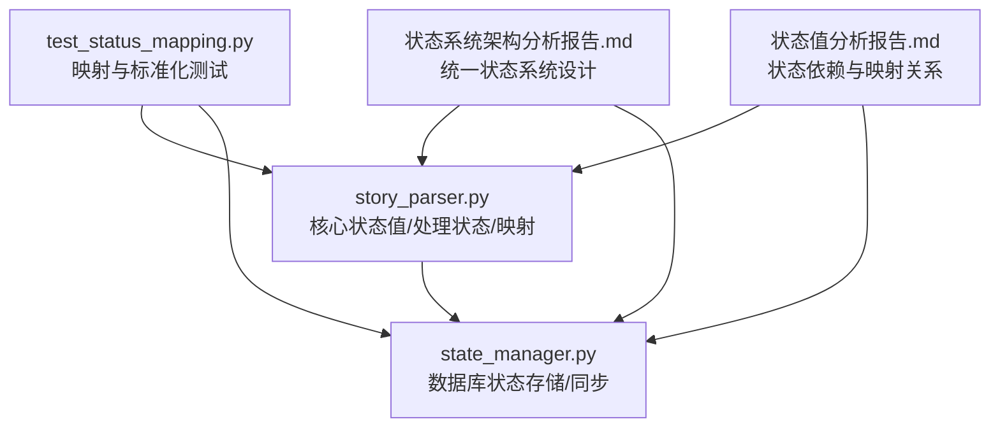
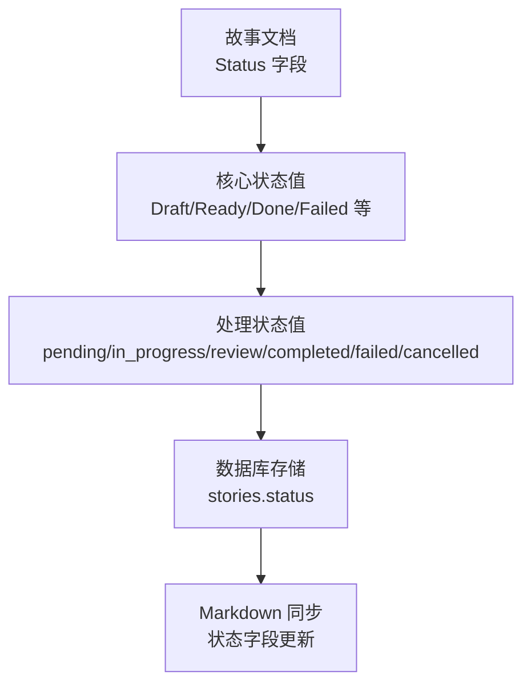
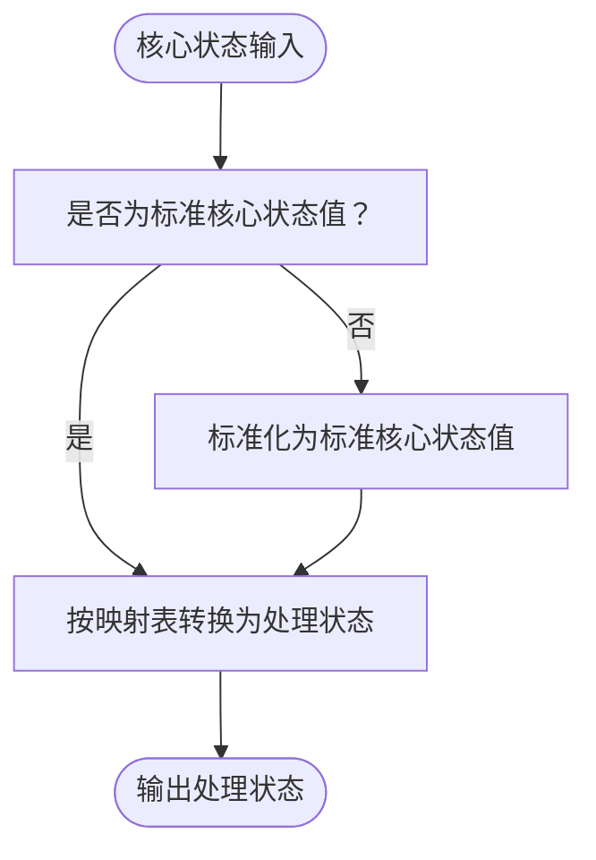
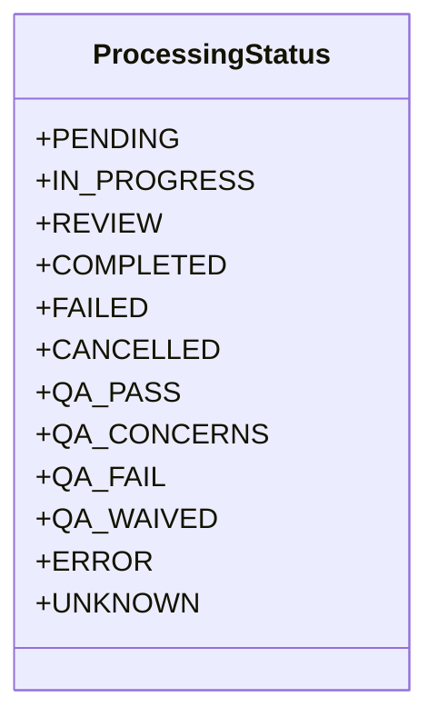
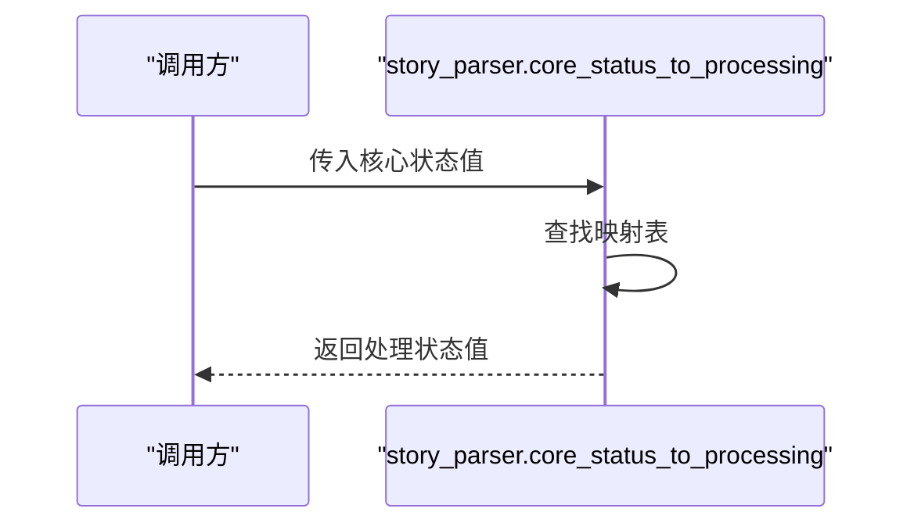
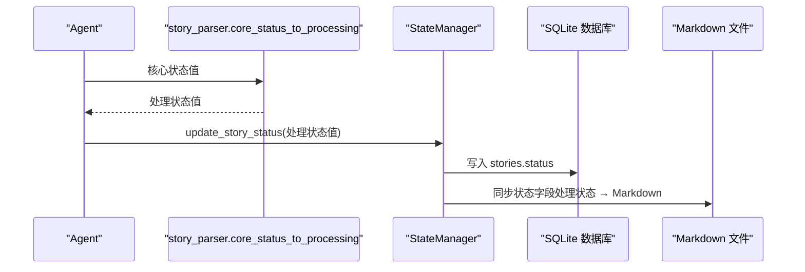
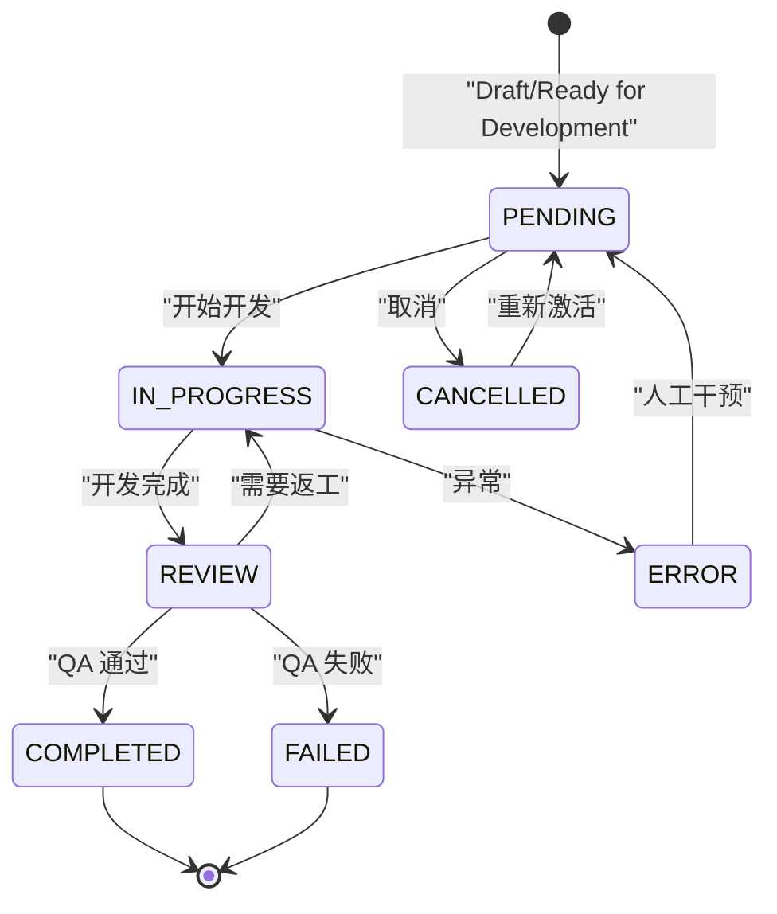
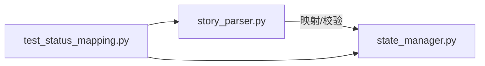

# 状态映射

<cite>
**本文引用的文件**
- [story_parser.py](file://autoBMAD/epic_automation/story_parser.py)
- [state_manager.py](file://autoBMAD/epic_automation/state_manager.py)
- [test_status_mapping.py](file://test_status_mapping.py)
- [状态系统架构分析报告.md](file://状态系统架构分析报告.md)
- [状态值分析报告.md](file://状态值分析报告.md)
</cite>

## 目录
1. [简介](#简介)
2. [项目结构](#项目结构)
3. [核心组件](#核心组件)
4. [架构总览](#架构总览)
5. [详细组件分析](#详细组件分析)
6. [依赖关系分析](#依赖关系分析)
7. [性能考量](#性能考量)
8. [故障排查指南](#故障排查指南)
9. [结论](#结论)
10. [附录](#附录)

## 简介
本文件聚焦“状态映射”主题，系统阐述核心状态值与处理状态值之间的转换机制，重点覆盖：
- CORE_TO_PROCESSING_MAPPING 字典的结构与作用
- core_status_to_processing 函数的单向映射实现
- ProcessingStatus 枚举类的统一处理状态系统（故事处理状态、QA 相关状态、特殊状态）
- 状态映射在 SM-Dev-QA 工作流中的重要性与推进机制
- 完整状态映射表与与 StateManager 的协同工作机制

## 项目结构
围绕状态映射的关键文件与职责如下：
- autoBMAD/epic_automation/story_parser.py：定义核心状态值常量、ProcessingStatus 枚举、核心到处理状态的映射与转换函数
- autoBMAD/epic_automation/state_manager.py：负责数据库状态存储与同步，包含数据库状态到 Markdown 的映射逻辑
- test_status_mapping.py：验证状态标准化与映射逻辑的测试脚本
- 状态系统架构分析报告.md：统一状态系统的设计原则、单向数据流与重构方案
- 状态值分析报告.md：状态值依赖关系、映射关系与工作流程

图表来源
- [story_parser.py](file://autoBMAD/epic_automation/story_parser.py#L80-L124)
- [state_manager.py](file://autoBMAD/epic_automation/state_manager.py#L686-L796)
- [test_status_mapping.py](file://test_status_mapping.py#L1-L165)
- [状态系统架构分析报告.md](file://状态系统架构分析报告.md#L125-L208)
- [状态值分析报告.md](file://状态值分析报告.md#L1-L120)

章节来源
- [story_parser.py](file://autoBMAD/epic_automation/story_parser.py#L80-L124)
- [state_manager.py](file://autoBMAD/epic_automation/state_manager.py#L686-L796)
- [test_status_mapping.py](file://test_status_mapping.py#L1-L165)
- [状态系统架构分析报告.md](file://状态系统架构分析报告.md#L125-L208)
- [状态值分析报告.md](file://状态值分析报告.md#L1-L120)

## 核心组件
- 核心状态值（用于文档与业务逻辑）
  - Draft、Ready for Development、In Progress、Ready for Review、Ready for Done、Done、Failed
- 处理状态值（用于数据库与内部状态跟踪）
  - pending、in_progress、review、completed、failed、cancelled、error
- ProcessingStatus 枚举（统一处理状态系统）
  - 故事处理状态：PENDING、IN_PROGRESS、REVIEW、COMPLETED、FAILED、CANCELLED
  - QA 相关状态：QA_PASS、QA_CONCERNS、QA_FAIL、QA_WAIVED
  - 特殊状态：ERROR、UNKNOWN
- 核心到处理状态映射（单向）
  - Draft/Ready for Development → pending
  - In Progress → in_progress
  - Ready for Review/Ready for Done → review
  - Done → completed
  - Failed → failed
- 单向映射函数
  - core_status_to_processing：核心状态 → 处理状态
  - is_core_status_valid：校验核心状态有效性

章节来源
- [story_parser.py](file://autoBMAD/epic_automation/story_parser.py#L60-L100)
- [story_parser.py](file://autoBMAD/epic_automation/story_parser.py#L80-L124)
- [story_parser.py](file://autoBMAD/epic_automation/story_parser.py#L113-L123)

## 架构总览
统一状态系统遵循“文档 → 核心状态 → 处理状态”的单向数据流原则，避免处理状态反向影响核心状态，从而消除状态循环依赖与不一致风险。

图表来源
- [状态系统架构分析报告.md](file://状态系统架构分析报告.md#L134-L149)
- [state_manager.py](file://autoBMAD/epic_automation/state_manager.py#L686-L796)
- [story_parser.py](file://autoBMAD/epic_automation/story_parser.py#L113-L123)

## 详细组件分析

### 核心状态值与处理状态值映射
- 映射关系（核心 → 处理）
  - Draft/Ready for Development → pending
  - In Progress → in_progress
  - Ready for Review/Ready for Done → review
  - Done → completed
  - Failed → failed
- 反向映射（处理 → 核心）
  - pending → Draft
  - in_progress → In Progress
  - review → Ready for Review
  - completed → Done
  - failed → Failed
  - cancelled/error → Draft（特殊映射）

图表来源
- [story_parser.py](file://autoBMAD/epic_automation/story_parser.py#L102-L123)
- [story_parser.py](file://autoBMAD/epic_automation/story_parser.py#L822-L874)

章节来源
- [story_parser.py](file://autoBMAD/epic_automation/story_parser.py#L102-L123)
- [状态值分析报告.md](file://状态值分析报告.md#L164-L188)

### ProcessingStatus 枚举与状态分类
- 故事处理状态
  - PENDING、IN_PROGRESS、REVIEW、COMPLETED、FAILED、CANCELLED
- QA 相关处理状态
  - QA_PASS、QA_CONCERNS、QA_FAIL、QA_WAIVED
- 特殊状态
  - ERROR、UNKNOWN

图表来源
- [story_parser.py](file://autoBMAD/epic_automation/story_parser.py#L80-L100)

章节来源
- [story_parser.py](file://autoBMAD/epic_automation/story_parser.py#L80-L100)

### 单向映射函数 core_status_to_processing
- 功能：将核心状态值转换为处理状态值，用于数据库存储
- 策略：字典查找，若未命中返回默认值
- 与 ProcessingStatus 的关系：返回值与枚举值一一对应

图表来源
- [story_parser.py](file://autoBMAD/epic_automation/story_parser.py#L113-L123)

章节来源
- [story_parser.py](file://autoBMAD/epic_automation/story_parser.py#L113-L123)

### StateManager 的协同工作机制
- 数据库状态存储
  - stories.status 字段存储处理状态值（pending/in_progress/review/completed/failed/cancelled）
- Markdown 同步
  - 将数据库状态映射为 Markdown 文档的 Status 字段值（Draft/In Progress/Ready for Review/Done/Failed）
  - 支持多种 Status 格式与自动创建
- 错误与取消映射
  - cancelled/error 映射为 Draft，便于统一展示

图表来源
- [story_parser.py](file://autoBMAD/epic_automation/story_parser.py#L113-L123)
- [state_manager.py](file://autoBMAD/epic_automation/state_manager.py#L203-L348)
- [state_manager.py](file://autoBMAD/epic_automation/state_manager.py#L686-L796)

章节来源
- [state_manager.py](file://autoBMAD/epic_automation/state_manager.py#L203-L348)
- [state_manager.py](file://autoBMAD/epic_automation/state_manager.py#L686-L796)

### SM-Dev-QA 工作流中的状态推进
- Draft/Ready for Development → pending
- 开始开发 → in_progress
- 开发完成 → review
- QA 通过 → completed；QA 关注/失败 → review（返工）或 failed
- 取消 → cancelled（映射为 Draft 展示）
- 异常 → error（映射为 Draft 展示）

图表来源
- [状态系统架构分析报告.md](file://状态系统架构分析报告.md#L134-L149)
- [状态值分析报告.md](file://状态值分析报告.md#L210-L238)
- [state_manager.py](file://autoBMAD/epic_automation/state_manager.py#L686-L796)

章节来源
- [状态系统架构分析报告.md](file://状态系统架构分析报告.md#L134-L149)
- [状态值分析报告.md](file://状态值分析报告.md#L210-L238)

### 完整状态映射表
- 核心状态 → 处理状态
  - Draft/Ready for Development → pending
  - In Progress → in_progress
  - Ready for Review/Ready for Done → review
  - Done → completed
  - Failed → failed
- 处理状态 → Markdown 文档
  - pending → Draft
  - in_progress → In Progress
  - review → Ready for Review
  - completed → Done
  - failed → Failed
  - cancelled → Draft
  - error → Failed

章节来源
- [状态值分析报告.md](file://状态值分析报告.md#L164-L209)
- [state_manager.py](file://autoBMAD/epic_automation/state_manager.py#L686-L796)

## 依赖关系分析
- 组件耦合
  - story_parser.py 与 state_manager.py 通过“核心状态 → 处理状态”的单向映射解耦
  - ProcessingStatus 统一了处理状态的定义，避免多处重复
- 直接依赖
  - StateManager 依赖 story_parser 的映射函数与核心状态常量
  - 测试脚本依赖 story_parser 的标准化与映射函数
- 外部集成
  - Markdown 同步依赖正则表达式与文件读写

图表来源
- [story_parser.py](file://autoBMAD/epic_automation/story_parser.py#L113-L123)
- [state_manager.py](file://autoBMAD/epic_automation/state_manager.py#L203-L348)
- [test_status_mapping.py](file://test_status_mapping.py#L1-L165)

章节来源
- [story_parser.py](file://autoBMAD/epic_automation/story_parser.py#L113-L123)
- [state_manager.py](file://autoBMAD/epic_automation/state_manager.py#L203-L348)
- [test_status_mapping.py](file://test_status_mapping.py#L1-L165)

## 性能考量
- 映射复杂度：字典查找 O(1)，性能稳定
- 数据库存储：处理状态值较短，存储与索引开销较低
- Markdown 同步：正则匹配与文件写入，I/O 成本为主
- 建议
  - 对高频状态更新采用批量写入与连接池复用
  - 对 Markdown 同步进行去重与增量更新

[本节为通用指导，不直接分析具体文件]

## 故障排查指南
- 核心状态标准化失败
  - 现象：返回默认 Draft
  - 排查：检查输入格式（大小写、空格、中文/英文变体）
  - 参考：标准化函数逻辑
- 处理状态映射缺失
  - 现象：返回 unknown
  - 排查：确认核心状态是否在映射表中
- Markdown 同步失败
  - 现象：Status 字段未更新或格式不匹配
  - 排查：检查正则模式与文件存在性
- 数据库并发冲突
  - 现象：版本冲突或锁等待
  - 排查：检查乐观锁版本号与锁超时设置

章节来源
- [story_parser.py](file://autoBMAD/epic_automation/story_parser.py#L822-L874)
- [state_manager.py](file://autoBMAD/epic_automation/state_manager.py#L203-L348)
- [state_manager.py](file://autoBMAD/epic_automation/state_manager.py#L686-L796)

## 结论
通过统一的 ProcessingStatus 枚举与单向映射机制，系统实现了“文档 → 核心状态 → 处理状态”的清晰数据流，消除了状态循环依赖与不一致风险。在 SM-Dev-QA 工作流中，状态映射支撑了从草稿到完成的阶段推进与 QA 验证闭环，同时通过 StateManager 的数据库存储与 Markdown 同步，确保了状态的一致性与可观测性。

[本节为总结性内容，不直接分析具体文件]

## 附录

### API 与数据流概览
- 核心状态 → 处理状态：core_status_to_processing
- 处理状态 → Markdown：StateManager 的同步逻辑
- 核心状态标准化：_normalize_story_status

章节来源
- [story_parser.py](file://autoBMAD/epic_automation/story_parser.py#L113-L123)
- [story_parser.py](file://autoBMAD/epic_automation/story_parser.py#L822-L874)
- [state_manager.py](file://autoBMAD/epic_automation/state_manager.py#L686-L796)