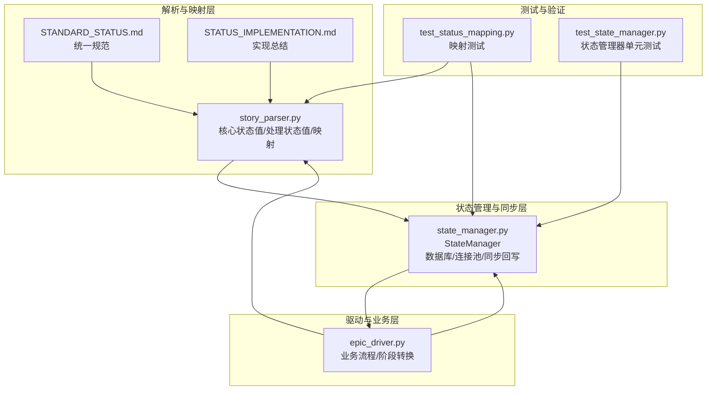
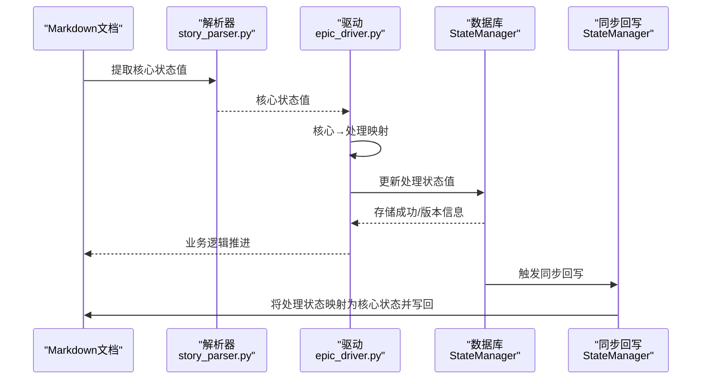
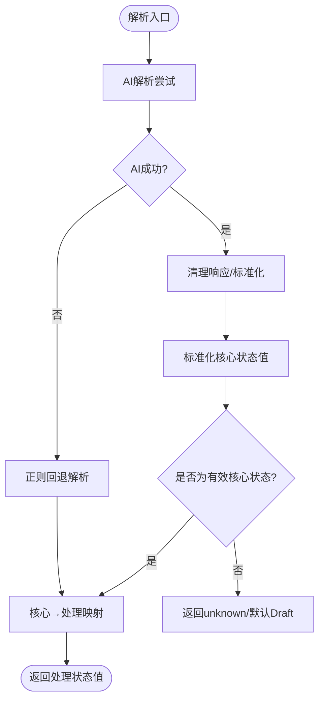
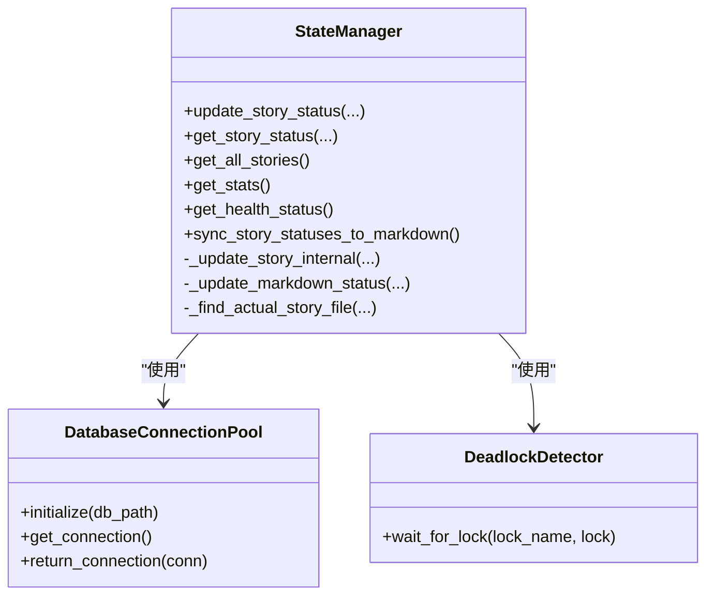
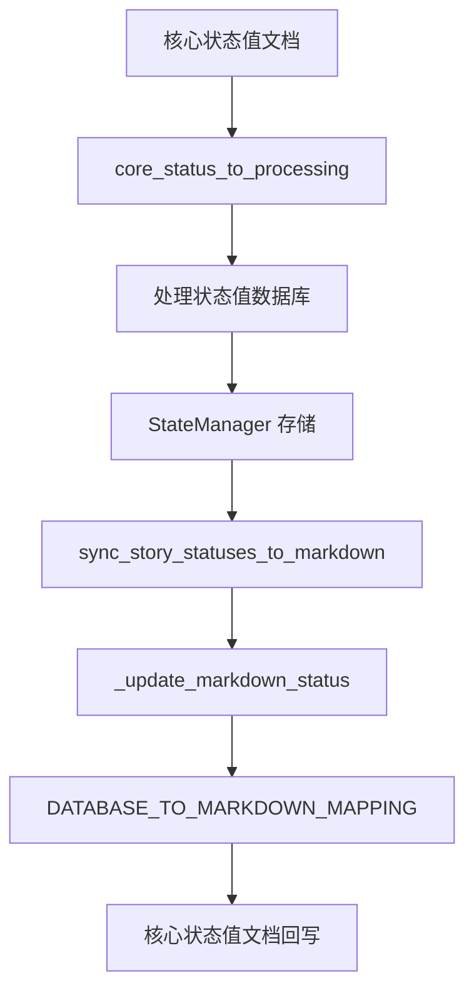
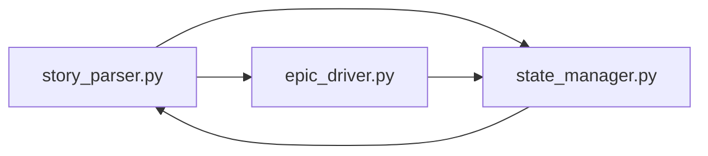

# 状态映射与状态管理器集成

<cite>
**本文引用的文件**
- [story_parser.py](file://autoBMAD/epic_automation/story_parser.py)
- [state_manager.py](file://autoBMAD/epic_automation/state_manager.py)
- [STANDARD_STATUS.md](file://autoBMAD/epic_automation/STANDARD_STATUS.md)
- [STATUS_IMPLEMENTATION.md](file://autoBMAD/epic_automation/STATUS_IMPLEMENTATION.md)
- [epic_driver.py](file://autoBMAD/epic_automation/epic_driver.py)
- [test_status_mapping.py](file://test_status_mapping.py)
- [test_state_manager.py](file://tests-copy/unit/test_state_manager.py)
</cite>

## 目录
1. [简介](#简介)
2. [项目结构](#项目结构)
3. [核心组件](#核心组件)
4. [架构总览](#架构总览)
5. [详细组件分析](#详细组件分析)
6. [依赖关系分析](#依赖关系分析)
7. [性能考量](#性能考量)
8. [故障排查指南](#故障排查指南)
9. [结论](#结论)
10. [附录](#附录)

## 简介
本文件聚焦“状态映射与状态管理器集成”，系统性阐述如下主题：
- Markdown文档解析时的状态映射：核心状态值（供人类可读与文档展示）如何经由解析器映射为处理状态值（供数据库与内部跟踪）。
- 数据库存储与状态管理器：StateManager如何以处理状态值持久化故事进度，并提供查询、统计与健康状态等能力。
- 双向映射机制：从数据库到Markdown文档的同步回写，将处理状态值映射回核心状态值，保证系统各组件间状态表示的一致性。
- SM-Dev-QA工作流闭环：通过统一状态值与映射，确保从文档解析、业务决策、状态存储到文档回写的完整闭环。

## 项目结构
围绕状态映射与状态管理器的关键文件组织如下：
- 解析与映射层：story_parser.py 定义核心状态值、处理状态值与单向映射；STANDARD_STATUS.md/STATUS_IMPLEMENTATION.md 提供规范与实现指导。
- 状态管理与同步层：state_manager.py 提供数据库状态管理、乐观锁、连接池、健康检查与“数据库→Markdown”的同步回写。
- 驱动与业务层：epic_driver.py 在业务流程中调用解析与映射，驱动SM-Dev-QA循环。
- 测试与验证：test_status_mapping.py 与 test_state_manager.py 验证映射正确性与状态管理器行为。

图表来源
- [story_parser.py](file://autoBMAD/epic_automation/story_parser.py#L1-L130)
- [state_manager.py](file://autoBMAD/epic_automation/state_manager.py#L1-L120)
- [STANDARD_STATUS.md](file://autoBMAD/epic_automation/STANDARD_STATUS.md#L1-L120)
- [STATUS_IMPLEMENTATION.md](file://autoBMAD/epic_automation/STATUS_IMPLEMENTATION.md#L1-L120)
- [epic_driver.py](file://autoBMAD/epic_automation/epic_driver.py#L1-L120)
- [test_status_mapping.py](file://test_status_mapping.py#L1-L165)
- [test_state_manager.py](file://tests-copy/unit/test_state_manager.py#L1-L120)

章节来源
- [story_parser.py](file://autoBMAD/epic_automation/story_parser.py#L1-L130)
- [state_manager.py](file://autoBMAD/epic_automation/state_manager.py#L1-L120)
- [STANDARD_STATUS.md](file://autoBMAD/epic_automation/STANDARD_STATUS.md#L1-L120)
- [STATUS_IMPLEMENTATION.md](file://autoBMAD/epic_automation/STATUS_IMPLEMENTATION.md#L1-L120)
- [epic_driver.py](file://autoBMAD/epic_automation/epic_driver.py#L1-L120)
- [test_status_mapping.py](file://test_status_mapping.py#L1-L165)
- [test_state_manager.py](file://tests-copy/unit/test_state_manager.py#L1-L120)

## 核心组件
- 核心状态值（人类可读/文档展示）：Draft、Ready for Development、In Progress、Ready for Review、Ready for Done、Done、Failed。
- 处理状态值（数据库/内部跟踪）：pending、in_progress、review、completed、failed、cancelled、error。
- 单向映射（文档→处理）：核心状态值经 core_status_to_processing 映射为处理状态值。
- 双向映射（处理→文档）：数据库状态经 DATABASE_TO_MARKDOWN_MAPPING 映射回核心状态值，用于同步回写 Markdown。

章节来源
- [STANDARD_STATUS.md](file://autoBMAD/epic_automation/STANDARD_STATUS.md#L1-L120)
- [STATUS_IMPLEMENTATION.md](file://autoBMAD/epic_automation/STATUS_IMPLEMENTATION.md#L1-L120)
- [story_parser.py](file://autoBMAD/epic_automation/story_parser.py#L100-L130)
- [state_manager.py](file://autoBMAD/epic_automation/state_manager.py#L680-L720)

## 架构总览
SM-Dev-QA工作流的闭环如下：
- 文档解析：解析器从Markdown提取核心状态值。
- 状态转换：核心状态值映射为处理状态值。
- 存储：StateManager以处理状态值持久化。
- 业务判断：Dev/QA代理基于核心状态值进行业务逻辑判断。
- 同步回写：StateManager将处理状态值同步回Markdown文档，映射为核心状态值。

图表来源
- [story_parser.py](file://autoBMAD/epic_automation/story_parser.py#L100-L130)
- [epic_driver.py](file://autoBMAD/epic_automation/epic_driver.py#L59-L92)
- [state_manager.py](file://autoBMAD/epic_automation/state_manager.py#L203-L349)
- [state_manager.py](file://autoBMAD/epic_automation/state_manager.py#L627-L795)

## 详细组件分析

### 解析器与状态映射（story_parser.py）
- 核心状态值常量与校验：定义标准核心状态值集合与有效性检查函数。
- 处理状态枚举：统一的处理状态值体系，覆盖故事处理、QA相关与特殊状态。
- 单向映射函数：core_status_to_processing 将核心状态值映射为处理状态值，默认 unknown。
- AI优先解析：parse_status 使用AI解析，失败时回退正则；_extract_status_from_response/_clean_response_string/_simple_fallback_match 等保障鲁棒性。
- 结构化解析：parse_story/parse_epic 支持AI优先与正则回退，返回结构化数据。

图表来源
- [story_parser.py](file://autoBMAD/epic_automation/story_parser.py#L234-L317)
- [story_parser.py](file://autoBMAD/epic_automation/story_parser.py#L318-L525)
- [story_parser.py](file://autoBMAD/epic_automation/story_parser.py#L112-L137)

章节来源
- [story_parser.py](file://autoBMAD/epic_automation/story_parser.py#L57-L137)
- [story_parser.py](file://autoBMAD/epic_automation/story_parser.py#L234-L525)

### 状态管理器（state_manager.py）
- 数据库模型：stories 表包含 epic_path、story_path、status、iteration、qa_result、error_message、created_at、updated_at、phase、version 等字段。
- 并发与锁：使用 asyncio.Lock 与 DeadlockDetector 防止死锁；DatabaseConnectionPool 提升并发性能。
- 状态更新：update_story_status 采用乐观锁（version），支持超时与取消处理；_update_story_internal 原子性地更新或插入记录。
- 查询与统计：get_story_status/get_all_stories/get_stats 提供常用查询与统计。
- 健康检查：get_health_status 汇总数据库与锁状态。
- 同步回写：sync_story_statuses_to_markdown 遍历所有故事记录，逐条调用 _update_markdown_status 将处理状态映射为核心状态并写回 Markdown 文件；_update_markdown_status 内置 DATABASE_TO_MARKDOWN_MAPPING，支持多种Status字段格式。

图表来源
- [state_manager.py](file://autoBMAD/epic_automation/state_manager.py#L97-L182)
- [state_manager.py](file://autoBMAD/epic_automation/state_manager.py#L203-L349)
- [state_manager.py](file://autoBMAD/epic_automation/state_manager.py#L627-L795)

章节来源
- [state_manager.py](file://autoBMAD/epic_automation/state_manager.py#L132-L182)
- [state_manager.py](file://autoBMAD/epic_automation/state_manager.py#L203-L349)
- [state_manager.py](file://autoBMAD/epic_automation/state_manager.py#L627-L795)

### 驱动与业务流程（epic_driver.py）
- 阶段转换：_convert_core_to_processing_status 展示了按阶段微调处理状态的思路（当前可能未直接使用，保留以备扩展）。
- 业务集成：导入 core_status_to_processing/is_core_status_valid 等，确保业务逻辑基于统一的核心状态值。

章节来源
- [epic_driver.py](file://autoBMAD/epic_automation/epic_driver.py#L59-L92)
- [epic_driver.py](file://autoBMAD/epic_automation/epic_driver.py#L1-L60)

### 双向映射机制详解
- 文档→处理（单向）：解析器返回核心状态值，驱动层调用 core_status_to_processing，得到处理状态值后写入数据库。
- 处理→文档（双向）：StateManager.sync_story_statuses_to_markdown 遍历记录，调用 _update_markdown_status；后者使用 DATABASE_TO_MARKDOWN_MAPPING 将处理状态映射为核心状态值，再写回 Markdown 的 Status 字段。

图表来源
- [story_parser.py](file://autoBMAD/epic_automation/story_parser.py#L100-L130)
- [state_manager.py](file://autoBMAD/epic_automation/state_manager.py#L687-L709)
- [state_manager.py](file://autoBMAD/epic_automation/state_manager.py#L677-L795)

章节来源
- [story_parser.py](file://autoBMAD/epic_automation/story_parser.py#L100-L130)
- [state_manager.py](file://autoBMAD/epic_automation/state_manager.py#L677-L795)

## 依赖关系分析
- 组件耦合：
  - story_parser.py 与 epic_driver.py：epic_driver 导入 core_status_to_processing/is_core_status_valid，形成业务层对解析层的依赖。
  - state_manager.py 与 story_parser.py：state_manager 依赖 story_parser.ProcessingStatus（用于QA工具集成），同时在同步回写时使用核心状态值映射。
- 映射依赖：
  - 单向映射：story_parser.core_status_to_processing → state_manager（写库）。
  - 双向映射：state_manager.DATABASE_TO_MARKDOWN_MAPPING → story_parser（回写文档）。
- 外部依赖：
  - SQLite（本地数据库）、正则表达式、异步I/O、日志系统。

图表来源
- [story_parser.py](file://autoBMAD/epic_automation/story_parser.py#L1-L130)
- [state_manager.py](file://autoBMAD/epic_automation/state_manager.py#L1-L120)
- [epic_driver.py](file://autoBMAD/epic_automation/epic_driver.py#L1-L60)

章节来源
- [story_parser.py](file://autoBMAD/epic_automation/story_parser.py#L1-L130)
- [state_manager.py](file://autoBMAD/epic_automation/state_manager.py#L1-L120)
- [epic_driver.py](file://autoBMAD/epic_automation/epic_driver.py#L1-L60)

## 性能考量
- 连接池与并发：DatabaseConnectionPool 与 WAL 模式、PRAGMA 调优提升并发与吞吐。
- 锁与超时：StateManager 使用 asyncio.Lock 与超时控制，避免长时间阻塞；DeadlockDetector 检测潜在死锁。
- 映射复杂度：状态映射为O(1)字典查找，开销极低。
- I/O与正则：解析与回写涉及文件I/O与正则匹配，建议批量处理与缓存热点文件路径以降低开销。

章节来源
- [state_manager.py](file://autoBMAD/epic_automation/state_manager.py#L59-L95)
- [state_manager.py](file://autoBMAD/epic_automation/state_manager.py#L132-L182)
- [state_manager.py](file://autoBMAD/epic_automation/state_manager.py#L203-L349)

## 故障排查指南
- 解析失败回退：
  - 若AI解析失败或不可用，解析器自动回退至正则解析；检查日志以定位失败原因。
  - _extract_status_from_response/_clean_response_string/_simple_fallback_match 提供多级清理与回退策略。
- 数据库存储异常：
  - update_story_status 支持超时与取消处理；若超时或取消，检查锁竞争与数据库负载。
  - 乐观锁冲突：expected_version 与当前版本不一致时返回冲突，需重试或合并。
- 同步回写失败：
  - _update_markdown_status 支持多种Status字段格式；若未找到Status字段，会在合适位置插入；若文件不存在，会尝试查找实际文件并记录警告。
- 健康检查：
  - get_health_status 返回数据库、锁、连接池等状态，便于快速诊断。

章节来源
- [story_parser.py](file://autoBMAD/epic_automation/story_parser.py#L234-L317)
- [state_manager.py](file://autoBMAD/epic_automation/state_manager.py#L203-L349)
- [state_manager.py](file://autoBMAD/epic_automation/state_manager.py#L627-L795)

## 结论
通过统一的核心状态值与处理状态值、明确的单向与双向映射，以及StateManager的数据库持久化与同步回写能力，系统实现了从文档解析、业务判断、状态存储到文档回写的完整闭环。该设计确保了跨组件状态表示的一致性，降低了状态歧义与维护成本，并为SM-Dev-QA工作流提供了可靠支撑。

## 附录
- 规范与实现参考：
  - [STANDARD_STATUS.md](file://autoBMAD/epic_automation/STANDARD_STATUS.md#L1-L213)
  - [STATUS_IMPLEMENTATION.md](file://autoBMAD/epic_automation/STATUS_IMPLEMENTATION.md#L1-L245)
- 测试参考：
  - [test_status_mapping.py](file://test_status_mapping.py#L1-L165)
  - [test_state_manager.py](file://tests-copy/unit/test_state_manager.py#L1-L273)