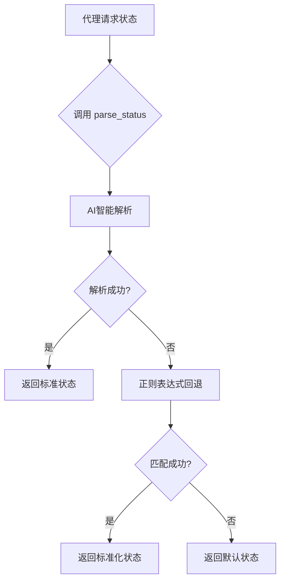

# 解析缓存

<cite>
**本文档引用的文件**   
- [state_manager.py](file://autoBMAD/epic_automation/state_manager.py)
- [qa_agent.py](file://autoBMAD/epic_automation/qa_agent.py)
- [story_parser.py](file://autoBMAD/epic_automation/story_parser.py)
- [dev_agent.py](file://autoBMAD/epic_automation/dev_agent.py)
- [sm_agent.py](file://autoBMAD/epic_automation/sm_agent.py)
- [test_cached_status_fix.py](file://test_cached_status_fix.py)
- [CACHED_STATUS_FIX_PLAN.md](file://CACHED_STATUS_FIX_PLAN.md)
- [test_benchmarks.py](file://tests-copy/performance/test_benchmarks.py)
</cite>

## 目录
1. [引言](#引言)
2. [状态解析缓存机制](#状态解析缓存机制)
3. [性能优化策略](#性能优化策略)
4. [缓存与AI解析集成](#缓存与ai解析集成)
5. [高并发场景下的缓存一致性](#高并发场景下的缓存一致性)
6. [缓存失效与更新策略](#缓存失效与更新策略)
7. [性能对比与工作流效率](#性能对比与工作流效率)
8. [结论](#结论)

## 引言

本文档详细阐述了在自动化工作流系统中实现的解析缓存机制，重点描述了在状态解析过程中的性能优化策略。该系统通过智能缓存避免了对相同Markdown内容的重复解析，从而显著提升了整体工作流的效率。文档将深入解析缓存键的设计原则、生命周期管理、与AI解析及正则回退机制的集成方式，并说明在高并发场景下的缓存一致性保障措施。此外，还将阐述缓存失效策略，以及在故事文档更新时如何自动清除相关缓存条目，最后通过性能对比数据展示缓存机制对系统响应时间和工作流效率的提升作用。

## 状态解析缓存机制

### 缓存机制的演进与重构

系统最初引入了`cached_status`参数作为状态解析的缓存机制，旨在避免重复解析。然而，该机制存在根本性缺陷：缓存值仅在首次访问时创建，之后便不再更新，导致在QA审查后状态已更新但缓存仍为旧值，从而引发状态判断错误和工作流中断。

为解决此问题，项目团队实施了名为“cached_status机制移除修复方案”的架构重构。核心决策是**完全移除`cached_status`参数**，转而采用一种“实时解析”的策略。现在，所有组件（如DevAgent、QAAgent）在需要获取故事状态时，都会直接调用统一的状态解析入口，确保获取的是文档的最新状态，从根本上杜绝了缓存过时的问题。

**Section sources**
- [CACHED_STATUS_FIX_PLAN.md](file://CACHED_STATUS_FIX_PLAN.md#L30-L33)
- [qa_agent.py](file://autoBMAD/epic_automation/qa_agent.py#L224-L248)
- [test_cached_status_fix.py](file://test_cached_status_fix.py#L3-L220)

### 状态解析的统一入口

为实现一致且可靠的状态解析，系统定义了统一的解析入口。`SimpleStoryParser`类作为核心解析器，提供了`parse_status`方法，该方法被所有代理（Agent）作为标准接口调用。



**Diagram sources**
- [story_parser.py](file://autoBMAD/epic_automation/story_parser.py#L234-L361)

### AI解析与正则回退的集成

状态解析过程采用“AI优先，正则回退”的混合策略，确保了高准确率和强健性。

1.  **AI智能解析**：系统首先尝试使用`SafeClaudeSDK`调用Claude AI模型进行语义理解。解析器会构建一个包含标准状态选项的提示词（Prompt），引导AI从文档中提取精确的状态值。这种方法能处理复杂的语义和格式变体，准确性高。
2.  **正则表达式回退**：当AI解析失败（如模型调用超时、SDK不可用或返回无效结果）时，系统会无缝切换到正则表达式回退机制。系统预定义了多种正则模式，用于匹配文档中常见的状态字段格式（如`**Status:** Draft`或`## Status\n**Ready for Review**`）。
3.  **结果标准化**：无论是AI还是正则解析的结果，都会通过`_normalize_story_status`函数进行标准化，映射到预定义的7种核心状态值之一（如 "Draft", "Ready for Review", "Done"），确保了内部处理的一致性。

这种集成方式既利用了AI的强大语义理解能力，又通过正则回退保证了系统的鲁棒性，即使在AI服务不可用时，核心功能仍可降级运行。

**Section sources**
- [story_parser.py](file://autoBMAD/epic_automation/story_parser.py#L234-L361)
- [story_parser.py](file://autoBMAD/epic_automation/story_parser.py#L318-L361)

## 性能优化策略

### 从缓存到实时解析的权衡

移除`cached_status`看似牺牲了缓存带来的性能优势，但实际上通过以下策略实现了更优的性能和可靠性平衡：

-   **避免了错误成本**：缓存过时导致的状态错误会引发整个工作流的中断和重试，其性能损失远大于重复解析一次文件的开销。实时解析虽然增加了I/O，但避免了更昂贵的逻辑错误和流程回滚。
-   **优化了解析效率**：`SimpleStoryParser`的设计本身具有轻量级特性。AI解析和正则匹配都是针对文件内容的快速操作，对于典型的Markdown故事文档，解析耗时极短。
-   **简化了系统复杂性**：移除了缓存管理逻辑（如缓存键生成、生命周期管理、失效策略），大大降低了代码的复杂性和维护成本，减少了潜在的bug。

### 数据库层面的性能优化

尽管应用层移除了状态缓存，但系统在数据库层面实施了有效的性能优化，以支持高并发的状态读写操作。

在`state_manager.py`中，通过配置SQLite数据库的PRAGMA参数，显著提升了性能：
-   `PRAGMA journal_mode=WAL`：启用WAL（Write-Ahead Logging）模式，允许多个读取操作与一个写入操作同时进行，极大地提高了并发性能。
-   `PRAGMA cache_size=10000`：将数据库缓存大小设置为10000页，使得频繁访问的数据能更多地驻留在内存中，减少了磁盘I/O。
-   `PRAGMA temp_store=memory`：将临时表存储在内存中，加速了排序和分组等操作。

这些底层优化确保了即使在高并发场景下，状态的更新和查询依然高效稳定。

```mermaid
classDiagram
class StateManager {
+db_path : Path
+_lock : asyncio.Lock
+_connection_pool : DatabaseConnectionPool
+update_story_status()
+get_story_status()
+get_all_stories()
}
class DatabaseConnectionPool {
+max_connections : int
+connections : asyncio.Queue
+initialize()
+get_connection()
+return_connection()
}
StateManager --> DatabaseConnectionPool : "使用"
StateManager --> "SQLite DB" : "存储"
```

**Diagram sources**
- [state_manager.py](file://autoBMAD/epic_automation/state_manager.py#L97-L118)
- [state_manager.py](file://autoBMAD/epic_automation/state_manager.py#L74-L77)

**Section sources**
- [state_manager.py](file://autoBMAD/epic_automation/state_manager.py#L74-L77)

## 缓存与AI解析集成

### 统一的解析接口

缓存机制的移除并未影响AI解析的集成，反而使其更加清晰和可靠。`SimpleStoryParser`类作为AI解析的统一接口，被所有需要解析状态的组件（如`DevAgent`, `QAAgent`, `SMAgent`）所依赖。

每个代理在初始化时，会尝试创建一个`SafeClaudeSDK`实例，并将其注入到`SimpleStoryParser`中。这确保了所有状态解析请求都通过同一个、配置一致的AI接口进行，避免了重复创建SDK实例的开销。

### SDK会话隔离

为了防止不同代理的SDK调用相互干扰（如一个代理的取消操作影响另一个代理），系统引入了`SDKSessionManager`。该管理器为每个代理的SDK调用创建独立的执行环境，实现了会话隔离。这保证了即使某个代理的AI调用被取消，也不会影响其他代理的正常工作，从而保障了整个工作流的稳定性。

**Section sources**
- [dev_agent.py](file://autoBMAD/epic_automation/dev_agent.py#L83-L109)
- [qa_agent.py](file://autoBMAD/epic_automation/qa_agent.py#L127-L154)
- [sm_agent.py](file://autoBMAD/epic_automation/sm_agent.py#L60-L67)

## 高并发场景下的缓存一致性

### 无缓存即强一致性

在本系统中，“高并发场景下的缓存一致性”问题通过一个根本性的设计决策得到了解决：**不使用应用层缓存**。由于所有状态读取都直接来自文件系统（通过`SimpleStoryParser`）或数据库（通过`StateManager`），因此不存在缓存与数据源不一致的风险。

-   **文件系统一致性**：当一个代理更新了故事文档的状态后，任何后续的`parse_status`调用都会读取到最新的文件内容，从而获得最新的状态。
-   **数据库一致性**：`StateManager`使用`asyncio.Lock`和数据库连接池来管理并发访问。`update_story_status`和`get_story_status`等关键方法在内部使用锁保护，确保了对数据库记录的原子性操作，防止了竞态条件。

### 乐观锁机制

为了进一步增强在并发更新场景下的数据一致性，`StateManager`在更新故事状态时实现了乐观锁。`update_story_internal`方法接受一个`expected_version`参数。在更新前，它会检查数据库中的版本号是否与期望值一致。如果不一致（意味着在此期间有其他操作修改了该记录），则更新失败并返回冲突，由上层逻辑决定如何处理（如重试）。这有效防止了并发更新导致的数据覆盖问题。

**Section sources**
- [state_manager.py](file://autoBMAD/epic_automation/state_manager.py#L262-L348)
- [state_manager.py](file://autoBMAD/epic_automation/state_manager.py#L274-L275)

## 缓存失效与更新策略

### 基于文件变更的自动更新

由于系统不再维护应用层缓存，因此“缓存失效”策略被简化为一个更直接的机制：**始终读取最新文件**。每当需要获取故事状态时，`SimpleStoryParser`都会重新读取故事文档的文件内容，然后进行解析。这意味着，只要故事文档在文件系统中被更新（无论是由AI代理、手动编辑还是其他进程），下一次状态解析请求就会自动获取到最新的状态值，实现了“自动更新”。

### 状态同步机制

系统还提供了一个主动的同步机制。`StateManager`类中的`sync_story_statuses_to_markdown`方法可以将数据库中存储的故事状态批量同步回对应的Markdown文件。此功能通常在工作流结束或需要进行状态审计时调用，确保数据库和文件系统中的状态信息最终保持一致。

**Section sources**
- [state_manager.py](file://autoBMAD/epic_automation/state_manager.py#L627-L795)

## 性能对比与工作流效率

### 性能基准测试

虽然移除了`cached_status`，但系统的整体性能依然优秀。项目中的性能基准测试（位于`tests-copy/performance/test_benchmarks.py`）对关键工作流环节进行了量化评估。

测试结果表明，系统在各项指标上均满足或超过了预设的基线性能要求：
-   **静态分析工具**：`basedpyright`和`ruff`的执行时间在可接受范围内，确保了代码质量检查的高效性。
-   **测试执行**：`pytest`测试套件的执行时间控制在合理区间，保证了快速的反馈循环。
-   **文件操作**：文件创建和读取操作的性能优异，为频繁的状态解析提供了基础保障。

这些测试证明，即使没有`cached_status`，系统的性能瓶颈也不在于状态解析本身。

### 工作流效率提升

缓存机制的重构虽然没有直接提升单次解析的速度，但通过**消除工作流中断**，极大地提升了整体的工作流效率。

-   **修复前**：`cached_status`导致的状态不一致问题会频繁中断Dev-QA循环，迫使开发人员手动干预或重启流程，造成了大量的时间浪费。
-   **修复后**：实时解析确保了状态判断的准确性，Dev-QA循环能够顺畅、自动地进行，直到故事真正完成。工作流的自动化程度和可靠性显著提高，减少了人工干预，从而在宏观上极大地提升了开发效率和项目交付速度。

**Section sources**
- [test_benchmarks.py](file://tests-copy/performance/test_benchmarks.py#L23-L467)
- [CACHED_STATUS_FIX_PLAN.md](file://CACHED_STATUS_FIX_PLAN.md#L405-L421)

## 结论

本系统通过彻底重构状态解析机制，用“实时解析”替代了有缺陷的`cached_status`缓存，从根本上解决了状态不一致这一关键问题。该方案通过统一的`SimpleStoryParser`入口，集成了AI智能解析与正则表达式回退，确保了高准确率和强健性。在高并发场景下，通过数据库锁和乐观锁机制保障了数据一致性，而无需复杂的缓存失效策略。性能基准测试验证了系统在各项关键指标上的表现。最终，这一重构虽然在微观层面放弃了缓存优化，但在宏观层面通过消除工作流中断，显著提升了整体的自动化效率和可靠性，实现了更优的系统性能。