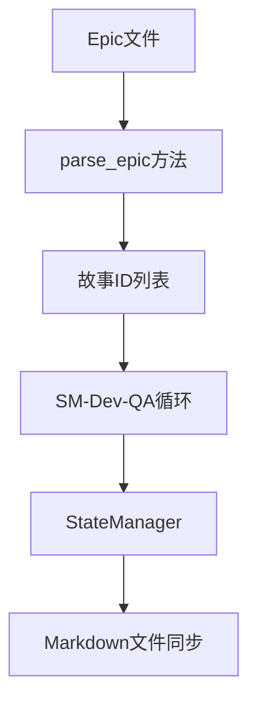
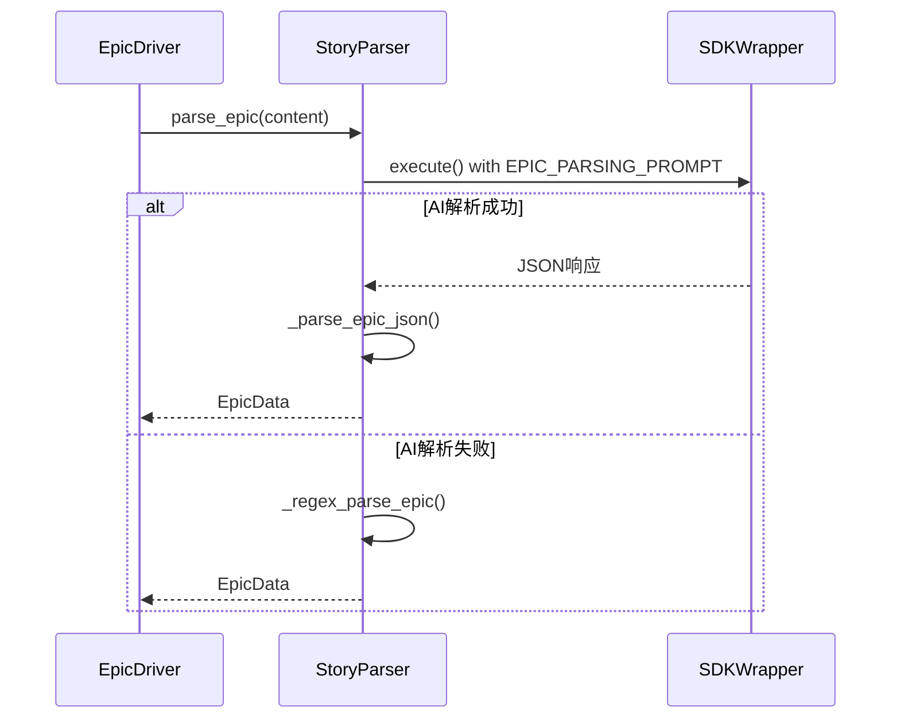
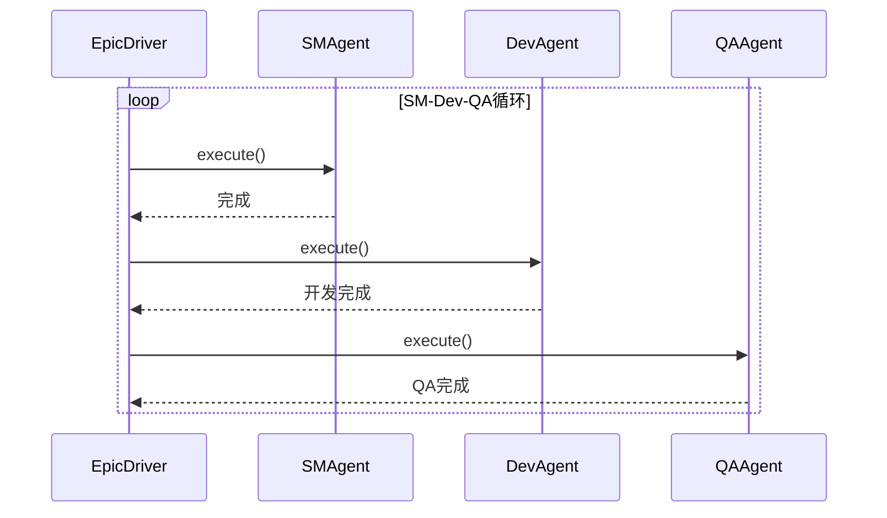
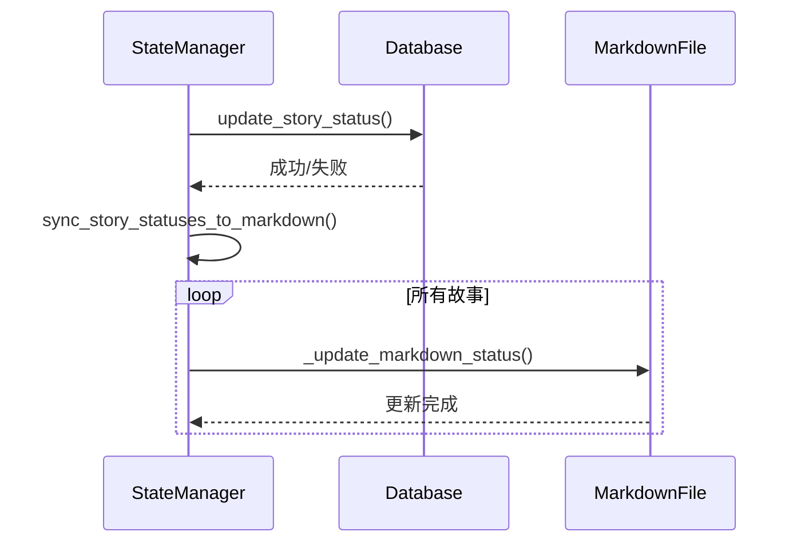
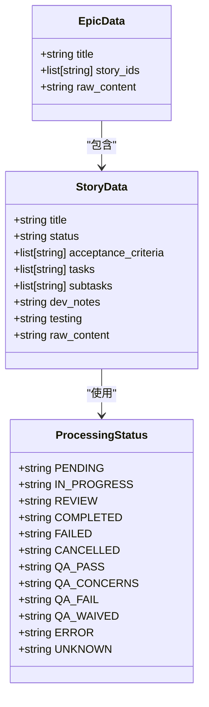
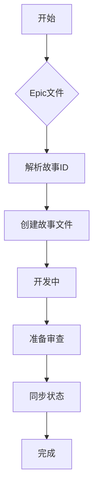
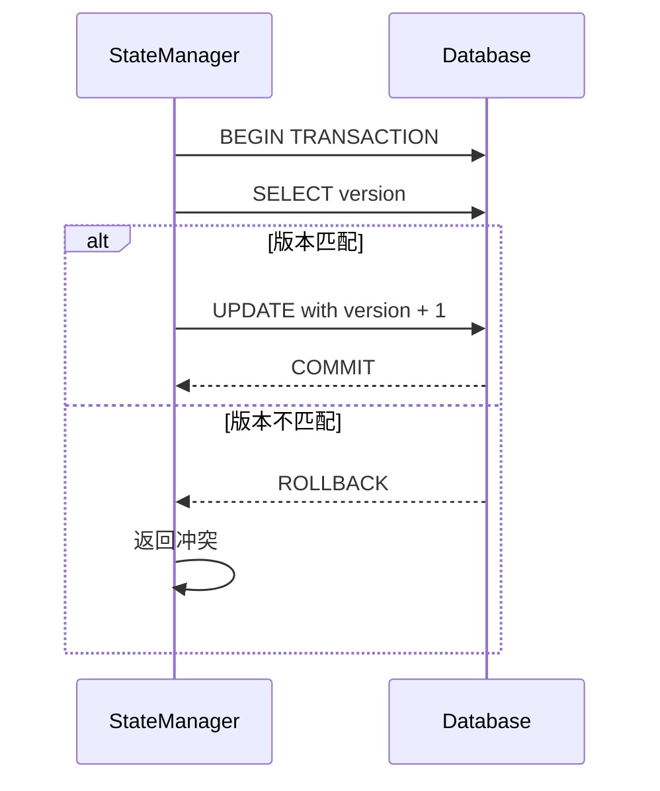

# 数据流

<cite>
**本文档引用的文件**
- [story_parser.py](file://autoBMAD/epic_automation/story_parser.py)
- [state_manager.py](file://autoBMAD/epic_automation/state_manager.py)
- [epic_driver.py](file://autoBMAD/epic_automation/epic_driver.py)
- [dev_agent.py](file://autoBMAD/epic_automation/dev_agent.py)
- [qa_agent.py](file://autoBMAD/epic_automation/qa_agent.py)
- [sm_agent.py](file://autoBMAD/epic_automation/sm_agent.py)
- [sdk_wrapper.py](file://autoBMAD/epic_automation/sdk_wrapper.py)
</cite>

## 目录
1. [引言](#引言)
2. [数据流概述](#数据流概述)
3. [Epic文件解析](#epic文件解析)
4. [SM-Dev-QA循环处理](#sm-dev-qa循环处理)
5. [状态持久化与同步](#状态持久化与同步)
6. [数据结构与转换](#数据结构与转换)
7. [数据流示例](#数据流示例)
8. [数据一致性保证](#数据一致性保证)

## 引言
本文档详细描述了从Epic文件解析到故事状态同步的完整数据流。系统通过解析Epic文件提取故事ID，经过SM-Dev-QA循环处理，最终由StateManager持久化并同步回Markdown文件。文档重点说明了数据在组件间的传递方式、异步调用中的数据流控制和错误处理机制。

## 数据流概述
系统数据流始于Epic文件的解析，通过`parse_epic`方法提取故事ID，然后进入SM-Dev-QA循环处理阶段，最后由StateManager进行持久化并同步回Markdown文件。整个流程涉及多个组件的协同工作，包括EpicDriver、StoryParser、DevAgent、QAAgent、SMAgent和StateManager。

**图源**
- [epic_driver.py](file://autoBMAD/epic_automation/epic_driver.py#L680-L702)
- [story_parser.py](file://autoBMAD/epic_automation/story_parser.py#L673-L683)
- [state_manager.py](file://autoBMAD/epic_automation/state_manager.py#L627-L668)

## Epic文件解析
Epic文件解析是数据流的起点，通过`SimpleStoryParser.parse_epic`方法实现。该方法采用AI优先、正则回退的策略，首先尝试使用Claude SDK进行智能解析，失败时回退到正则表达式解析。

**图源**
- [story_parser.py](file://autoBMAD/epic_automation/story_parser.py#L673-L764)
- [epic_driver.py](file://autoBMAD/epic_automation/epic_driver.py#L680-L702)

**节源**
- [story_parser.py](file://autoBMAD/epic_automation/story_parser.py#L673-L764)
- [epic_driver.py](file://autoBMAD/epic_automation/epic_driver.py#L680-L702)

## SM-Dev-QA循环处理
SM-Dev-QA循环是系统的核心处理流程，由EpicDriver协调SMAgent、DevAgent和QAAgent完成。该循环处理故事的开发和质量保证，确保每个故事都经过完整的开发-测试周期。

**图源**
- [epic_driver.py](file://autoBMAD/epic_automation/epic_driver.py#L535-L680)
- [dev_agent.py](file://autoBMAD/epic_automation/dev_agent.py#L239-L304)
- [qa_agent.py](file://autoBMAD/epic_automation/qa_agent.py#L222-L338)

**节源**
- [epic_driver.py](file://autoBMAD/epic_automation/epic_driver.py#L535-L680)
- [dev_agent.py](file://autoBMAD/epic_automation/dev_agent.py#L239-L304)
- [qa_agent.py](file://autoBMAD/epic_automation/qa_agent.py#L222-L338)

## 状态持久化与同步
StateManager负责故事状态的持久化和同步，使用SQLite数据库存储状态信息，并提供将状态同步回Markdown文件的功能。该组件确保了数据的一致性和可靠性。

**图源**
- [state_manager.py](file://autoBMAD/epic_automation/state_manager.py#L203-L248)
- [state_manager.py](file://autoBMAD/epic_automation/state_manager.py#L627-L668)

**节源**
- [state_manager.py](file://autoBMAD/epic_automation/state_manager.py#L203-L248)
- [state_manager.py](file://autoBMAD/epic_automation/state_manager.py#L627-L668)

## 数据结构与转换
系统使用多种数据结构来表示故事和Epic信息，并在不同阶段进行转换。核心数据结构包括StoryData、EpicData和ProcessingStatus，这些结构在组件间传递时会进行相应的转换。

**图源**
- [story_parser.py](file://autoBMAD/epic_automation/story_parser.py#L34-L46)
- [story_parser.py](file://autoBMAD/epic_automation/story_parser.py#L48-L55)
- [story_parser.py](file://autoBMAD/epic_automation/story_parser.py#L80-L100)

**节源**
- [story_parser.py](file://autoBMAD/epic_automation/story_parser.py#L34-L100)

## 数据流示例
以下是一个典型故事处理过程中的数据流示例，展示了数据在各个阶段的变化：

1. **初始状态**: Epic文件包含故事ID "1.1"
2. **解析阶段**: `parse_epic`方法提取故事ID "1.1"
3. **SM阶段**: SMAgent创建故事文件 "1.1.md"
4. **Dev阶段**: DevAgent将状态更新为 "In Progress"
5. **QA阶段**: QAAgent将状态更新为 "Ready for Review"
6. **同步阶段**: StateManager将最终状态同步回Markdown文件

**图源**
- [epic_driver.py](file://autoBMAD/epic_automation/epic_driver.py#L535-L680)
- [state_manager.py](file://autoBMAD/epic_automation/state_manager.py#L627-L668)

## 数据一致性保证
系统通过多种机制保证数据一致性，包括数据库事务、乐观锁和定期备份。StateManager使用数据库事务确保状态更新的原子性，并通过乐观锁防止并发更新冲突。

**图源**
- [state_manager.py](file://autoBMAD/epic_automation/state_manager.py#L262-L348)
- [state_manager.py](file://autoBMAD/epic_automation/state_manager.py#L544-L567)

**节源**
- [state_manager.py](file://autoBMAD/epic_automation/state_manager.py#L262-L348)
- [state_manager.py](file://autoBMAD/epic_automation/state_manager.py#L544-L567)