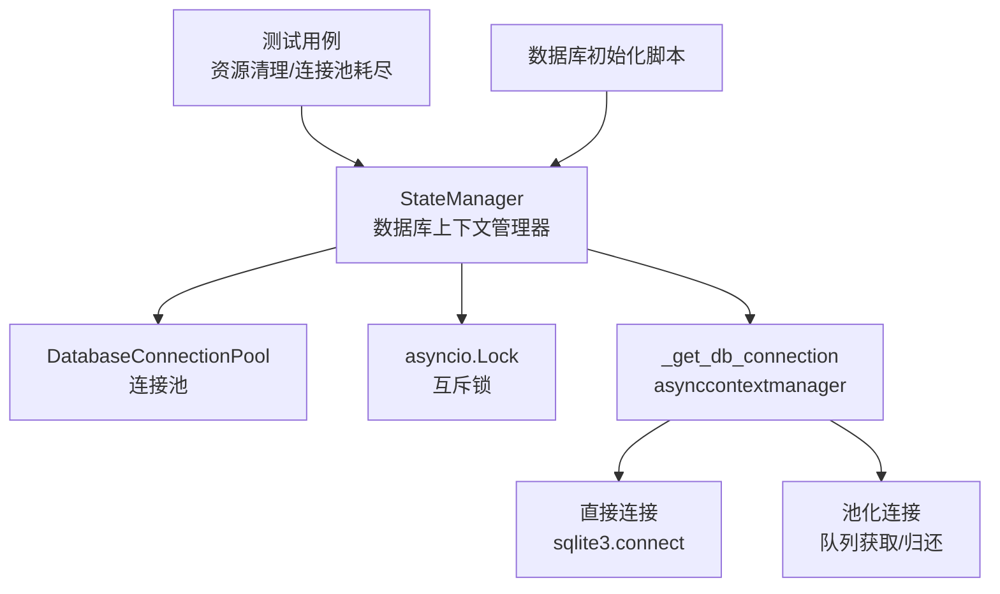
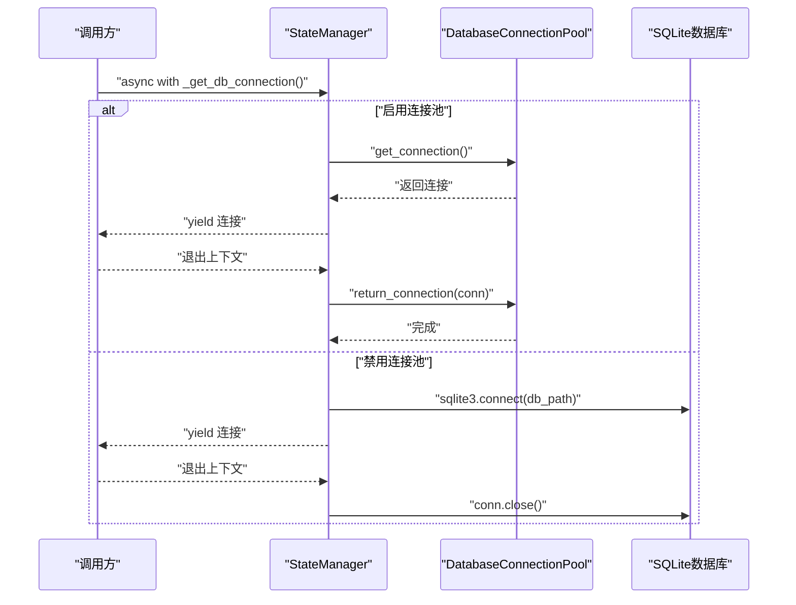
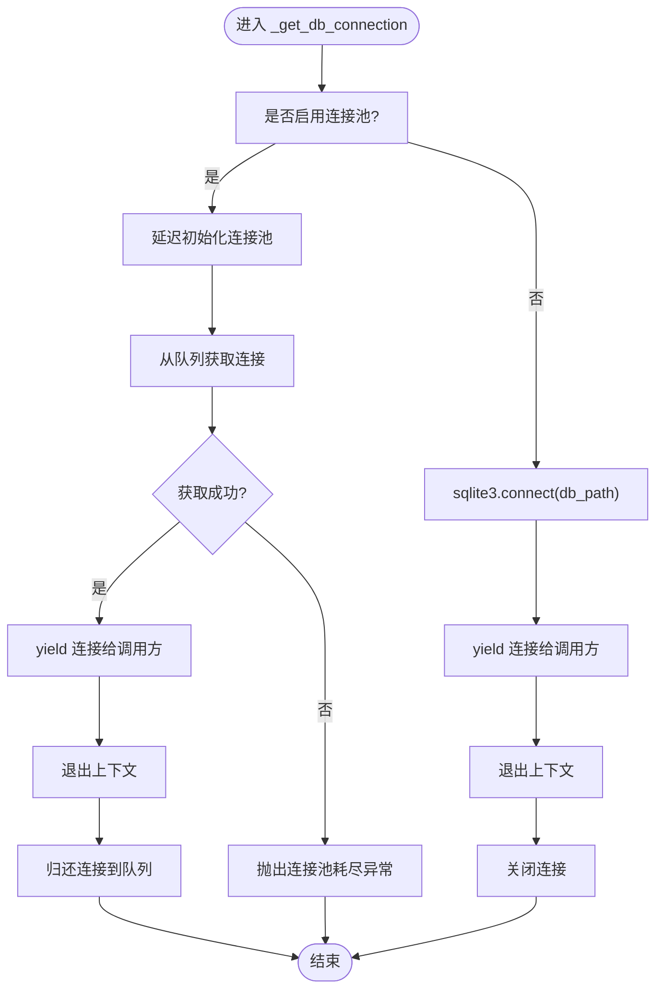
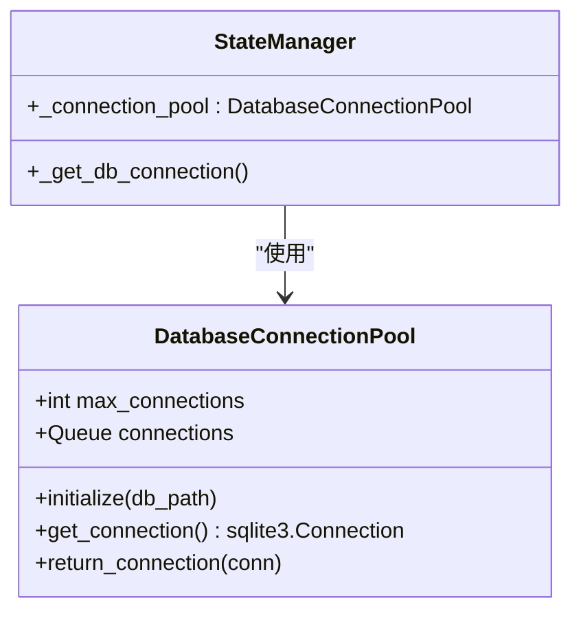
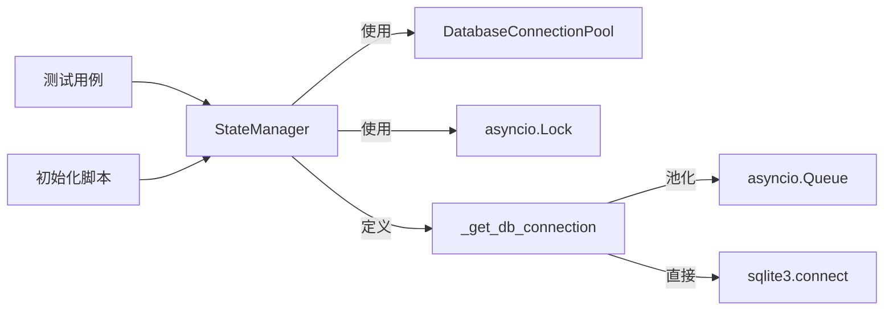

# 上下文管理

<cite>
**本文引用的文件**
- [state_manager.py](file://autoBMAD/epic_automation/state_manager.py)
- [state_manager_fixed.py](file://BUGFIX_20260107/fixed_modules/state_manager_fixed.py)
- [test_resource_cleanup.py](file://BUGFIX_20260107/tests/test_resource_cleanup.py)
- [init_db.py](file://autoBMAD/epic_automation/init_db.py)
</cite>

## 目录
1. [简介](#简介)
2. [项目结构](#项目结构)
3. [核心组件](#核心组件)
4. [架构总览](#架构总览)
5. [详细组件分析](#详细组件分析)
6. [依赖关系分析](#依赖关系分析)
7. [性能考量](#性能考量)
8. [故障排查指南](#故障排查指南)
9. [结论](#结论)

## 简介
本文件聚焦于数据库上下文管理器“_get_db_connection”的双重模式实现，系统性阐述其在两种运行模式之间的自动切换、asynccontextmanager装饰器的应用、yield语句在资源管理中的作用、异常与取消场景下的资源清理机制，以及状态转换图与异步环境中的线程安全特性。目标是帮助读者在不深入源码的前提下，理解该上下文管理器如何确保连接的可靠获取与释放，并在高并发与取消场景下保持一致性与稳定性。

## 项目结构
围绕数据库上下文管理的关键文件与职责如下：
- autoBMAD/epic_automation/state_manager.py：定义StateManager类，包含数据库连接池、锁与上下文管理器等核心逻辑。
- BUGFIX_20260107/fixed_modules/state_manager_fixed.py：修复版StateManager，展示更完整的上下文管理器与锁管理实践。
- autoBMAD/epic_automation/init_db.py：数据库初始化脚本，负责建表与索引，为上下文管理器提供稳定的数据库环境。
- BUGFIX_20260107/tests/test_resource_cleanup.py：资源清理与连接池耗尽测试，验证上下文管理器在异常与压力下的行为。

图表来源
- [state_manager.py](file://autoBMAD/epic_automation/state_manager.py#L183-L202)
- [state_manager.py](file://autoBMAD/epic_automation/state_manager.py#L59-L95)
- [state_manager.py](file://autoBMAD/epic_automation/state_manager.py#L97-L125)
- [init_db.py](file://autoBMAD/epic_automation/init_db.py#L24-L120)
- [test_resource_cleanup.py](file://BUGFIX_20260107/tests/test_resource_cleanup.py#L312-L353)

章节来源
- [state_manager.py](file://autoBMAD/epic_automation/state_manager.py#L183-L202)
- [state_manager.py](file://autoBMAD/epic_automation/state_manager.py#L59-L95)
- [state_manager.py](file://autoBMAD/epic_automation/state_manager.py#L97-L125)
- [init_db.py](file://autoBMAD/epic_automation/init_db.py#L24-L120)
- [test_resource_cleanup.py](file://BUGFIX_20260107/tests/test_resource_cleanup.py#L312-L353)

## 核心组件
- 数据库连接池：基于asyncio.Queue的有限容量队列，支持连接预热与超时获取。
- 上下文管理器_get_db_connection：统一入口，按配置自动选择池化或直接连接模式；通过asynccontextmanager与finally保证资源回收。
- 锁与死锁检测：在关键数据库操作前后加锁，避免竞态；在取消与异常时确保锁释放。
- 数据库初始化：确保表结构与索引存在，为上下文管理器提供稳定的数据层基础。

章节来源
- [state_manager.py](file://autoBMAD/epic_automation/state_manager.py#L59-L95)
- [state_manager.py](file://autoBMAD/epic_automation/state_manager.py#L183-L202)
- [state_manager.py](file://autoBMAD/epic_automation/state_manager.py#L97-L125)
- [init_db.py](file://autoBMAD/epic_automation/init_db.py#L24-L120)

## 架构总览
_get_db_connection在不同模式下的工作流如下：
- 池化模式：首次使用时延迟初始化连接池；从队列获取连接，yield给调用方；finally将连接归还至队列。
- 直接连接模式：每次操作新建连接，yield给调用方；finally关闭连接。
- 两者均通过asynccontextmanager与finally确保异常与取消场景下的资源回收。

图表来源
- [state_manager.py](file://autoBMAD/epic_automation/state_manager.py#L183-L202)
- [state_manager.py](file://autoBMAD/epic_automation/state_manager.py#L59-L95)

## 详细组件分析

### 组件A：_get_db_connection 双重模式实现
- 模式选择依据：构造函数参数use_connection_pool决定是否启用池化模式。
- 池化模式：
  - 首次使用时延迟初始化连接池，避免在同步上下文中创建任务。
  - 从队列获取连接，若超时则抛出异常；finally将连接归还队列，队列满时关闭连接以防泄漏。
- 直接连接模式：
  - 每次操作新建连接，finally直接关闭连接。
- asynccontextmanager装饰器：
  - 将协程函数包装为异步上下文管理器，使调用方能以async with语法安全地获取与释放资源。
- yield语句的作用：
  - 在try块内yield连接，确保调用方持有连接期间的业务逻辑执行；
  - finally块保证无论正常退出还是异常/取消，都能执行资源回收。
- 异常与取消处理：
  - 测试覆盖了连接池耗尽、取消与压力场景，验证finally路径在异常与取消时仍能正确归还或关闭连接。

图表来源
- [state_manager.py](file://autoBMAD/epic_automation/state_manager.py#L183-L202)
- [state_manager.py](file://autoBMAD/epic_automation/state_manager.py#L126-L131)
- [state_manager.py](file://autoBMAD/epic_automation/state_manager.py#L59-L95)

章节来源
- [state_manager.py](file://autoBMAD/epic_automation/state_manager.py#L183-L202)
- [state_manager.py](file://autoBMAD/epic_automation/state_manager.py#L126-L131)
- [state_manager.py](file://autoBMAD/epic_automation/state_manager.py#L59-L95)
- [test_resource_cleanup.py](file://BUGFIX_20260107/tests/test_resource_cleanup.py#L312-L353)

### 组件B：连接池与资源回收
- 连接池初始化：批量创建固定数量的连接并设置SQLite性能参数（WAL、同步级别、缓存、临时存储）。
- 获取与归还：
  - 获取：带超时等待，避免无限阻塞；超时抛出异常。
  - 归还：尝试放回队列；若队列已满则关闭连接，防止泄漏。
- 测试验证：
  - 连接池耗尽时的超时行为；
  - 正常与异常场景下的连接回收；
  - 压力场景下的锁与资源清理。

图表来源
- [state_manager.py](file://autoBMAD/epic_automation/state_manager.py#L59-L95)
- [state_manager.py](file://autoBMAD/epic_automation/state_manager.py#L183-L202)

章节来源
- [state_manager.py](file://autoBMAD/epic_automation/state_manager.py#L59-L95)
- [state_manager.py](file://autoBMAD/epic_automation/state_manager.py#L183-L202)
- [test_resource_cleanup.py](file://BUGFIX_20260107/tests/test_resource_cleanup.py#L312-L353)

### 组件C：锁与上下文管理器的协同
- 锁策略：在数据库操作前后使用asyncio.Lock，避免并发写入冲突。
- 死锁检测：通过DeadlockDetector记录等待任务并在超时后标记死锁，辅助定位问题。
- managed_operation：封装锁获取与释放，确保即使发生取消也能正确释放锁，避免悬挂锁。
- _get_db_connection：作为业务操作的资源入口，配合锁与finally确保连接生命周期可控。

章节来源
- [state_manager.py](file://autoBMAD/epic_automation/state_manager.py#L31-L57)
- [state_manager.py](file://autoBMAD/epic_automation/state_manager.py#L370-L404)
- [state_manager.py](file://autoBMAD/epic_automation/state_manager.py#L275-L277)

### 组件D：数据库初始化与一致性
- 初始化脚本负责创建所需表与索引，确保上下文管理器在稳定的数据层上运行。
- 该步骤在StateManager构造时同步执行，保证后续操作无需重复初始化。

章节来源
- [init_db.py](file://autoBMAD/epic_automation/init_db.py#L24-L120)
- [state_manager.py](file://autoBMAD/epic_automation/state_manager.py#L132-L182)

## 依赖关系分析
- StateManager依赖DatabaseConnectionPool（可选）与asyncio.Lock，通过asynccontextmanager统一资源管理。
- _get_db_connection同时依赖池化与直接连接两条路径，最终都通过finally确保资源回收。
- 测试用例覆盖连接池耗尽、取消与压力场景，验证finally路径在异常与取消时的健壮性。

图表来源
- [state_manager.py](file://autoBMAD/epic_automation/state_manager.py#L59-L95)
- [state_manager.py](file://autoBMAD/epic_automation/state_manager.py#L183-L202)
- [test_resource_cleanup.py](file://BUGFIX_20260107/tests/test_resource_cleanup.py#L312-L353)
- [init_db.py](file://autoBMAD/epic_automation/init_db.py#L24-L120)

章节来源
- [state_manager.py](file://autoBMAD/epic_automation/state_manager.py#L59-L95)
- [state_manager.py](file://autoBMAD/epic_automation/state_manager.py#L183-L202)
- [test_resource_cleanup.py](file://BUGFIX_20260107/tests/test_resource_cleanup.py#L312-L353)
- [init_db.py](file://autoBMAD/epic_automation/init_db.py#L24-L120)

## 性能考量
- 连接池预热：在首次使用时批量创建连接，减少首次请求延迟。
- SQLite参数优化：启用WAL、调整同步级别与缓存，提升并发读写性能。
- 超时控制：获取连接时设置超时，避免长时间阻塞导致资源占用。
- 队列满时关闭连接：防止连接池满载时的泄漏风险。

章节来源
- [state_manager.py](file://autoBMAD/epic_automation/state_manager.py#L69-L78)
- [state_manager.py](file://autoBMAD/epic_automation/state_manager.py#L82-L88)
- [state_manager.py](file://autoBMAD/epic_automation/state_manager.py#L92-L95)

## 故障排查指南
- 连接池耗尽：
  - 现象：获取连接超时并抛出异常。
  - 排查：确认池大小与并发量匹配；检查是否存在未归还连接的泄漏。
  - 参考测试：连接池耗尽处理与恢复。
- 取消与异常：
  - 现象：任务被取消或业务逻辑抛出异常。
  - 排查：确认finally路径是否被执行；检查锁是否被释放。
  - 参考测试：取消场景下的资源清理与状态恢复。
- 资源泄漏：
  - 现象：连接未归还或未关闭。
  - 排查：确保使用async with获取连接；检查finally逻辑；监控队列满时的连接关闭。

章节来源
- [test_resource_cleanup.py](file://BUGFIX_20260107/tests/test_resource_cleanup.py#L312-L353)
- [test_resource_cleanup.py](file://BUGFIX_20260107/tests/test_resource_cleanup.py#L217-L248)
- [test_resource_cleanup.py](file://BUGFIX_20260107/tests/test_resource_cleanup.py#L355-L383)

## 结论
_get_db_connection通过asynccontextmanager与finally实现了对连接生命周期的精确控制，能够在池化与直接连接两种模式间无缝切换，并在异常与取消场景下确保资源回收。结合锁与死锁检测机制，该上下文管理器在异步环境中提供了可靠的数据库访问抽象，既满足性能需求，又保障了稳定性与可维护性。