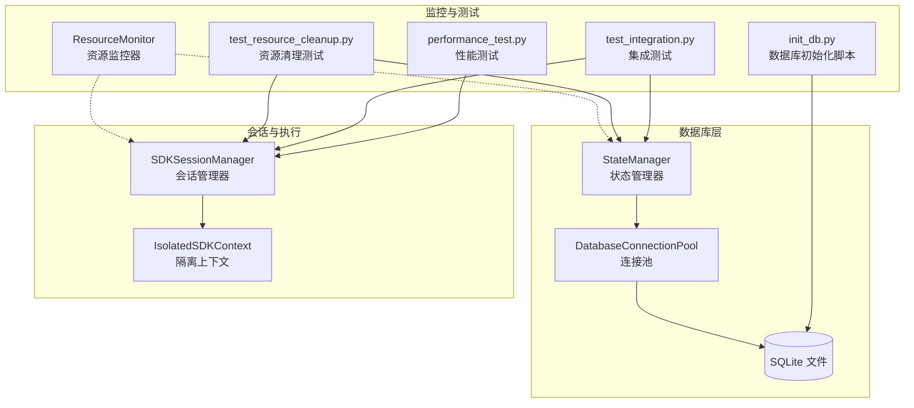
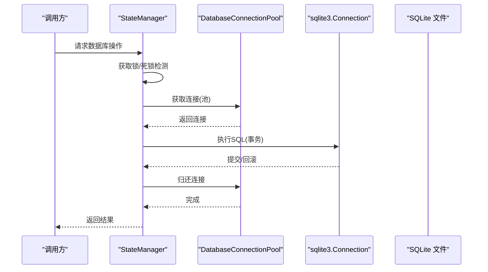
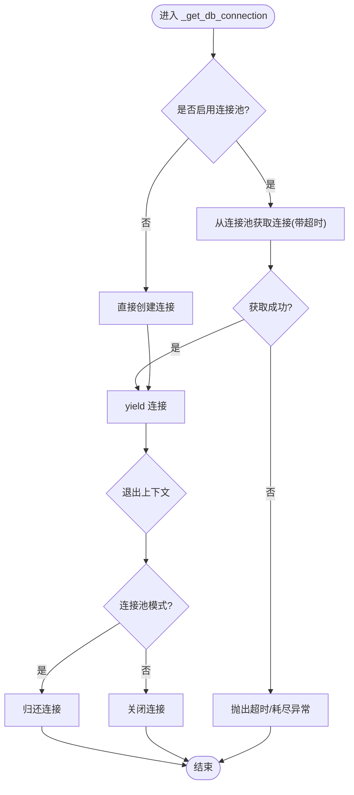
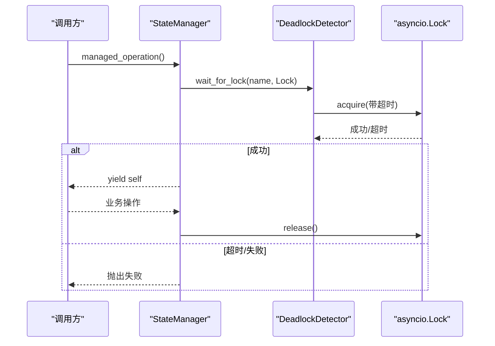
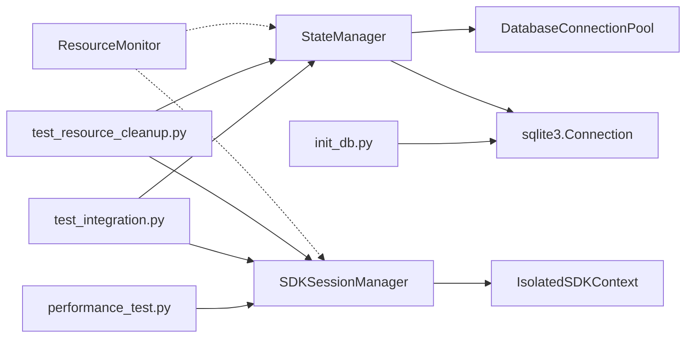

# 数据库交互模式

<cite>
**本文引用的文件**
- [state_manager.py](file://autoBMAD/epic_automation/state_manager.py)
- [state_manager_fixed.py](file://BUGFIX_20260107/fixed_modules/state_manager_fixed.py)
- [sdk_session_manager_fixed.py](file://BUGFIX_20260107/fixed_modules/sdk_session_manager_fixed.py)
- [resource_monitor.py](file://BUGFIX_20260107/debug_suite/resource_monitor.py)
- [test_resource_cleanup.py](file://BUGFIX_20260107/tests/test_resource_cleanup.py)
- [test_integration.py](file://BUGFIX_20260107/tests/test_integration.py)
- [performance_test.py](file://BUGFIX_20260107/validation_scripts/performance_test.py)
- [init_db.py](file://autoBMAD/epic_automation/init_db.py)
</cite>

## 目录
1. [简介](#简介)
2. [项目结构](#项目结构)
3. [核心组件](#核心组件)
4. [架构总览](#架构总览)
5. [详细组件分析](#详细组件分析)
6. [依赖关系分析](#依赖关系分析)
7. [性能考量](#性能考量)
8. [故障排查指南](#故障排查指南)
9. [结论](#结论)
10. [附录](#附录)

## 简介
本文件聚焦于数据库交互模式，系统性阐述异步数据库操作的实现方式，重点覆盖以下方面：
- 上下文管理器对连接池与直连两种模式的封装
- 连接获取超时处理与资源自动释放机制
- asynccontextmanager 在数据库操作中的应用
- 通过 managed_operation 确保锁的正确释放
- 错误处理策略、重试机制与异常传播模式
- 数据库交互时序图与性能监控、诊断工具的集成

## 项目结构
围绕数据库交互的关键模块与测试/调试文件如下：
- 状态管理器：提供数据库连接获取、事务控制、锁管理、健康状态查询等能力
- 会话管理器：提供 SDK 调用隔离、超时与重试、取消传播控制
- 资源监控器：记录锁、会话、任务等资源的生命周期与统计
- 测试与验证脚本：覆盖连接池耗尽、批量操作、取消、恢复等场景
- 初始化脚本：创建数据库表结构与索引

图表来源
- [state_manager.py](file://autoBMAD/epic_automation/state_manager.py#L183-L202)
- [state_manager_fixed.py](file://BUGFIX_20260107/fixed_modules/state_manager_fixed.py#L207-L222)
- [sdk_session_manager_fixed.py](file://BUGFIX_20260107/fixed_modules/sdk_session_manager_fixed.py#L211-L235)
- [resource_monitor.py](file://BUGFIX_20260107/debug_suite/resource_monitor.py#L1-L200)
- [test_resource_cleanup.py](file://BUGFIX_20260107/tests/test_resource_cleanup.py#L1-L200)
- [test_integration.py](file://BUGFIX_20260107/tests/test_integration.py#L247-L283)
- [performance_test.py](file://BUGFIX_20260107/validation_scripts/performance_test.py#L392-L427)
- [init_db.py](file://autoBMAD/epic_automation/init_db.py#L1-L120)

章节来源
- [state_manager.py](file://autoBMAD/epic_automation/state_manager.py#L183-L202)
- [state_manager_fixed.py](file://BUGFIX_20260107/fixed_modules/state_manager_fixed.py#L207-L222)
- [sdk_session_manager_fixed.py](file://BUGFIX_20260107/fixed_modules/sdk_session_manager_fixed.py#L211-L235)
- [resource_monitor.py](file://BUGFIX_20260107/debug_suite/resource_monitor.py#L1-L200)
- [test_resource_cleanup.py](file://BUGFIX_20260107/tests/test_resource_cleanup.py#L1-L200)
- [test_integration.py](file://BUGFIX_20260107/tests/test_integration.py#L247-L283)
- [performance_test.py](file://BUGFIX_20260107/validation_scripts/performance_test.py#L392-L427)
- [init_db.py](file://autoBMAD/epic_automation/init_db.py#L1-L120)

## 核心组件
- 数据库连接获取上下文管理器：统一封装连接池与直连两种模式，负责连接获取、超时与归还
- 状态管理器：提供数据库事务、乐观锁、健康状态查询；内置死锁检测与锁超时
- 会话管理器：提供 SDK 调用隔离、超时与重试、取消传播控制
- 资源监控器：记录锁、会话等资源事件，支持泄漏检测与统计
- 初始化脚本：创建数据库表结构与索引，保证一致性

章节来源
- [state_manager.py](file://autoBMAD/epic_automation/state_manager.py#L183-L202)
- [state_manager_fixed.py](file://BUGFIX_20260107/fixed_modules/state_manager_fixed.py#L207-L222)
- [sdk_session_manager_fixed.py](file://BUGFIX_20260107/fixed_modules/sdk_session_manager_fixed.py#L211-L235)
- [resource_monitor.py](file://BUGFIX_20260107/debug_suite/resource_monitor.py#L1-L200)
- [init_db.py](file://autoBMAD/epic_automation/init_db.py#L1-L120)

## 架构总览
数据库交互采用“状态管理器 + 连接池/直连”的分层设计，配合 asynccontextmanager 实现资源生命周期管理；同时通过 managed_operation 保障锁的正确释放，结合死锁检测与超时控制提升稳定性。

图表来源
- [state_manager.py](file://autoBMAD/epic_automation/state_manager.py#L183-L202)
- [state_manager.py](file://autoBMAD/epic_automation/state_manager.py#L262-L364)
- [state_manager_fixed.py](file://BUGFIX_20260107/fixed_modules/state_manager_fixed.py#L207-L222)
- [state_manager_fixed.py](file://BUGFIX_20260107/fixed_modules/state_manager_fixed.py#L285-L364)

## 详细组件分析

### 数据库连接获取上下文管理器
- 功能要点
  - 统一封装连接池与直连两种模式
  - 获取连接时支持超时控制，避免阻塞
  - 使用 finally/finally 子句确保连接归还或关闭
- 关键行为
  - 连接池模式：从队列获取连接，超时抛出异常
  - 直连模式：直接创建连接，结束后关闭
- 资源释放
  - 连接池模式：归还连接至队列
  - 直连模式：显式关闭连接

图表来源
- [state_manager.py](file://autoBMAD/epic_automation/state_manager.py#L183-L202)
- [state_manager_fixed.py](file://BUGFIX_20260107/fixed_modules/state_manager_fixed.py#L207-L222)

章节来源
- [state_manager.py](file://autoBMAD/epic_automation/state_manager.py#L183-L202)
- [state_manager_fixed.py](file://BUGFIX_20260107/fixed_modules/state_manager_fixed.py#L207-L222)

### 连接池与直连模式对比
- 连接池模式
  - 初始化：预创建固定数量连接，设置 WAL、同步级别、缓存等参数
  - 获取：等待队列头部连接，超时抛出异常
  - 归还：放回队列；若队列满则关闭连接
- 直连模式
  - 直接 connect，结束后 close
- 超时处理
  - 连接池获取超时：抛出运行时异常，提示连接耗尽
  - 业务操作超时：由上层包装函数统一捕获并返回失败

章节来源
- [state_manager.py](file://autoBMAD/epic_automation/state_manager.py#L60-L109)
- [state_manager_fixed.py](file://BUGFIX_20260107/fixed_modules/state_manager_fixed.py#L77-L109)

### managed_operation 与锁管理
- 设计目标
  - 确保即使发生取消也能正确释放锁
  - 通过死锁检测器与超时控制降低死锁风险
- 行为流程
  - 使用死锁检测器等待锁，超时返回失败
  - 正常路径：yield 管理器实例；异常路径：记录并释放锁；finally：确保释放
  - 取消路径：记录并释放锁，不重新抛出以避免 cancel scope 错误

图表来源
- [state_manager.py](file://autoBMAD/epic_automation/state_manager.py#L370-L404)
- [state_manager_fixed.py](file://BUGFIX_20260107/fixed_modules/state_manager_fixed.py#L385-L419)

章节来源
- [state_manager.py](file://autoBMAD/epic_automation/state_manager.py#L370-L404)
- [state_manager_fixed.py](file://BUGFIX_20260107/fixed_modules/state_manager_fixed.py#L385-L419)

### 乐观锁与事务控制
- 乐观锁
  - 读取当前版本号，写入前校验预期版本，冲突则返回当前版本
- 事务控制
  - 每个数据库操作在锁保护下进行，提交后返回成功与最新版本
- 错误处理
  - 捕获超时、取消与异常，记录日志并返回失败

章节来源
- [state_manager.py](file://autoBMAD/epic_automation/state_manager.py#L262-L364)
- [state_manager_fixed.py](file://BUGFIX_20260107/fixed_modules/state_manager_fixed.py#L285-L364)

### SDK 会话管理器与重试机制
- 隔离执行
  - 每个 Agent 创建独立会话上下文，避免 cancel scope 传播
- 超时与重试
  - 统一超时控制；对可重试错误（超时、网络、会话错误）按指数退避重试
- 取消处理
  - 捕获取消并统计失败；对 cancel scope 错误不重试
- 统计与健康检查
  - 记录成功/失败次数、成功率；维护健康历史与恢复阈值

章节来源
- [sdk_session_manager_fixed.py](file://BUGFIX_20260107/fixed_modules/sdk_session_manager_fixed.py#L211-L235)
- [sdk_session_manager_fixed.py](file://BUGFIX_20260107/fixed_modules/sdk_session_manager_fixed.py#L236-L435)
- [sdk_session_manager_fixed.py](file://BUGFIX_20260107/fixed_modules/sdk_session_manager_fixed.py#L437-L445)

### 资源监控与泄漏检测
- 锁监控
  - 记录获取/释放/超时事件；统计活跃锁、平均/最长持有时间、泄漏计数
- 会话监控
  - 记录创建/更新/关闭事件；统计错误与失败率
- 资源清理测试
  - 验证取消、异常、批量操作、压力场景下的资源释放与健康状态

章节来源
- [resource_monitor.py](file://BUGFIX_20260107/debug_suite/resource_monitor.py#L1-L200)
- [test_resource_cleanup.py](file://BUGFIX_20260107/tests/test_resource_cleanup.py#L1-L200)

### 数据库初始化与迁移
- 初始化脚本
  - 创建 stories、code_quality_phase、test_automation_phase、epic_processing 等表
  - 创建索引以优化查询性能
- 迁移与验证
  - 验证表结构与索引存在性；支持强制重建与详细输出

章节来源
- [init_db.py](file://autoBMAD/epic_automation/init_db.py#L1-L120)
- [init_db.py](file://autoBMAD/epic_automation/init_db.py#L122-L195)

## 依赖关系分析
- 状态管理器依赖连接池或直连；连接池依赖 SQLite 连接队列
- 会话管理器独立于数据库层，但与状态管理器协作完成端到端流程
- 资源监控器作为横切关注点，与状态管理器、会话管理器解耦
- 测试与验证脚本覆盖连接池耗尽、批量操作、取消、恢复等关键路径

图表来源
- [state_manager.py](file://autoBMAD/epic_automation/state_manager.py#L183-L202)
- [state_manager_fixed.py](file://BUGFIX_20260107/fixed_modules/state_manager_fixed.py#L207-L222)
- [sdk_session_manager_fixed.py](file://BUGFIX_20260107/fixed_modules/sdk_session_manager_fixed.py#L211-L235)
- [resource_monitor.py](file://BUGFIX_20260107/debug_suite/resource_monitor.py#L1-L200)
- [test_resource_cleanup.py](file://BUGFIX_20260107/tests/test_resource_cleanup.py#L1-L200)
- [test_integration.py](file://BUGFIX_20260107/tests/test_integration.py#L247-L283)
- [performance_test.py](file://BUGFIX_20260107/validation_scripts/performance_test.py#L392-L427)
- [init_db.py](file://autoBMAD/epic_automation/init_db.py#L1-L120)

## 性能考量
- 连接池
  - 预创建固定数量连接，减少连接建立开销
  - 设置 WAL、同步级别、缓存与临时存储参数以提升并发与性能
- 事务与锁
  - 通过锁与死锁检测器降低竞争；短事务与最小化锁持有时间
- 超时与重试
  - 业务操作超时统一捕获；SDK 层对可重试错误按指数退避重试
- 监控与诊断
  - 资源监控器记录锁与会话事件；测试脚本覆盖压力与泄漏场景
  - 性能测试脚本生成性能评分与测试结果汇总

章节来源
- [state_manager.py](file://autoBMAD/epic_automation/state_manager.py#L60-L109)
- [state_manager_fixed.py](file://BUGFIX_20260107/fixed_modules/state_manager_fixed.py#L77-L109)
- [sdk_session_manager_fixed.py](file://BUGFIX_20260107/fixed_modules/sdk_session_manager_fixed.py#L236-L435)
- [resource_monitor.py](file://BUGFIX_20260107/debug_suite/resource_monitor.py#L1-L200)
- [performance_test.py](file://BUGFIX_20260107/validation_scripts/performance_test.py#L392-L427)

## 故障排查指南
- 连接池耗尽
  - 现象：获取连接超时，抛出运行时异常
  - 排查：检查连接池大小、并发度、是否及时归还连接
  - 参考测试：连接池耗尽处理与泄漏检测
- 锁超时与死锁
  - 现象：死锁检测器标记死锁，锁获取超时
  - 排查：缩短锁持有时间、避免嵌套锁、使用 managed_operation
  - 参考监控：锁统计与超时事件
- 取消与异常
  - 现象：取消导致的 cancel scope 错误；异常被捕获并记录
  - 排查：区分可重试与不可重试错误；确认 finally 释放逻辑
- 回滚与恢复
  - 现象：可重试错误后自动重试；集成测试验证恢复路径
  - 参考测试：错误恢复集成测试

章节来源
- [test_resource_cleanup.py](file://BUGFIX_20260107/tests/test_resource_cleanup.py#L1-L200)
- [test_resource_cleanup.py](file://BUGFIX_20260107/tests/test_resource_cleanup.py#L560-L606)
- [test_integration.py](file://BUGFIX_20260107/tests/test_integration.py#L247-L283)
- [state_manager.py](file://autoBMAD/epic_automation/state_manager.py#L370-L404)
- [state_manager_fixed.py](file://BUGFIX_20260107/fixed_modules/state_manager_fixed.py#L385-L419)

## 结论
该数据库交互模式通过 asynccontextmanager 封装连接池与直连，结合死锁检测、锁超时与 finally 释放机制，确保资源安全与稳定性。managed_operation 保障锁的正确释放，SDK 会话管理器提供隔离执行与重试策略。配合资源监控与全面测试，形成可观测、可恢复、可扩展的数据库交互体系。

## 附录
- 数据库初始化脚本可确保表结构与索引一致，建议在部署前执行
- 性能测试与验证脚本可用于回归与基线评估

章节来源
- [init_db.py](file://autoBMAD/epic_automation/init_db.py#L1-L120)
- [performance_test.py](file://BUGFIX_20260107/validation_scripts/performance_test.py#L392-L427)