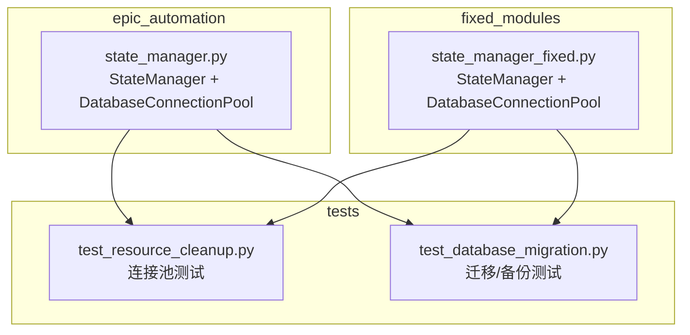
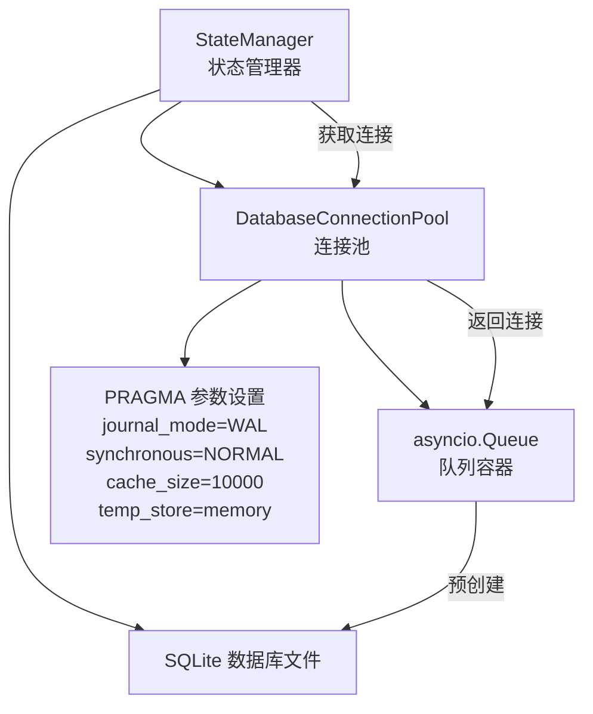
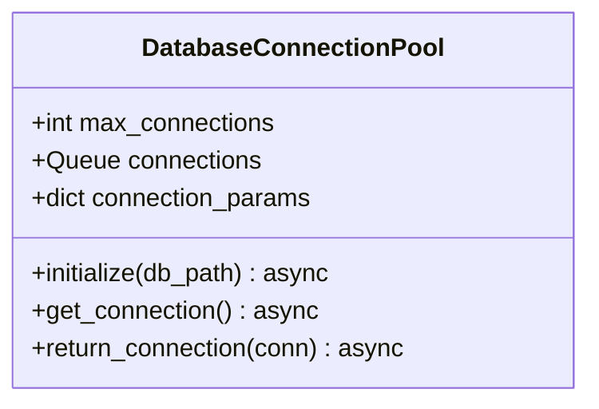
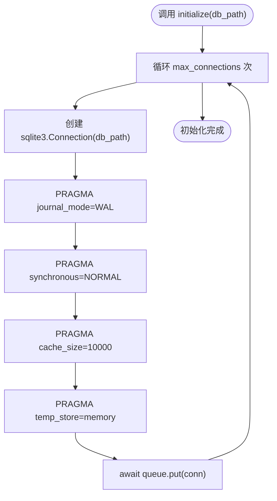
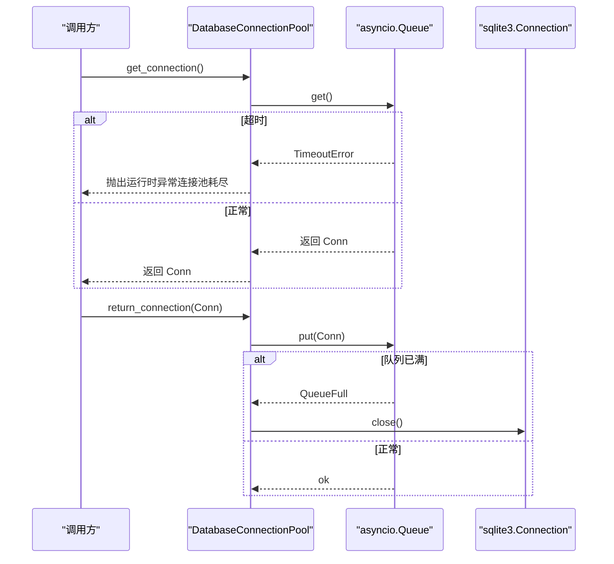
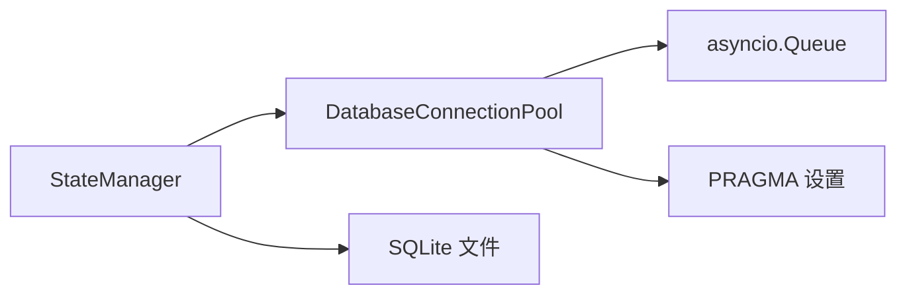

# 连接管理

<cite>
**本文引用的文件**
- [state_manager.py](file://autoBMAD/epic_automation/state_manager.py)
- [state_manager_fixed.py](file://BUGFIX_20260107/fixed_modules/state_manager_fixed.py)
- [test_resource_cleanup.py](file://BUGFIX_20260107/tests/test_resource_cleanup.py)
- [test_database_migration.py](file://tests-copy/unit/test_database_migration.py)
</cite>

## 目录
1. [简介](#简介)
2. [项目结构](#项目结构)
3. [核心组件](#核心组件)
4. [架构总览](#架构总览)
5. [详细组件分析](#详细组件分析)
6. [依赖关系分析](#依赖关系分析)
7. [性能考量](#性能考量)
8. [故障排查指南](#故障排查指南)
9. [结论](#结论)

## 简介
本文件聚焦于数据库连接管理，围绕 DatabaseConnectionPool 类的实现机制展开，涵盖：
- 连接池初始化过程与 SQLite 关键优化参数（WAL 模式、同步级别、缓存大小、临时存储）的配置
- initialize 方法如何预创建连接并设置数据库性能参数
- 连接获取与归还流程，包括超时处理与连接池耗尽时的异常策略
- 连接池使用时序图与并发性能提升效果说明

## 项目结构
与连接管理相关的核心代码位于以下模块：
- autoBMAD/epic_automation/state_manager.py：包含 DatabaseConnectionPool 的实现与 StateManager 对其的集成
- BUGFIX_20260107/fixed_modules/state_manager_fixed.py：另一个实现版本，展示连接池初始化与获取/归还的完整流程
- BUGFIX_20260107/tests/test_resource_cleanup.py：覆盖连接池初始化、耗尽处理、压力下的资源清理等测试
- tests-copy/unit/test_database_migration.py：数据库迁移与备份验证，间接体现数据库连接的使用场景

图表来源
- [state_manager.py](file://autoBMAD/epic_automation/state_manager.py#L59-L110)
- [state_manager_fixed.py](file://BUGFIX_20260107/fixed_modules/state_manager_fixed.py#L77-L110)
- [test_resource_cleanup.py](file://BUGFIX_20260107/tests/test_resource_cleanup.py#L48-L74)
- [test_database_migration.py](file://tests-copy/unit/test_database_migration.py#L1-L120)

章节来源
- [state_manager.py](file://autoBMAD/epic_automation/state_manager.py#L59-L110)
- [state_manager_fixed.py](file://BUGFIX_20260107/fixed_modules/state_manager_fixed.py#L77-L110)
- [test_resource_cleanup.py](file://BUGFIX_20260107/tests/test_resource_cleanup.py#L48-L74)
- [test_database_migration.py](file://tests-copy/unit/test_database_migration.py#L1-L120)

## 核心组件
- DatabaseConnectionPool：基于 asyncio.Queue 的轻量连接池，负责预创建 SQLite 连接并设置关键 PRAGMA 参数；提供 get_connection/return_connection 接口，内置超时与耗尽异常策略
- StateManager：业务层状态管理器，可选择启用连接池；通过上下文管理器在每次数据库操作中获取/归还连接，保证资源生命周期可控

章节来源
- [state_manager.py](file://autoBMAD/epic_automation/state_manager.py#L59-L110)
- [state_manager_fixed.py](file://BUGFIX_20260107/fixed_modules/state_manager_fixed.py#L77-L110)

## 架构总览
下图展示了连接池在整体架构中的位置与交互：

图表来源
- [state_manager.py](file://autoBMAD/epic_automation/state_manager.py#L59-L110)
- [state_manager_fixed.py](file://BUGFIX_20260107/fixed_modules/state_manager_fixed.py#L77-L110)

## 详细组件分析

### DatabaseConnectionPool 类分析
- 设计要点
  - 使用 asyncio.Queue 作为连接池容器，最大容量即最大连接数
  - 初始化阶段一次性创建指定数量的 sqlite3.Connection，并执行关键 PRAGMA 设置
  - 提供 get_connection/return_connection 两个核心接口，配合超时与队列满载处理

- 关键实现点
  - 初始化参数设置
    - WAL 模式：提升并发读写性能
    - 同步级别：NORMAL 平衡性能与可靠性
    - 缓存大小：增大页缓存以减少磁盘 IO
    - 临时存储：将临时表/索引放入内存，降低磁盘压力
  - 获取连接：wait_for 限制等待时间，超时抛出运行时异常
  - 归还连接：若队列已满则主动关闭连接，避免泄漏

图表来源
- [state_manager.py](file://autoBMAD/epic_automation/state_manager.py#L59-L110)
- [state_manager_fixed.py](file://BUGFIX_20260107/fixed_modules/state_manager_fixed.py#L77-L110)

章节来源
- [state_manager.py](file://autoBMAD/epic_automation/state_manager.py#L59-L110)
- [state_manager_fixed.py](file://BUGFIX_20260107/fixed_modules/state_manager_fixed.py#L77-L110)

### 初始化流程（initialize）
- 预创建连接：根据 max_connections 循环创建 sqlite3.Connection
- 执行 PRAGMA 设置：在每个连接上设置 WAL、同步级别、缓存大小、临时存储
- 入队：将连接放入 asyncio.Queue，等待后续获取

图表来源
- [state_manager.py](file://autoBMAD/epic_automation/state_manager.py#L69-L78)
- [state_manager_fixed.py](file://BUGFIX_20260107/fixed_modules/state_manager_fixed.py#L85-L94)

章节来源
- [state_manager.py](file://autoBMAD/epic_automation/state_manager.py#L69-L78)
- [state_manager_fixed.py](file://BUGFIX_20260107/fixed_modules/state_manager_fixed.py#L85-L94)

### 连接获取与归还流程
- 获取连接（get_connection）
  - 从队列取出连接，等待超时为固定值
  - 超时抛出运行时异常，提示“连接池耗尽”
- 归还连接（return_connection）
  - 将连接放回队列
  - 若队列已满，主动关闭连接，防止泄漏

图表来源
- [state_manager.py](file://autoBMAD/epic_automation/state_manager.py#L79-L110)
- [state_manager_fixed.py](file://BUGFIX_20260107/fixed_modules/state_manager_fixed.py#L95-L110)

章节来源
- [state_manager.py](file://autoBMAD/epic_automation/state_manager.py#L79-L110)
- [state_manager_fixed.py](file://BUGFIX_20260107/fixed_modules/state_manager_fixed.py#L95-L110)

### 超时与耗尽异常策略
- 获取连接超时：固定超时时间，超时后抛出运行时异常，明确提示“连接池耗尽”
- 归还连接耗尽：当队列满载时主动关闭连接，避免资源泄漏
- 测试覆盖：通过短超时模拟连接池耗尽，验证异常行为与后续恢复

章节来源
- [state_manager.py](file://autoBMAD/epic_automation/state_manager.py#L79-L110)
- [state_manager_fixed.py](file://BUGFIX_20260107/fixed_modules/state_manager_fixed.py#L95-L110)
- [test_resource_cleanup.py](file://BUGFIX_20260107/tests/test_resource_cleanup.py#L312-L353)

### 与 StateManager 的集成
- 可选启用：StateManager 支持是否使用连接池的开关
- 延迟初始化：首次使用时才初始化连接池，避免在同步上下文中创建任务
- 上下文管理：通过上下文管理器在每次数据库操作中自动获取/归还连接，确保资源生命周期可控

章节来源
- [state_manager.py](file://autoBMAD/epic_automation/state_manager.py#L97-L131)
- [state_manager_fixed.py](file://BUGFIX_20260107/fixed_modules/state_manager_fixed.py#L111-L140)

## 依赖关系分析
- 组件耦合
  - DatabaseConnectionPool 与 asyncio.Queue 强耦合，依赖队列的阻塞/非阻塞语义
  - StateManager 与 DatabaseConnectionPool 通过组合关系耦合，但通过上下文管理器隔离了直接调用细节
- 外部依赖
  - sqlite3：底层数据库驱动
  - asyncio：异步队列与超时控制
- 潜在风险
  - 连接池满载时的关闭策略需谨慎，避免误关仍在使用的连接
  - 超时时间应结合业务负载进行评估

图表来源
- [state_manager.py](file://autoBMAD/epic_automation/state_manager.py#L59-L110)
- [state_manager_fixed.py](file://BUGFIX_20260107/fixed_modules/state_manager_fixed.py#L77-L110)

章节来源
- [state_manager.py](file://autoBMAD/epic_automation/state_manager.py#L59-L110)
- [state_manager_fixed.py](file://BUGFIX_20260107/fixed_modules/state_manager_fixed.py#L77-L110)

## 性能考量
- WAL 模式：显著提升并发读写能力，适合多任务频繁访问的场景
- 同步级别 NORMAL：在可靠性与性能之间取得平衡
- 缓存大小：增大页缓存，减少磁盘 IO，提升吞吐
- 临时存储内存化：减少临时表/索引的磁盘写入
- 并发提升：通过连接池复用连接，避免频繁创建/销毁连接带来的开销；配合队列的阻塞语义，可有效平滑突发请求

章节来源
- [state_manager.py](file://autoBMAD/epic_automation/state_manager.py#L69-L78)
- [state_manager_fixed.py](file://BUGFIX_20260107/fixed_modules/state_manager_fixed.py#L85-L94)

## 故障排查指南
- 连接池耗尽
  - 现象：获取连接时抛出运行时异常
  - 排查：确认 max_connections 是否过小；检查是否存在长时间占用连接的任务
  - 复现：参考测试用例中短超时模拟耗尽的场景
- 连接泄漏
  - 现象：队列满载导致连接被关闭；长期存在可能影响性能
  - 排查：确保每次获取连接后都会归还；使用上下文管理器自动归还
- 资源清理
  - 状态管理器在异常/取消情况下仍能正确释放锁与连接，可通过健康状态检查确认

章节来源
- [state_manager.py](file://autoBMAD/epic_automation/state_manager.py#L79-L110)
- [state_manager_fixed.py](file://BUGFIX_20260107/fixed_modules/state_manager_fixed.py#L95-L110)
- [test_resource_cleanup.py](file://BUGFIX_20260107/tests/test_resource_cleanup.py#L312-L353)

## 结论
DatabaseConnectionPool 通过预创建连接与关键 PRAGMA 参数设置，为 SQLite 提供了面向高并发的连接管理方案。结合 StateManager 的上下文管理器，实现了资源生命周期的自动化管理。在连接池耗尽时，通过超时与异常策略保障系统稳定性；在队列满载时主动关闭连接，避免泄漏。该设计在保证可靠性的同时，有效提升了系统的并发性能与资源利用率。