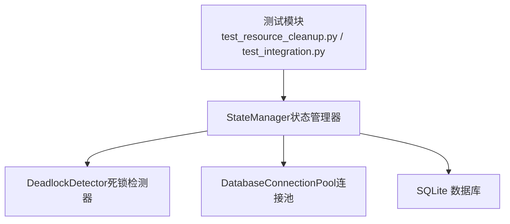
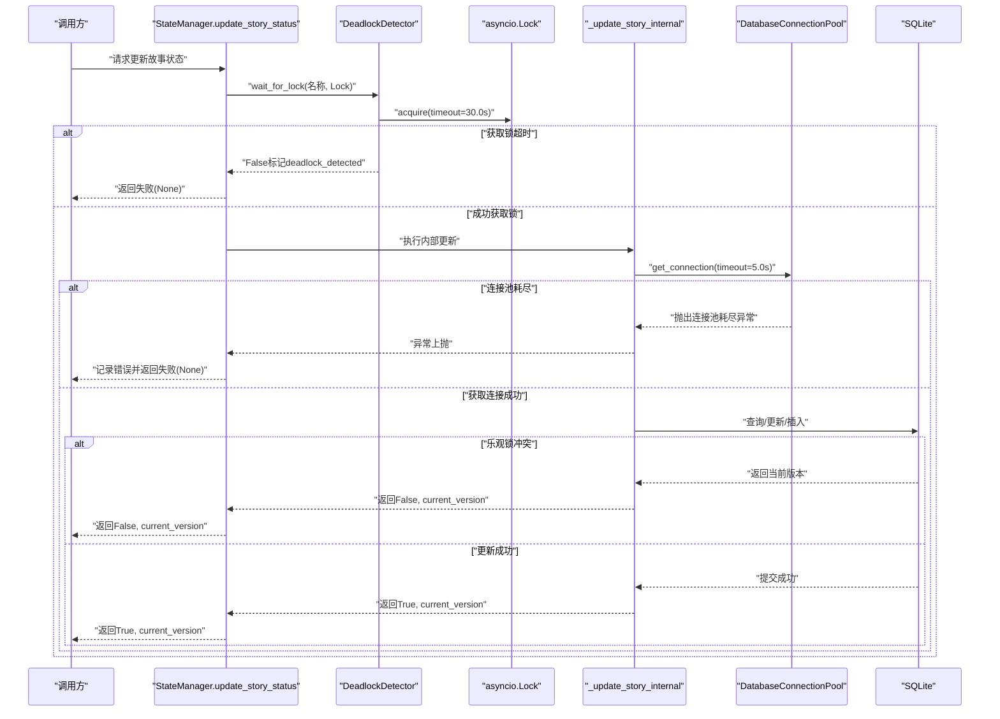
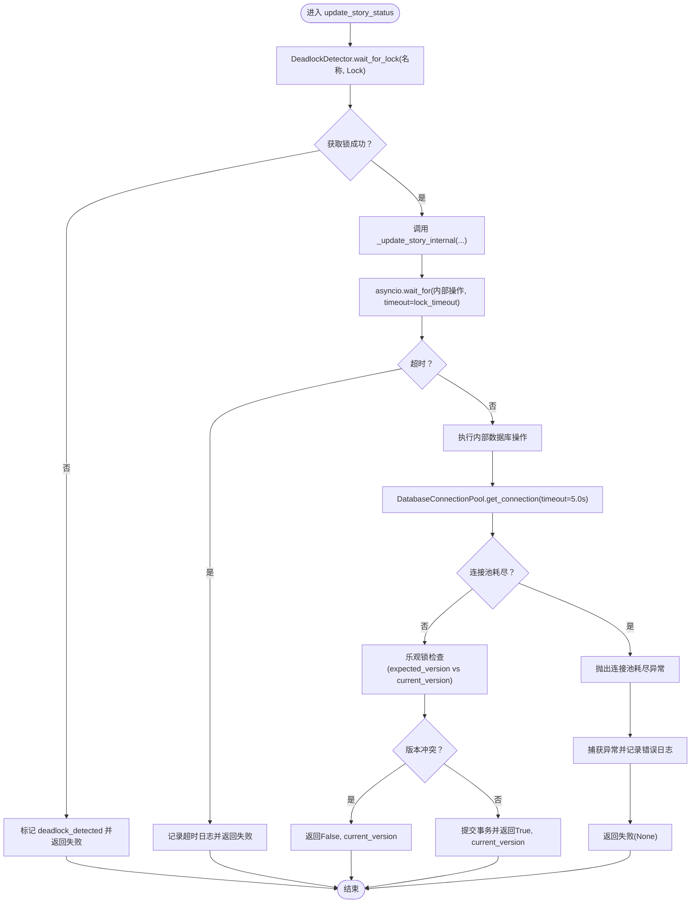
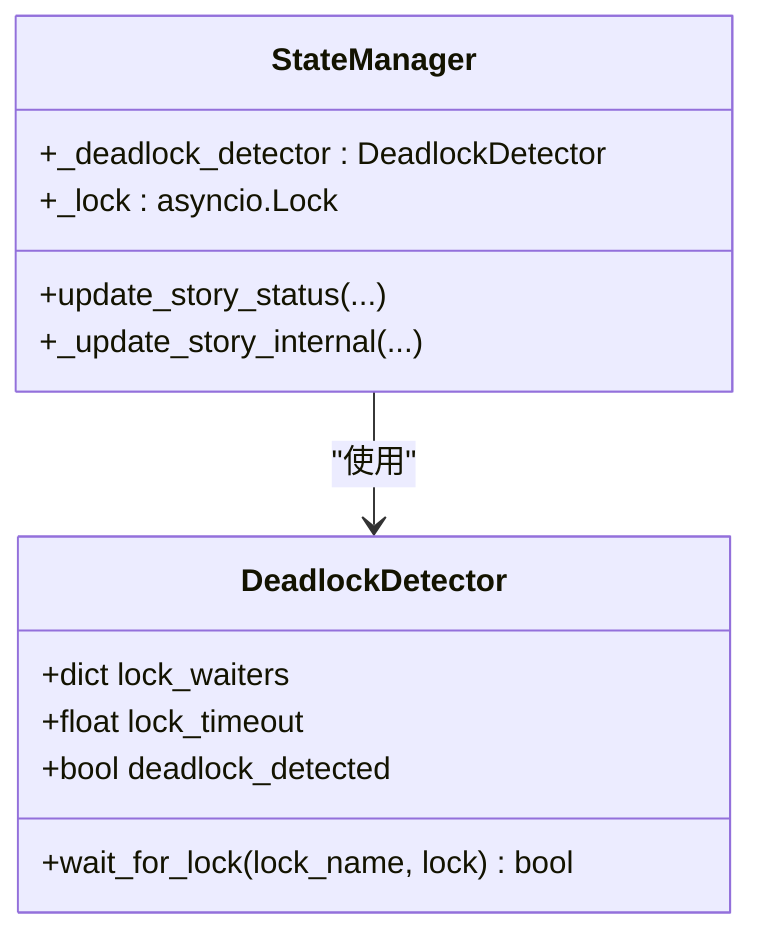
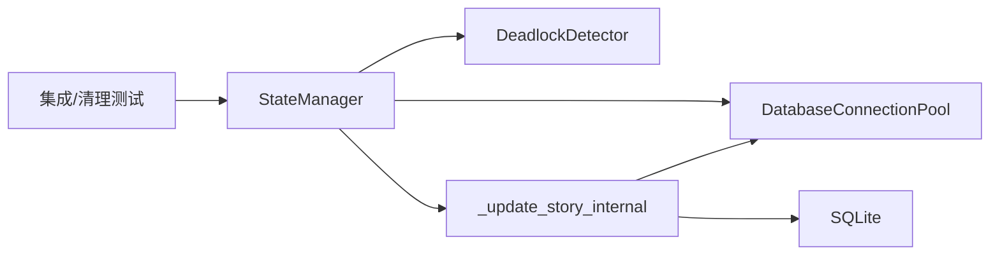

# 错误处理

<cite>
**本文引用的文件**
- [state_manager.py（原始实现）](file://autoBMAD/epic_automation/state_manager.py)
- [state_manager_fixed.py（修复后实现）](file://BUGFIX_20260107/fixed_modules/state_manager_fixed.py)
- [test_resource_cleanup.py（资源清理与死锁测试）](file://BUGFIX_20260107/tests/test_resource_cleanup.py)
- [test_integration.py（集成测试）](file://BUGFIX_20260107/tests/test_integration.py)
</cite>

## 目录
1. [简介](#简介)
2. [项目结构](#项目结构)
3. [核心组件](#核心组件)
4. [架构总览](#架构总览)
5. [详细组件分析](#详细组件分析)
6. [依赖关系分析](#依赖关系分析)
7. [性能考量](#性能考量)
8. [故障排查指南](#故障排查指南)
9. [结论](#结论)

## 简介
本文件聚焦于数据库错误处理的多层次策略，围绕以下目标展开：
- 深入解析 update_story_status 方法中的超时处理机制，包括 asyncio.wait_for 的应用与超时异常的捕获与处理。
- 解释死锁检测器 DeadlockDetector 的工作原理，包括 30 秒超时阈值的设置与死锁发生时的日志记录。
- 阐述各类数据库操作异常的处理方式，包括连接池耗尽、版本冲突（乐观锁）、JSON 序列化失败等。
- 提供错误处理流程图，并给出各错误类型的恢复建议。

## 项目结构
本仓库中与数据库错误处理直接相关的核心文件位于两个位置：
- autoBMAD/epic_automation/state_manager.py：原始实现，包含基础的超时与乐观锁处理。
- BUGFIX_20260107/fixed_modules/state_manager_fixed.py：修复后实现，引入了 DeadlockDetector、连接池耗尽异常、更完善的错误日志与恢复策略。

图表来源
- [state_manager.py（原始实现）](file://autoBMAD/epic_automation/state_manager.py#L203-L350)
- [state_manager_fixed.py（修复后实现）](file://BUGFIX_20260107/fixed_modules/state_manager_fixed.py#L223-L422)
- [test_resource_cleanup.py（资源清理与死锁测试）](file://BUGFIX_20260107/tests/test_resource_cleanup.py#L318-L353)
- [test_integration.py（集成测试）](file://BUGFIX_20260107/tests/test_integration.py#L187-L200)

章节来源
- [state_manager.py（原始实现）](file://autoBMAD/epic_automation/state_manager.py#L203-L350)
- [state_manager_fixed.py（修复后实现）](file://BUGFIX_20260107/fixed_modules/state_manager_fixed.py#L223-L422)

## 核心组件
- DeadlockDetector：负责在获取 asyncio.Lock 时进行超时检测，超过阈值即标记死锁并记录日志。
- DatabaseConnectionPool：封装 SQLite 连接池，提供获取/归还连接能力，并在连接池耗尽时抛出明确异常。
- StateManager.update_story_status：对外暴露的状态更新接口，统一整合超时、死锁检测、乐观锁、JSON 序列化清理与异常日志。
- _update_story_internal：内部执行数据库读写与乐观锁校验的核心逻辑。
- 测试模块：验证死锁检测、连接池耗尽、取消与恢复等场景。

章节来源
- [state_manager.py（原始实现）](file://autoBMAD/epic_automation/state_manager.py#L31-L57)
- [state_manager.py（原始实现）](file://autoBMAD/epic_automation/state_manager.py#L60-L108)
- [state_manager.py（原始实现）](file://autoBMAD/epic_automation/state_manager.py#L203-L350)
- [state_manager_fixed.py（修复后实现）](file://BUGFIX_20260107/fixed_modules/state_manager_fixed.py#L48-L75)
- [state_manager_fixed.py（修复后实现）](file://BUGFIX_20260107/fixed_modules/state_manager_fixed.py#L77-L109)
- [state_manager_fixed.py（修复后实现）](file://BUGFIX_20260107/fixed_modules/state_manager_fixed.py#L223-L422)

## 架构总览
下图展示了 update_story_status 的调用链与错误处理路径，涵盖超时、死锁检测、乐观锁与连接池耗尽等关键环节。

图表来源
- [state_manager.py（原始实现）](file://autoBMAD/epic_automation/state_manager.py#L203-L350)
- [state_manager_fixed.py（修复后实现）](file://BUGFIX_20260107/fixed_modules/state_manager_fixed.py#L223-L422)

## 详细组件分析

### update_story_status 超时处理机制
- 原始实现（autoBMAD/epic_automation/state_manager.py）：
  - 使用 asyncio.wait_for 对内部更新函数设置 lock_timeout 超时，默认 30.0 秒。
  - 捕获 TimeoutError、CancelledError 与通用异常，分别记录警告/错误日志并返回失败。
- 修复后实现（BUGFIX_20260107/fixed_modules/state_manager_fixed.py）：
  - 先通过 DeadlockDetector.wait_for_lock 获取锁，若超时则标记 deadlock_detected 并返回失败。
  - 在 finally 中确保锁被释放，避免死锁导致的资源泄漏。
  - 内部更新仍使用连接池与乐观锁，异常路径保持一致。

图表来源
- [state_manager.py（原始实现）](file://autoBMAD/epic_automation/state_manager.py#L203-L350)
- [state_manager_fixed.py（修复后实现）](file://BUGFIX_20260107/fixed_modules/state_manager_fixed.py#L223-L422)

章节来源
- [state_manager.py（原始实现）](file://autoBMAD/epic_automation/state_manager.py#L203-L350)
- [state_manager_fixed.py（修复后实现）](file://BUGFIX_20260107/fixed_modules/state_manager_fixed.py#L223-L422)

### DeadlockDetector 工作原理
- 30 秒超时阈值：在 wait_for_lock 中对 asyncio.Lock.acquire(timeout=30.0) 进行超时控制。
- 死锁检测与日志：超时后记录“Deadlock detected”日志，并将 deadlock_detected 置位；finally 中清理等待任务映射。
- 修复后实现中，update_story_status 在获取锁失败时直接返回失败，避免继续执行内部逻辑。

图表来源
- [state_manager.py（原始实现）](file://autoBMAD/epic_automation/state_manager.py#L31-L57)
- [state_manager_fixed.py（修复后实现）](file://BUGFIX_20260107/fixed_modules/state_manager_fixed.py#L48-L75)

章节来源
- [state_manager.py（原始实现）](file://autoBMAD/epic_automation/state_manager.py#L31-L57)
- [state_manager_fixed.py（修复后实现）](file://BUGFIX_20260107/fixed_modules/state_manager_fixed.py#L48-L75)

### 连接池耗尽与异常处理
- 连接池耗尽：DatabaseConnectionPool.get_connection(timeout=5.0) 在超时后抛出“Database connection pool exhausted”类的 RuntimeError。
- 归还连接：return_connection 在队列满时关闭连接，防止资源泄漏。
- update_story_status 捕获该异常并记录错误日志，返回失败。

章节来源
- [state_manager.py（原始实现）](file://autoBMAD/epic_automation/state_manager.py#L79-L108)
- [state_manager_fixed.py（修复后实现）](file://BUGFIX_20260107/fixed_modules/state_manager_fixed.py#L77-L109)

### 乐观锁与版本冲突
- 查询当前版本：内部更新前先查询 stories 表的 version 字段。
- 乐观锁检查：若传入 expected_version 且不等于当前版本，记录警告并返回 False 与 current_version，避免覆盖他人修改。
- 成功更新后 version 自增，提交事务。

章节来源
- [state_manager.py（原始实现）](file://autoBMAD/epic_automation/state_manager.py#L280-L348)
- [state_manager_fixed.py（修复后实现）](file://BUGFIX_20260107/fixed_modules/state_manager_fixed.py#L297-L363)

### JSON 序列化失败处理
- 清理不可序列化对象：_clean_qa_result_for_json 递归清理对象，移除不可 JSON 序列化的属性，再进行 json.dumps。
- 失败回退：若清理或序列化失败，记录警告并返回 None，保证数据库写入不会因 JSON 异常而中断。

章节来源
- [state_manager.py（原始实现）](file://autoBMAD/epic_automation/state_manager.py#L350-L369)
- [state_manager_fixed.py（修复后实现）](file://BUGFIX_20260107/fixed_modules/state_manager_fixed.py#L365-L384)

### 取消与恢复
- 取消处理：update_story_status 捕获 CancelledError 并记录警告，返回失败。
- 修复后实现：managed_operation 在取消时释放锁，避免锁泄漏；finally 中确保锁释放。
- 集成测试验证：在长时间运行的任务中取消，最终健康状态显示锁未被占用。

章节来源
- [state_manager.py（原始实现）](file://autoBMAD/epic_automation/state_manager.py#L232-L261)
- [state_manager_fixed.py（修复后实现）](file://BUGFIX_20260107/fixed_modules/state_manager_fixed.py#L385-L419)
- [test_integration.py（集成测试）](file://BUGFIX_20260107/tests/test_integration.py#L144-L185)
- [test_resource_cleanup.py（资源清理与死锁测试）](file://BUGFIX_20260107/tests/test_resource_cleanup.py#L512-L530)

## 依赖关系分析
- StateManager 依赖 DeadlockDetector 与 DatabaseConnectionPool，二者分别负责锁超时检测与连接池管理。
- update_story_status 是对外唯一入口，内部串联锁获取、连接池、数据库操作与乐观锁。
- 测试模块覆盖死锁检测、连接池耗尽、取消与恢复等关键路径。

图表来源
- [state_manager.py（原始实现）](file://autoBMAD/epic_automation/state_manager.py#L203-L350)
- [state_manager_fixed.py（修复后实现）](file://BUGFIX_20260107/fixed_modules/state_manager_fixed.py#L223-L422)
- [test_resource_cleanup.py（资源清理与死锁测试）](file://BUGFIX_20260107/tests/test_resource_cleanup.py#L512-L530)
- [test_integration.py（集成测试）](file://BUGFIX_20260107/tests/test_integration.py#L144-L185)

## 性能考量
- WAL 模式与 PRAGMA 参数：连接池初始化时启用 WAL、调整同步级别与缓存参数，提升并发性能与可靠性。
- 连接池大小：默认最大连接数为 5，可通过构造函数参数调整。
- 超时阈值：锁获取 30 秒、连接池获取 5 秒，平衡响应性与稳定性。

章节来源
- [state_manager.py（原始实现）](file://autoBMAD/epic_automation/state_manager.py#L69-L78)
- [state_manager_fixed.py（修复后实现）](file://BUGFIX_20260107/fixed_modules/state_manager_fixed.py#L85-L94)

## 故障排查指南
- 死锁/锁超时
  - 现象：日志出现“Deadlock detected”，update_story_status 返回失败。
  - 排查：检查是否存在长时间持有锁的任务；确认 managed_operation 的 finally 是否正确释放锁。
  - 建议：缩短锁内操作时间，拆分长任务；必要时增加 lock_timeout。
- 连接池耗尽
  - 现象：抛出“Database connection pool exhausted”类异常。
  - 排查：确认连接池大小是否过小；是否存在未归还连接的泄漏。
  - 建议：增大 max_connections；确保 return_connection 被调用；监控健康状态。
- 乐观锁冲突
  - 现象：返回 False 且附带 current_version。
  - 排查：确认 expected_version 是否来自最新查询；避免并发写入冲突。
  - 建议：重试时携带最新 version；或采用幂等写入策略。
- JSON 序列化失败
  - 现象：清理/序列化失败时记录警告，qa_result 可能为空。
  - 排查：检查 qa_result 结构；确认不可序列化对象来源。
  - 建议：在上游生成可序列化结构；或在清理阶段显式过滤。
- 取消导致的资源泄漏
  - 现象：取消后锁未释放。
  - 排查：确认 finally 中释放锁；managed_operation 的取消分支。
  - 建议：使用上下文管理器；在 finally 中统一释放资源。

章节来源
- [state_manager.py（原始实现）](file://autoBMAD/epic_automation/state_manager.py#L232-L350)
- [state_manager_fixed.py（修复后实现）](file://BUGFIX_20260107/fixed_modules/state_manager_fixed.py#L223-L422)
- [test_resource_cleanup.py（资源清理与死锁测试）](file://BUGFIX_20260107/tests/test_resource_cleanup.py#L512-L530)
- [test_integration.py（集成测试）](file://BUGFIX_20260107/tests/test_integration.py#L144-L185)

## 结论
本项目的数据库错误处理策略通过“超时 + 死锁检测 + 乐观锁 + 连接池管理 + JSON 清理 + 取消安全释放”构建了完整的多层防护体系。update_story_status 作为统一入口，既保证了操作的原子性与一致性，又提供了清晰的异常路径与可观测性。结合测试模块的覆盖，能够有效定位与缓解常见问题，提升系统的鲁棒性与可维护性。