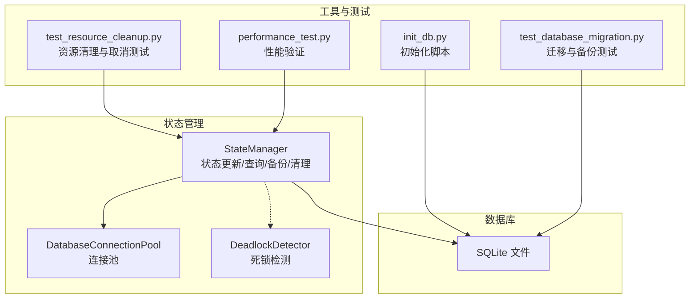
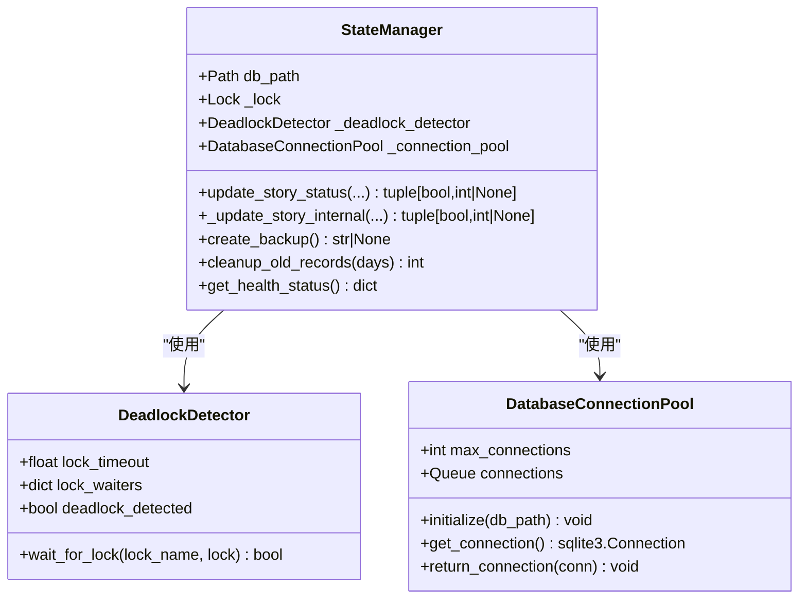
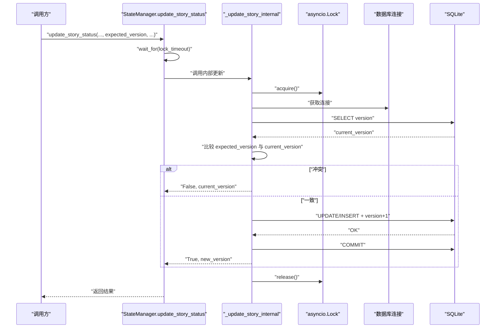
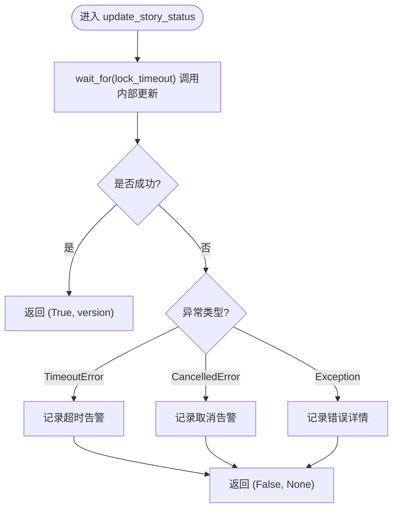
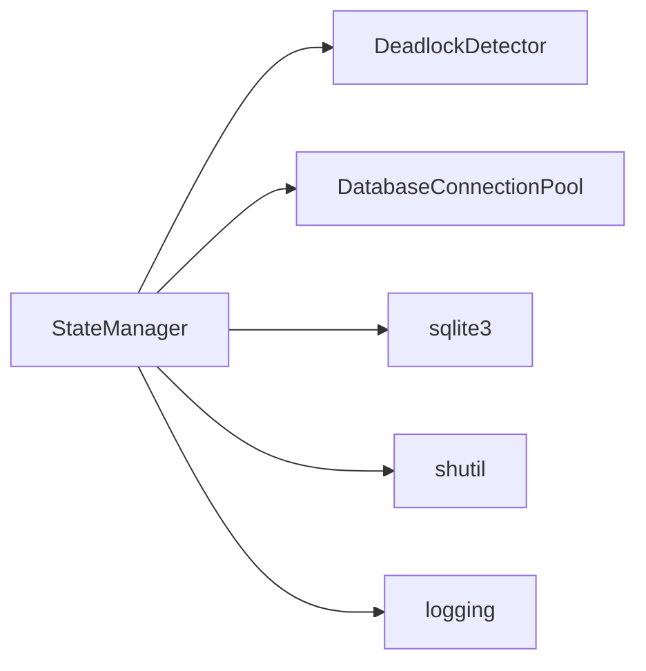

# 事务处理与错误恢复

<cite>
**本文引用的文件**
- [state_manager.py](file://autoBMAD/epic_automation/state_manager.py)
- [state_manager_fixed.py](file://BUGFIX_20260107/fixed_modules/state_manager_fixed.py)
- [init_db.py](file://autoBMAD/epic_automation/init_db.py)
- [test_database_migration.py](file://tests-copy/unit/test_database_migration.py)
- [test_resource_cleanup.py](file://BUGFIX_20260107/tests/test_resource_cleanup.py)
- [performance_test.py](file://BUGFIX_20260107/validation_scripts/performance_test.py)
</cite>

## 目录
1. [简介](#简介)
2. [项目结构](#项目结构)
3. [核心组件](#核心组件)
4. [架构总览](#架构总览)
5. [详细组件分析](#详细组件分析)
6. [依赖关系分析](#依赖关系分析)
7. [性能考量](#性能考量)
8. [故障排查指南](#故障排查指南)
9. [结论](#结论)

## 简介
本文件聚焦于事务处理与错误恢复机制，围绕以下主题展开：
- 通过 asyncio.Lock 与上下文管理器实现状态更新的原子性与一致性
- 乐观锁（expected_version）在并发更新冲突检测中的应用与版本号自增策略
- PRAGMA 配置（journal_mode=WAL, synchronous=NORMAL）对事务性能与数据安全的权衡
- 错误恢复策略：update_story_status 中的超时控制（lock_timeout）、CancelledError 处理与异常捕获
- cleanup_old_records 中 DELETE 操作的事务完整性
- create_backup 通过 shutil.copy2 实现的热备份机制与可靠性保障

## 项目结构
本专题涉及的核心文件位于 autoBMAD/epic_automation 与 BUGFIX_20260107/fixed_modules 两个目录下，分别提供“修复版”与“原版”实现对比；同时配合迁移测试与资源清理测试，验证事务、备份与恢复能力。

图示来源
- [state_manager.py](file://autoBMAD/epic_automation/state_manager.py#L97-L131)
- [state_manager_fixed.py](file://BUGFIX_20260107/fixed_modules/state_manager_fixed.py#L77-L109)
- [init_db.py](file://autoBMAD/epic_automation/init_db.py#L24-L118)
- [test_database_migration.py](file://tests-copy/unit/test_database_migration.py#L35-L111)
- [test_resource_cleanup.py](file://BUGFIX_20260107/tests/test_resource_cleanup.py#L470-L606)
- [performance_test.py](file://BUGFIX_20260107/validation_scripts/performance_test.py#L227-L259)

章节来源
- [state_manager.py](file://autoBMAD/epic_automation/state_manager.py#L97-L131)
- [state_manager_fixed.py](file://BUGFIX_20260107/fixed_modules/state_manager_fixed.py#L77-L109)
- [init_db.py](file://autoBMAD/epic_automation/init_db.py#L24-L118)

## 核心组件
- 状态管理器（StateManager）
  - 提供 update_story_status、_update_story_internal、create_backup、cleanup_old_records 等方法
  - 使用 asyncio.Lock 与上下文管理器确保数据库操作的原子性
  - 支持乐观锁（expected_version），在更新时进行版本比对，防止并发覆盖
- 死锁检测器（DeadlockDetector）
  - 通过 wait_for_lock + lock_timeout 检测潜在死锁，避免长时间阻塞
- 数据库连接池（DatabaseConnectionPool）
  - 初始化时设置 PRAGMA：journal_mode=WAL、synchronous=NORMAL、cache_size、temp_store=memory
  - 提升并发读写与查询性能，同时保持合理的数据安全边界
- 初始化脚本（init_db.py）
  - 创建 stories 及相关表与索引，确保数据库结构一致
- 测试与验证
  - 迁移与备份测试：验证备份创建、校验、回滚与错误处理
  - 资源清理测试：验证取消、异常场景下的锁与连接释放
  - 性能测试：评估状态更新平均耗时与吞吐

章节来源
- [state_manager.py](file://autoBMAD/epic_automation/state_manager.py#L203-L348)
- [state_manager_fixed.py](file://BUGFIX_20260107/fixed_modules/state_manager_fixed.py#L223-L363)
- [state_manager.py](file://autoBMAD/epic_automation/state_manager.py#L49-L88)
- [state_manager.py](file://autoBMAD/epic_automation/state_manager.py#L59-L88)
- [state_manager.py](file://autoBMAD/epic_automation/state_manager.py#L544-L599)
- [state_manager.py](file://autoBMAD/epic_automation/state_manager.py#L599-L604)
- [init_db.py](file://autoBMAD/epic_automation/init_db.py#L24-L118)
- [test_database_migration.py](file://tests-copy/unit/test_database_migration.py#L35-L111)
- [test_resource_cleanup.py](file://BUGFIX_20260107/tests/test_resource_cleanup.py#L470-L606)
- [performance_test.py](file://BUGFIX_20260107/validation_scripts/performance_test.py#L227-L259)

## 架构总览
下面的类图展示了状态管理器、死锁检测器与连接池之间的关系，以及它们如何协作实现事务性与错误恢复。

图示来源
- [state_manager.py](file://autoBMAD/epic_automation/state_manager.py#L31-L88)
- [state_manager.py](file://autoBMAD/epic_automation/state_manager.py#L97-L131)
- [state_manager.py](file://autoBMAD/epic_automation/state_manager.py#L203-L348)

## 详细组件分析

### 事务性与原子性：_update_story_internal 与 asyncio.Lock
- 原子性保障
  - 使用 asyncio.Lock 对状态更新路径加锁，确保同一时刻仅有一个协程持有锁执行数据库操作
  - 在锁内通过上下文管理器获取数据库连接，保证连接生命周期与锁的绑定
- 事务边界
  - 所有更新（INSERT/UPDATE）均在单次事务中完成，最终 commit 提交
  - 若中途出现异常，由外层 try/except 捕获并记录日志，不提交事务，从而维持一致性
- 乐观锁与版本号自增
  - 查询当前版本号 current_version
  - 若传入 expected_version，比较两者是否一致，不一致则直接返回 False 与当前版本，避免覆盖
  - 成功更新后，将 version 自增 1，作为后续乐观锁的依据

图示来源
- [state_manager.py](file://autoBMAD/epic_automation/state_manager.py#L203-L348)

章节来源
- [state_manager.py](file://autoBMAD/epic_automation/state_manager.py#L203-L348)

### 乐观锁与版本号自增策略
- 适用场景
  - 多个消费者/生产者并发更新同一故事状态，避免后写覆盖先写
- 策略要点
  - 读取 current_version
  - 若 expected_version 存在且不等于 current_version，则判定冲突，返回 False 与 current_version
  - 成功更新后，version 自增 1，作为下一次更新的 expected_version
- 数据一致性
  - 结合事务提交与锁保护，确保“读-比较-写”的原子性，避免竞态条件

章节来源
- [state_manager.py](file://autoBMAD/epic_automation/state_manager.py#L294-L323)

### PRAGMA 配置：WAL 与 NORMAL 的权衡
- WAL（Write-Ahead Logging）
  - 提升并发读写性能，允许多个读事务与一个写事务并行
  - 降低写入阻塞概率，改善高并发场景下的响应时间
- synchronous=NORMAL
  - 放弃每次写入都 fsync 到磁盘，换取更高的写入吞吐
  - 在 SQLite 中仍保证崩溃恢复能力，但极端断电风险略有上升
- 其他优化
  - cache_size、temp_store=memory 提升查询与临时表性能
- 影响范围
  - 通过 DatabaseConnectionPool.initialize 在连接建立时设置，影响所有后续操作

章节来源
- [state_manager.py](file://autoBMAD/epic_automation/state_manager.py#L69-L88)
- [state_manager_fixed.py](file://BUGFIX_20260107/fixed_modules/state_manager_fixed.py#L85-L93)

### 错误恢复策略：update_story_status 的超时与取消处理
- 超时控制（lock_timeout）
  - 外层 update_story_status 使用 asyncio.wait_for 对内部更新进行超时限制
  - 超时返回 False，避免线程/协程长期阻塞
- 取消处理（CancelledError）
  - 捕获 asyncio.CancelledError，记录告警并返回 False
  - 修复版（fixed_modules）在 finally 中显式释放锁，避免死锁
- 异常捕获
  - 捕获通用异常，记录错误详情与堆栈，返回 False
- 死锁检测
  - 通过 DeadlockDetector.wait_for_lock + lock_timeout 检测潜在死锁，避免无限等待

图示来源
- [state_manager.py](file://autoBMAD/epic_automation/state_manager.py#L203-L261)
- [state_manager_fixed.py](file://BUGFIX_20260107/fixed_modules/state_manager_fixed.py#L223-L284)

章节来源
- [state_manager.py](file://autoBMAD/epic_automation/state_manager.py#L203-L261)
- [state_manager_fixed.py](file://BUGFIX_20260107/fixed_modules/state_manager_fixed.py#L223-L284)

### DELETE 操作的事务完整性：cleanup_old_records
- 事务边界
  - 在锁保护下执行多条 DELETE 语句，最后统一 commit
  - 任一异常被捕获并记录，不提交事务，保证数据一致性
- 删除策略
  - 删除 stories 中超过保留期且状态为 completed/failed 的记录
  - 同步清理 code_quality_phase 与 test_automation_phase 表中的旧记录
- 返回值
  - 返回本次清理的总记录数，便于监控与审计

章节来源
- [state_manager.py](file://autoBMAD/epic_automation/state_manager.py#L599-L604)
- [state_manager_fixed.py](file://BUGFIX_20260107/fixed_modules/state_manager_fixed.py#L588-L621)

### 热备份机制：create_backup 与可靠性
- 备份方式
  - 使用 shutil.copy2 对数据库文件进行复制，利用 SQLite 的热备份特性
  - 备份文件名包含时间戳，避免覆盖
- 可靠性保障
  - 测试覆盖了备份创建、校验、回滚与错误处理（如磁盘空间不足）
  - 回滚测试验证备份可恢复至迁移前状态
- 与事务的关系
  - 备份发生在文件层面，不依赖数据库事务；但建议在 schema 变更前进行备份，确保可回滚

章节来源
- [state_manager.py](file://autoBMAD/epic_automation/state_manager.py#L544-L567)
- [test_database_migration.py](file://tests-copy/unit/test_database_migration.py#L35-L111)
- [test_database_migration.py](file://tests-copy/unit/test_database_migration.py#L423-L470)

## 依赖关系分析
- 组件耦合
  - StateManager 依赖 DeadlockDetector 与 DatabaseConnectionPool
  - 所有数据库操作通过上下文管理器获取连接，避免连接泄漏
- 外部依赖
  - sqlite3、asyncio、shutil
  - 日志模块用于错误与性能记录
- 循环依赖
  - 无循环导入；各模块职责清晰

图示来源
- [state_manager.py](file://autoBMAD/epic_automation/state_manager.py#L97-L131)
- [state_manager.py](file://autoBMAD/epic_automation/state_manager.py#L203-L348)

章节来源
- [state_manager.py](file://autoBMAD/epic_automation/state_manager.py#L97-L131)
- [state_manager.py](file://autoBMAD/epic_automation/state_manager.py#L203-L348)

## 性能考量
- 并发与锁
  - 使用 asyncio.Lock 串行化关键路径，避免锁竞争导致的上下文切换开销
  - 通过 DeadlockDetector + lock_timeout 防止死锁与长时间阻塞
- 连接池与 PRAGMA
  - 连接池减少频繁打开/关闭连接的成本
  - WAL + NORMAL 提升并发读写吞吐，cache_size 与 temp_store=memory 优化查询与临时表
- 性能测试
  - 性能测试显示状态更新平均耗时与吞吐满足预期阈值

章节来源
- [state_manager.py](file://autoBMAD/epic_automation/state_manager.py#L69-L88)
- [performance_test.py](file://BUGFIX_20260107/validation_scripts/performance_test.py#L227-L259)

## 故障排查指南
- 常见问题与定位
  - 更新超时：检查 lock_timeout 与系统负载；确认 DeadlockDetector 是否检测到死锁
  - 更新被取消：关注 CancelledError 分支的日志，排查外部取消来源
  - 版本冲突：expected_version 与 current_version 不一致，需重试或刷新数据
  - DELETE 未生效：确认事务是否提交；检查异常捕获分支
  - 备份失败：检查磁盘空间与权限；查看备份/回滚测试用例中的错误处理
- 资源清理
  - 取消与异常场景下，确保锁与连接被释放；参考资源清理测试用例
- 健康检查
  - 使用 get_health_status 获取数据库路径、锁状态、死锁标记与连接池信息

章节来源
- [state_manager.py](file://autoBMAD/epic_automation/state_manager.py#L203-L261)
- [state_manager.py](file://autoBMAD/epic_automation/state_manager.py#L599-L604)
- [state_manager.py](file://autoBMAD/epic_automation/state_manager.py#L605-L626)
- [test_resource_cleanup.py](file://BUGFIX_20260107/tests/test_resource_cleanup.py#L470-L606)
- [test_database_migration.py](file://tests-copy/unit/test_database_migration.py#L485-L504)

## 结论
- 通过 asyncio.Lock 与上下文管理器，状态更新具备原子性与一致性
- 乐观锁与版本号自增有效防止并发覆盖，保障数据一致性
- PRAGMA 配置在 WAL 与 NORMAL 之间取得性能与安全的平衡
- 错误恢复策略完善：超时、取消、异常捕获与死锁检测共同构成稳健的容错体系
- DELETE 操作在事务内执行，配合异常捕获确保一致性
- create_backup 采用热备份与严格的测试覆盖，提升可靠性与可回滚性