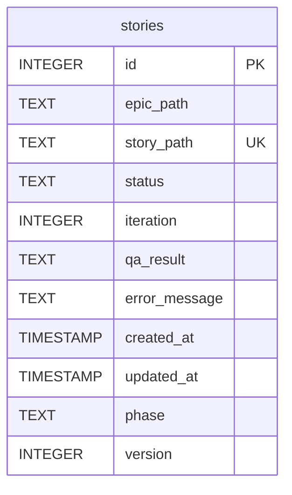
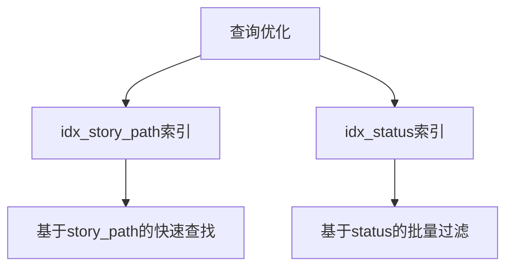
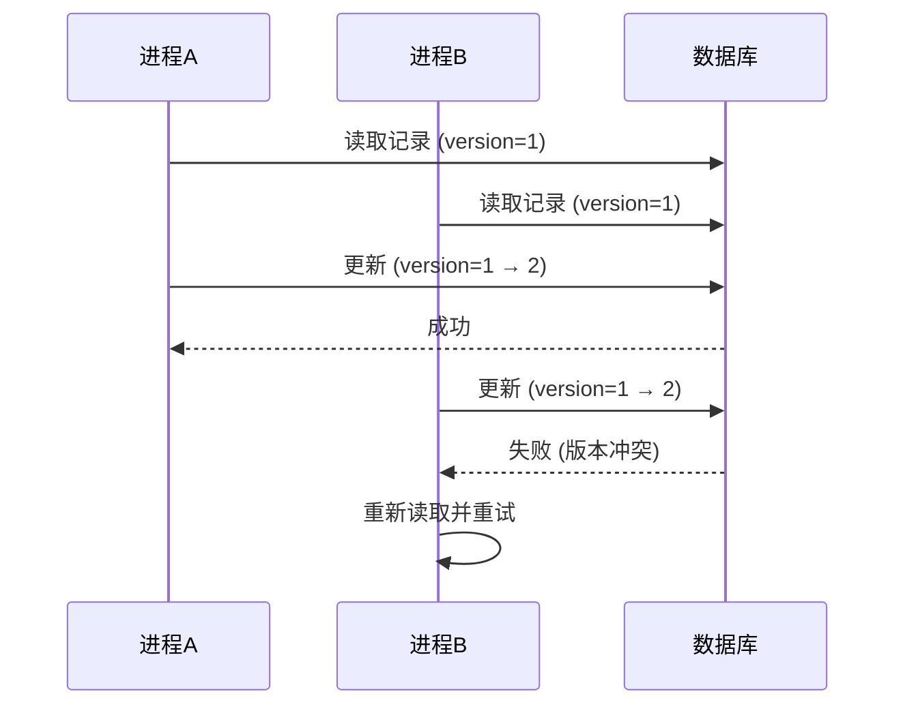
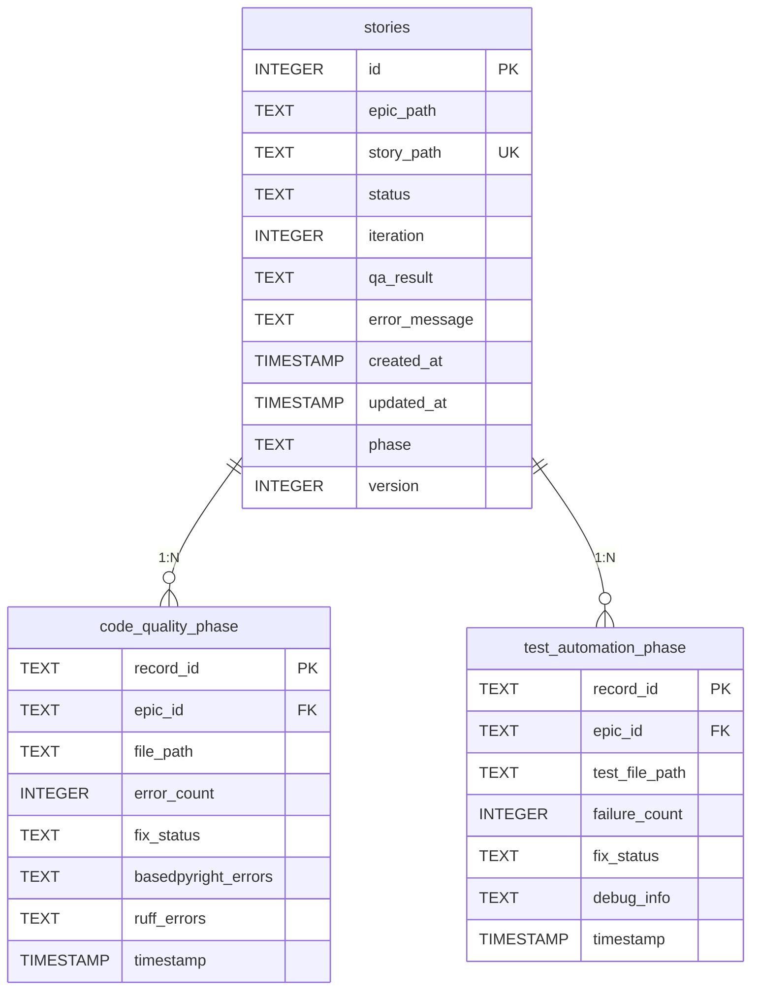
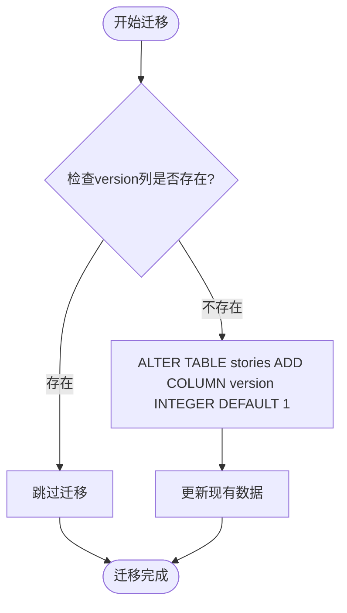

# 数据库Schema设计

<cite>
**本文档引用的文件**   
- [init_db.py](file://autoBMAD/epic_automation/init_db.py)
- [state_manager.py](file://autoBMAD/epic_automation/state_manager.py)
- [test_state_manager.py](file://tests-copy/test_state_manager.py)
- [test_database_migration.py](file://tests-copy/unit/test_database_migration.py)
</cite>

## 目录
1. [简介](#简介)
2. [核心表结构](#核心表结构)
3. [字段业务含义](#字段业务含义)
4. [约束与索引](#约束与索引)
5. [乐观锁机制](#乐观锁机制)
6. [数据库Schema示意图](#数据库schema示意图)
7. [迁移策略](#迁移策略)
8. [结论](#结论)

## 简介
本文档详细分析了autoBMAD系统中stories表的数据库Schema设计。该表用于跟踪史诗（epic）和故事（story）的处理进度，是整个自动化系统的核心数据存储。文档将深入解析各字段的业务含义、约束条件、索引优化以及版本控制机制。

**Section sources**
- [init_db.py](file://autoBMAD/epic_automation/init_db.py#L34-L46)
- [state_manager.py](file://autoBMAD/epic_automation/state_manager.py#L143-L157)

## 核心表结构
stories表是系统的核心数据表，用于持久化存储每个故事的处理状态和元数据。该表采用SQLite数据库实现，设计上注重数据完整性、查询性能和并发安全性。

**Diagram sources**
- [init_db.py](file://autoBMAD/epic_automation/init_db.py#L34-L46)
- [state_manager.py](file://autoBMAD/epic_automation/state_manager.py#L143-L157)

## 字段业务含义
以下是对stories表中各字段的详细业务含义说明：

### id（主键）
id字段是表的主键，采用INTEGER类型并设置为AUTOINCREMENT，确保每个记录都有唯一的标识符。它是数据库层面的唯一标识，不具有业务含义。

### epic_path（史诗路径）
epic_path字段存储与故事关联的史诗文档的文件路径。它用于建立故事与史诗之间的层级关系，支持按史诗维度进行进度汇总和查询。

### story_path（故事路径）
story_path字段存储故事文档的文件路径。作为业务主键，它标识了系统中处理的具体故事单元。该字段的值通常与文件系统中的.md文件路径对应。

### status（状态）
status字段表示故事当前的处理状态。可能的值包括：pending（待处理）、in_progress（处理中）、review（评审中）、pass（通过）和fail（失败）。该字段驱动系统的状态机流转。

### iteration（迭代次数）
iteration字段记录故事被处理的迭代次数。每当故事状态变为in_progress时，该计数器会递增，用于跟踪问题解决的尝试次数。

### qa_result（QA结果JSON）
qa_result字段存储质量保证（QA）检查的结果，以JSON格式保存。它包含详细的检查结果、发现的问题和通过/失败的判定。

### error_message（错误信息）
error_message字段存储处理过程中发生的错误信息。当状态为fail时，该字段会记录具体的错误原因，便于问题排查。

### created_at/updated_at（时间戳）
created_at和updated_at字段分别记录记录的创建时间和最后更新时间。它们采用TIMESTAMP类型，默认值为CURRENT_TIMESTAMP，用于跟踪处理进度的时间线。

### phase（阶段）
phase字段表示故事当前所处的处理阶段。它支持将处理流程划分为多个阶段（如代码质量检查、测试自动化等），实现分阶段的进度管理。

### version（版本号）
version字段实现乐观锁机制，用于解决并发更新问题。每次更新记录时，版本号会递增，确保数据一致性。

**Section sources**
- [init_db.py](file://autoBMAD/epic_automation/init_db.py#L34-L46)
- [state_manager.py](file://autoBMAD/epic_automation/state_manager.py#L203-L237)

## 约束与索引
### UNIQUE约束
story_path字段上的UNIQUE约束确保了每个故事路径在系统中只能存在一个记录。这防止了重复处理同一个故事，保证了数据的唯一性和完整性。

### 索引优化
系统实现了两个关键索引以优化查询性能：

**Diagram sources**
- [init_db.py](file://autoBMAD/epic_automation/init_db.py#L50-L58)
- [state_manager.py](file://autoBMAD/epic_automation/state_manager.py#L160-L168)

idx_story_path索引在story_path字段上创建，极大地加速了基于故事路径的查找操作。idx_status索引在status字段上创建，优化了按状态筛选故事的查询性能，如获取所有"in_progress"状态的故事。

**Section sources**
- [init_db.py](file://autoBMAD/epic_automation/init_db.py#L49-L59)
- [test_state_manager.py](file://tests-copy/test_state_manager.py#L70-L85)

## 乐观锁机制
version字段实现了乐观锁机制，用于处理并发更新场景。当多个进程尝试同时更新同一条记录时，系统会检查版本号以确保数据一致性。

**Diagram sources**
- [state_manager.py](file://autoBMAD/epic_automation/state_manager.py#L203-L237)
- [state_manager.py](file://autoBMAD/epic_automation/state_manager.py#L170-L177)

当进程尝试更新记录时，会检查当前版本号是否与读取时一致。如果不一致，更新将失败，进程需要重新读取最新数据并重试操作，从而避免了数据覆盖问题。

**Section sources**
- [state_manager.py](file://autoBMAD/epic_automation/state_manager.py#L203-L237)

## 数据库Schema示意图
以下是完整的数据库Schema示意图，展示了stories表的完整结构：

**Diagram sources**
- [init_db.py](file://autoBMAD/epic_automation/init_db.py#L34-L116)
- [state_manager.py](file://autoBMAD/epic_automation/state_manager.py#L143-L177)

## 迁移策略
系统的ALTER TABLE迁移策略设计为向后兼容。通过在现有表上添加新字段（如version）而不是重构表结构，确保了旧版本代码仍能正常工作。

**Diagram sources**
- [state_manager.py](file://autoBMAD/epic_automation/state_manager.py#L170-L177)
- [test_database_migration.py](file://tests-copy/unit/test_database_migration.py#L246-L290)

迁移脚本首先检查目标列是否存在，如果不存在则执行ALTER TABLE语句添加列。这种设计确保了迁移可以安全地多次执行，且不会影响现有数据的完整性。

**Section sources**
- [state_manager.py](file://autoBMAD/epic_automation/state_manager.py#L170-L177)
- [test_database_migration.py](file://tests-copy/unit/test_database_migration.py#L246-L290)

## 结论
stories表的Schema设计充分考虑了业务需求、性能优化和系统可靠性。通过合理的字段设计、约束条件、索引优化和版本控制机制，该表能够高效、安全地支持系统的自动化处理流程。迁移策略的向后兼容性设计确保了系统演进过程中的平稳过渡。