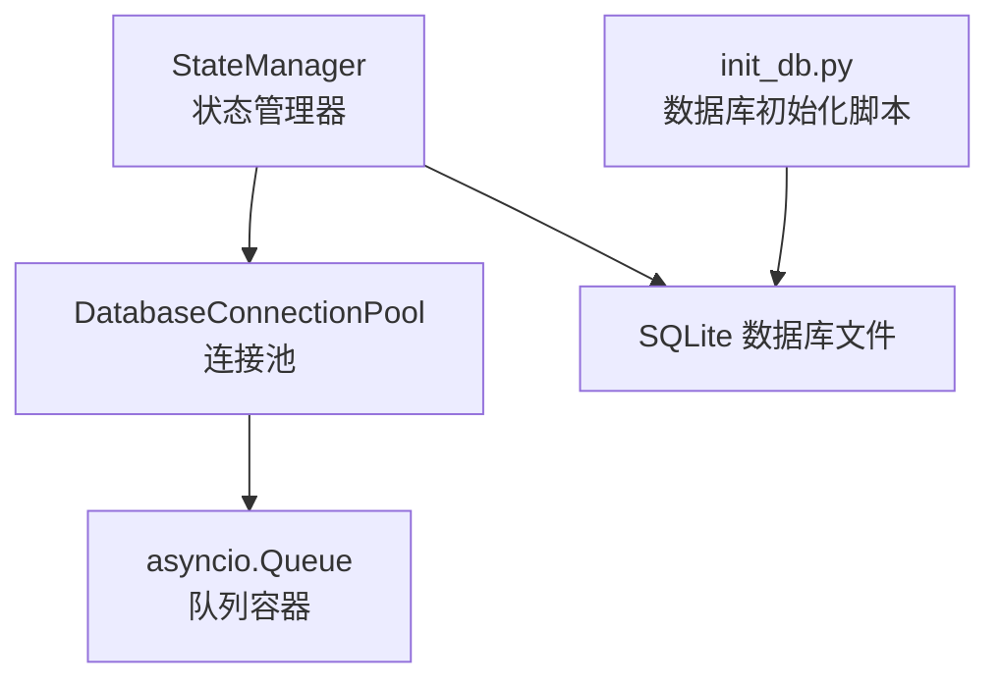
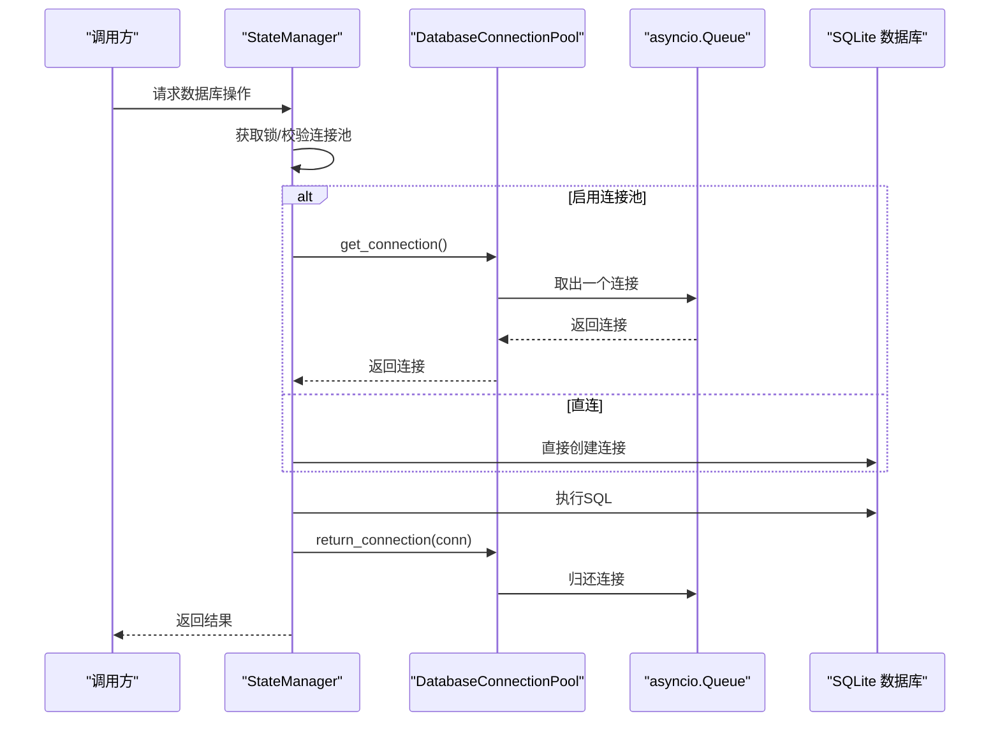
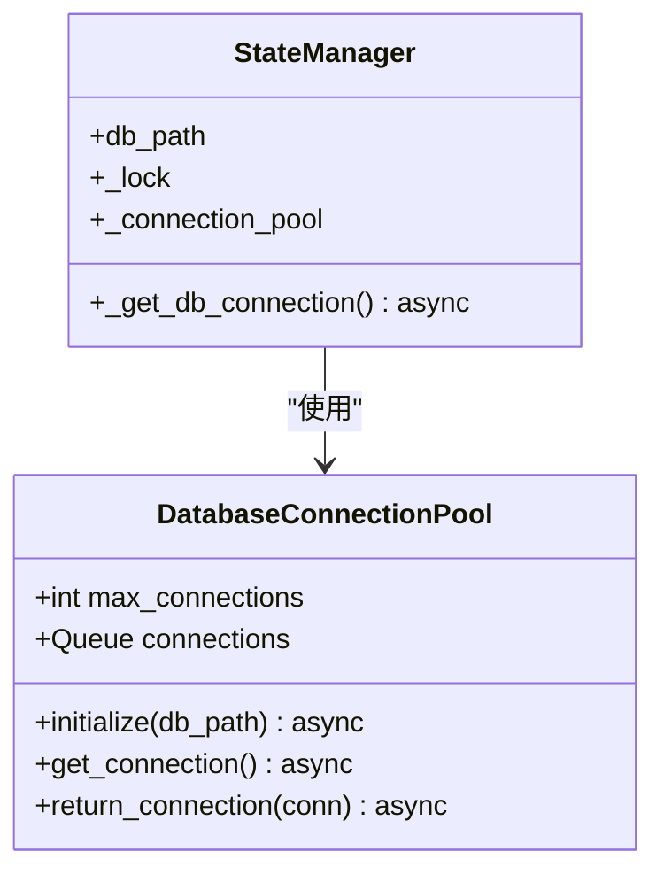
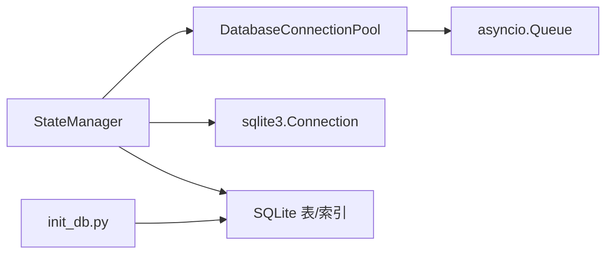

# 数据库连接管理

<cite>
**本文引用的文件**
- [state_manager.py](file://autoBMAD/epic_automation/state_manager.py)
- [test_resource_cleanup.py](file://BUGFIX_20260107/tests/test_resource_cleanup.py)
- [init_db.py](file://autoBMAD/epic_automation/init_db.py)
- [state_manager_fixed.py](file://BUGFIX_20260107/fixed_modules/state_manager_fixed.py)
</cite>

## 目录
1. [简介](#简介)
2. [项目结构](#项目结构)
3. [核心组件](#核心组件)
4. [架构总览](#架构总览)
5. [详细组件分析](#详细组件分析)
6. [依赖关系分析](#依赖关系分析)
7. [性能考量](#性能考量)
8. [故障排查指南](#故障排查指南)
9. [结论](#结论)
10. [附录](#附录)

## 简介
本文件围绕数据库连接管理展开，重点阐述 DatabaseConnectionPool 类的实现机制与使用方式，涵盖：
- 连接池初始化流程与 PRAGMA 配置（WAL、synchronous、cache_size、temp_store）对并发性能的影响
- 连接获取（get_connection）与归还（return_connection）的异步处理机制
- 连接池耗尽时的异常处理策略
- 连接池状态监控方法（最大连接数、健康状态）
- 高并发场景下的性能优势与资源管理最佳实践

## 项目结构
与数据库连接管理相关的核心文件位于以下模块：
- autoBMAD/epic_automation/state_manager.py：定义 DatabaseConnectionPool 与 StateManager，提供连接池与数据库操作封装
- BUGFIX_20260107/tests/test_resource_cleanup.py：包含连接池耗尽处理、压力测试等测试用例
- autoBMAD/epic_automation/init_db.py：数据库初始化脚本，创建所需表与索引
- BUGFIX_20260107/fixed_modules/state_manager_fixed.py：修复版状态管理器，展示连接池的另一种初始化与使用方式

图表来源
- [state_manager.py](file://autoBMAD/epic_automation/state_manager.py#L59-L95)
- [init_db.py](file://autoBMAD/epic_automation/init_db.py#L24-L119)

章节来源
- [state_manager.py](file://autoBMAD/epic_automation/state_manager.py#L59-L95)
- [init_db.py](file://autoBMAD/epic_automation/init_db.py#L24-L119)

## 核心组件
- DatabaseConnectionPool：基于 asyncio.Queue 的 SQLite 连接池，负责连接的创建、获取与归还，并在初始化时设置关键 PRAGMA 参数以提升并发性能
- StateManager：封装数据库操作，内部通过上下文管理器自动获取与归还连接；可选择启用连接池或直连
- 测试用例：验证连接池初始化、获取/归还、耗尽处理、压力与泄漏检测等

章节来源
- [state_manager.py](file://autoBMAD/epic_automation/state_manager.py#L59-L95)
- [state_manager.py](file://autoBMAD/epic_automation/state_manager.py#L183-L202)
- [test_resource_cleanup.py](file://BUGFIX_20260107/tests/test_resource_cleanup.py#L48-L73)
- [test_resource_cleanup.py](file://BUGFIX_20260107/tests/test_resource_cleanup.py#L312-L353)

## 架构总览
连接池与状态管理器的交互流程如下：
- StateManager 在需要数据库操作时，通过上下文管理器获取连接
- 若启用连接池，则由 DatabaseConnectionPool 提供连接；否则直接创建 sqlite3 连接
- 操作完成后，连接通过 finally 语句归还至连接池或关闭

图表来源
- [state_manager.py](file://autoBMAD/epic_automation/state_manager.py#L183-L202)
- [state_manager.py](file://autoBMAD/epic_automation/state_manager.py#L88-L95)

章节来源
- [state_manager.py](file://autoBMAD/epic_automation/state_manager.py#L183-L202)

## 详细组件分析

### DatabaseConnectionPool 类
- 初始化流程
  - 通过循环创建固定数量的 sqlite3 连接，并将连接放入 asyncio.Queue 中
  - 在初始化时执行关键 PRAGMA 配置，以优化并发与性能
- 连接获取（get_connection）
  - 从队列取出一个连接，若队列为空则等待指定超时后抛出异常
- 连接归还（return_connection）
  - 将连接放回队列；若队列已满则关闭该连接，防止泄漏

图表来源
- [state_manager.py](file://autoBMAD/epic_automation/state_manager.py#L59-L95)
- [state_manager.py](file://autoBMAD/epic_automation/state_manager.py#L183-L202)

章节来源
- [state_manager.py](file://autoBMAD/epic_automation/state_manager.py#L59-L95)
- [state_manager.py](file://autoBMAD/epic_automation/state_manager.py#L88-L95)

### PRAGMA 配置与并发性能影响
连接池初始化时设置的关键 PRAGMA：
- journal_mode=WAL：启用 WAL 模式，显著提升并发读写能力，减少锁竞争
- synchronous=NORMAL：在性能与安全性之间取得平衡，降低 fsync 开销
- cache_size=10000：增大页缓存，减少磁盘 IO，提升吞吐
- temp_store=MEMORY：临时表存储在内存，避免磁盘临时文件带来的额外开销

这些配置共同作用于高并发场景，降低锁等待与 IO 抖动，提升整体响应速度与稳定性。

章节来源
- [state_manager.py](file://autoBMAD/epic_automation/state_manager.py#L69-L78)

### 异步获取与归还机制
- 获取连接采用超时等待，避免无限阻塞
- 归还连接时若队列已满，主动关闭连接，防止连接泄漏
- StateManager 的上下文管理器确保无论正常结束还是异常退出，连接都会被归还或关闭

章节来源
- [state_manager.py](file://autoBMAD/epic_automation/state_manager.py#L79-L95)
- [state_manager.py](file://autoBMAD/epic_automation/state_manager.py#L183-L202)

### 连接池耗尽时的异常处理策略
- 当队列为空且超时后，get_connection 抛出运行时异常，提示“连接池耗尽”
- 测试用例覆盖了连接池耗尽场景，验证超时行为与后续恢复

章节来源
- [state_manager.py](file://autoBMAD/epic_automation/state_manager.py#L79-L88)
- [test_resource_cleanup.py](file://BUGFIX_20260107/tests/test_resource_cleanup.py#L312-L353)

### 连接池状态监控与健康检查
- 健康状态接口提供连接池启用状态、最大连接数等信息
- 结合测试用例可验证锁状态、连接池耗尽等健康指标

章节来源
- [state_manager.py](file://autoBMAD/epic_automation/state_manager.py#L605-L626)
- [test_resource_cleanup.py](file://BUGFIX_20260107/tests/test_resource_cleanup.py#L312-L353)

### 高并发场景下的性能优势与最佳实践
- 性能优势
  - 使用 asyncio.Queue 作为连接池容器，天然支持异步并发
  - WAL 模式与缓存配置显著提升并发读写吞吐
- 最佳实践
  - 合理设置 max_connections，避免过度占用内存
  - 在业务高峰前预热连接池，减少首次请求延迟
  - 使用上下文管理器确保连接归还，避免泄漏
  - 对长时间运行的任务设置超时，防止连接占用过久

章节来源
- [state_manager.py](file://autoBMAD/epic_automation/state_manager.py#L59-L95)
- [state_manager.py](file://autoBMAD/epic_automation/state_manager.py#L183-L202)
- [test_resource_cleanup.py](file://BUGFIX_20260107/tests/test_resource_cleanup.py#L355-L383)

## 依赖关系分析
- DatabaseConnectionPool 依赖 asyncio.Queue 作为连接容器
- StateManager 依赖 DatabaseConnectionPool 或直接依赖 sqlite3 连接
- init_db.py 负责数据库表与索引的初始化，为连接池提供稳定的数据库环境

图表来源
- [state_manager.py](file://autoBMAD/epic_automation/state_manager.py#L59-L95)
- [state_manager.py](file://autoBMAD/epic_automation/state_manager.py#L183-L202)
- [init_db.py](file://autoBMAD/epic_automation/init_db.py#L24-L119)

章节来源
- [state_manager.py](file://autoBMAD/epic_automation/state_manager.py#L59-L95)
- [state_manager.py](file://autoBMAD/epic_automation/state_manager.py#L183-L202)
- [init_db.py](file://autoBMAD/epic_automation/init_db.py#L24-L119)

## 性能考量
- PRAGMA 配置对并发性能的影响
  - WAL 模式：减少写入阻塞，提升并发读写
  - synchronous=NORMAL：降低 fsync 频率，提高写入吞吐
  - cache_size=10000：增大缓存，减少磁盘访问
  - temp_store=MEMORY：避免临时文件 IO
- 连接池容量与超时
  - 容量过大可能导致内存占用上升；容量过小可能导致频繁耗尽
  - 超时设置需结合业务峰值与平均响应时间权衡
- 上下文管理器与异常处理
  - 确保连接在 finally 中归还或关闭，避免泄漏
  - 对长时间任务设置超时，防止连接被长时间占用

章节来源
- [state_manager.py](file://autoBMAD/epic_automation/state_manager.py#L69-L78)
- [state_manager.py](file://autoBMAD/epic_automation/state_manager.py#L79-L95)
- [state_manager.py](file://autoBMAD/epic_automation/state_manager.py#L183-L202)

## 故障排查指南
- 连接池耗尽
  - 现象：get_connection 抛出“连接池耗尽”异常
  - 排查：检查 max_connections 设置、并发峰值、是否存在连接泄漏
  - 参考测试：连接池耗尽处理与压力测试
- 连接泄漏
  - 现象：连接无法归还导致队列持续空闲
  - 排查：确认是否使用上下文管理器、finally 是否执行
  - 参考测试：连接泄漏检测
- 锁争用与死锁
  - 现象：操作超时或锁状态异常
  - 排查：检查锁超时配置、业务逻辑是否持有锁过久
  - 参考实现：DeadlockDetector 与 managed_operation

章节来源
- [state_manager.py](file://autoBMAD/epic_automation/state_manager.py#L31-L57)
- [state_manager.py](file://autoBMAD/epic_automation/state_manager.py#L370-L404)
- [test_resource_cleanup.py](file://BUGFIX_20260107/tests/test_resource_cleanup.py#L312-L353)
- [test_resource_cleanup.py](file://BUGFIX_20260107/tests/test_resource_cleanup.py#L217-L247)

## 结论
DatabaseConnectionPool 通过 asyncio.Queue 实现轻量级异步连接池，配合 WAL、synchronous、cache_size、temp_store 等 PRAGMA 配置，在高并发场景下显著提升 SQLite 的并发性能与稳定性。StateManager 的上下文管理器确保连接生命周期管理的正确性，测试用例覆盖了连接池耗尽、压力与泄漏检测等关键场景。建议根据业务负载合理设置连接池容量与超时，并始终使用上下文管理器保证资源回收。

## 附录
- 数据库初始化脚本：init_db.py 负责创建表与索引，为连接池提供稳定的数据层基础
- 修复版状态管理器：fixed_modules/state_manager_fixed.py 展示了连接池的另一种初始化与使用方式，便于对比与迁移

章节来源
- [init_db.py](file://autoBMAD/epic_automation/init_db.py#L24-L119)
- [state_manager_fixed.py](file://BUGFIX_20260107/fixed_modules/state_manager_fixed.py#L111-L118)
- [state_manager_fixed.py](file://BUGFIX_20260107/fixed_modules/state_manager_fixed.py#L208-L222)