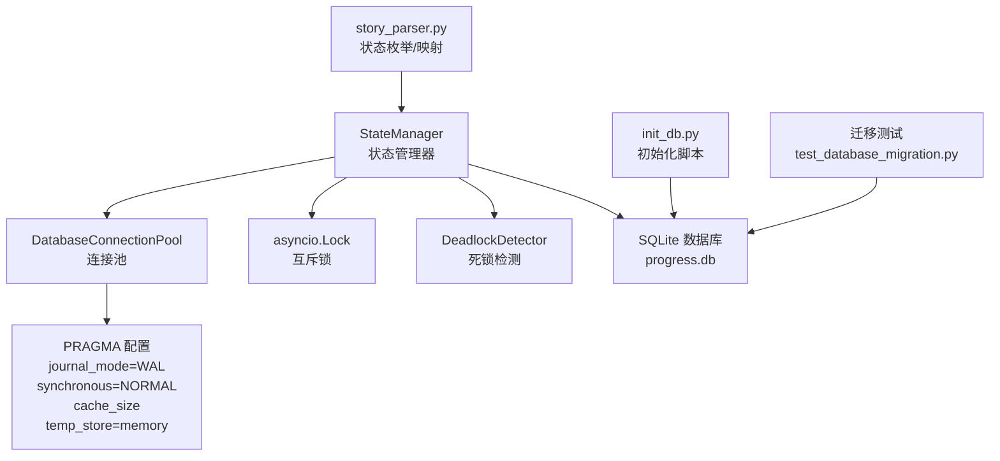
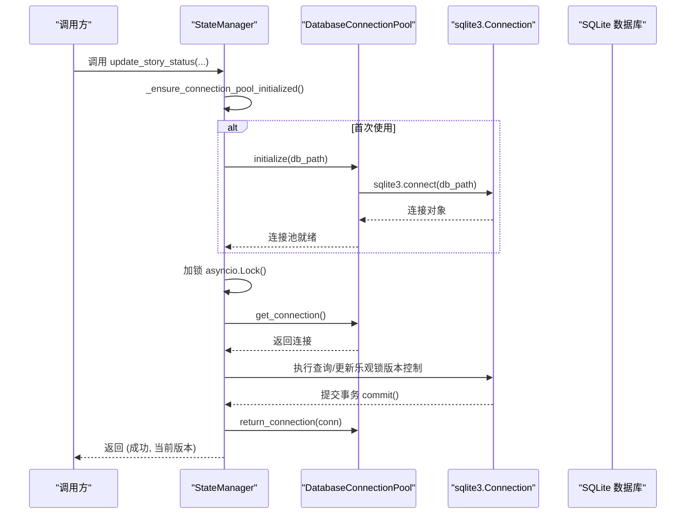
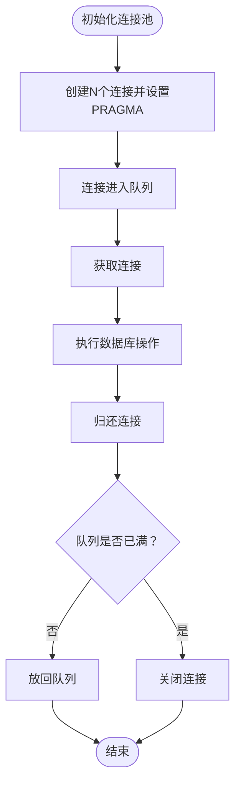
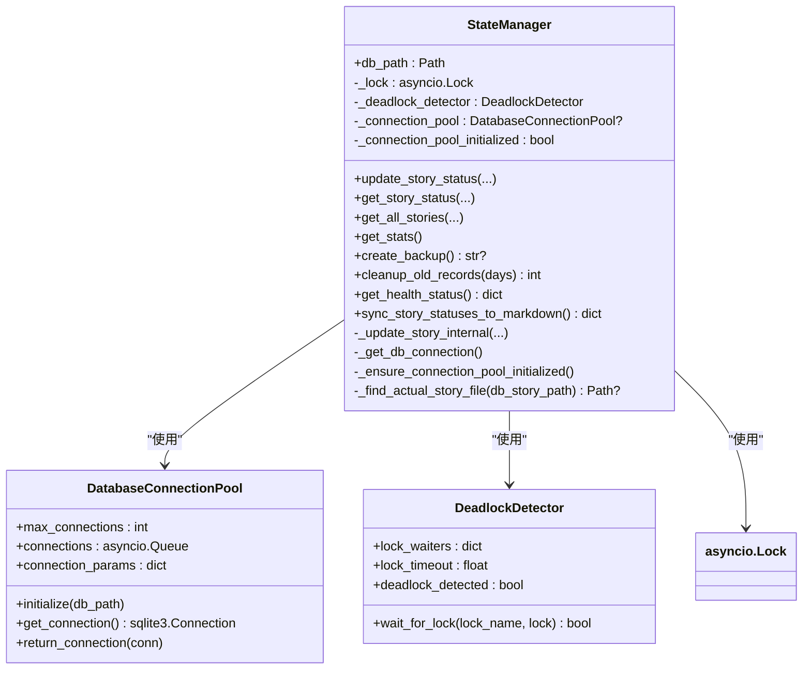
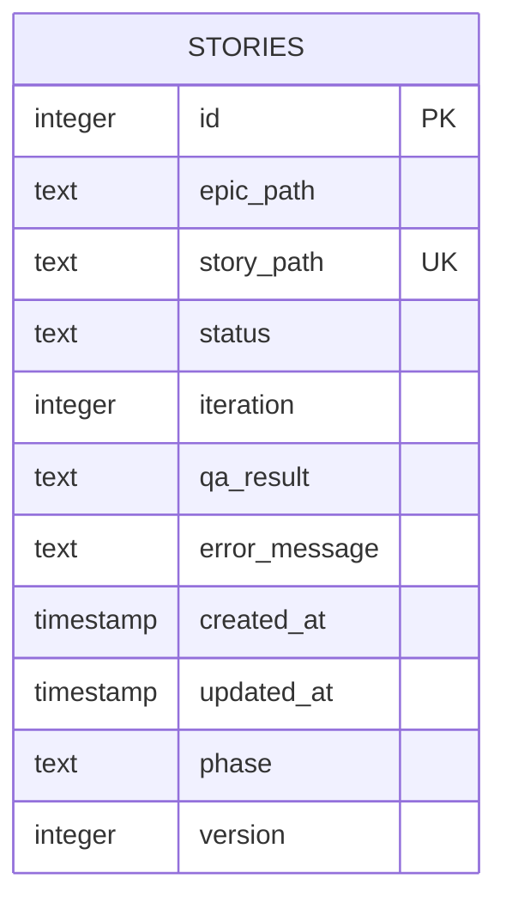
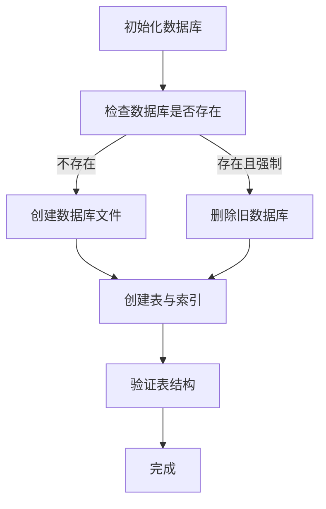
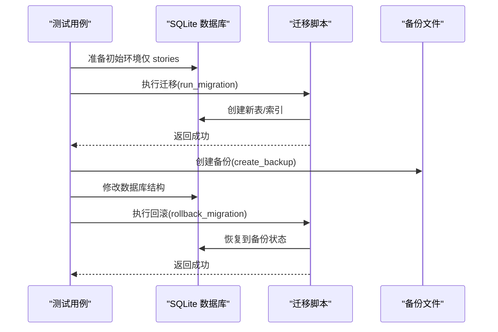
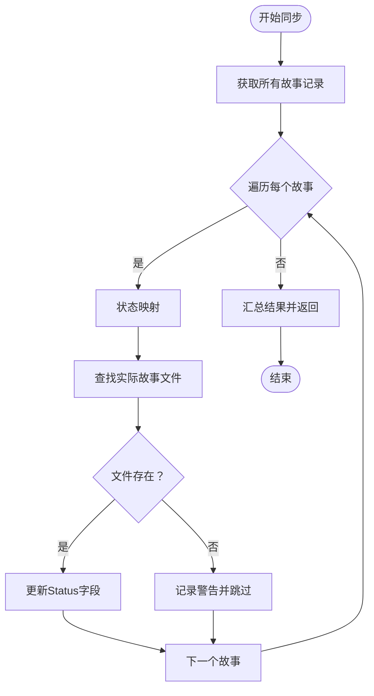
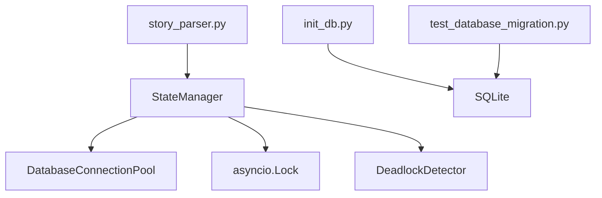
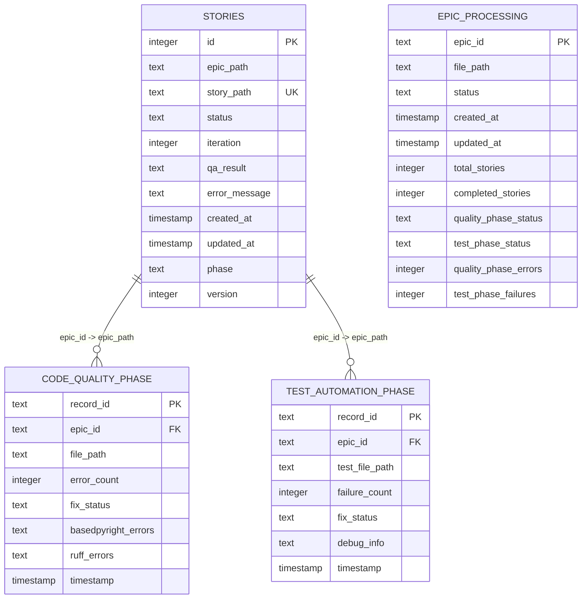

# 状态存储机制

<cite>
**本文引用的文件**
- [state_manager.py](file://autoBMAD/epic_automation/state_manager.py)
- [init_db.py](file://autoBMAD/epic_automation/init_db.py)
- [test_database_migration.py](file://tests-copy/unit/test_database_migration.py)
- [story_parser.py](file://autoBMAD/epic_automation/story_parser.py)
</cite>

## 目录
1. [简介](#简介)
2. [项目结构](#项目结构)
3. [核心组件](#核心组件)
4. [架构总览](#架构总览)
5. [详细组件分析](#详细组件分析)
6. [依赖分析](#依赖分析)
7. [性能考量](#性能考量)
8. [故障排查指南](#故障排查指南)
9. [结论](#结论)
10. [附录](#附录)

## 简介
本文件聚焦于基于 SQLite 的状态存储机制，围绕 autoBMAD 项目的“故事进度状态管理”展开，系统性说明：
- 基于 asyncio 的连接池与 WAL 模式优化并发性能
- 数据库 Schema 设计（stories 表及关联表）、索引策略与版本控制
- 事务处理与错误恢复策略（含 PRAGMA 配置）
- 数据库迁移、备份与回滚能力
- 状态同步至 Markdown 文档的流程与健壮性

## 项目结构
与状态存储直接相关的模块与文件如下：
- 状态管理器：负责数据库连接池、并发锁、状态更新、查询、统计、备份、清理等
- 初始化脚本：一次性创建数据库与表结构、索引
- 迁移测试：覆盖迁移、备份、回滚、外键约束与向前兼容性
- 故事解析：提供状态枚举与映射，支撑状态同步逻辑

图表来源
- [state_manager.py](file://autoBMAD/epic_automation/state_manager.py#L59-L125)
- [init_db.py](file://autoBMAD/epic_automation/init_db.py#L24-L118)
- [test_database_migration.py](file://tests-copy/unit/test_database_migration.py#L113-L200)
- [story_parser.py](file://autoBMAD/epic_automation/story_parser.py#L80-L110)

章节来源
- [state_manager.py](file://autoBMAD/epic_automation/state_manager.py#L59-L125)
- [init_db.py](file://autoBMAD/epic_automation/init_db.py#L24-L118)
- [test_database_migration.py](file://tests-copy/unit/test_database_migration.py#L113-L200)
- [story_parser.py](file://autoBMAD/epic_automation/story_parser.py#L80-L110)

## 核心组件
- DatabaseConnectionPool：基于 asyncio.Queue 的连接池，按需延迟初始化，支持获取/归还连接；在初始化时设置 WAL、同步级别、缓存与临时存储等 PRAGMA。
- StateManager：状态管理器，封装数据库模式初始化、连接获取、并发锁、乐观锁版本控制、事务提交、统计查询、备份、清理、以及将数据库状态同步到 Markdown 文档。
- DeadlockDetector：带超时的锁等待与死锁检测，避免长时间阻塞。
- 初始化脚本 init_db.py：创建 stories、code_quality_phase、test_automation_phase、epic_processing 等表与索引。
- 迁移测试：覆盖迁移执行、备份/校验、回滚、外键约束、向前兼容性与幂等性。
- 故事解析：提供 ProcessingStatus 枚举与核心状态映射，支撑状态同步逻辑。

章节来源
- [state_manager.py](file://autoBMAD/epic_automation/state_manager.py#L59-L125)
- [state_manager.py](file://autoBMAD/epic_automation/state_manager.py#L132-L179)
- [state_manager.py](file://autoBMAD/epic_automation/state_manager.py#L183-L201)
- [state_manager.py](file://autoBMAD/epic_automation/state_manager.py#L203-L349)
- [state_manager.py](file://autoBMAD/epic_automation/state_manager.py#L544-L603)
- [state_manager.py](file://autoBMAD/epic_automation/state_manager.py#L605-L626)
- [state_manager.py](file://autoBMAD/epic_automation/state_manager.py#L627-L796)
- [init_db.py](file://autoBMAD/epic_automation/init_db.py#L24-L118)
- [test_database_migration.py](file://tests-copy/unit/test_database_migration.py#L113-L200)
- [story_parser.py](file://autoBMAD/epic_automation/story_parser.py#L80-L110)

## 架构总览
状态存储的整体架构围绕“连接池 + 并发锁 + 乐观锁版本控制 + PRAGMA 性能配置”构建，保证高并发下的数据一致性与性能。

图表来源
- [state_manager.py](file://autoBMAD/epic_automation/state_manager.py#L126-L131)
- [state_manager.py](file://autoBMAD/epic_automation/state_manager.py#L183-L201)
- [state_manager.py](file://autoBMAD/epic_automation/state_manager.py#L203-L349)
- [state_manager.py](file://autoBMAD/epic_automation/state_manager.py#L79-L125)

## 详细组件分析

### 数据库连接池（DatabaseConnectionPool）
- 初始化流程：按最大连接数预先创建连接，每个连接设置 PRAGMA：
  - journal_mode=WAL：提升并发读写性能，允许多读/单写场景
  - synchronous=NORMAL：平衡性能与可靠性
  - cache_size=10000：增大页缓存
  - temp_store=memory：临时表存储在内存中，减少磁盘 IO
- 连接获取：从队列取出一个连接，超时则抛出运行时错误
- 连接归还：放回队列；若队列满则关闭连接，防止泄漏
- 延迟初始化：首次使用时才初始化，避免在同步上下文中创建异步任务

图表来源
- [state_manager.py](file://autoBMAD/epic_automation/state_manager.py#L69-L95)

章节来源
- [state_manager.py](file://autoBMAD/epic_automation/state_manager.py#L69-L95)

### 状态管理器（StateManager）
- 数据库初始化：在同步上下文中创建 stories 表、索引，并确保 version 列存在（迁移）
- 连接获取：通过上下文管理器 _get_db_connection，自动处理延迟初始化、获取/归还连接
- 并发控制：使用 asyncio.Lock 保护数据库操作；DeadlockDetector 带超时等待，避免死锁
- 乐观锁版本控制：更新前读取当前版本，若传入 expected_version 与数据库不一致则拒绝更新并返回当前版本
- 事务处理：每个操作在连接内执行，显式 commit
- 查询与统计：提供按 story_path 查询、全量查询、按状态分组统计
- 备份与清理：支持数据库文件级备份与旧记录清理
- 健康检查：返回数据库路径、锁状态、死锁检测状态、连接池启用与大小等

图表来源
- [state_manager.py](file://autoBMAD/epic_automation/state_manager.py#L59-L125)
- [state_manager.py](file://autoBMAD/epic_automation/state_manager.py#L132-L179)
- [state_manager.py](file://autoBMAD/epic_automation/state_manager.py#L183-L201)
- [state_manager.py](file://autoBMAD/epic_automation/state_manager.py#L203-L349)
- [state_manager.py](file://autoBMAD/epic_automation/state_manager.py#L544-L603)
- [state_manager.py](file://autoBMAD/epic_automation/state_manager.py#L605-L626)
- [state_manager.py](file://autoBMAD/epic_automation/state_manager.py#L627-L796)

章节来源
- [state_manager.py](file://autoBMAD/epic_automation/state_manager.py#L132-L179)
- [state_manager.py](file://autoBMAD/epic_automation/state_manager.py#L183-L201)
- [state_manager.py](file://autoBMAD/epic_automation/state_manager.py#L203-L349)
- [state_manager.py](file://autoBMAD/epic_automation/state_manager.py#L544-L603)
- [state_manager.py](file://autoBMAD/epic_automation/state_manager.py#L605-L626)
- [state_manager.py](file://autoBMAD/epic_automation/state_manager.py#L627-L796)

### 数据库 Schema 设计（stories 表）
- 主键与唯一性：id 自增主键；story_path 唯一，作为业务主键
- 字段含义：
  - epic_path：所属 Epic 文件路径
  - story_path：故事文件路径（唯一）
  - status：处理状态（如 pending/in_progress/review/completed/failed/cancelled/qa_*）
  - iteration：迭代次数
  - qa_result：QA 结果（JSON 字符串）
  - error_message：错误信息
  - created_at/updated_at：时间戳
  - phase：阶段
  - version：乐观锁版本号，默认 1；若缺失则迁移时自动添加
- 索引策略：
  - idx_story_path：加速按故事路径查询
  - idx_status：加速按状态过滤
- 版本控制机制：
  - 新增 version 列，更新时自增
  - 支持 expected_version 参数进行乐观锁校验

图表来源
- [state_manager.py](file://autoBMAD/epic_automation/state_manager.py#L142-L179)

章节来源
- [state_manager.py](file://autoBMAD/epic_automation/state_manager.py#L142-L179)

### 初始化脚本与 Schema（init_db.py）
- 创建 stories 表与索引
- 创建 code_quality_phase、test_automation_phase、epic_processing 表，并建立外键约束
- 提供 verify_tables 校验表与索引是否存在
- 支持强制重建与仅验证模式

图表来源
- [init_db.py](file://autoBMAD/epic_automation/init_db.py#L197-L218)
- [init_db.py](file://autoBMAD/epic_automation/init_db.py#L220-L278)
- [init_db.py](file://autoBMAD/epic_automation/init_db.py#L122-L195)

章节来源
- [init_db.py](file://autoBMAD/epic_automation/init_db.py#L24-L118)
- [init_db.py](file://autoBMAD/epic_automation/init_db.py#L122-L195)
- [init_db.py](file://autoBMAD/epic_automation/init_db.py#L197-L218)
- [init_db.py](file://autoBMAD/epic_automation/init_db.py#L220-L278)

### 迁移策略与备份/回滚（迁移测试）
- 迁移脚本执行：创建新表、索引，保持 existing stories 表不变
- 备份：复制数据库文件生成备份
- 校验：验证备份文件存在且非空
- 回滚：从备份恢复数据库
- 外键约束：对新表的 epic_id 建立外键，指向 stories.epic_path
- 幂等性：多次运行迁移不会破坏现有结构
- 兼容性：向前兼容，不破坏已有数据

图表来源
- [test_database_migration.py](file://tests-copy/unit/test_database_migration.py#L113-L200)
- [test_database_migration.py](file://tests-copy/unit/test_database_migration.py#L243-L340)
- [test_database_migration.py](file://tests-copy/unit/test_database_migration.py#L341-L421)
- [test_database_migration.py](file://tests-copy/unit/test_database_migration.py#L423-L483)

章节来源
- [test_database_migration.py](file://tests-copy/unit/test_database_migration.py#L113-L200)
- [test_database_migration.py](file://tests-copy/unit/test_database_migration.py#L243-L340)
- [test_database_migration.py](file://tests-copy/unit/test_database_migration.py#L341-L421)
- [test_database_migration.py](file://tests-copy/unit/test_database_migration.py#L423-L483)

### 事务处理与错误恢复策略
- 事务边界：每个数据库操作在连接内执行，显式 commit；失败时捕获异常并记录日志
- 锁与超时：使用 asyncio.Lock 保护临界区；DeadlockDetector 超时检测避免死锁
- PRAGMA 影响：
  - journal_mode=WAL：提升并发读写吞吐，降低写阻塞
  - synchronous=NORMAL：在性能与可靠性间折中
  - cache_size：提升缓存命中率
  - temp_store=memory：减少磁盘临时文件 IO
- 备份与回滚：提供文件级备份与回滚，保障变更风险可控
- 健康检查：暴露数据库路径、锁状态、死锁检测状态、连接池启用与大小等

章节来源
- [state_manager.py](file://autoBMAD/epic_automation/state_manager.py#L183-L201)
- [state_manager.py](file://autoBMAD/epic_automation/state_manager.py#L203-L349)
- [state_manager.py](file://autoBMAD/epic_automation/state_manager.py#L544-L603)
- [state_manager.py](file://autoBMAD/epic_automation/state_manager.py#L605-L626)

### 状态同步至 Markdown 文档
- 将数据库中的状态映射为 Markdown 文档的 Status 字段
- 支持多种 Status 字段格式的正则匹配与替换
- 若目标文件不存在，尝试查找实际存在的文件或在文件开头添加 Status 区域
- 记录成功/失败计数与错误列表

图表来源
- [state_manager.py](file://autoBMAD/epic_automation/state_manager.py#L627-L796)
- [story_parser.py](file://autoBMAD/epic_automation/story_parser.py#L80-L110)

章节来源
- [state_manager.py](file://autoBMAD/epic_automation/state_manager.py#L627-L796)
- [story_parser.py](file://autoBMAD/epic_automation/story_parser.py#L80-L110)

## 依赖分析
- StateManager 依赖 DatabaseConnectionPool、asyncio.Lock、DeadlockDetector
- 初始化脚本与迁移测试独立于运行时状态管理器，但共同维护数据库 Schema 与一致性
- 故事解析模块提供状态枚举与映射，支撑状态同步逻辑

图表来源
- [state_manager.py](file://autoBMAD/epic_automation/state_manager.py#L59-L125)
- [init_db.py](file://autoBMAD/epic_automation/init_db.py#L24-L118)
- [test_database_migration.py](file://tests-copy/unit/test_database_migration.py#L113-L200)
- [story_parser.py](file://autoBMAD/epic_automation/story_parser.py#L80-L110)

章节来源
- [state_manager.py](file://autoBMAD/epic_automation/state_manager.py#L59-L125)
- [init_db.py](file://autoBMAD/epic_automation/init_db.py#L24-L118)
- [test_database_migration.py](file://tests-copy/unit/test_database_migration.py#L113-L200)
- [story_parser.py](file://autoBMAD/epic_automation/story_parser.py#L80-L110)

## 性能考量
- WAL 模式：显著提升并发读写性能，适合多读/单写场景
- 缓存与临时存储：增大缓存与内存临时表，减少磁盘 IO
- 索引：对 story_path 与 status 建立索引，优化查询与过滤
- 连接池：限制最大连接数，避免资源耗尽；延迟初始化避免阻塞同步上下文
- 乐观锁：减少写冲突带来的重试成本，提升吞吐

[本节为通用性能讨论，无需列出具体文件来源]

## 故障排查指南
- 连接池耗尽：当队列为空且超时，会抛出运行时错误；检查并发量与最大连接数配置
- 死锁检测：DeadlockDetector 超时会记录死锁并标记；检查锁持有者与等待链路
- 乐观锁冲突：expected_version 与数据库不一致时拒绝更新；需重试或刷新数据
- 备份失败：检查磁盘空间与权限；迁移测试覆盖了备份失败场景
- 外键约束：启用 PRAGMA foreign_keys=ON 后再插入；迁移测试验证了外键约束
- 健康检查：通过 get_health_status 快速定位数据库路径、锁状态、连接池大小等

章节来源
- [state_manager.py](file://autoBMAD/epic_automation/state_manager.py#L79-L95)
- [state_manager.py](file://autoBMAD/epic_automation/state_manager.py#L39-L57)
- [state_manager.py](file://autoBMAD/epic_automation/state_manager.py#L294-L303)
- [test_database_migration.py](file://tests-copy/unit/test_database_migration.py#L485-L510)
- [state_manager.py](file://autoBMAD/epic_automation/state_manager.py#L605-L626)

## 结论
该状态存储机制通过连接池、WAL 模式、PRAGMA 性能配置、并发锁与乐观锁版本控制，实现了高并发、高性能且可靠的 SQLite 状态持久化。配合完善的初始化脚本、迁移测试、备份/回滚与健康检查，满足工程化落地需求。状态同步至 Markdown 的能力进一步提升了可观测性与可维护性。

[本节为总结性内容，无需列出具体文件来源]

## 附录

### 数据库 Schema 一览（含关联表）
- stories：故事状态主表
- code_quality_phase：质量门禁阶段表，外键关联 stories.epic_path
- test_automation_phase：测试自动化阶段表，外键关联 stories.epic_path
- epic_processing：Epic 级进度跟踪表

图表来源
- [init_db.py](file://autoBMAD/epic_automation/init_db.py#L33-L118)

章节来源
- [init_db.py](file://autoBMAD/epic_automation/init_db.py#L33-L118)