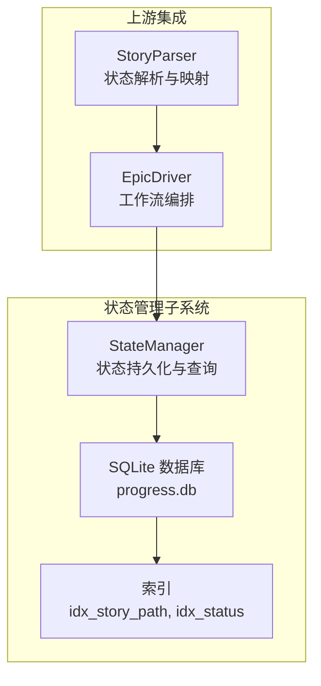
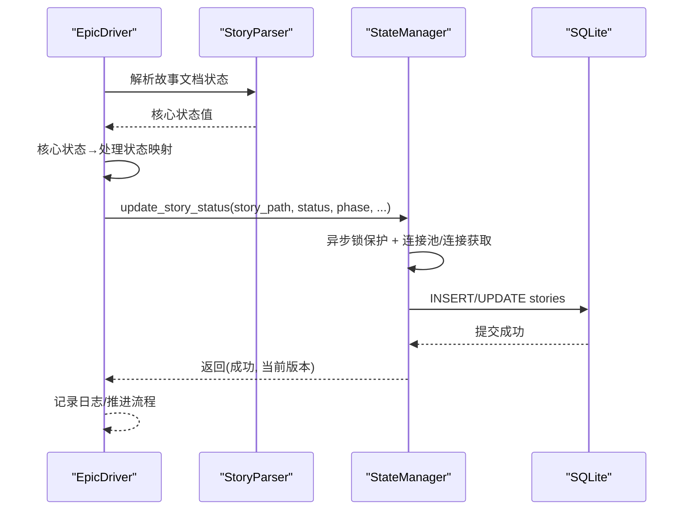
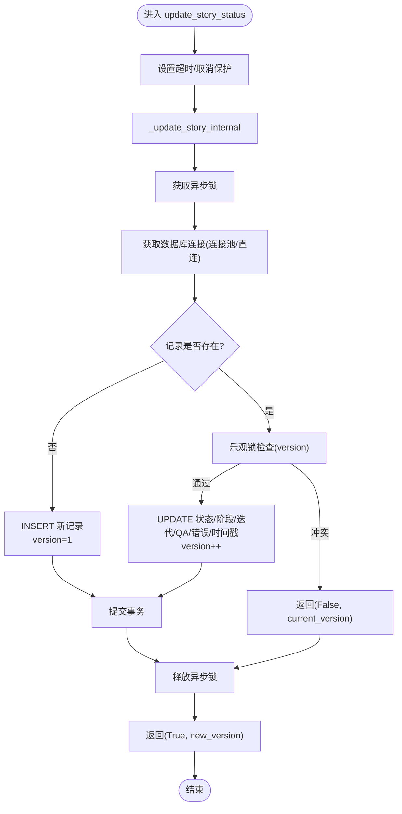
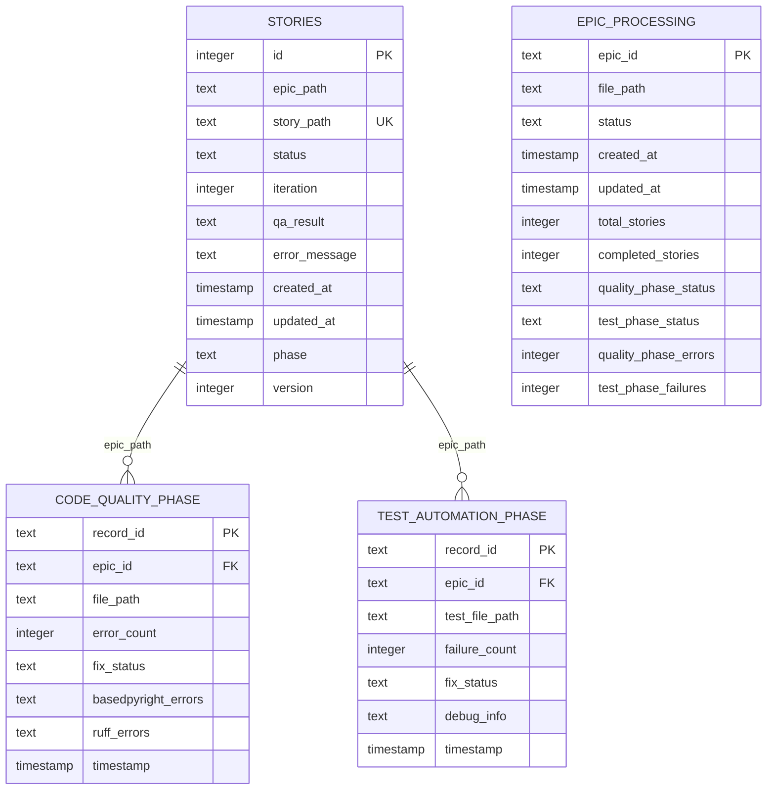
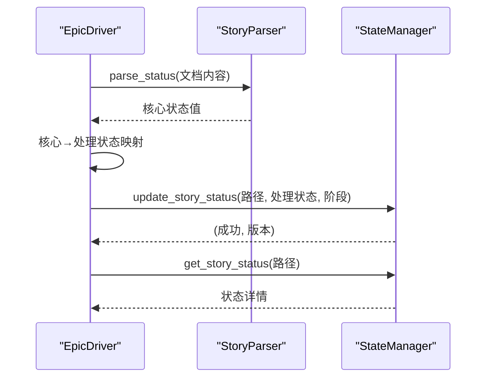
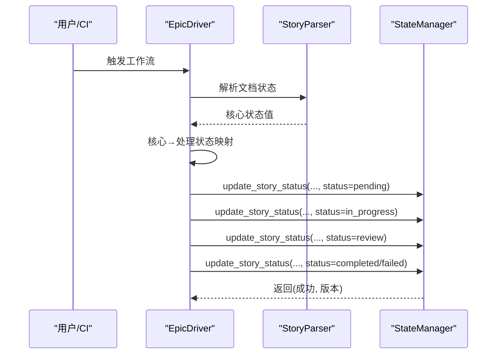
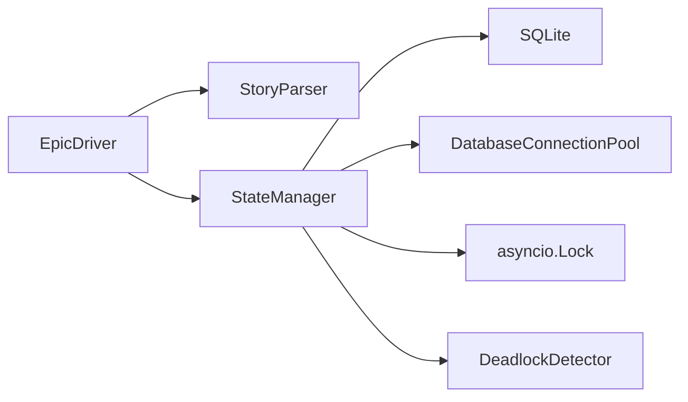

# 状态管理机制

<cite>
**本文引用的文件**
- [state_manager.py](file://autoBMAD/epic_automation/state_manager.py)
- [init_db.py](file://autoBMAD/epic_automation/init_db.py)
- [epic_driver.py](file://autoBMAD/epic_automation/epic_driver.py)
- [story_parser.py](file://autoBMAD/epic_automation/story_parser.py)
- [STANDARD_STATUS.md](file://autoBMAD/epic_automation/STANDARD_STATUS.md)
- [test_state_manager.py](file://tests-copy/unit/test_state_manager.py)
- [test_spec_state_manager.py](file://spec_automation/tests/spec_automation/test_spec_state_manager.py)
- [状态系统架构分析报告.md](file://状态系统架构分析报告.md)
- [状态值分析报告.md](file://状态值分析报告.md)
</cite>

## 目录
1. [简介](#简介)
2. [项目结构](#项目结构)
3. [核心组件](#核心组件)
4. [架构总览](#架构总览)
5. [详细组件分析](#详细组件分析)
6. [依赖分析](#依赖分析)
7. [性能考虑](#性能考虑)
8. [故障排查指南](#故障排查指南)
9. [结论](#结论)
10. [附录](#附录)

## 简介
本文件围绕基于SQLite的状态持久化系统，系统性阐述状态管理机制，重点覆盖：
- StateManager通过update_story_status方法管理故事状态生命周期，涵盖pending、in_progress、review、completed、failed等状态转换。
- 数据库模式设计、事务处理与错误恢复机制。
- 状态一致性保障策略，包括与EpicDriver的集成点与状态更新确认机制。
- 数据库Schema示意图、状态查询与报告生成能力。
- 典型状态转换序列图与性能优化建议。

## 项目结构
与状态管理相关的关键文件与职责：
- autoBMAD/epic_automation/state_manager.py：状态管理器核心实现，负责SQLite数据库访问、状态更新、查询、统计与报告同步。
- autoBMAD/epic_automation/init_db.py：数据库初始化脚本，创建stories及关联表、索引，并提供校验与重建能力。
- autoBMAD/epic_automation/epic_driver.py：Epic驱动，编排SM/Dev/QA流程并将状态写入StateManager。
- autoBMAD/epic_automation/story_parser.py：统一状态解析与映射，提供核心状态值与处理状态值的双向映射。
- autoBMAD/epic_automation/STANDARD_STATUS.md：统一状态值规范，明确核心状态与处理状态的映射关系。
- tests-copy/unit/test_state_manager.py 与 spec_automation/tests/spec_automation/test_spec_state_manager.py：测试用例，覆盖状态更新、查询、统计与边界条件。
- 状态系统架构分析报告.md 与 状态值分析报告.md：架构演进与状态流转分析材料。

图表来源
- [state_manager.py](file://autoBMAD/epic_automation/state_manager.py#L97-L182)
- [init_db.py](file://autoBMAD/epic_automation/init_db.py#L24-L120)
- [epic_driver.py](file://autoBMAD/epic_automation/epic_driver.py#L535-L660)
- [story_parser.py](file://autoBMAD/epic_automation/story_parser.py#L80-L110)

章节来源
- [state_manager.py](file://autoBMAD/epic_automation/state_manager.py#L97-L182)
- [init_db.py](file://autoBMAD/epic_automation/init_db.py#L24-L120)

## 核心组件
- StateManager：基于SQLite的状态管理器，提供状态更新、查询、统计、备份、清理与报告同步能力；内部采用异步锁与可选连接池，确保并发安全与性能。
- DatabaseConnectionPool：轻量连接池，支持WAL模式、同步级别调优与内存临时存储，提升并发读写吞吐。
- DeadlockDetector：死锁检测辅助，避免长时间等待导致的死锁。
- EpicDriver：工作流编排器，负责从文档解析状态、驱动SM/Dev/QA阶段，并通过StateManager写入处理状态。
- StoryParser：统一状态解析与映射，提供核心状态值与处理状态值的双向映射，确保跨组件一致性。

章节来源
- [state_manager.py](file://autoBMAD/epic_automation/state_manager.py#L97-L182)
- [epic_driver.py](file://autoBMAD/epic_automation/epic_driver.py#L535-L660)
- [story_parser.py](file://autoBMAD/epic_automation/story_parser.py#L80-L110)

## 架构总览
状态管理的整体交互流程如下：
- EpicDriver解析文档状态，经由StoryParser映射为处理状态值，再调用StateManager.update_story_status写入数据库。
- StateManager内部以异步锁保护数据库操作，必要时使用连接池与WAL模式提升并发性能。
- 查询侧通过StateManager.get_story_status/get_all_stories/get_stats等接口提供状态检索与统计。
- 报告侧通过sync_story_statuses_to_markdown将数据库状态同步至Markdown文档Status字段。

图表来源
- [epic_driver.py](file://autoBMAD/epic_automation/epic_driver.py#L535-L660)
- [story_parser.py](file://autoBMAD/epic_automation/story_parser.py#L80-L110)
- [state_manager.py](file://autoBMAD/epic_automation/state_manager.py#L203-L348)

## 详细组件分析

### StateManager：状态持久化与一致性
- 数据库初始化与模式
  - 初始化时创建stories表，包含主键、唯一索引、常用查询索引、版本列等；后续迁移逻辑确保版本列存在。
  - 支持可选连接池初始化，启用WAL模式、调整同步级别与缓存大小，兼顾性能与可靠性。
- 状态更新流程（update_story_status）
  - 外层封装超时与取消处理，内部委托_update_story_internal。
  - _update_story_internal在异步锁保护下执行：
    - 若记录存在：执行乐观锁检查（version比较），更新状态、阶段、迭代、QA结果、错误信息与updated_at，同时递增version。
    - 若记录不存在：插入新记录，初始version=1。
  - 提供受控超时与取消保护，避免长时间阻塞。
- 查询与统计
  - get_story_status：按story_path查询并返回结构化字典，包含qa_result与error_message的JSON解析回退。
  - get_all_stories：全量查询并返回列表。
  - get_stats：按status分组统计数量。
- 报告同步
  - sync_story_statuses_to_markdown：遍历数据库记录，将处理状态映射为Markdown Status字段值并写回对应文档。
- 健康与运维
  - create_backup：基于文件复制的热备份。
  - cleanup_old_records：清理超过保留期且状态为completed/failed的历史记录。
  - get_health_status：返回数据库路径、锁状态、死锁检测状态与连接池配置等健康指标。
- 并发与容错
  - 异步锁保护关键路径，避免竞态。
  - 连接池队列满时自动关闭连接，防止泄漏。
  - 死锁检测器记录等待超时并标记死锁状态，便于诊断。

图表来源
- [state_manager.py](file://autoBMAD/epic_automation/state_manager.py#L203-L348)

章节来源
- [state_manager.py](file://autoBMAD/epic_automation/state_manager.py#L97-L182)
- [state_manager.py](file://autoBMAD/epic_automation/state_manager.py#L203-L348)
- [state_manager.py](file://autoBMAD/epic_automation/state_manager.py#L405-L512)
- [state_manager.py](file://autoBMAD/epic_automation/state_manager.py#L514-L542)
- [state_manager.py](file://autoBMAD/epic_automation/state_manager.py#L544-L603)
- [state_manager.py](file://autoBMAD/epic_automation/state_manager.py#L627-L796)

### 数据库Schema与关系
- 主表：stories
  - 字段：id（主键）、epic_path、story_path（唯一）、status、iteration、qa_result、error_message、created_at、updated_at、phase、version。
  - 索引：idx_story_path（按story_path）、idx_status（按status）。
- 迁移与兼容性
  - 迁移逻辑确保version列存在，避免破坏既有数据。
- 其他表（初始化脚本）
  - code_quality_phase：质量门禁阶段记录，外键关联stories.epic_path。
  - test_automation_phase：测试自动化阶段记录，外键关联stories.epic_path。
  - epic_processing：Epic级进度跟踪，包含状态与统计字段。
  - 索引：idx_quality_epic、idx_test_epic。

图表来源
- [init_db.py](file://autoBMAD/epic_automation/init_db.py#L24-L120)

章节来源
- [init_db.py](file://autoBMAD/epic_automation/init_db.py#L24-L120)

### 与EpicDriver的集成点
- EpicDriver在解析完文档状态后，将核心状态值转换为处理状态值，随后调用StateManager.update_story_status写入数据库。
- EpicDriver在工作流推进中多次更新状态（如SM/Dev/QA阶段），确保状态与流程一致。
- 通过StateManager.get_story_status与get_all_stories，EpicDriver可进行状态检查与报告汇总。

图表来源
- [epic_driver.py](file://autoBMAD/epic_automation/epic_driver.py#L535-L660)
- [story_parser.py](file://autoBMAD/epic_automation/story_parser.py#L80-L110)
- [state_manager.py](file://autoBMAD/epic_automation/state_manager.py#L203-L348)

章节来源
- [epic_driver.py](file://autoBMAD/epic_automation/epic_driver.py#L535-L660)
- [story_parser.py](file://autoBMAD/epic_automation/story_parser.py#L80-L110)
- [state_manager.py](file://autoBMAD/epic_automation/state_manager.py#L203-L348)

### 状态一致性与转换
- 核心状态值（文档与人类可读）：Draft、Ready for Development、In Progress、Ready for Review、Ready for Done、Done、Failed。
- 处理状态值（数据库与内部跟踪）：pending、in_progress、review、completed、failed。
- 映射关系：核心状态值→处理状态值，特殊状态（cancelled、error）直接使用。
- 状态流转：Draft → Ready for Development → In Progress → Ready for Review → Ready for Done → Done；异常路径可直接进入Failed或Cancelled。

章节来源
- [STANDARD_STATUS.md](file://autoBMAD/epic_automation/STANDARD_STATUS.md#L1-L121)
- [story_parser.py](file://autoBMAD/epic_automation/story_parser.py#L80-L110)
- [状态系统架构分析报告.md](file://状态系统架构分析报告.md#L282-L864)
- [状态值分析报告.md](file://状态值分析报告.md#L190-L257)

### 典型状态转换序列图

图表来源
- [epic_driver.py](file://autoBMAD/epic_automation/epic_driver.py#L535-L660)
- [story_parser.py](file://autoBMAD/epic_automation/story_parser.py#L80-L110)
- [state_manager.py](file://autoBMAD/epic_automation/state_manager.py#L203-L348)

## 依赖分析
- 组件耦合
  - EpicDriver依赖StateManager与StoryParser，形成“解析→转换→存储”的单向依赖链。
  - StateManager依赖SQLite与异步运行时，内部通过锁与连接池解耦并发与资源管理。
- 外部依赖
  - SQLite：本地文件数据库，支持WAL与索引优化。
  - asyncio：异步锁、队列与超时控制。
- 潜在风险
  - 死锁：通过死锁检测器与超时避免；若出现，需检查锁持有者与等待链路。
  - 连接池耗尽：队列满时自动关闭连接，避免泄漏；可通过增大池容量或优化并发策略缓解。

图表来源
- [epic_driver.py](file://autoBMAD/epic_automation/epic_driver.py#L535-L660)
- [state_manager.py](file://autoBMAD/epic_automation/state_manager.py#L97-L182)

章节来源
- [epic_driver.py](file://autoBMAD/epic_automation/epic_driver.py#L535-L660)
- [state_manager.py](file://autoBMAD/epic_automation/state_manager.py#L97-L182)

## 性能考虑
- 连接池与WAL
  - 连接池最大连接数限制，避免过度并发导致资源争用；WAL模式提升读写并发。
  - PRAGMA设置：journal_mode=WAL、synchronous=NORMAL、cache_size=10000、temp_store=memory。
- 索引优化
  - idx_story_path与idx_status加速按路径与状态过滤。
- 乐观锁与版本控制
  - version字段用于乐观锁，避免并发更新覆盖；冲突时返回当前版本，调用方可重试。
- 异步与超时
  - update_story_status外层超时与取消保护，避免长时间阻塞；managed_operation提供更细粒度的锁管理。
- 备份与清理
  - 定期备份与历史记录清理，降低数据库膨胀对性能的影响。

章节来源
- [state_manager.py](file://autoBMAD/epic_automation/state_manager.py#L59-L95)
- [state_manager.py](file://autoBMAD/epic_automation/state_manager.py#L132-L179)
- [state_manager.py](file://autoBMAD/epic_automation/state_manager.py#L203-L348)
- [state_manager.py](file://autoBMAD/epic_automation/state_manager.py#L544-L603)

## 故障排查指南
- 常见问题
  - 更新超时：检查锁等待与死锁检测器状态；适当增大lock_timeout或优化并发。
  - 连接池耗尽：查看连接池大小与队列状态；必要时增加max_connections或缩短事务时间。
  - 版本冲突：乐观锁返回False且携带current_version，调用方可重试或合并变更。
  - 文件不存在：sync_story_statuses_to_markdown在找不到实际文件时记录警告并跳过，检查story_path映射。
- 日志与健康检查
  - 使用get_health_status获取数据库路径、锁状态、死锁检测状态与连接池配置，辅助定位问题。
  - 通过create_backup进行快速回滚，配合cleanup_old_records清理历史数据。
- 测试验证
  - 单元测试覆盖初始化、新增/更新、按状态查询、QA结果与错误记录、迭代计数、全量查询与不存在场景。
  - 规范测试覆盖多轮更新序列、特殊字符路径、空参数等边界条件。

章节来源
- [state_manager.py](file://autoBMAD/epic_automation/state_manager.py#L370-L404)
- [state_manager.py](file://autoBMAD/epic_automation/state_manager.py#L605-L626)
- [state_manager.py](file://autoBMAD/epic_automation/state_manager.py#L627-L796)
- [test_state_manager.py](file://tests-copy/unit/test_state_manager.py#L1-L200)
- [test_spec_state_manager.py](file://spec_automation/tests/spec_automation/test_spec_state_manager.py#L314-L383)

## 结论
该状态管理机制通过StateManager与SQLite实现可靠的状态持久化，结合异步锁、连接池与WAL模式，满足并发与性能需求。通过StoryParser与EpicDriver的协作，确保状态在文档、解析、存储与工作流之间保持一致。乐观锁与版本控制进一步增强了并发一致性。配合完善的查询、统计与报告同步能力，系统能够稳定支撑端到端的自动化工作流。

## 附录
- 状态值规范与映射参考：STANDARD_STATUS.md
- 架构演进与状态一致性收益：状态系统架构分析报告.md
- 状态流转与工作流分析：状态值分析报告.md