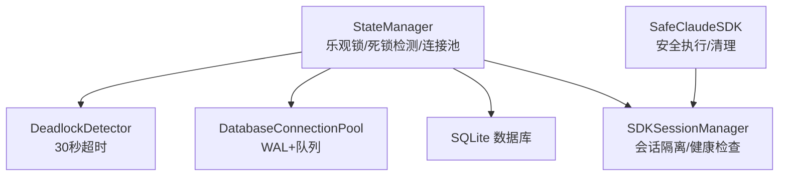
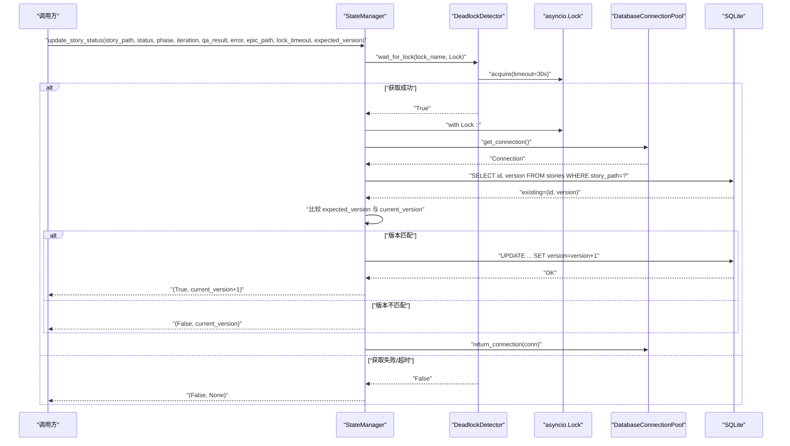
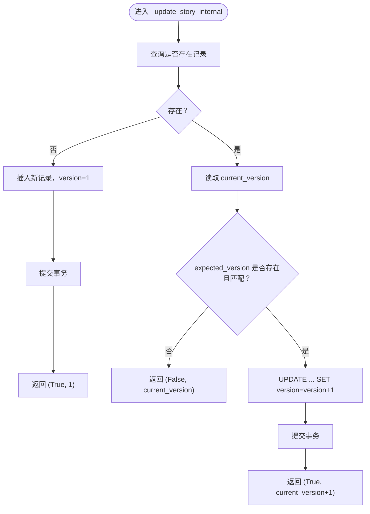
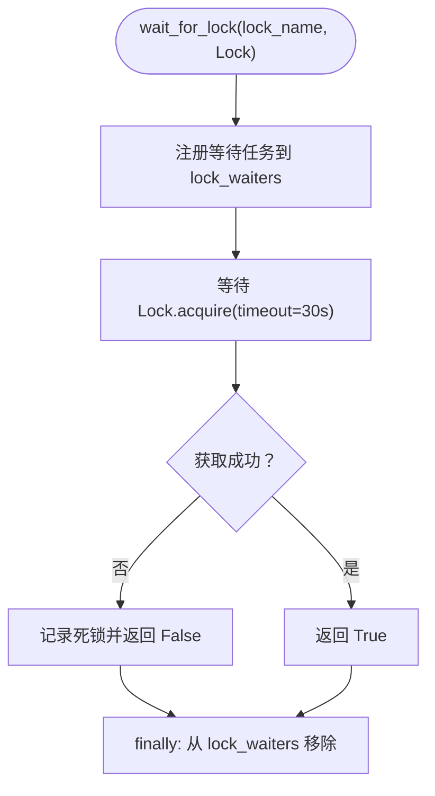
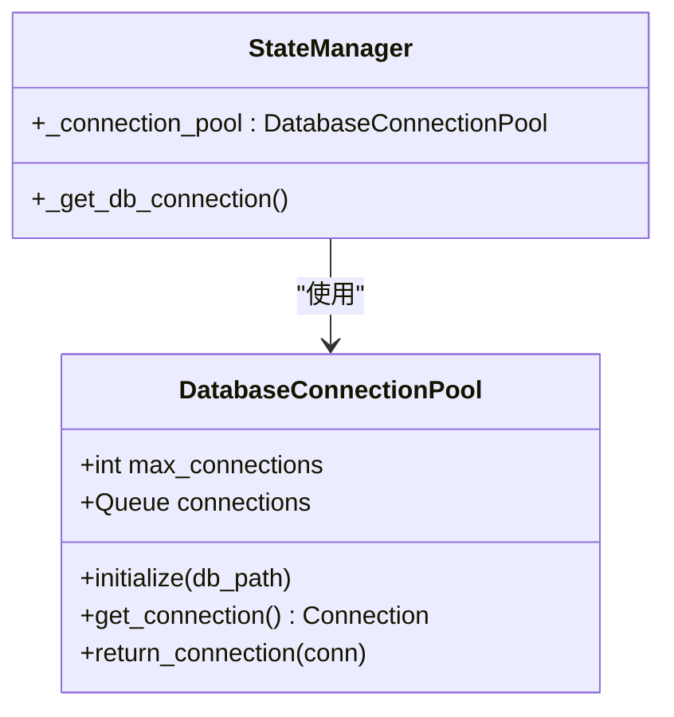
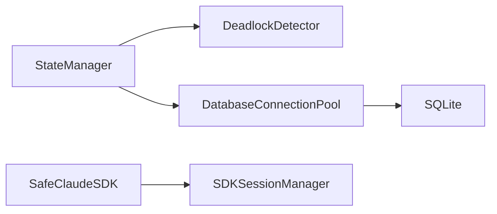

# 并发控制机制

<cite>
**本文引用的文件**
- [state_manager.py](file://autoBMAD/epic_automation/state_manager.py)
- [state_manager_fixed.py](file://BUGFIX_20260107/fixed_modules/state_manager_fixed.py)
- [sdk_session_manager.py](file://autoBMAD/epic_automation/sdk_session_manager.py)
- [sdk_wrapper.py](file://autoBMAD/epic_automation/sdk_wrapper.py)
</cite>

## 目录
1. [简介](#简介)
2. [项目结构](#项目结构)
3. [核心组件](#核心组件)
4. [架构总览](#架构总览)
5. [详细组件分析](#详细组件分析)
6. [依赖关系分析](#依赖关系分析)
7. [性能考量](#性能考量)
8. [故障排查指南](#故障排查指南)
9. [结论](#结论)

## 简介
本文件聚焦于仓库中的并发控制机制，围绕以下目标展开：
- 乐观锁的实现与使用：version 字段在每次状态更新时递增；expected_version 参数用于检测并发冲突。
- _update_story_internal 方法中的版本检查逻辑：当检测到版本不匹配时返回失败结果。
- 死锁检测器（DeadlockDetector）的工作原理：30秒超时机制与锁等待监控。
- 数据库连接池（DatabaseConnectionPool）：通过WAL模式与连接队列提升并发性能。

## 项目结构
与并发控制直接相关的模块集中在 autoBMAD/epic_automation 与 BUGFIX_20260107/fixed_modules 两个目录中：
- autoBMAD/epic_automation/state_manager.py：提供乐观锁、死锁检测、数据库连接池与状态更新的主实现。
- BUGFIX_20260107/fixed_modules/state_manager_fixed.py：修复版实现，补充了更完善的锁获取与释放、错误处理与健康状态查询。
- autoBMAD/epic_automation/sdk_session_manager.py：SDK会话管理与健康检查，辅助理解整体并发与取消语义。
- autoBMAD/epic_automation/sdk_wrapper.py：安全的SDK执行封装，体现取消与清理的并发安全实践。

图表来源
- [state_manager.py](file://autoBMAD/epic_automation/state_manager.py#L31-L118)
- [sdk_session_manager.py](file://autoBMAD/epic_automation/sdk_session_manager.py#L193-L415)
- [sdk_wrapper.py](file://autoBMAD/epic_automation/sdk_wrapper.py#L300-L687)

章节来源
- [state_manager.py](file://autoBMAD/epic_automation/state_manager.py#L31-L118)
- [state_manager_fixed.py](file://BUGFIX_20260107/fixed_modules/state_manager_fixed.py#L48-L137)

## 核心组件
- 乐观锁与版本控制：在 stories 表中引入 version 字段，默认值为 1；更新时将 version 自增 1；通过 expected_version 参数进行冲突检测。
- 死锁检测器（DeadlockDetector）：在获取 asyncio.Lock 时设置 30 秒超时，若等待超时则标记死锁并返回失败。
- 数据库连接池（DatabaseConnectionPool）：使用 asyncio.Queue 维护固定大小的连接队列，并启用 SQLite 的 WAL 模式以提升并发写入性能。
- 状态更新流程：update_story_status 作为对外接口，内部通过 _update_story_internal 执行数据库更新；在乐观锁冲突时返回 False 与当前版本号。

章节来源
- [state_manager.py](file://autoBMAD/epic_automation/state_manager.py#L148-L177)
- [state_manager.py](file://autoBMAD/epic_automation/state_manager.py#L203-L348)
- [state_manager.py](file://autoBMAD/epic_automation/state_manager.py#L31-L57)
- [state_manager.py](file://autoBMAD/epic_automation/state_manager.py#L59-L95)
- [state_manager_fixed.py](file://BUGFIX_20260107/fixed_modules/state_manager_fixed.py#L223-L363)

## 架构总览
下面的序列图展示了“更新故事状态”的端到端流程，包括锁获取、死锁检测、乐观锁检查与数据库更新。

图表来源
- [state_manager.py](file://autoBMAD/epic_automation/state_manager.py#L203-L348)
- [state_manager.py](file://autoBMAD/epic_automation/state_manager.py#L31-L57)
- [state_manager.py](file://autoBMAD/epic_automation/state_manager.py#L59-L95)

## 详细组件分析

### 乐观锁与版本控制
- 数据库模式：stories 表包含 version 字段，默认值为 1；迁移逻辑确保该列存在。
- 更新策略：
  - 若记录存在：先读取 current_version，若 expected_version 存在且与 current_version 不一致，则返回失败并附带 current_version；否则执行 UPDATE 并将 version 自增 1。
  - 若记录不存在：INSERT 新记录，version 设为 1。
- 返回值约定：成功返回 (True, 新版本号)；冲突返回 (False, 当前版本号)。

图表来源
- [state_manager.py](file://autoBMAD/epic_automation/state_manager.py#L262-L348)

章节来源
- [state_manager.py](file://autoBMAD/epic_automation/state_manager.py#L148-L177)
- [state_manager.py](file://autoBMAD/epic_automation/state_manager.py#L262-L348)

### 死锁检测器（DeadlockDetector）
- 超时机制：在等待 asyncio.Lock.acquire() 时设置 30 秒超时；超时后记录死锁并返回 False。
- 等待监控：维护 lock_waiters 字典，记录等待特定锁的任务；在 finally 中清理。
- 使用方式：update_story_status 先通过 wait_for_lock 获取锁；若返回 False 或检测到 deadlock_detected，则直接返回失败。

图表来源
- [state_manager.py](file://autoBMAD/epic_automation/state_manager.py#L31-L57)

章节来源
- [state_manager.py](file://autoBMAD/epic_automation/state_manager.py#L31-L57)
- [state_manager.py](file://autoBMAD/epic_automation/state_manager.py#L203-L261)

### 数据库连接池（DatabaseConnectionPool）
- 连接队列：使用 asyncio.Queue(maxsize=max_connections) 维护固定数量的连接。
- 初始化：在 initialize 中创建指定数量的 sqlite3.Connection，并设置 PRAGMA：
  - journal_mode=WAL：提升并发写入能力。
  - synchronous=NORMAL：平衡性能与可靠性。
  - cache_size=10000：增大缓存。
  - temp_store=memory：临时表存储在内存中。
- 获取/归还：get_connection 通过 wait_for 获取连接，超时则抛出异常；return_connection 在队列满时关闭连接，避免泄漏。

图表来源
- [state_manager.py](file://autoBMAD/epic_automation/state_manager.py#L59-L95)
- [state_manager.py](file://autoBMAD/epic_automation/state_manager.py#L183-L201)

章节来源
- [state_manager.py](file://autoBMAD/epic_automation/state_manager.py#L59-L95)
- [state_manager.py](file://autoBMAD/epic_automation/state_manager.py#L183-L201)

### 修复版实现要点（补充）
- 修复版在 update_story_status 中先通过 DeadlockDetector.wait_for_lock 获取锁，再进入锁保护的 _update_story_internal；finally 中确保锁被释放。
- 健康状态查询：get_health_status 返回数据库路径、锁状态、死锁检测状态、连接池启用与大小等信息。

章节来源
- [state_manager_fixed.py](file://BUGFIX_20260107/fixed_modules/state_manager_fixed.py#L223-L363)
- [state_manager_fixed.py](file://BUGFIX_20260107/fixed_modules/state_manager_fixed.py#L627-L646)

## 依赖关系分析
- StateManager 依赖：
  - DeadlockDetector：用于锁等待超时检测。
  - DatabaseConnectionPool：用于连接复用与WAL优化。
  - SQLite：作为持久化存储。
- SDK 相关模块：
  - SDKSessionManager：提供会话隔离与健康检查，有助于理解取消与并发边界。
  - SafeClaudeSDK：封装 SDK 执行与清理，体现取消与清理的并发安全实践。

图表来源
- [state_manager.py](file://autoBMAD/epic_automation/state_manager.py#L31-L118)
- [sdk_session_manager.py](file://autoBMAD/epic_automation/sdk_session_manager.py#L193-L415)
- [sdk_wrapper.py](file://autoBMAD/epic_automation/sdk_wrapper.py#L300-L687)

章节来源
- [state_manager.py](file://autoBMAD/epic_automation/state_manager.py#L31-L118)
- [sdk_session_manager.py](file://autoBMAD/epic_automation/sdk_session_manager.py#L193-L415)
- [sdk_wrapper.py](file://autoBMAD/epic_automation/sdk_wrapper.py#L300-L687)

## 性能考量
- WAL 模式：启用 journal_mode=WAL 提升并发写入吞吐，降低写放大与锁竞争。
- 连接池：通过固定大小的连接队列减少频繁打开/关闭连接的开销，配合 PRAGMA cache_size 与 temp_store=memory 提升查询与临时表性能。
- 锁粒度：StateManager 在数据库操作上使用 asyncio.Lock 保护，避免多协程同时写入；同时通过 30 秒超时避免死锁。
- 乐观锁：通过 version 字段减少不必要的重试与冲突，冲突时快速失败并提示调用方重试或合并变更。

[本节为通用指导，不直接分析具体文件]

## 故障排查指南
- 乐观锁冲突
  - 现象：返回 (False, current_version)，且日志提示版本不匹配。
  - 排查：确认调用方传入的 expected_version 是否来自最近一次读取；若频繁冲突，考虑在调用侧重试或合并变更。
  - 参考路径：[乐观锁检查与返回](file://autoBMAD/epic_automation/state_manager.py#L294-L323)
- 死锁/锁等待超时
  - 现象：wait_for_lock 返回 False，日志记录死锁；update_story_status 返回 (False, None)。
  - 排查：检查是否存在长时间持有锁的操作；确认锁等待时间是否合理；必要时拆分任务或降低并发。
  - 参考路径：[死锁检测器](file://autoBMAD/epic_automation/state_manager.py#L31-L57)
- 连接池耗尽
  - 现象：get_connection 抛出异常，提示连接池耗尽。
  - 排查：增大 max_connections；检查是否存在未归还连接的情况；确认连接生命周期管理。
  - 参考路径：[连接池初始化与获取](file://autoBMAD/epic_automation/state_manager.py#L59-L95)
- 健康状态检查
  - 使用 get_health_status 获取数据库路径、锁状态、死锁检测状态、连接池启用与大小等信息，便于定位问题。
  - 参考路径：[健康状态查询](file://autoBMAD/epic_automation/state_manager.py#L605-L626)

章节来源
- [state_manager.py](file://autoBMAD/epic_automation/state_manager.py#L294-L323)
- [state_manager.py](file://autoBMAD/epic_automation/state_manager.py#L31-L57)
- [state_manager.py](file://autoBMAD/epic_automation/state_manager.py#L59-L95)
- [state_manager.py](file://autoBMAD/epic_automation/state_manager.py#L605-L626)

## 结论
本仓库通过“乐观锁 + 死锁检测 + 连接池 + WAL”构建了稳健的并发控制体系：
- 乐观锁以 version 字段实现冲突检测，冲突时快速失败并返回当前版本，便于调用方重试或合并。
- 死锁检测器以 30 秒超时保护锁等待，避免永久阻塞。
- 数据库连接池结合 WAL 模式与连接队列，显著提升并发写入性能与稳定性。
- 修复版进一步完善了锁获取/释放与错误处理，增强了系统的可观测性与健壮性。