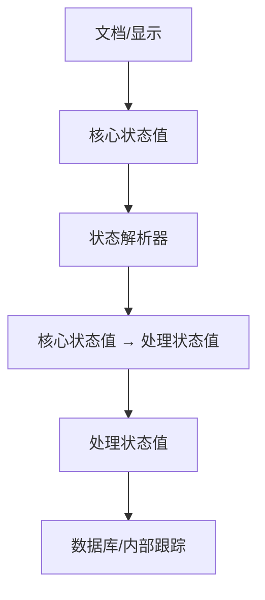
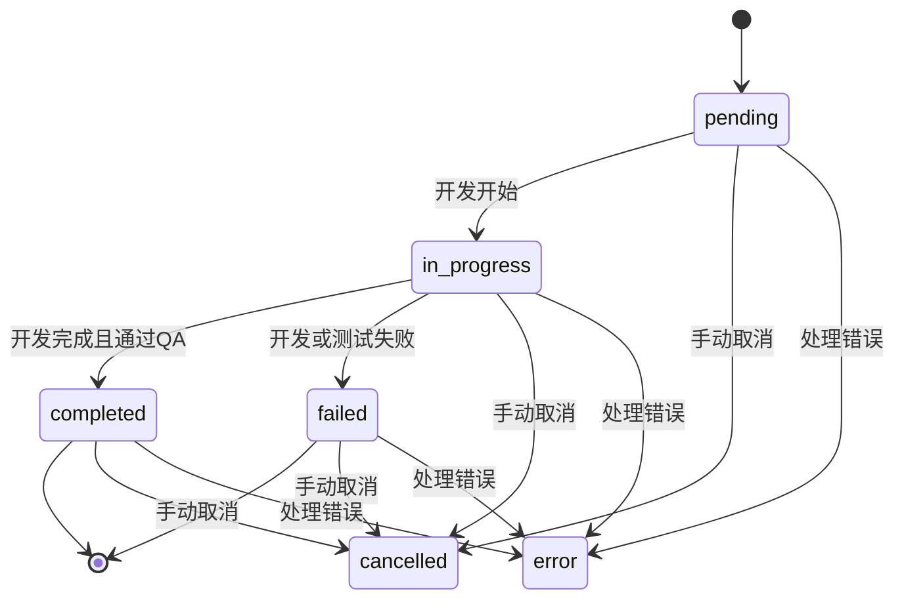
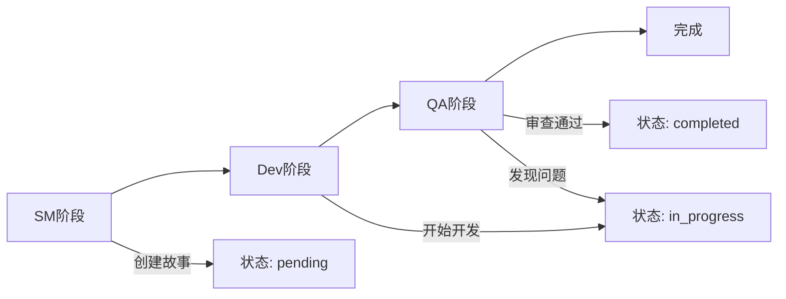
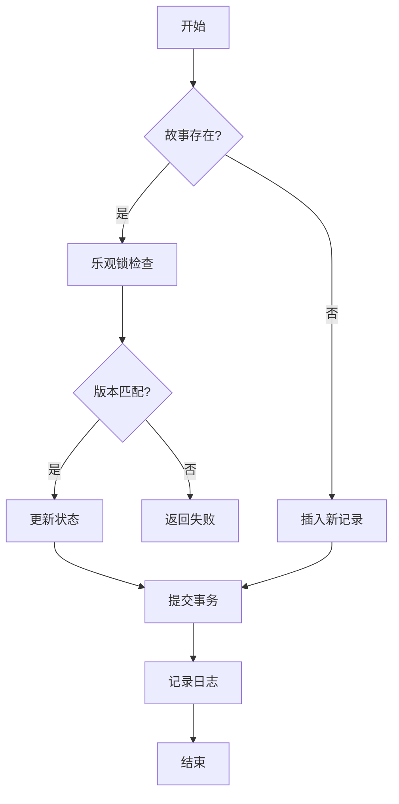

# 状态变更规则

<cite>
**本文档引用的文件**   
- [state_manager.py](file://autoBMAD/epic_automation/state_manager.py)
- [STANDARD_STATUS.md](file://autoBMAD/epic_automation/STANDARD_STATUS.md)
- [STATUS_IMPLEMENTATION.md](file://autoBMAD/epic_automation/STATUS_IMPLEMENTATION.md)
- [story_parser.py](file://autoBMAD/epic_automation/story_parser.py)
- [epic_driver.py](file://autoBMAD/epic_automation/epic_driver.py)
- [bmad_methodology.md](file://claude_docs/bmad_methodology.md)
- [spec_state_manager.py](file://spec_automation/spec_state_manager.py)
</cite>

## 目录
1. [引言](#引言)
2. [状态值体系](#状态值体系)
3. [状态转换规则](#状态转换规则)
4. [SM-Dev-QA工作流阶段对应关系](#sm-dev-qa工作流阶段对应关系)
5. [状态转换规则表](#状态转换规则表)
6. [违反规则的处理机制](#违反规则的处理机制)
7. [数据库实现](#数据库实现)
8. [总结](#总结)

## 引言

本文档详细描述了系统中状态变更的业务规则，重点阐述了`pending`、`in_progress`、`completed`、`failed`等状态之间的合法转换路径。文档解释了状态转换与SM-Dev-QA工作流阶段的对应关系，并提供了状态转换规则表，以确保系统状态流转的准确性和一致性。

**Section sources**
- [STANDARD_STATUS.md](file://autoBMAD/epic_automation/STANDARD_STATUS.md#L1-L213)
- [STATUS_IMPLEMENTATION.md](file://autoBMAD/epic_automation/STATUS_IMPLEMENTATION.md#L1-L245)

## 状态值体系

系统采用双层状态值体系，以确保状态在文档、显示和内部处理之间的一致性。

### 核心状态值（Core Status Values）

核心状态值用于故事文档和人类可读的显示，包括：
- `Draft` (草稿)
- `Ready for Development` (准备开发)
- `In Progress` (进行中)
- `Ready for Review` (准备审查)
- `Ready for Done` (准备完成)
- `Done` (已完成)
- `Failed` (失败)

### 处理状态值（Processing Status Values）

处理状态值用于数据库存储和内部状态跟踪，包括：
- `pending` (等待处理)
- `in_progress` (进行中)
- `review` (审查阶段)
- `completed` (已完成)
- `failed` (失败)
- `cancelled` (已取消)
- `error` (错误)

### 状态值转换映射

核心状态值与处理状态值之间存在明确的映射关系：

| 核心状态值 | → | 处理状态值 |
|-----------|---|-----------|
| `Draft` | → | `pending` |
| `Ready for Development` | → | `pending` |
| `In Progress` | → | `in_progress` |
| `Ready for Review` | → | `review` |
| `Ready for Done` | → | `review` |
| `Done` | → | `completed` |
| `Failed` | → | `failed` |

特殊状态值如`cancelled`和`error`直接使用，不进行转换。

**Diagram sources **
- [STANDARD_STATUS.md](file://autoBMAD/epic_automation/STANDARD_STATUS.md#L101-L114)
- [story_parser.py](file://autoBMAD/epic_automation/story_parser.py#L101-L110)

**Section sources**
- [STANDARD_STATUS.md](file://autoBMAD/epic_automation/STANDARD_STATUS.md#L17-L114)
- [story_parser.py](file://autoBMAD/epic_automation/story_parser.py#L59-L110)

## 状态转换规则

系统的状态转换遵循严格的业务规则，以确保工作流的正确执行。

### 合法转换路径

- `pending` 状态可以转换为 `in_progress`
- `in_progress` 状态可以转换为 `completed` 或 `failed`
- `completed` 和 `failed` 状态为终止状态，不可再转换
- 任意状态均可转换为 `cancelled` 或 `error` 状态

### 触发条件和约束

- 只有当开发阶段开始时，`pending` 状态才能转换为 `in_progress`
- `in_progress` 状态转换为 `completed` 需要通过所有质量门控检查
- `in_progress` 状态转换为 `failed` 是由于开发或测试失败
- 状态转换需要记录日志并通知相关团队成员

**Diagram sources **
- [bmad_methodology.md](file://claude_docs/bmad_methodology.md#L378-L420)
- [STANDARD_STATUS.md](file://autoBMAD/epic_automation/STANDARD_STATUS.md#L53-L66)

**Section sources**
- [bmad_methodology.md](file://claude_docs/bmad_methodology.md#L378-L420)
- [STANDARD_STATUS.md](file://autoBMAD/epic_automation/STANDARD_STATUS.md#L53-L66)

## SM-Dev-QA工作流阶段对应关系

状态转换与SM-Dev-QA工作流阶段有明确的对应关系，`phase`字段记录了当前处理阶段。

### 阶段与状态映射

| 工作流阶段 | 对应状态 | 说明 |
|----------|--------|------|
| SM (Scrum Master) | `pending` | 故事创建和评审 |
| Dev (Development) | `in_progress` | 开发实现 |
| QA (Quality Assurance) | `review` | 质量审查 |
| 完成 | `completed` | 所有要求满足 |
| 失败 | `failed` | 未满足要求 |

### phase字段的作用

`phase`字段在数据库中记录了当前处理阶段，用于：
- 跟踪工作流进度
- 决定下一步操作
- 生成状态报告
- 控制自动化流程

**Diagram sources **
- [epic_driver.py](file://autoBMAD/epic_automation/epic_driver.py#L50-L91)
- [bmad_methodology.md](file://claude_docs/bmad_methodology.md#L378-L420)

**Section sources**
- [epic_driver.py](file://autoBMAD/epic_automation/epic_driver.py#L50-L91)
- [bmad_methodology.md](file://claude_docs/bmad_methodology.md#L378-L420)

## 状态转换规则表

以下表格列出了所有允许和禁止的状态转换组合：

| 从状态 | 到状态 | 是否允许 | 说明 |
|--------|--------|--------|------|
| `pending` | `in_progress` | ✅ | 开发开始 |
| `pending` | `completed` | ❌ | 不允许直接完成 |
| `pending` | `failed` | ❌ | 不允许直接失败 |
| `in_progress` | `completed` | ✅ | 开发完成且通过QA |
| `in_progress` | `failed` | ✅ | 开发或测试失败 |
| `in_progress` | `pending` | ❌ | 不允许回退 |
| `completed` | `in_progress` | ❌ | 终止状态 |
| `completed` | `failed` | ❌ | 终止状态 |
| `failed` | `in_progress` | ❌ | 终止状态 |
| `failed` | `completed` | ❌ | 终止状态 |
| 任意状态 | `cancelled` | ✅ | 手动取消 |
| 任意状态 | `error` | ✅ | 处理错误 |

**Section sources**
- [STANDARD_STATUS.md](file://autoBMAD/epic_automation/STANDARD_STATUS.md#L53-L66)
- [bmad_methodology.md](file://claude_docs/bmad_methodology.md#L407-L413)

## 违反规则的处理机制

当系统检测到违反状态转换规则的操作时，会采取以下处理机制：

### 验证与阻止

- 在状态转换前进行验证，确保当前状态的先决条件已满足
- 如果转换不合法，操作将被阻止并返回错误
- 记录违规尝试的日志，用于审计和分析

### 错误处理

- 抛出明确的异常信息，说明违规原因
- 保持原有状态不变，确保数据一致性
- 通知相关团队成员，以便及时处理

### 恢复机制

- 提供状态回滚功能，在必要时恢复到之前的状态
- 支持手动状态调整，由管理员进行干预
- 记录所有状态变更日志，便于追踪和恢复

**Section sources**
- [state_manager.py](file://autoBMAD/epic_automation/state_manager.py#L203-L261)
- [bmad_methodology.md](file://claude_docs/bmad_methodology.md#L417-L420)

## 数据库实现

状态管理通过SQLite数据库实现，确保状态的持久化和一致性。

### 数据库表结构

`stories`表包含以下字段：
- `id`: 主键
- `story_path`: 故事文件路径
- `status`: 处理状态值
- `phase`: 当前处理阶段
- `iteration`: 迭代次数
- `qa_result`: QA结果
- `error_message`: 错误消息
- `created_at`: 创建时间
- `updated_at`: 更新时间
- `version`: 版本号（用于乐观锁）

### 状态更新流程

状态更新流程包括：
1. 获取数据库连接
2. 检查故事是否存在
3. 执行乐观锁检查
4. 更新状态和元数据
5. 提交事务
6. 记录日志

**Diagram sources **
- [state_manager.py](file://autoBMAD/epic_automation/state_manager.py#L203-L349)
- [spec_state_manager.py](file://spec_automation/spec_state_manager.py#L102-L125)

**Section sources**
- [state_manager.py](file://autoBMAD/epic_automation/state_manager.py#L142-L156)
- [spec_state_manager.py](file://spec_automation/spec_state_manager.py#L29-L37)

## 总结

通过统一标准状态值，我们实现了：
1. **一致性**: 所有组件使用相同的状态值标准
2. **可理解性**: 核心状态值直观易懂
3. **可维护性**: 清晰的状态流转逻辑
4. **可扩展性**: 易于添加新的状态值

关键原则是：核心状态值用于文档和显示，处理状态值用于数据库和内部跟踪。这种分离确保了系统的清晰性和可维护性。

**Section sources**
- [STANDARD_STATUS.md](file://autoBMAD/epic_automation/STANDARD_STATUS.md#L204-L213)
- [STATUS_IMPLEMENTATION.md](file://autoBMAD/epic_automation/STATUS_IMPLEMENTATION.md#L237-L245)