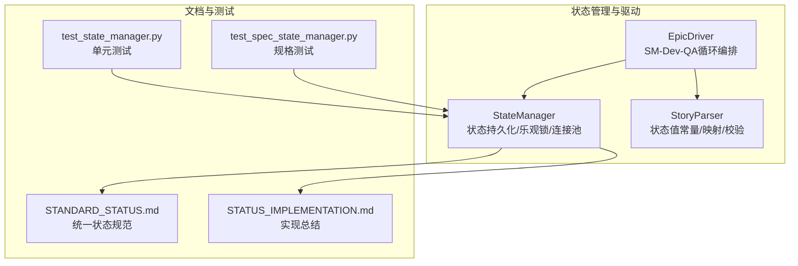
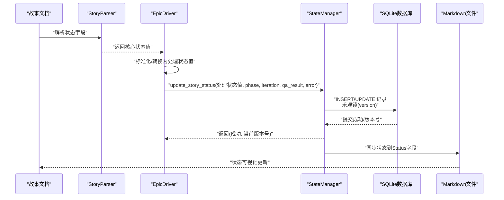
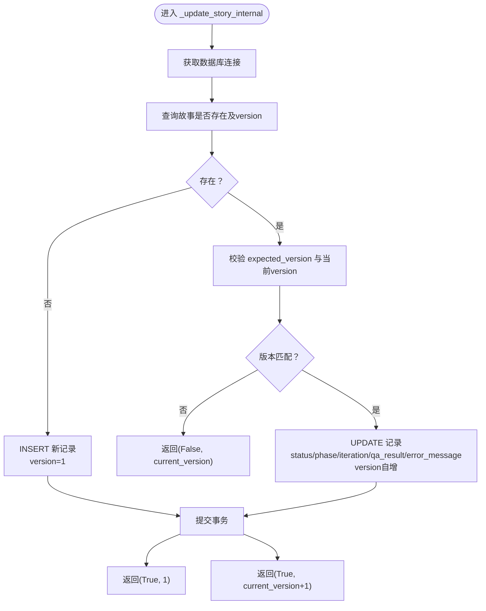
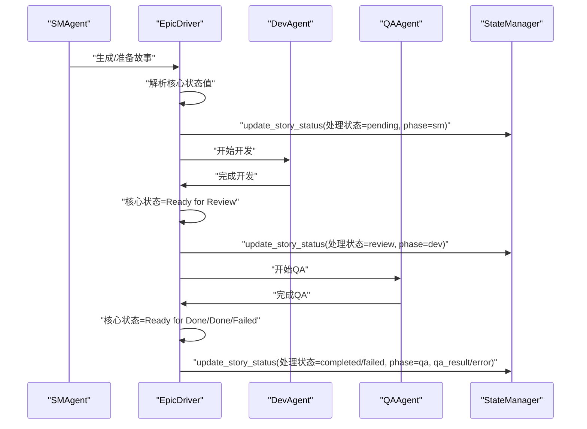
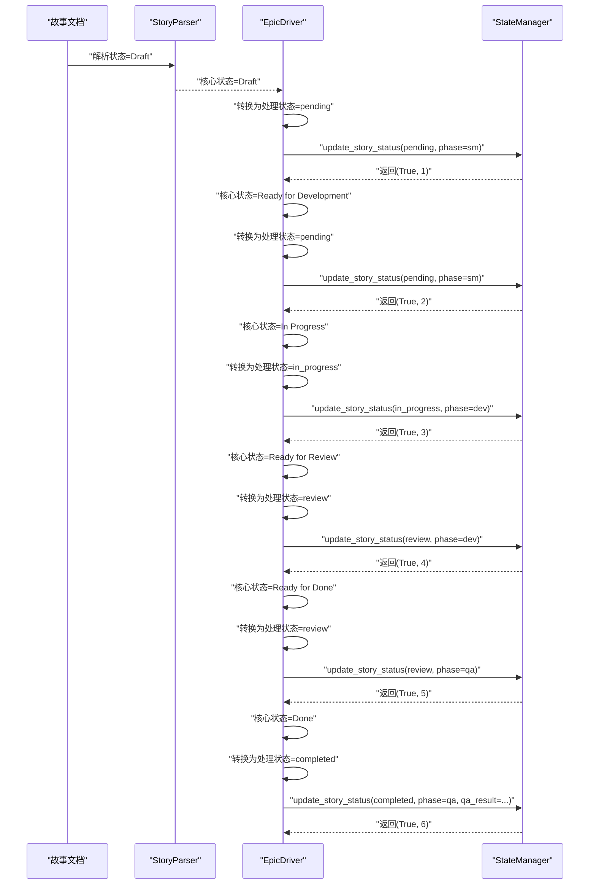
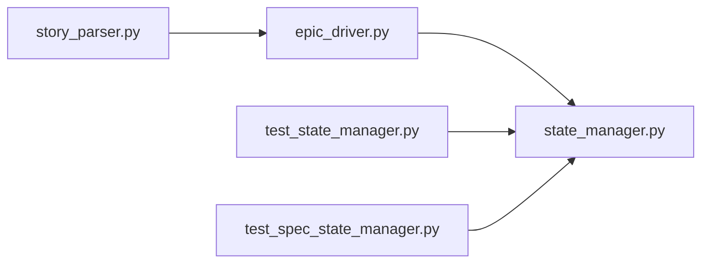

# 状态转换流程

<cite>
**本文引用的文件**
- [state_manager.py](file://autoBMAD/epic_automation/state_manager.py)
- [epic_driver.py](file://autoBMAD/epic_automation/epic_driver.py)
- [STANDARD_STATUS.md](file://autoBMAD/epic_automation/STANDARD_STATUS.md)
- [STATUS_IMPLEMENTATION.md](file://autoBMAD/epic_automation/STATUS_IMPLEMENTATION.md)
- [story_parser.py](file://autoBMAD/epic_automation/story_parser.py)
- [test_state_manager.py](file://tests-copy/epic_automation/test_state_manager.py)
- [test_spec_state_manager.py](file://spec_automation/tests/spec_automation/test_spec_state_manager.py)
</cite>

## 目录
1. [简介](#简介)
2. [项目结构](#项目结构)
3. [核心组件](#核心组件)
4. [架构总览](#架构总览)
5. [详细组件分析](#详细组件分析)
6. [依赖分析](#依赖分析)
7. [性能考量](#性能考量)
8. [故障排查指南](#故障排查指南)
9. [结论](#结论)
10. [附录](#附录)

## 简介
本文件聚焦“故事状态生命周期管理”，围绕以下目标展开：
- 详述 update_story_status 如何处理 pending、in_progress、completed、failed 等状态转换；
- 解释 _update_story_internal 的实现逻辑，特别是乐观锁（version 字段）如何防止并发更新冲突；
- 阐明状态转换的触发条件与上下文，以及与 EpicDriver 中 SM-Dev-QA 循环的集成点；
- 提供典型状态转换序列图；
- 说明状态转换的审计日志记录机制。

## 项目结构
与状态转换直接相关的核心文件与职责如下：
- autoBMAD/epic_automation/state_manager.py：故事状态持久化、并发控制、乐观锁、数据库连接池、状态查询与统计、同步到 Markdown 等；
- autoBMAD/epic_automation/epic_driver.py：Epic 驱动器，负责 SM-Dev-QA 循环编排，将核心状态值转换为处理状态值并写入 StateManager；
- autoBMAD/epic_automation/story_parser.py：统一的状态值常量、核心状态与处理状态的映射、状态校验与转换工具；
- autoBMAD/epic_automation/STANDARD_STATUS.md 与 STATUS_IMPLEMENTATION.md：统一状态值规范与实现总结；
- tests-copy/epic_automation/test_state_manager.py 与 spec_automation/tests/spec_automation/test_spec_state_manager.py：覆盖状态更新、序列更新、错误消息等行为的测试。

图表来源
- [state_manager.py](file://autoBMAD/epic_automation/state_manager.py#L1-L120)
- [epic_driver.py](file://autoBMAD/epic_automation/epic_driver.py#L535-L700)
- [story_parser.py](file://autoBMAD/epic_automation/story_parser.py#L1-L120)
- [STANDARD_STATUS.md](file://autoBMAD/epic_automation/STANDARD_STATUS.md#L1-L120)
- [STATUS_IMPLEMENTATION.md](file://autoBMAD/epic_automation/STATUS_IMPLEMENTATION.md#L1-L120)
- [test_state_manager.py](file://tests-copy/epic_automation/test_state_manager.py#L1-L120)
- [test_spec_state_manager.py](file://spec_automation/tests/spec_automation/test_spec_state_manager.py#L314-L383)

章节来源
- [state_manager.py](file://autoBMAD/epic_automation/state_manager.py#L1-L120)
- [epic_driver.py](file://autoBMAD/epic_automation/epic_driver.py#L535-L700)
- [story_parser.py](file://autoBMAD/epic_automation/story_parser.py#L1-L120)
- [STANDARD_STATUS.md](file://autoBMAD/epic_automation/STANDARD_STATUS.md#L1-L120)
- [STATUS_IMPLEMENTATION.md](file://autoBMAD/epic_automation/STATUS_IMPLEMENTATION.md#L1-L120)
- [test_state_manager.py](file://tests-copy/epic_automation/test_state_manager.py#L1-L120)
- [test_spec_state_manager.py](file://spec_automation/tests/spec_automation/test_spec_state_manager.py#L314-L383)

## 核心组件
- StateManager：提供 update_story_status、get_story_status、get_all_stories、get_stats、cleanup_old_records、sync_story_statuses_to_markdown 等能力；内部通过 asyncio.Lock 与数据库连接池保证并发安全；通过 version 字段实现乐观锁；支持将数据库状态同步到 Markdown 文件的 Status 字段。
- EpicDriver：负责 SM-Dev-QA 循环，将核心状态值转换为处理状态值后调用 StateManager.update_story_status 写入数据库；在各阶段根据状态值决定是否跳过或继续。
- StoryParser：提供核心状态值常量、核心状态到处理状态的映射、状态校验与转换工具，确保解析与转换的一致性。

章节来源
- [state_manager.py](file://autoBMAD/epic_automation/state_manager.py#L203-L348)
- [epic_driver.py](file://autoBMAD/epic_automation/epic_driver.py#L535-L700)
- [story_parser.py](file://autoBMAD/epic_automation/story_parser.py#L1-L120)

## 架构总览
下图展示了状态转换在系统中的整体流向：文档状态（核心状态值）经由解析与标准化，进入处理状态值，再由驱动器在 SM-Dev-QA 循环中写入 StateManager，最终同步到 Markdown。

图表来源
- [epic_driver.py](file://autoBMAD/epic_automation/epic_driver.py#L535-L700)
- [state_manager.py](file://autoBMAD/epic_automation/state_manager.py#L203-L348)
- [story_parser.py](file://autoBMAD/epic_automation/story_parser.py#L100-L140)
- [STANDARD_STATUS.md](file://autoBMAD/epic_automation/STANDARD_STATUS.md#L100-L170)

## 详细组件分析

### StateManager.update_story_status 与 _update_story_internal
- update_story_status：对外暴露的更新入口，封装超时与异常处理，内部委托给 _update_story_internal，并支持 expected_version 参数用于乐观锁校验。
- _update_story_internal：核心实现，包含以下关键步骤：
  - 获取数据库连接（支持连接池）；
  - 查询故事是否存在及当前 version；
  - 清理 QA 结果为 JSON 字符串；
  - 若存在：校验 expected_version 与当前 version；若不一致则返回 False 与当前版本号；否则执行 UPDATE，原子性地更新 status、phase、iteration、qa_result、error_message、updated_at，并将 version 自增；
  - 若不存在：执行 INSERT，初始 version=1；
  - 提交事务并返回 (成功, 当前版本号)。

图表来源
- [state_manager.py](file://autoBMAD/epic_automation/state_manager.py#L262-L348)

章节来源
- [state_manager.py](file://autoBMAD/epic_automation/state_manager.py#L203-L348)

### 状态转换规则与约束
- 核心状态值（文档与人类可读）：Draft、Ready for Development、In Progress、Ready for Review、Ready for Done、Done、Failed；
- 处理状态值（数据库与内部跟踪）：pending、in_progress、review、completed、failed、cancelled、error；
- 核心状态值 → 处理状态值映射（单向）：
  - Draft/Ready for Development → pending
  - In Progress → in_progress
  - Ready for Review/Ready for Done → review
  - Done → completed
  - Failed → failed
- 特殊状态：cancelled、error 直接使用，不转换；
- 状态流转（正常流程）：Draft → Ready for Development → In Progress → Ready for Review → Ready for Done → Done；
- 异常流程：任意状态 → Failed 或 Cancelled。

章节来源
- [STANDARD_STATUS.md](file://autoBMAD/epic_automation/STANDARD_STATUS.md#L1-L120)
- [STATUS_IMPLEMENTATION.md](file://autoBMAD/epic_automation/STATUS_IMPLEMENTATION.md#L100-L170)
- [story_parser.py](file://autoBMAD/epic_automation/story_parser.py#L100-L140)

### 与 EpicDriver 的集成点（SM-Dev-QA 循环）
- EpicDriver 在各阶段（SM、Dev、QA）根据核心状态值决定是否执行、如何推进；
- 将核心状态值转换为处理状态值后调用 StateManager.update_story_status；
- 通过 phase、iteration、qa_result、error 等参数记录阶段信息与结果；
- 驱动器在 QA 完成后依据状态值决定是否继续或终止流程。

图表来源
- [epic_driver.py](file://autoBMAD/epic_automation/epic_driver.py#L535-L700)
- [state_manager.py](file://autoBMAD/epic_automation/state_manager.py#L203-L348)
- [story_parser.py](file://autoBMAD/epic_automation/story_parser.py#L100-L140)

章节来源
- [epic_driver.py](file://autoBMAD/epic_automation/epic_driver.py#L535-L700)
- [state_manager.py](file://autoBMAD/epic_automation/state_manager.py#L203-L348)
- [story_parser.py](file://autoBMAD/epic_automation/story_parser.py#L100-L140)

### 典型状态转换序列图
以下序列图展示从 Draft 到 Completed 的完整流程，以及异常路径（Failed/Cancelled）。

图表来源
- [epic_driver.py](file://autoBMAD/epic_automation/epic_driver.py#L535-L700)
- [state_manager.py](file://autoBMAD/epic_automation/state_manager.py#L203-L348)
- [STANDARD_STATUS.md](file://autoBMAD/epic_automation/STANDARD_STATUS.md#L100-L170)

### 审计日志记录机制
- 成功更新：记录“更新状态”日志，包含故事路径、目标状态与版本号；
- 版本冲突：记录“版本冲突”警告，包含期望版本与实际版本；
- 超时/取消/异常：记录对应警告/错误日志，便于定位并发与资源问题；
- 同步到 Markdown：记录同步结果与错误详情，便于追溯。

章节来源
- [state_manager.py](file://autoBMAD/epic_automation/state_manager.py#L294-L323)
- [state_manager.py](file://autoBMAD/epic_automation/state_manager.py#L232-L260)
- [state_manager.py](file://autoBMAD/epic_automation/state_manager.py#L627-L796)

## 依赖分析
- StateManager 依赖：
  - story_parser.ProcessingStatus（处理状态枚举与映射）；
  - sqlite3（数据库访问）、asyncio.Lock（并发控制）、DatabaseConnectionPool（连接池）；
  - 日志模块（记录审计信息）。
- EpicDriver 依赖：
  - StateManager（写入状态）；
  - StoryParser（解析与转换状态）；
  - 各 Agent（SM、Dev、QA）按阶段推进。
- 测试依赖：
  - test_state_manager.py 与 test_spec_state_manager.py 验证 update_story_status 的行为、序列更新与错误消息。

图表来源
- [story_parser.py](file://autoBMAD/epic_automation/story_parser.py#L1-L120)
- [epic_driver.py](file://autoBMAD/epic_automation/epic_driver.py#L535-L700)
- [state_manager.py](file://autoBMAD/epic_automation/state_manager.py#L1-L120)
- [test_state_manager.py](file://tests-copy/epic_automation/test_state_manager.py#L1-L120)
- [test_spec_state_manager.py](file://spec_automation/tests/spec_automation/test_spec_state_manager.py#L314-L383)

章节来源
- [story_parser.py](file://autoBMAD/epic_automation/story_parser.py#L1-L120)
- [epic_driver.py](file://autoBMAD/epic_automation/epic_driver.py#L535-L700)
- [state_manager.py](file://autoBMAD/epic_automation/state_manager.py#L1-L120)
- [test_state_manager.py](file://tests-copy/epic_automation/test_state_manager.py#L1-L120)
- [test_spec_state_manager.py](file://spec_automation/tests/spec_automation/test_spec_state_manager.py#L314-L383)

## 性能考量
- 连接池：通过 DatabaseConnectionPool 限制最大连接数、启用 WAL 模式与 PRAGMA 调优，提升并发读写性能；
- 锁粒度：update_story_status 通过 asyncio.Lock 保护数据库操作，避免竞态；
- 乐观锁：version 字段减少不必要的重试与回滚成本，冲突时快速失败并返回当前版本；
- 序列化：QA 结果在入库前清理为 JSON 字符串，降低存储与解析开销；
- 同步到 Markdown：批量同步时逐条更新，建议在大规模场景下考虑批处理或去重策略。

章节来源
- [state_manager.py](file://autoBMAD/epic_automation/state_manager.py#L59-L119)
- [state_manager.py](file://autoBMAD/epic_automation/state_manager.py#L203-L348)

## 故障排查指南
- 版本冲突（乐观锁）：当 expected_version 与数据库当前 version 不一致时，返回 False 与当前版本号；建议上层重试并携带最新版本号；
- 超时/取消：update_story_status 支持 lock_timeout，超时或取消会返回 False/None；检查锁竞争与资源占用；
- 异常：捕获并记录异常详情，定位数据库连接、序列化、正则替换等问题；
- QA 结果为空：确认 _clean_qa_result_for_json 是否成功，必要时检查数据结构；
- 同步失败：检查 Markdown 文件是否存在、权限与正则匹配是否正确。

章节来源
- [state_manager.py](file://autoBMAD/epic_automation/state_manager.py#L232-L260)
- [state_manager.py](file://autoBMAD/epic_automation/state_manager.py#L294-L323)
- [state_manager.py](file://autoBMAD/epic_automation/state_manager.py#L627-L796)

## 结论
- StateManager 提供了可靠的并发控制与乐观锁保障，确保状态更新的正确性；
- EpicDriver 将核心状态值转换为处理状态值，贯穿 SM-Dev-QA 循环，形成闭环；
- STANDARD_STATUS 与 STATUS_IMPLEMENTATION 明确了状态值规范与映射，避免多套状态体系带来的歧义；
- 测试覆盖了常见状态转换与边界场景，有助于持续演进与回归验证。

## 附录
- 常见状态转换路径参考：
  - Draft/Ready for Development → pending
  - In Progress → in_progress
  - Ready for Review/Ready for Done → review
  - Done → completed
  - Failed → failed
  - Cancelled → cancelled
- QA Agent 行为要点：不应强制将状态更新为 Done，而应基于状态驱动执行相应逻辑；失败时应记录 error 并允许回到 Dev 阶段。

章节来源
- [STANDARD_STATUS.md](file://autoBMAD/epic_automation/STANDARD_STATUS.md#L100-L170)
- [STATUS_IMPLEMENTATION.md](file://autoBMAD/epic_automation/STATUS_IMPLEMENTATION.md#L100-L170)
- [QA_AGENT_FIX_PLAN.md](file://QA_AGENT_FIX_PLAN.md#L1-L37)