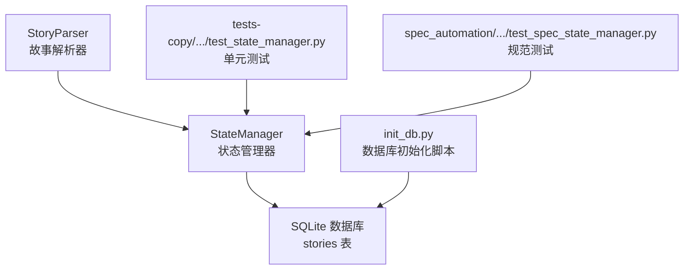
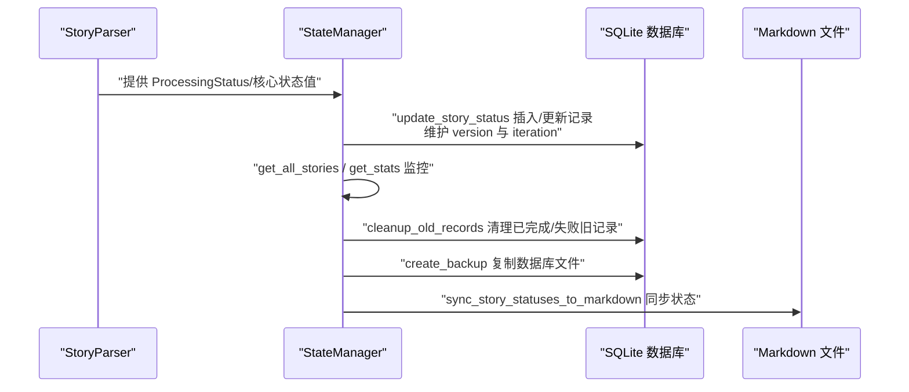
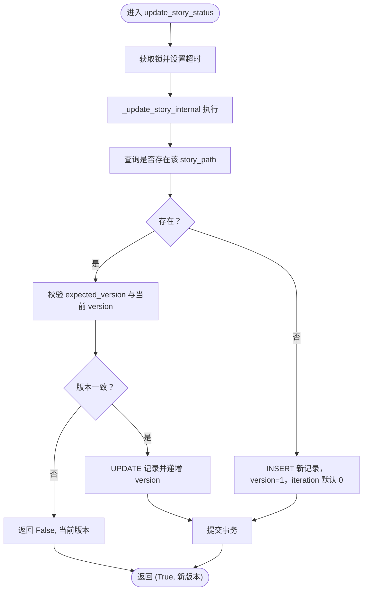
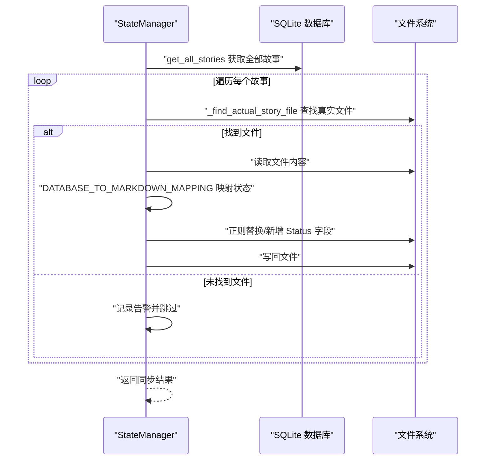
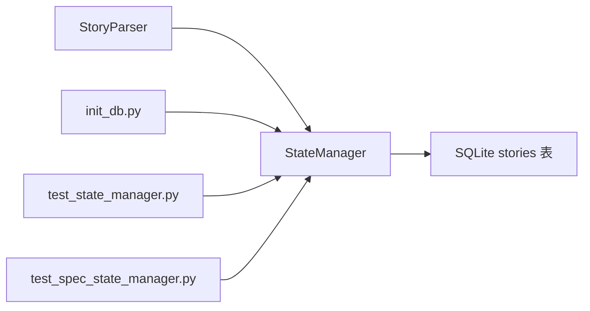

# 生命周期管理

<cite>
**本文引用的文件**
- [state_manager.py](file://autoBMAD/epic_automation/state_manager.py)
- [story_parser.py](file://autoBMAD/epic_automation/story_parser.py)
- [init_db.py](file://autoBMAD/epic_automation/init_db.py)
- [test_state_manager.py](file://tests-copy/epic_automation/test_state_manager.py)
- [test_spec_state_manager.py](file://spec_automation/tests/spec_automation/test_spec_state_manager.py)
</cite>

## 目录
1. [简介](#简介)
2. [项目结构](#项目结构)
3. [核心组件](#核心组件)
4. [架构总览](#架构总览)
5. [详细组件分析](#详细组件分析)
6. [依赖关系分析](#依赖关系分析)
7. [性能考量](#性能考量)
8. [故障排查指南](#故障排查指南)
9. [结论](#结论)
10. [附录](#附录)

## 简介
本文件聚焦“故事生命周期管理”，围绕从创建到完成的完整流程，系统阐述以下能力：
- update_story_status 如何处理新故事的插入与现有故事的更新，以及 iteration 字段的迭代计数语义
- get_all_stories 与 get_stats 如何支撑生命周期监控
- cleanup_old_records 如何基于时间策略清理已完成或失败的旧记录
- create_backup 如何保障生命周期数据的安全性
- sync_story_statuses_to_markdown 如何将数据库状态同步回 Markdown 文件

## 项目结构
与生命周期管理直接相关的模块与文件如下：
- 状态管理器：负责故事状态的持久化、并发控制、统计与同步
- 故事解析器：提供状态值的标准化与映射，支撑生命周期状态的来源一致性
- 数据库初始化脚本：创建 stories 表及索引，确保状态管理器的表结构可用
- 测试用例：覆盖状态 CRUD、统计、并发、序列化等关键行为

图表来源
- [state_manager.py](file://autoBMAD/epic_automation/state_manager.py#L132-L179)
- [story_parser.py](file://autoBMAD/epic_automation/story_parser.py#L80-L110)
- [init_db.py](file://autoBMAD/epic_automation/init_db.py#L33-L60)
- [test_state_manager.py](file://tests-copy/epic_automation/test_state_manager.py#L36-L49)
- [test_spec_state_manager.py](file://spec_automation/tests/spec_automation/test_spec_state_manager.py#L76-L112)

章节来源
- [state_manager.py](file://autoBMAD/epic_automation/state_manager.py#L132-L179)
- [story_parser.py](file://autoBMAD/epic_automation/story_parser.py#L80-L110)
- [init_db.py](file://autoBMAD/epic_automation/init_db.py#L33-L60)
- [test_state_manager.py](file://tests-copy/epic_automation/test_state_manager.py#L36-L49)
- [test_spec_state_manager.py](file://spec_automation/tests/spec_automation/test_spec_state_manager.py#L76-L112)

## 核心组件
- 状态管理器（StateManager）
  - 负责故事状态的插入/更新、乐观锁、并发控制、统计、备份、清理与同步
  - 提供 get_all_stories、get_stats、cleanup_old_records、create_backup、sync_story_statuses_to_markdown 等方法
- 故事解析器（StoryParser）
  - 提供 ProcessingStatus 枚举与核心状态值映射，保证生命周期状态的一致性
- 数据库初始化（init_db.py）
  - 创建 stories 表、索引，确保状态管理器可用

章节来源
- [state_manager.py](file://autoBMAD/epic_automation/state_manager.py#L132-L179)
- [story_parser.py](file://autoBMAD/epic_automation/story_parser.py#L80-L110)
- [init_db.py](file://autoBMAD/epic_automation/init_db.py#L33-L60)

## 架构总览
生命周期管理的端到端流程如下：
- 故事状态来源：由 StoryParser 的 ProcessingStatus 与核心状态值映射，统一到数据库的 status 字段
- 状态持久化：StateManager.update_story_status 负责插入或更新 stories 记录，维护 version 与 iteration
- 生命周期监控：StateManager.get_all_stories 与 get_stats 提供全量与按状态计数
- 数据治理：StateManager.cleanup_old_records 基于时间策略清理已完成/失败记录；create_backup 提供安全备份
- 状态同步：StateManager.sync_story_statuses_to_markdown 将数据库状态映射回 Markdown 的 Status 字段

图表来源
- [story_parser.py](file://autoBMAD/epic_automation/story_parser.py#L80-L110)
- [state_manager.py](file://autoBMAD/epic_automation/state_manager.py#L203-L348)
- [state_manager.py](file://autoBMAD/epic_automation/state_manager.py#L462-L542)
- [state_manager.py](file://autoBMAD/epic_automation/state_manager.py#L569-L603)
- [state_manager.py](file://autoBMAD/epic_automation/state_manager.py#L544-L568)
- [state_manager.py](file://autoBMAD/epic_automation/state_manager.py#L627-L795)

## 详细组件分析

### update_story_status：新故事插入与现有故事更新
- 并发与锁
  - 使用 asyncio.Lock 与超时控制，避免并发写冲突
  - 内部方法 _update_story_internal 在锁内执行数据库操作
- 乐观锁
  - 通过 version 字段实现乐观锁：若传入 expected_version 与当前版本不一致，返回 False 并返回当前版本，避免覆盖他人更新
- 插入新故事
  - 若不存在对应 story_path，则插入新记录，初始 version=1，iteration 默认 0（可显式传入）
- 更新现有故事
  - 更新 status、phase、iteration、qa_result、error_message、updated_at，并递增 version
  - qa_result 会先做清理与 JSON 序列化，确保可持久化
- 返回值
  - 返回 (是否成功, 当前版本号)，便于上层进行乐观锁重试或状态回滚

图表来源
- [state_manager.py](file://autoBMAD/epic_automation/state_manager.py#L203-L348)

章节来源
- [state_manager.py](file://autoBMAD/epic_automation/state_manager.py#L203-L348)

### iteration 字段：迭代计数语义
- 语义说明
  - iteration 表示该故事在生命周期内的迭代次数，通常用于记录同一故事多次失败后再次推进的次数
  - 插入时默认 0，更新时可递增，便于追踪修复与回归
- 测试验证
  - 单元测试覆盖了多次失败后最终完成的场景，验证 iteration 与 status 的一致性

章节来源
- [test_state_manager.py](file://tests-copy/epic_automation/test_state_manager.py#L263-L277)

### get_all_stories 与 get_stats：生命周期监控
- get_all_stories
  - 返回所有故事记录，包含 epic_path、story_path、status、iteration、phase、version、created_at、updated_at 等字段
  - 适合生成报表、导出数据或进行全量审计
- get_stats
  - 按 status 分组统计数量，便于看板与仪表盘展示
- 测试验证
  - 规范测试与单元测试均验证了表结构创建、索引存在与统计结果正确性

章节来源
- [state_manager.py](file://autoBMAD/epic_automation/state_manager.py#L462-L542)
- [test_spec_state_manager.py](file://spec_automation/tests/spec_automation/test_spec_state_manager.py#L76-L112)
- [test_state_manager.py](file://tests-copy/epic_automation/test_state_manager.py#L235-L247)

### cleanup_old_records：基于时间策略的旧记录清理
- 策略
  - 删除 updated_at 早于 N 天、且 status 为 completed 或 failed 的记录
  - 通过 SQL 条件过滤，避免误删进行中或草稿态故事
- 返回值
  - 返回删除的记录数，便于审计与日志记录
- 测试验证
  - 单元测试覆盖了并发访问下的正确性与统计结果

章节来源
- [state_manager.py](file://autoBMAD/epic_automation/state_manager.py#L569-L603)
- [test_state_manager.py](file://tests-copy/epic_automation/test_state_manager.py#L288-L310)

### create_backup：生命周期数据的安全性保障
- 机制
  - 基于 shutil.copy2 复制数据库文件，生成带时间戳的备份文件名
  - 失败时记录错误日志并返回 None
- 适用场景
  - 数据库迁移、批量清理前的保护、灾难恢复演练

章节来源
- [state_manager.py](file://autoBMAD/epic_automation/state_manager.py#L544-L568)

### sync_story_statuses_to_markdown：数据库状态同步回 Markdown
- 目标
  - 将数据库中的每个故事状态映射为 Markdown 的 Status 字段值，并写回对应文件
- 映射规则
  - 数据库状态到 Markdown 的映射表覆盖：pending/review/completed/failed/cancelled、qa_*、error 等
  - 若目标文件不存在，尝试查找实际存在的文件；若仍不存在则跳过并记录告警
- 更新策略
  - 支持多种 Status 字段格式（含旧版），优先使用正则替换；若未找到字段则在文件首标题前插入
- 返回结果
  - 返回同步结果字典，包含成功数、失败数与错误列表

图表来源
- [state_manager.py](file://autoBMAD/epic_automation/state_manager.py#L627-L795)

章节来源
- [state_manager.py](file://autoBMAD/epic_automation/state_manager.py#L627-L795)

## 依赖关系分析
- StateManager 依赖
  - stories 表：status、iteration、version、qa_result、error_message、created_at、updated_at、phase、epic_path
  - StoryParser：提供 ProcessingStatus 与核心状态值映射，确保数据库状态与文档状态一致
  - init_db.py：初始化数据库表与索引，保证运行时可用
- 测试依赖
  - 单元测试与规范测试覆盖了表创建、索引、CRUD、统计、并发、序列化等关键路径

图表来源
- [story_parser.py](file://autoBMAD/epic_automation/story_parser.py#L80-L110)
- [state_manager.py](file://autoBMAD/epic_automation/state_manager.py#L132-L179)
- [init_db.py](file://autoBMAD/epic_automation/init_db.py#L33-L60)
- [test_state_manager.py](file://tests-copy/epic_automation/test_state_manager.py#L36-L49)
- [test_spec_state_manager.py](file://spec_automation/tests/spec_automation/test_spec_state_manager.py#L76-L112)

章节来源
- [story_parser.py](file://autoBMAD/epic_automation/story_parser.py#L80-L110)
- [state_manager.py](file://autoBMAD/epic_automation/state_manager.py#L132-L179)
- [init_db.py](file://autoBMAD/epic_automation/init_db.py#L33-L60)
- [test_state_manager.py](file://tests-copy/epic_automation/test_state_manager.py#L36-L49)
- [test_spec_state_manager.py](file://spec_automation/tests/spec_automation/test_spec_state_manager.py#L76-L112)

## 性能考量
- 并发与锁
  - 使用 asyncio.Lock 与超时，避免长时间阻塞；内部方法在锁内执行数据库操作
- 连接池
  - StateManager 支持可选的 DatabaseConnectionPool，启用 WAL 模式与 PRAGMA 调优，提升并发读写性能
- 索引
  - idx_story_path 与 idx_status 索引有助于 get_all_stories 与按状态查询的性能
- I/O 与序列化
  - qa_result 的 JSON 序列化与清理在写入前完成，减少后续读取开销

章节来源
- [state_manager.py](file://autoBMAD/epic_automation/state_manager.py#L59-L95)
- [state_manager.py](file://autoBMAD/epic_automation/state_manager.py#L132-L179)

## 故障排查指南
- 并发冲突与超时
  - update_story_status 在超时或取消时返回 False/None；可通过增加 lock_timeout 或重试乐观锁版本
- 乐观锁冲突
  - 若返回 False 且返回当前版本，应在上层重试并传入最新 expected_version
- 文件不存在
  - sync_story_statuses_to_markdown 在找不到实际文件时会跳过并记录告警；请确认 story_path 与实际文件路径映射
- 数据库不可用
  - 检查数据库文件是否存在、权限是否正确；init_db.py 可用于初始化或验证表结构
- 备份失败
  - create_backup 返回 None 时查看日志，确认磁盘空间与权限

章节来源
- [state_manager.py](file://autoBMAD/epic_automation/state_manager.py#L203-L260)
- [state_manager.py](file://autoBMAD/epic_automation/state_manager.py#L627-L795)
- [init_db.py](file://autoBMAD/epic_automation/init_db.py#L197-L218)

## 结论
本生命周期管理方案以 StateManager 为核心，结合 StoryParser 的状态映射与 init_db 的表结构初始化，实现了：
- 严谨的插入/更新与乐观锁，保障并发安全
- 清晰的迭代计数与版本管理，便于审计与回溯
- 全量与按状态统计，满足监控与看板需求
- 基于时间策略的旧记录清理与数据库备份，兼顾数据治理与安全
- 自动同步至 Markdown 的 Status 字段，打通数据库与文档的一致性

## 附录
- 数据模型（简化）
  - stories 表包含：epic_path、story_path（UNIQUE）、status、iteration、qa_result、error_message、created_at、updated_at、phase、version
- 状态映射参考
  - ProcessingStatus 与核心状态值映射，确保数据库状态与文档状态一致

章节来源
- [init_db.py](file://autoBMAD/epic_automation/init_db.py#L33-L60)
- [story_parser.py](file://autoBMAD/epic_automation/story_parser.py#L80-L110)