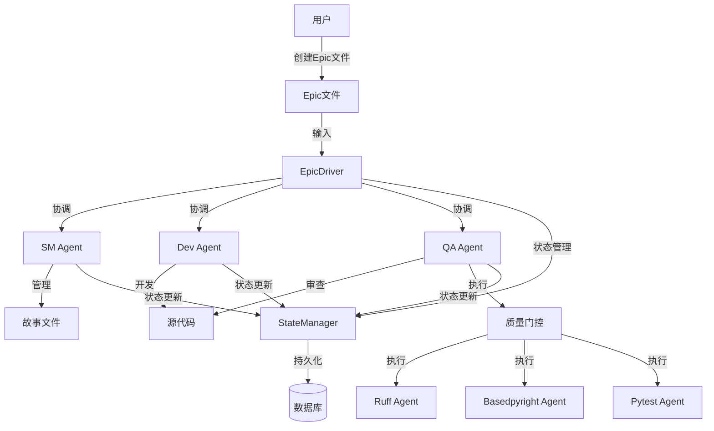
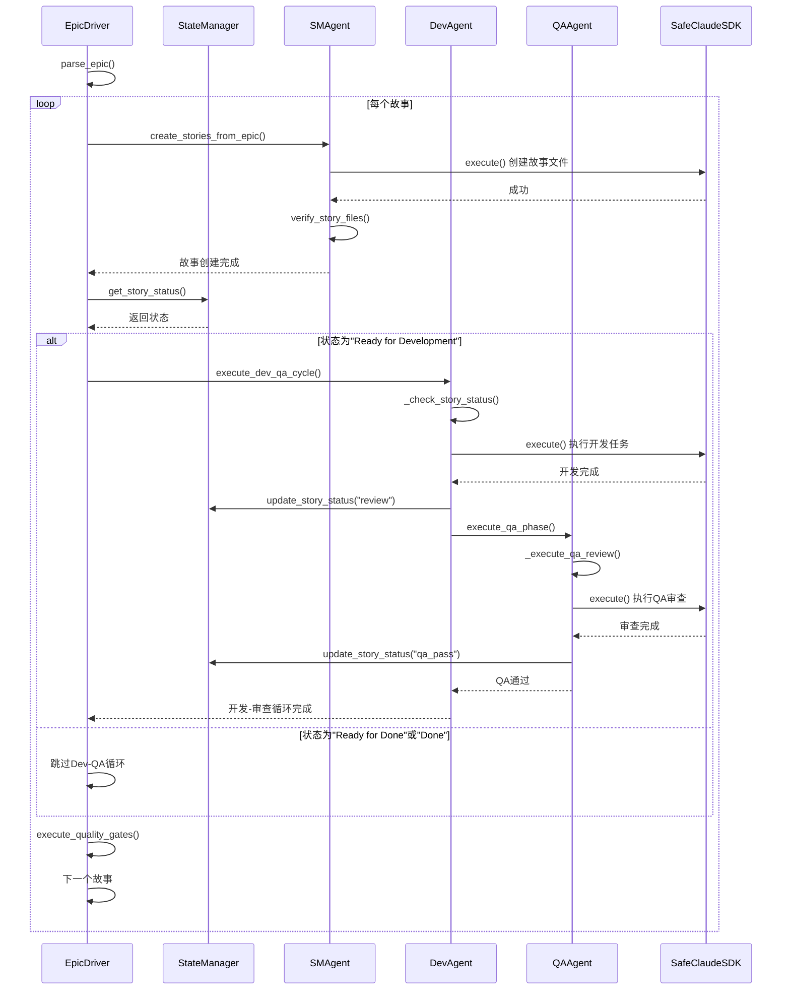

# 系统架构设计

<cite>
**本文档引用的文件**   
- [epic_driver.py](file://autoBMAD/epic_automation/epic_driver.py)
- [state_manager.py](file://autoBMAD/epic_automation/state_manager.py)
- [sm_agent.py](file://autoBMAD/epic_automation/sm_agent.py)
- [dev_agent.py](file://autoBMAD/epic_automation/dev_agent.py)
- [qa_agent.py](file://autoBMAD/epic_automation/qa_agent.py)
- [quality_agents.py](file://autoBMAD/epic_automation/quality_agents.py)
- [story_parser.py](file://autoBMAD/epic_automation/story_parser.py)
- [sdk_session_manager.py](file://autoBMAD/epic_automation/sdk_session_manager.py)
- [sdk_wrapper.py](file://autoBMAD/epic_automation/sdk_wrapper.py)
</cite>

## 目录
1. [系统上下文图](#系统上下文图)
2. [EpicDriver核心协调器设计](#epicdriver核心协调器设计)
3. [组件分解与交互](#组件分解与交互)
4. [数据流分析](#数据流分析)
5. [设计模式应用](#设计模式应用)
6. [技术决策与约束](#技术决策与约束)

## 系统上下文图

**图源**
- [epic_driver.py](file://autoBMAD/epic_automation/epic_driver.py)
- [state_manager.py](file://autoBMAD/epic_automation/state_manager.py)
- [sm_agent.py](file://autoBMAD/epic_automation/sm_agent.py)
- [dev_agent.py](file://autoBMAD/epic_automation/dev_agent.py)
- [qa_agent.py](file://autoBMAD/epic_automation/qa_agent.py)
- [quality_agents.py](file://autoBMAD/epic_automation/quality_agents.py)

## EpicDriver核心协调器设计

EpicDriver是整个自动化系统的核心协调器，负责驱动SM-Dev-QA循环并管理整个工作流。它作为系统的单一入口点，接收Epic文件作为输入，并协调各个代理（Agent）完成故事的创建、开发、审查和质量保证。

EpicDriver通过初始化`SMAgent`、`DevAgent`、`QAAgent`和`StateManager`等核心组件来构建其执行环境。它利用`QualityGateOrchestrator`类来管理质量门控流程，确保代码在合并前通过所有质量检查。EpicDriver的设计体现了命令模式，它将复杂的自动化流程封装为一系列可执行的命令，由`execute_dev_qa_cycle`等方法具体实现。

**组件源**
- [epic_driver.py](file://autoBMAD/epic_automation/epic_driver.py#L535-L2172)
- [quality_agents.py](file://autoBMAD/epic_automation/quality_agents.py#L762-L989)

## 组件分解与交互

### 核心组件类图

```mermaid
classDiagram
class EpicDriver {
+epic_path : Path
+epic_id : str
+tasks_dir : Path
+stories : list[dict[str, Any]]
+current_story_index : int
+max_iterations : int
+retry_failed : bool
+verbose : bool
+concurrent : bool
+use_claude : bool
+source_dir : str
+test_dir : str
+sm_agent : Any
+dev_agent : Any
+qa_agent : Any
+state_manager : Any
+logger : logging.Logger
+log_manager : LogManager
+__init__(epic_path : str, ...)
+_setup_logging() Logger
+parse_epic() list[dict[str, Any]]
+execute_dev_qa_cycle(story_path : str) bool
+_check_state_consistency() bool
+_find_story_file_with_fallback(stories_dir : Path, story_id : str, epic_prefix : str) Path | None
+_is_story_ready_for_done(story_path : str) bool
+_parse_story_status_sync(story_path : str) str
}
class StateManager {
+db_path : Path
+_lock : asyncio.Lock
+_deadlock_detector : DeadlockDetector
+_connection_pool : DatabaseConnectionPool | None
+__init__(db_path : str = "progress.db", use_connection_pool : bool = True)
+_init_db_sync() void
+_get_db_connection() AsyncContextManager[sqlite3.Connection]
+update_story_status(story_path : str, status : str, phase : str | None = None, iteration : int | None = None, qa_result : Union[dict[str, Any], None] = None, error : str | None = None, epic_path : str | None = None, lock_timeout : float = 30.0, expected_version : int | None = None) tuple[bool, int | None]
+_update_story_internal(story_path : str, status : str, phase : str | None, iteration : int | None, qa_result : Union[dict[str, Any], None], error : str | None, epic_path : str | None, expected_version : int | None) tuple[bool, int | None]
+_clean_qa_result_for_json(qa_result : Any) str | None
+managed_operation() AsyncContextManager[StateManager]
+get_story_status(story_path : str) Union[dict[str, Any], None]
+get_all_stories() list[dict[str, Any]]
+get_stats() dict[str, int]
+create_backup() str | None
+cleanup_old_records(days : int = 30) int
+get_health_status() dict[str, Any]
+sync_story_statuses_to_markdown() dict[str, Any]
+_update_markdown_status(story_path : str, db_status : str) None
+_find_actual_story_file(db_story_path : str) Path | None
}
class SMAgent {
+name : str
+agent_name : str
+phase : str
+project_root : Path | None
+tasks_path : Path | None
+config : dict[str, Any]
+status_parser : SimpleStoryParser | None
+__init__(project_root : str | None = None, tasks_path : str | None = None, config : dict[str, Any] | None = None)
+_find_story_file(stories_dir : Path, story_id : str) Path | None
+execute(story_content : str, story_path : str = "") bool
+_parse_story_metadata(story_content : str) dict[str, Any] | None
+_validate_story_structure(story_data : dict[str, Any]) dict[str, Any]
+create_story(title : str, description : str, epic_path : str) dict[str, Any] | None
+create_stories_from_epic(epic_path : str) bool
+_extract_story_ids_from_epic(content : str) list[str]
+_call_claude_create_stories(epic_path : str, story_ids : list[str]) bool
+_build_claude_prompt(epic_path : str, story_ids : list[str]) str
+_execute_claude_sdk(prompt : str) bool
+_execute_sdk_with_logging(prompt : str) bool
+_verify_story_files(story_ids : list[str], epic_path : str) tuple[bool, list[str]]
+_update_story_statuses(story_ids : list[str], stories_dir : Path) None
+_check_existing_stories(epic_path : str, story_ids : list[str]) bool
}
class DevAgent {
+name : str
+use_claude : bool
+_claude_available : bool
+_session_manager : SDKSessionManager
+_log_manager : LogManager | None
+_current_story_path : None
+status_parser : SimpleStoryParser | None
+__init__(use_claude : bool = True, log_manager : LogManager | None = None)
+_validate_prompt_format(prompt : str) bool
+_check_claude_available() bool
+execute(story_path : str) bool
+_extract_requirements(story_content : str) dict[str, Any]
+_validate_requirements(requirements : dict[str, Any]) dict[str, Any]
+_execute_development_tasks(requirements : dict[str, Any]) bool
+_handle_qa_feedback(qa_prompt : str, story_path : str) bool
+_execute_single_claude_sdk(prompt : str, story_path : str, log_manager : LogManager | None = None) bool
+_notify_qa_agent(story_path : str) dict[str, Any] | None
+_update_story_completion(story_content : str, requirements : dict[str, Any]) None
+_check_story_status(story_path : str) str | None
}
class QAAgent {
+name : str = "QA Agent"
+_session_manager : SDKSessionManager
+status_parser : SimpleStoryParser | None
+__init__()
+_parse_story_status(story_path : str) str
+execute(story_path : str, cached_status : str | None = None) dict[str, str | bool | list[str] | int | None]
+execute_qa_phase(story_path : str, source_dir : str = "src", test_dir : str = "tests", cached_status : str | None = None) bool
+_execute_qa_review(story_path : str, source_dir : str, test_dir : str) QAResult
+_execute_ai_qa_review(story_path : str) bool
+_build_qa_prompt(story_path : str) str
+_create_sdk_execution_function(prompt : str) Callable
+_check_story_status(story_path : str) bool
+_evaluate_story_status(status : str) bool
+_perform_fallback_qa_review(story_path : str, source_dir : str = "src", test_dir : str = "tests") QAResult
+_check_code_quality_basics(story_path : str) dict[str, Any]
+_check_test_files_exist(story_path : str) dict[str, Any]
+_check_documentation_updated(story_path : str) dict[str, Any]
}
class CodeQualityAgent {
+tool_name : str
+command_template : str
+__init__(tool_name : str, command_template : str)
+execute_check(source_dir : Path) tuple[bool, list[dict[str, Any]]]
+fix_issues(issues : list[dict[str, Any]], source_dir : Path, max_turns : int = 150) tuple[bool, str, int]
+retry_cycle(source_dir : Path, max_cycles : int = 3, retries_per_cycle : int = 2) dict[str, Any]
+_generate_fix_prompt(issues : list[dict[str, Any]], source_dir : Path) str
}
class RuffAgent {
+__init__()
+format_code(source_dir : Path) bool
+execute_check(source_dir : Path) tuple[bool, list[dict[str, Any]]]
+fix_issues(issues : list[dict[str, Any]], source_dir : Path, max_turns : int = 150) tuple[bool, str, int]
}
class BasedpyrightAgent {
+__init__()
+execute_check(source_dir : Path) tuple[bool, list[dict[str, Any]]]
+fix_issues(issues : list[dict[str, Any]], source_dir : Path, max_turns : int = 150) tuple[bool, str, int]
+_generate_fix_prompt(issues : list[dict[str, Any]], source_dir : Path) str
}
class PytestAgent {
+logger : logging.Logger
+__init__()
+run_tests(test_dir : str, source_dir : str) dict[str, Any]
}
class QualityGateOrchestrator {
+source_dir : str
+test_dir : str
+skip_quality : bool
+skip_tests : bool
+logger : logging.Logger
+results : dict[str, Any]
+__init__(source_dir : str, test_dir : str, skip_quality : bool = False, skip_tests : bool = False)
+_update_progress(phase : str, status : str, start : bool = False, end : bool = False) None
+_calculate_duration(start_time : float, end_time : float) float
+execute_ruff_agent(source_dir : str) dict[str, Any]
+execute_basedpyright_agent(source_dir : str) dict[str, Any]
+execute_pytest_agent(test_dir : str) dict[str, Any]
+execute_quality_gates(epic_id : str) dict[str, Any]
+_finalize_results() dict[str, Any]
}
class SimpleStoryParser {
+sdk_wrapper : Optional[SafeClaudeSDK]
+__init__(sdk_wrapper : Optional[SafeClaudeSDK] = None)
+parse_status(content : str) str
+_regex_fallback_parse_status(content : str) str
+_clean_response_string(response : str) str
+_extract_status_from_response(response : str) str
+_simple_fallback_match(cleaned : str) str
+parse_story(content : str) StoryData
+_ai_parse_story(content : str) StoryData
+_parse_story_json(response : str, original_content : str) StoryData
+_regex_parse_story(content : str) StoryData
+parse_epic(content : str) EpicData
+_ai_parse_epic(content : str) EpicData
+_parse_epic_json(response : str, original_content : str) EpicData
+_regex_parse_epic(content : str) EpicData
}
class SDKSessionManager {
+_active_sessions : dict[str, IsolatedSDKContext]
+_lock : asyncio.Lock
+_total_sessions : int
+_successful_sessions : int
+_failed_sessions : int
+_retry_config : dict[str, Any]
+__init__()
+create_session(agent_name : str) AsyncContextManager[IsolatedSDKContext]
+execute_isolated(agent_name : str, sdk_func : Callable[[], Any], timeout : float | None = None, max_retries : int | None = None) SDKExecutionResult
+_calculate_retry_delay(retry_count : int) float
+get_active_sessions() list[str]
+get_session_count() int
+get_statistics() dict[str, Any]
+cancel_all_sessions() int
+get_session_health_summary() dict[str, Any]
}
class IsolatedSDKContext {
+agent_name : str
+session_id : str
+_cancel_event : asyncio.Event
+_is_active : bool
+_start_time : float | None
+_health_checker : SessionHealthChecker
+__aenter__() IsolatedSDKContext
+__aexit__(exc_type : type | None, exc_val : BaseException | None, exc_tb : Any) bool
+request_cancel() None
+is_cancelled() bool
+is_active() bool
+get_elapsed_time() float
+check_health() bool
}
class SafeClaudeSDK {
+prompt : str
+options : Any
+timeout : float | None
+message_tracker : SDKMessageTracker
+log_manager : Any | None
+__init__(prompt : str, options : Any, timeout : float | None = None, log_manager : Any | None = None)
+_extract_message_content(message : Any) str | None
+_extract_assistant_content(message : Any) str | None
+_extract_system_content(message : Any) str | None
+_extract_user_content(message : Any) str | None
+_extract_result_content(message : Any) str | None
+_classify_message_type(message : Any) str
+execute() bool
+_safe_cleanup() None
+_execute_safely() bool
+_run_isolated_generator(safe_generator : SafeAsyncGenerator) bool
+_check_work_completed() bool
}
class SDKMessageTracker {
+latest_message : str | None
+message_type : str
+message_count : int
+start_time : float
+_stop_event : asyncio.Event
+_display_task : asyncio.Task[None] | None
+log_manager : Any | None
+__init__(log_manager : Any | None = None)
+update_message(message : str, msg_type : str = "INFO") None
+get_elapsed_time() float
+start_periodic_display() None
+stop_periodic_display(timeout : float = 1.0) None
+signal_stop() None
+_periodic_display() None
+display_final_summary() None
}
class SafeAsyncGenerator {
+generator : AsyncIterator[Any]
+cleanup_timeout : float
+_closed : bool
+__init__(generator : AsyncIterator[Any], cleanup_timeout : float = 1.0)
+__aiter__() SafeAsyncGenerator
+__anext__() Any
+aclose() None
+_ensure_cleanup_complete() None
}
EpicDriver --> SMAgent : "使用"
EpicDriver --> DevAgent : "使用"
EpicDriver --> QAAgent : "使用"
EpicDriver --> StateManager : "使用"
EpicDriver --> QualityGateOrchestrator : "创建"
QualityGateOrchestrator --> RuffAgent : "使用"
QualityGateOrchestrator --> BasedpyrightAgent : "使用"
QualityGateOrchestrator --> PytestAgent : "使用"
DevAgent --> StateManager : "更新状态"
QAAgent --> StateManager : "更新状态"
SMAgent --> StateManager : "更新状态"
DevAgent --> QAAgent : "通知审查"
QAAgent --> DevAgent : "反馈修复"
DevAgent --> SafeClaudeSDK : "使用"
QAAgent --> SafeClaudeSDK : "使用"
SMAgent --> SafeClaudeSDK : "使用"
SafeClaudeSDK --> SDKMessageTracker : "使用"
SafeClaudeSDK --> SafeAsyncGenerator : "使用"
SDKSessionManager --> IsolatedSDKContext : "创建"
DevAgent --> SDKSessionManager : "使用"
QAAgent --> SDKSessionManager : "使用"
SMAgent --> SDKSessionManager : "使用"
SimpleStoryParser --> SafeClaudeSDK : "可选使用"
DevAgent --> SimpleStoryParser : "使用"
QAAgent --> SimpleStoryParser : "使用"
SMAgent --> SimpleStoryParser : "使用"
```

**图源**
- [epic_driver.py](file://autoBMAD/epic_automation/epic_driver.py)
- [state_manager.py](file://autoBMAD/epic_automation/state_manager.py)
- [sm_agent.py](file://autoBMAD/epic_automation/sm_agent.py)
- [dev_agent.py](file://autoBMAD/epic_automation/dev_agent.py)
- [qa_agent.py](file://autoBMAD/epic_automation/qa_agent.py)
- [quality_agents.py](file://autoBMAD/epic_automation/quality_agents.py)
- [story_parser.py](file://autoBMAD/epic_automation/story_parser.py)
- [sdk_session_manager.py](file://autoBMAD/epic_automation/sdk_session_manager.py)
- [sdk_wrapper.py](file://autoBMAD/epic_automation/sdk_wrapper.py)

### SM-Dev-QA循环序列图

**图源**
- [epic_driver.py](file://autoBMAD/epic_automation/epic_driver.py)
- [state_manager.py](file://autoBMAD/epic_automation/state_manager.py)
- [sm_agent.py](file://autoBMAD/epic_automation/sm_agent.py)
- [dev_agent.py](file://autoBMAD/epic_automation/dev_agent.py)
- [qa_agent.py](file://autoBMAD/epic_automation/qa_agent.py)
- [sdk_wrapper.py](file://autoBMAD/epic_automation/sdk_wrapper.py)

## 数据流分析

系统的数据流始于Epic文件，由EpicDriver解析后，驱动SM-Dev-QA循环。数据流的核心是故事文件（Story File）和数据库状态。

1.  **Epic文件输入**：用户创建的Epic Markdown文件是整个流程的起点。EpicDriver通过`parse_epic`方法解析该文件，提取故事ID列表。
2.  **故事创建（SM阶段）**：SMAgent根据故事ID，调用Claude SDK创建相应的故事文件。这些文件遵循预定义的模板，包含标题、状态、验收标准等元数据。
3.  **状态同步**：StateManager通过SQLite数据库持久化每个故事的处理状态。当DevAgent或QAAgent完成其任务时，会调用`update_story_status`方法更新数据库。同时，`sync_story_statuses_to_markdown`方法会将数据库中的状态反向同步到故事文件的Markdown中，确保两者一致。
4.  **开发与审查循环（Dev-QA阶段）**：对于每个状态为“Ready for Development”的故事，EpicDriver会启动Dev-QA循环。DevAgent首先检查故事状态，然后调用Claude SDK执行开发任务。完成后，它会通知QAAgent。QAAgent执行审查，如果发现问题，会生成一个包含修复指令的提示，并再次调用DevAgent，形成一个闭环。
5.  **质量门控**：当所有故事都通过QA审查后，EpicDriver会调用`QualityGateOrchestrator`。该组件依次执行Ruff、Basedpyright和Pytest三个质量检查，确保代码的格式、类型安全和功能正确性。

**组件源**
- [epic_driver.py](file://autoBMAD/epic_automation/epic_driver.py#L680-L800)
- [state_manager.py](file://autoBMAD/epic_automation/state_manager.py#L203-L456)
- [sm_agent.py](file://autoBMAD/epic_automation/sm_agent.py#L264-L320)
- [dev_agent.py](file://autoBMAD/epic_automation/dev_agent.py#L239-L304)
- [qa_agent.py](file://autoBMAD/epic_automation/qa_agent.py#L222-L359)

## 设计模式应用

### 命令模式 (Command Pattern)
命令模式在系统中被广泛应用。`EpicDriver`类充当调用者（Invoker），而`SMAgent`、`DevAgent`和`QAAgent`则扮演命令（Command）的角色。`EpicDriver`并不关心这些代理的具体实现，它只知道如何调用它们的`execute`方法。这种设计将请求的发起者与执行者解耦，使得系统可以轻松地添加新的代理或修改现有代理的行为，而无需改变`EpicDriver`的代码。

### 责任链模式 (Chain of Responsibility Pattern)
责任链模式体现在QA审查流程中。`QAAgent`首先尝试使用AI进行审查（`_execute_ai_qa_review`）。如果AI审查失败或不可用，它会自动回退到基础的`_perform_fallback_qa_review`方法，执行文件存在性、代码质量和测试文件等基本检查。这形成了一条处理链，每个处理器（AI审查器、基础审查器）都有机会处理请求，如果前一个处理器无法处理，则将请求传递给下一个。

### 状态模式 (State Pattern)
状态模式通过`StateManager`和`ProcessingStatus`枚举来实现。故事的生命周期被定义为一系列离散的状态，如`PENDING`、`IN_PROGRESS`、`REVIEW`、`COMPLETED`等。`StateManager`负责根据当前状态执行相应的操作。例如，当故事状态为`REVIEW`时，系统会触发QA审查流程。这种模式避免了复杂的条件判断，使状态转换逻辑更加清晰和易于维护。

### 观察者模式 (Observer Pattern)
观察者模式体现在状态管理机制中。`StateManager`是被观察的主题（Subject），而`EpicDriver`、`DevAgent`、`QAAgent`等组件是观察者（Observer）。当故事状态在`StateManager`中被更新时，这些观察者会收到通知（通过方法调用），并根据新的状态做出反应。例如，`DevAgent`在执行前会检查故事状态，以决定是开始开发还是跳过。

**组件源**
- [epic_driver.py](file://autoBMAD/epic_automation/epic_driver.py)
- [state_manager.py](file://autoBMAD/epic_automation/state_manager.py)
- [story_parser.py](file://autoBMAD/epic_automation/story_parser.py)
- [dev_agent.py](file://autoBMAD/epic_automation/dev_agent.py)
- [qa_agent.py](file://autoBMAD/epic_automation/qa_agent.py)

## 技术决策与约束

### 技术决策
1.  **异步架构**：整个系统采用异步编程模型（`asyncio`），以高效处理I/O密集型任务，如文件读写、网络请求和调用外部CLI工具。这显著提高了系统的并发处理能力。
2.  **SQLite状态管理**：选择SQLite作为状态持久化方案，因为它轻量、无需独立服务器、易于部署，并且支持ACID事务，能保证状态数据的一致性。
3.  **AI优先的解析策略**：`SimpleStoryParser`采用AI优先、正则回退的策略。它首先尝试使用Claude SDK进行语义理解，如果失败则回退到传统的正则表达式匹配。这在保证解析准确性的同时，也提供了良好的向后兼容性。
4.  **隔离的SDK会话**：通过`SDKSessionManager`和`IsolatedSDKContext`，为每个Agent的SDK调用创建独立的执行上下文，有效防止了`cancel scope`错误在不同Agent间的传播。

### 权衡取舍
1.  **复杂性 vs. 可靠性**：引入`SafeAsyncGenerator`、`SafeClaudeSDK`和`SDKSessionManager`等包装器虽然增加了代码的复杂性，但极大地提高了系统在处理外部SDK调用时的可靠性和健壮性，避免了因取消操作导致的崩溃。
2.  **性能 vs. 安全性**：`StateManager`使用`asyncio.Lock`来保护数据库操作，虽然可能在高并发下成为性能瓶颈，但确保了数据的线程安全。对于大多数自动化场景，这种权衡是合理的。
3.  **灵活性 vs. 约束**：系统强制要求故事文件必须遵循特定的命名和结构规范（如`1.1.md`），这限制了用户的自由度，但为自动化解析和处理提供了必要的结构化基础。

### 系统约束
1.  **依赖外部SDK**：系统的核心功能（故事创建、开发、审查）严重依赖`claude-agent-sdk`。如果该SDK不可用或配置错误，相关功能将无法正常工作。
2.  **文件系统依赖**：系统假设存在特定的目录结构（如`docs/stories/`、`src/`、`tests/`）。如果这些目录不存在或路径配置错误，会导致文件查找失败。
3.  **Python环境**：系统需要一个配置好的Python环境，并安装了`ruff`、`basedpyright`和`pytest`等质量检查工具，否则质量门控流程将无法执行。

**组件源**
- [epic_driver.py](file://autoBMAD/epic_automation/epic_driver.py)
- [state_manager.py](file://autoBMAD/epic_automation/state_manager.py)
- [sdk_session_manager.py](file://autoBMAD/epic_automation/sdk_session_manager.py)
- [sdk_wrapper.py](file://autoBMAD/epic_automation/sdk_wrapper.py)
- [quality_agents.py](file://autoBMAD/epic_automation/quality_agents.py)