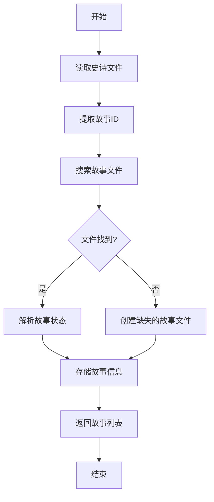
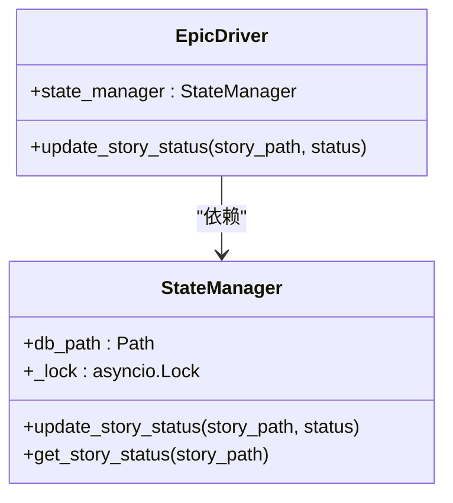
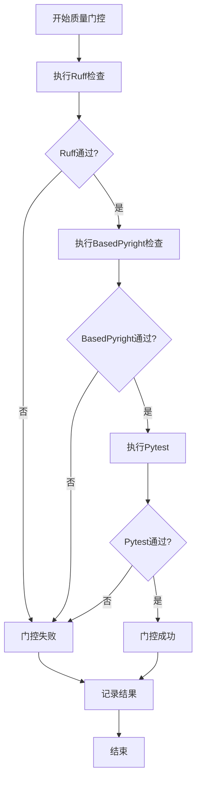
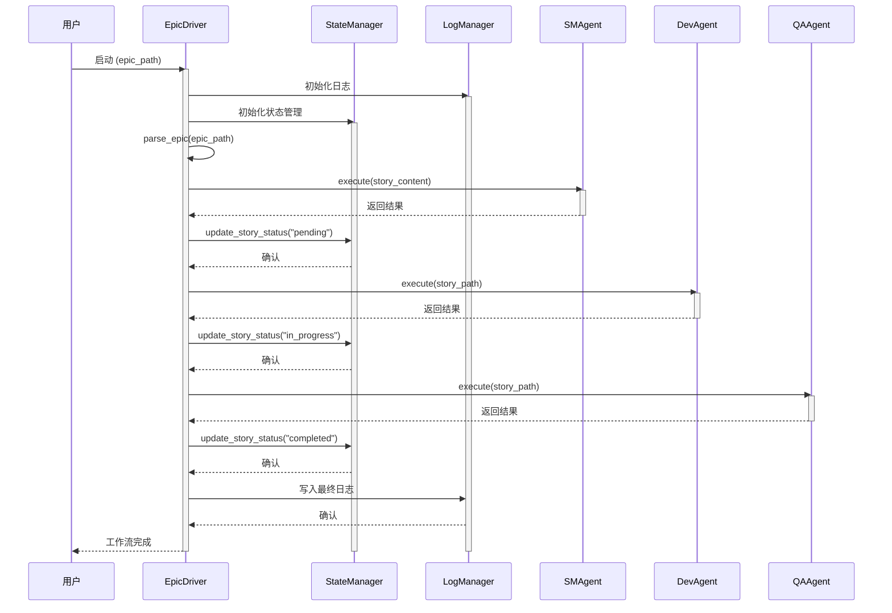

# EpicDriver协调机制

<cite>
**本文档引用的文件**
- [epic_driver.py](file://autoBMAD/epic_automation/epic_driver.py)
- [state_manager.py](file://autoBMAD/epic_automation/state_manager.py)
- [log_manager.py](file://autoBMAD/epic_automation/log_manager.py)
- [story_parser.py](file://autoBMAD/epic_automation/story_parser.py)
- [sm_agent.py](file://autoBMAD/epic_automation/sm_agent.py)
- [dev_agent.py](file://autoBMAD/epic_automation/dev_agent.py)
- [qa_agent.py](file://autoBMAD/epic_automation/qa_agent.py)
- [sdk_wrapper.py](file://autoBMAD/epic_automation/sdk_wrapper.py)
</cite>

## 目录
1. [引言](#引言)
2. [核心组件分析](#核心组件分析)
3. [EpicDriver工作流协调机制](#epicdriver工作流协调机制)
4. [状态管理与日志记录集成](#状态管理与日志记录集成)
5. [错误处理与重试机制](#错误处理与重试机制)
6. [质量门控执行](#质量门控执行)
7. [组件交互序列图](#组件交互序列图)
8. [结论](#结论)

## 引言
EpicDriver是BMAD自动化系统的核心协调器，负责驱动SM-Dev-QA（故事管理-开发-质量保证）循环。它作为主工作流协调器，解析史诗（epic）文件，协调各个阶段的执行，并通过与StateManager和LogManager的集成来管理状态和日志。本文档详细阐述了EpicDriver的协调机制，包括其如何解析史诗文件、执行各阶段任务、执行质量门控，以及与关键组件的集成方式。

## 核心组件分析

EpicDriver协调机制由多个核心组件构成，每个组件负责特定的功能，共同完成自动化工作流。

**EpicDriver** 是主协调器，负责解析史诗文件、驱动SM-Dev-QA循环、协调各代理（Agent）的执行，并管理整体工作流的状态。它通过`parse_epic`方法解析史诗文件以提取故事信息，并通过`execute_sm_phase`、`execute_dev_phase`和`execute_qa_phase`方法执行各阶段任务。

**StateManager** 是一个基于SQLite的状态管理器，用于持久化地跟踪每个故事的进度。它存储故事的状态、迭代次数、QA结果等元数据，并提供原子性的状态更新操作，确保在并发环境下的数据一致性。

**LogManager** 提供统一的日志记录系统，支持自动创建时间戳日志文件、实时增量更新和控制台与文件的双重写入模式。它确保了运行时日志的完整性和可追溯性。

**StoryParser** 是一个统一的Markdown解析器，采用AI优先、正则回退的策略。它使用Claude SDK进行语义理解来解析故事状态，当AI解析失败时，会回退到正则表达式进行解析，确保了高解析成功率。

**各阶段代理（Agent）** 包括SMAgent、DevAgent和QAAgent，它们分别负责故事管理、开发实现和质量保证审查。这些代理通过调用Claude SDK来执行具体任务，并将结果反馈给EpicDriver。

**Section sources**
- [epic_driver.py](file://autoBMAD/epic_automation/epic_driver.py#L535-L2172)
- [state_manager.py](file://autoBMAD/epic_automation/state_manager.py#L97-L866)
- [log_manager.py](file://autoBMAD/epic_automation/log_manager.py#L18-L426)
- [story_parser.py](file://autoBMAD/epic_automation/story_parser.py#L213-L800)

## EpicDriver工作流协调机制

EpicDriver的核心功能是协调SM-Dev-QA循环。其工作流程始于解析史诗文件，并驱动各个阶段的代理依次执行。

### 史诗文件解析
EpicDriver通过`parse_epic`方法解析史诗文件。该方法首先读取史诗文件内容，然后提取其中的故事ID。接着，它会搜索`docs/stories/`目录下的Markdown文件，通过文件名（如`1.1.md`）与故事ID进行匹配。匹配成功后，它会解析每个故事文件的当前状态，并将故事信息（ID、路径、状态）存储在内部列表中，为后续的阶段执行做准备。

**Diagram sources**
- [epic_driver.py](file://autoBMAD/epic_automation/epic_driver.py#L680-L800)

### 阶段任务执行
EpicDriver通过调用各代理的`execute`方法来执行SM、Dev和QA阶段。

- **SM阶段**：调用`SMAgent.execute`。该代理负责验证故事结构的完整性，检查标题、验收标准和任务等关键字段是否缺失，并确保故事文档符合规范。
- **Dev阶段**：调用`DevAgent.execute`。该代理使用Claude SDK根据故事要求生成或修改代码，并执行开发任务。执行成功后，它会将故事状态更新为“Ready for Review”。
- **QA阶段**：调用`QAAgent.execute`。该代理使用Claude SDK对代码和文档进行审查，检查是否符合质量标准。审查通过后，它会将故事状态更新为“Done”。

每个阶段的执行都是异步的，并且EpicDriver会根据前一阶段的结果决定是否继续执行后续阶段。

**Section sources**
- [epic_driver.py](file://autoBMAD/epic_automation/epic_driver.py#L1020-L1200)
- [sm_agent.py](file://autoBMAD/epic_automation/sm_agent.py#L98-L133)
- [dev_agent.py](file://autoBMAD/epic_automation/dev_agent.py#L239-L304)
- [qa_agent.py](file://autoBMAD/epic_automation/qa_agent.py#L222-L329)

## 状态管理与日志记录集成

EpicDriver通过与StateManager和LogManager的紧密集成，实现了对工作流状态的精确控制和运行时行为的全面监控。

### 与StateManager的集成
EpicDriver在初始化时会创建一个`StateManager`实例。在每个阶段执行完毕后，EpicDriver会调用`StateManager.update_story_status`方法来更新故事的当前状态。例如，在Dev阶段成功完成后，EpicDriver会将故事状态从“In Progress”更新为“review”（处理状态值）。`StateManager`使用SQLite数据库存储这些状态，并通过异步锁（`asyncio.Lock`）来防止并发更新冲突，确保了状态更新的原子性和一致性。

**Diagram sources**
- [epic_driver.py](file://autoBMAD/epic_automation/epic_driver.py#L554-L555)
- [state_manager.py](file://autoBMAD/epic_automation/state_manager.py#L100-L101)

### 与LogManager的集成
EpicDriver在初始化时也会创建一个`LogManager`实例。`LogManager`通过`setup_dual_write`函数将`sys.stdout`和`sys.stderr`重定向到一个自定义的`DualWriteStream`。这个流会同时将输出写入控制台和一个时间戳命名的日志文件中。EpicDriver及其调用的代理在执行过程中产生的所有日志信息，都会通过这个机制被实时记录到文件中，便于后续的分析和调试。

**Section sources**
- [epic_driver.py](file://autoBMAD/epic_automation/epic_driver.py#L556-L557)
- [log_manager.py](file://autoBMAD/epic_automation/log_manager.py#L306-L321)

## 错误处理与重试机制

EpicDriver及其组件具备完善的错误处理和重试机制，以应对执行过程中可能出现的各种异常。

### 错误处理
整个系统采用了分层的错误处理策略。在最底层，`SafeAsyncGenerator`类负责安全地清理异步生成器，捕获并抑制可能导致事件循环关闭的`RuntimeError`（如cancel scope错误）。在中间层，`SafeClaudeSDK`包装器捕获SDK执行过程中的所有异常，并将其转换为有意义的错误信息。在顶层，`EpicDriver`会捕获各阶段执行的异常，并根据配置决定是否重试失败的故事。

### 重试机制
EpicDriver在初始化时接受`max_iterations`和`retry_failed`参数。`max_iterations`定义了单个故事的最大重试次数，而`retry_failed`则控制是否自动重试失败的故事。当某个阶段执行失败时，EpicDriver会根据这些配置决定是放弃该故事还是进行重试，从而提高了工作流的整体鲁棒性。

**Section sources**
- [sdk_wrapper.py](file://autoBMAD/epic_automation/sdk_wrapper.py#L101-L200)
- [epic_driver.py](file://autoBMAD/epic_automation/epic_driver.py#L562-L564)

## 质量门控执行

在QA阶段完成后，EpicDriver会调用`QualityGateOrchestrator`来执行一系列质量门控检查，确保代码质量。

`QualityGateOrchestrator`会依次执行以下检查：
1.  **Ruff Linting**：使用Ruff工具检查代码风格和潜在错误。
2.  **BasedPyright Type Checking**：使用BasedPyright进行静态类型检查。
3.  **Pytest Execution**：运行pytest以验证单元测试是否通过。

这些检查是按顺序执行的，如果前一个检查失败，后续的检查可能会被跳过（取决于配置），从而快速反馈问题。所有检查结果会被汇总并记录到日志中。

**Diagram sources**
- [epic_driver.py](file://autoBMAD/epic_automation/epic_driver.py#L94-L533)

## 组件交互序列图

下图展示了EpicDriver协调各组件执行一个完整SM-Dev-QA周期的序列。

**Diagram sources**
- [epic_driver.py](file://autoBMAD/epic_automation/epic_driver.py#L535-L2172)
- [state_manager.py](file://autoBMAD/epic_automation/state_manager.py#L97-L866)
- [log_manager.py](file://autoBMAD/epic_automation/log_manager.py#L18-L426)

## 结论
EpicDriver是一个功能强大且设计精良的工作流协调器。它通过清晰的职责划分和模块化设计，有效地驱动了SM-Dev-QA循环。其与StateManager和LogManager的深度集成，确保了状态的可靠性和日志的完整性。通过采用AI优先的解析策略和稳健的错误处理机制，EpicDriver能够适应复杂的自动化任务，为BMAD系统的稳定运行提供了坚实的基础。