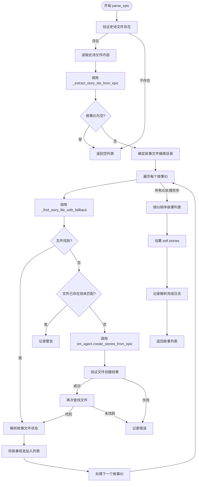
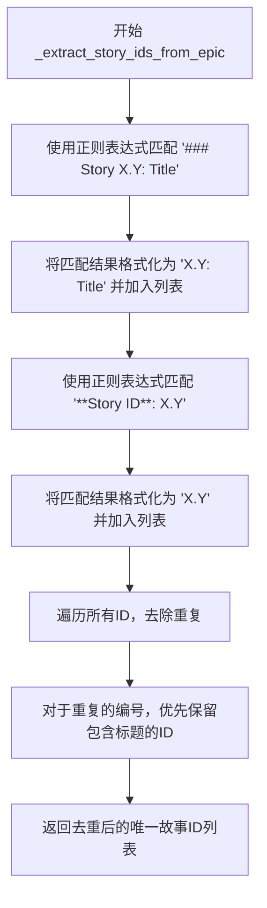
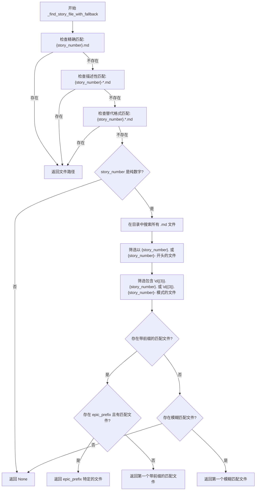

# 史诗文件解析机制

<cite>
**本文档引用的文件**   
- [epic_driver.py](file://autoBMAD/epic_automation/epic_driver.py)
- [story_parser.py](file://autoBMAD/epic_automation/story_parser.py)
- [sm_agent.py](file://autoBMAD/epic_automation/sm_agent.py)
</cite>

## 目录
1. [引言](#引言)
2. [核心解析流程](#核心解析流程)
3. [故事ID提取机制](#故事id提取机制)
4. [文件匹配与回退搜索策略](#文件匹配与回退搜索策略)
5. [缺失文件自动创建](#缺失文件自动创建)
6. [错误处理与日志记录](#错误处理与日志记录)
7. [总结](#总结)

## 引言
`parse_epic` 方法是 EpicDriver 的核心功能，负责解析史诗（Epic）Markdown 文件并提取其中包含的故事（Story）信息。该方法实现了强大的隐式编号关联机制，无需在史诗文档中使用显式的 Markdown 链接即可将史诗与对应的故事文件关联起来。其工作流程包括从史诗文档中提取故事ID、根据文件名模式搜索故事文件，并在文件未找到时通过 SM Agent 自动创建。本文档将详细阐述其内部机制。

## 核心解析流程
`parse_epic` 方法的执行流程是一个多步骤的协调过程，旨在将史诗文档中的信息与物理文件系统中的故事文件进行匹配。其主要步骤如下：

1.  **验证与读取**: 首先检查史诗文件是否存在，若存在则读取其全部内容。
2.  **提取故事ID**: 调用 `_extract_story_ids_from_epic` 方法，从史诗文档的文本内容中解析出所有故事的ID。
3.  **确定搜索目录**: 根据史诗文件的路径，按优先级顺序确定故事文件的搜索目录。
4.  **匹配故事文件**: 对于每一个提取出的故事ID，使用 `_find_story_file_with_fallback` 方法在确定的目录中进行多级回退搜索，以找到匹配的故事文件。
5.  **处理缺失文件**: 如果某个故事ID未能找到匹配的文件，系统会尝试通过 SM Agent 自动创建该文件。
6.  **构建结果**: 将成功匹配（或创建）的故事文件路径、ID和状态信息汇总成一个列表并返回。

**Diagram sources**
- [epic_driver.py](file://autoBMAD/epic_automation/epic_driver.py#L679-L865)

**Section sources**
- [epic_driver.py](file://autoBMAD/epic_automation/epic_driver.py#L679-L865)

## 故事ID提取机制
`_extract_story_ids_from_epic` 方法负责从史诗文档的原始文本中识别并提取所有故事的ID。它使用正则表达式匹配两种常见的模式：

1.  **故事章节模式**: 匹配以 `### Story X.Y: Title` 格式开头的行。例如，`### Story 1.1: 用户登录功能` 会被提取为 `"1.1: 用户登录功能"`。
2.  **故事ID标签模式**: 匹配以 `**Story ID**: X.Y` 格式出现的行。例如，`**Story ID**: 1.1` 会被提取为 `"1.1"`。

该方法还会处理ID的重复问题。当同一个故事编号（如 "1.1"）同时以带标题和不带标题的形式出现时，它会优先保留包含标题信息的ID，以确保信息的完整性。

**Diagram sources**
- [epic_driver.py](file://autoBMAD/epic_automation/epic_driver.py#L873-L961)

**Section sources**
- [epic_driver.py](file://autoBMAD/epic_automation/epic_driver.py#L873-L961)

## 文件匹配与回退搜索策略
`_find_story_file_with_fallback` 方法实现了多级回退的文件搜索逻辑，以应对故事文件命名的多样性。其搜索策略按优先级顺序如下：

1.  **精确匹配**: 搜索 `{story_number}.md` 格式的文件，例如 `1.1.md`。
2.  **描述性匹配**: 搜索 `{story_number}-*.md` 或 `story-{story_number}-*.md` 格式的文件，例如 `1.1-user-login.md` 或 `story-1.1-user-login.md`。
3.  **替代格式匹配**: 搜索 `{story_number}.*.md` 或 `story-{story_number}.*.md` 格式的文件，例如 `1.1.description.md`。
4.  **模糊匹配**: 当故事编号为纯数字时（如 "1"），会进行更复杂的模糊匹配，以处理像 `004.1` 这样带有前缀的编号。此阶段会优先匹配包含前缀的文件（如 `004.1.md`），并且如果已知史诗前缀（epic_prefix），会优先匹配与该前缀相符的文件。

这种分层的搜索策略极大地提高了文件匹配的鲁棒性。

**Diagram sources**
- [epic_driver.py](file://autoBMAD/epic_automation/epic_driver.py#L1011-L1110)

**Section sources**
- [epic_driver.py](file://autoBMAD/epic_automation/epic_driver.py#L1011-L1110)

## 缺失文件自动创建
当 `parse_epic` 方法在所有搜索目录中都未能找到某个故事ID对应的故事文件时，它会触发自动创建机制。该机制的核心是调用 `sm_agent.create_stories_from_epic` 方法。

1.  **触发条件**: 在确认文件不存在（通过 `existing_stories` 集合验证）后，系统会记录日志并调用 SM Agent 的 `create_stories_from_epic` 方法。
2.  **创建过程**: SM Agent 会读取原始的史诗文件，提取所有故事ID，并构建一个包含 Claude 指令的提示词（prompt），指示其根据史诗内容创建所有缺失的故事文件。
3.  **验证与更新**: 文件创建后，`parse_epic` 会立即再次调用 `_find_story_file_with_fallback` 来验证文件是否已成功创建。如果验证通过，则解析新文件的状态并将其加入结果列表；如果失败，则记录错误。

此机制确保了工作流的连续性，即使故事文件缺失，系统也能自动修复并继续执行。

**Section sources**
- [epic_driver.py](file://autoBMAD/epic_automation/epic_driver.py#L791-L827)
- [sm_agent.py](file://autoBMAD/epic_automation/sm_agent.py#L264-L319)

## 错误处理与日志记录
`parse_epic` 方法具备完善的错误处理和日志记录策略，以确保系统的稳定性和可调试性。

*   **异常捕获**: 整个解析过程被包裹在 `try...except` 块中。任何未预期的异常都会被捕获，记录为错误日志，并输出详细的堆栈跟踪信息，最后返回一个空列表，防止程序崩溃。
*   **详细日志**: 系统使用 `logger` 对象输出不同级别的日志信息：
    *   `logger.info`: 记录关键步骤的开始和完成，例如 "Parsing epic: ..." 或 "Epic parsing complete: ...".
    *   `logger.debug`: 记录详细的调试信息，例如匹配到的文件、提取的ID等，有助于问题排查。
    *   `logger.warning`: 记录非致命性问题，例如 "No stories found in epic document" 或 "Missing story files for IDs: ...".
    *   `logger.error`: 记录致命错误，例如 "Epic file not found" 或 "Failed to create story".
*   **状态报告**: 在解析结束时，会汇总并报告成功找到的故事数量和缺失的故事ID，为用户提供清晰的执行结果。

**Section sources**
- [epic_driver.py](file://autoBMAD/epic_automation/epic_driver.py#L867-L871)
- [epic_driver.py](file://autoBMAD/epic_automation/epic_driver.py#L691-L695)
- [epic_driver.py](file://autoBMAD/epic_automation/epic_driver.py#L853-L855)

## 总结
`parse_epic` 方法是连接史诗文档与故事文件的关键桥梁。它通过智能的ID提取、多级回退的文件搜索以及自动化的文件创建机制，实现了强大的隐式关联功能。其设计充分考虑了实际项目中文件命名的多样性和潜在的缺失情况，结合详尽的错误处理和日志记录，确保了整个自动化工作流的健壮性和可靠性。