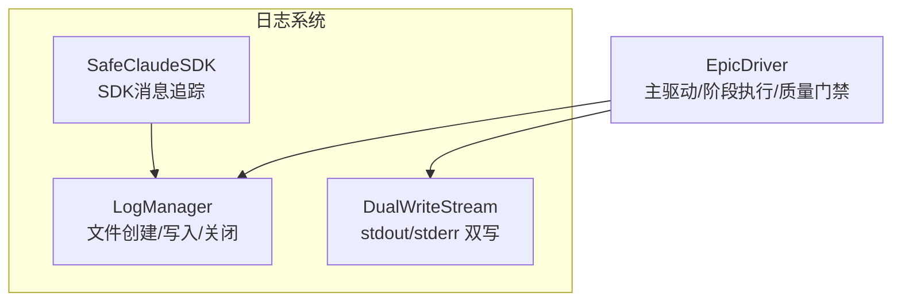
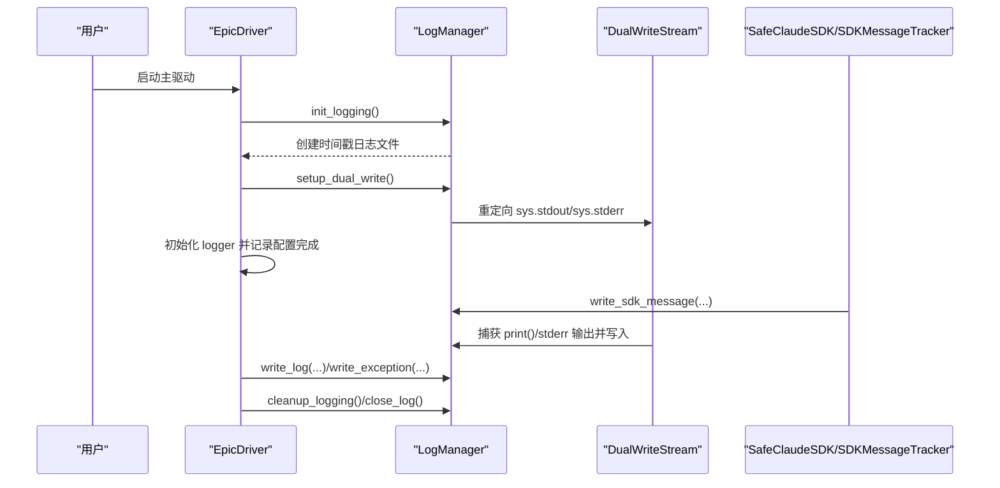
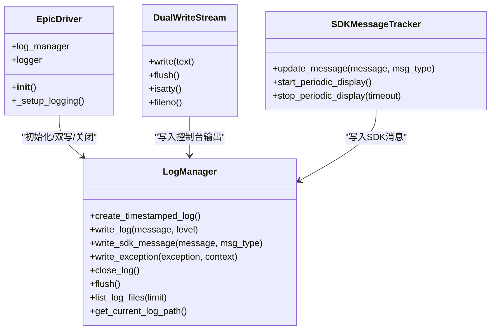

# 日志系统集成

<cite>
**本文引用的文件**
- [epic_driver.py](file://autoBMAD/epic_automation/epic_driver.py)
- [log_manager.py](file://autoBMAD/epic_automation/log_manager.py)
- [sdk_wrapper.py](file://autoBMAD/epic_automation/sdk_wrapper.py)
- [LOGSYSTEM_README.md](file://autoBMAD/epic_automation/LOGSYSTEM_README.md)
</cite>

## 目录
1. [简介](#简介)
2. [项目结构](#项目结构)
3. [核心组件](#核心组件)
4. [架构总览](#架构总览)
5. [详细组件分析](#详细组件分析)
6. [依赖关系分析](#依赖关系分析)
7. [性能考量](#性能考量)
8. [故障排查指南](#故障排查指南)
9. [结论](#结论)
10. [附录](#附录)

## 简介
本文件围绕 EpicDriver 与 LogManager 的集成机制展开，系统性阐述以下主题：
- EpicDriver 如何通过 setup_dual_write() 实现“控制台+文件”的双写日志机制；
- 如何通过 LogManager 实现结构化日志记录（含时间戳、相对时间、消息类型等）；
- 日志初始化流程 init_logging、日志级别配置与消息格式化规则；
- 关键操作（如阶段执行、质量检查）中的日志记录模式；
- 日志文件创建、实时写入、异常处理与日志关闭的完整生命周期管理。

## 项目结构
日志系统由三个关键模块构成：
- EpicDriver：主驱动，负责工作流编排与日志集成入口；
- LogManager：统一日志管理器，负责文件创建、实时写入、异常记录与关闭；
- SDKWrapper：SDK封装与消息追踪，将 SDK 消息同步写入日志文件。

图表来源
- [log_manager.py](file://autoBMAD/epic_automation/log_manager.py#L377-L425)
- [epic_driver.py](file://autoBMAD/epic_automation/epic_driver.py#L611-L615)
- [sdk_wrapper.py](file://autoBMAD/epic_automation/sdk_wrapper.py#L200-L250)

章节来源
- [epic_driver.py](file://autoBMAD/epic_automation/epic_driver.py#L611-L615)
- [log_manager.py](file://autoBMAD/epic_automation/log_manager.py#L377-L425)
- [sdk_wrapper.py](file://autoBMAD/epic_automation/sdk_wrapper.py#L200-L250)

## 核心组件
- EpicDriver：在构造函数中实例化 LogManager，调用 init_logging 完成日志系统初始化，并通过 setup_dual_write() 启用双写模式；随后在运行过程中使用 logger 记录阶段与质量门禁等关键事件。
- LogManager：负责创建带时间戳的日志文件、写入普通日志与 SDK 消息、记录异常、周期性刷新缓冲区、列出最近日志文件、关闭日志文件并输出结束页脚。
- SDKWrapper：SDKMessageTracker 将 SDK 消息写入日志文件，同时在控制台输出，配合 DualWriteStream 实现“控制台+文件”双写。

章节来源
- [epic_driver.py](file://autoBMAD/epic_automation/epic_driver.py#L611-L678)
- [log_manager.py](file://autoBMAD/epic_automation/log_manager.py#L377-L425)
- [sdk_wrapper.py](file://autoBMAD/epic_automation/sdk_wrapper.py#L200-L250)

## 架构总览
下图展示了 EpicDriver 与 LogManager 的交互路径，以及双写模式如何将 stdout/stderr 同步写入日志文件。

图表来源
- [epic_driver.py](file://autoBMAD/epic_automation/epic_driver.py#L611-L615)
- [log_manager.py](file://autoBMAD/epic_automation/log_manager.py#L377-L425)
- [sdk_wrapper.py](file://autoBMAD/epic_automation/sdk_wrapper.py#L200-L250)

## 详细组件分析

### EpicDriver 与日志初始化
- 在构造函数中：
  - 实例化 LogManager；
  - 调用 init_logging 完成日志系统初始化（创建时间戳日志文件、配置 logging 基本格式、记录初始化日志）；
  - 调用 setup_dual_write 启用双写模式（重定向 sys.stdout 与 sys.stderr）；
  - 重新设置 logger 级别与日志文件路径提示。
- 生命周期收尾：
  - 在运行结束处调用 cleanup_logging，确保日志文件被正确关闭并输出结束页脚。

章节来源
- [epic_driver.py](file://autoBMAD/epic_automation/epic_driver.py#L611-L678)
- [epic_driver.py](file://autoBMAD/epic_automation/epic_driver.py#L1948-L1950)

### LogManager：结构化日志记录
- 文件创建与头尾部：
  - create_timestamped_log：按运行时间生成唯一日志文件名，写入头部信息并刷新；
  - close_log：写入结束页脚并关闭句柄。
- 写入接口：
  - write_log：写入普通日志，包含绝对时间、日志级别、相对运行时间与消息正文；
  - write_sdk_message：写入 SDK 消息，包含绝对时间、SDK 类型（如 THINKING/TOOL_USE/USER/TOOL_RESULT/SYSTEM）与相对运行时间；
  - write_exception：写入异常，包含异常类型、消息与完整堆栈。
- 辅助能力：
  - flush：强制刷新缓冲区；
  - list_log_files：列出最近若干个日志文件；
  - get_current_log_path：返回当前日志文件路径；
  - log_cancellation/log_state_resync：记录取消与状态同步事件。

章节来源
- [log_manager.py](file://autoBMAD/epic_automation/log_manager.py#L53-L215)
- [log_manager.py](file://autoBMAD/epic_automation/log_manager.py#L216-L298)

### 双写模式：setup_dual_write 与 DualWriteStream
- init_logging：
  - 创建时间戳日志文件；
  - 配置 logging 基本格式（控制台 handler），避免重复写文件。
- setup_dual_write：
  - 将 sys.stdout 与 sys.stderr 替换为 DualWriteStream；
  - DualWriteStream.write：同时向原控制台输出与日志文件写入，对 Unicode 编码进行兼容处理。
- SDKWrapper：
  - SDKMessageTracker.update_message：在控制台输出 SDK 消息的同时，调用 LogManager.write_sdk_message 写入文件。

章节来源
- [log_manager.py](file://autoBMAD/epic_automation/log_manager.py#L377-L425)
- [sdk_wrapper.py](file://autoBMAD/epic_automation/sdk_wrapper.py#L200-L250)

### 日志初始化流程（init_logging）
- 创建时间戳日志文件；
- 配置 logging 基本格式与控制台 handler；
- 记录“日志系统初始化完成”与“日志文件路径”等关键信息。

章节来源
- [log_manager.py](file://autoBMAD/epic_automation/log_manager.py#L377-L404)

### 日志级别配置与消息格式化规则
- 日志级别：
  - EpicDriver 中通过 logger.setLevel 控制日志详细程度（verbose 影响级别）；
  - 可通过修改 logging.getLogger().setLevel(...) 调整全局级别。
- 消息格式：
  - 普通日志：包含绝对时间、日志级别、相对运行时间与消息正文；
  - SDK 消息：包含绝对时间、SDK 类型、相对运行时间与消息正文；
  - 异常日志：包含分隔线、上下文、异常类型、异常消息与堆栈；
  - 双写输出：捕获 print()/stderr 输出，统一以 [STDOUT]/[STDERR] 标记写入日志。

章节来源
- [log_manager.py](file://autoBMAD/epic_automation/log_manager.py#L90-L146)
- [log_manager.py](file://autoBMAD/epic_automation/log_manager.py#L147-L185)
- [log_manager.py](file://autoBMAD/epic_automation/log_manager.py#L300-L358)
- [epic_driver.py](file://autoBMAD/epic_automation/epic_driver.py#L664-L678)

### 关键操作中的日志记录模式
- 阶段执行（SM/Dev/QA）：
  - 在 EpicDriver 中记录解析、匹配、创建故事文件、阶段开始/结束等关键节点；
  - 使用 logger.info/warning/error 记录流程与异常。
- 质量门禁（Ruff/Basedpyright/Pytest）：
  - QualityGateOrchestrator 在每个阶段开始、结束、失败、跳过时记录进度与耗时；
  - 失败与异常通过 warning/error 记录，并汇总错误列表。

章节来源
- [epic_driver.py](file://autoBMAD/epic_automation/epic_driver.py#L166-L229)
- [epic_driver.py](file://autoBMAD/epic_automation/epic_driver.py#L230-L296)
- [epic_driver.py](file://autoBMAD/epic_automation/epic_driver.py#L298-L448)
- [epic_driver.py](file://autoBMAD/epic_automation/epic_driver.py#L450-L533)

### 日志文件创建、实时写入、异常处理与关闭的生命周期
- 创建：init_logging 调用 create_timestamped_log，生成带时间戳的日志文件并写入头部；
- 实时写入：write_log/write_sdk_message/close_log/flush 提供持续写入与刷新；
- 异常处理：write_exception 记录异常上下文与堆栈，保证问题可追溯；
- 关闭：cleanup_logging 调用 close_log 输出结束页脚并释放资源。

章节来源
- [log_manager.py](file://autoBMAD/epic_automation/log_manager.py#L377-L425)
- [log_manager.py](file://autoBMAD/epic_automation/log_manager.py#L147-L185)
- [log_manager.py](file://autoBMAD/epic_automation/log_manager.py#L186-L215)

## 依赖关系分析
- EpicDriver 依赖 LogManager 完成日志初始化与双写；
- SDKWrapper 依赖 LogManager 将 SDK 消息写入日志；
- DualWriteStream 依赖 LogManager 将控制台输出写入日志；
- 三者共同形成“控制台+文件”的双写闭环，确保运行期所有输出均可持久化。

图表来源
- [epic_driver.py](file://autoBMAD/epic_automation/epic_driver.py#L611-L678)
- [log_manager.py](file://autoBMAD/epic_automation/log_manager.py#L377-L425)
- [sdk_wrapper.py](file://autoBMAD/epic_automation/sdk_wrapper.py#L200-L250)

章节来源
- [epic_driver.py](file://autoBMAD/epic_automation/epic_driver.py#L611-L678)
- [log_manager.py](file://autoBMAD/epic_automation/log_manager.py#L377-L425)
- [sdk_wrapper.py](file://autoBMAD/epic_automation/sdk_wrapper.py#L200-L250)

## 性能考量
- CPU：最小影响（异步写入与行缓冲）；
- 内存：忽略不计（行缓冲）；
- 磁盘：取决于日志级别与运行时长度；
- I/O：实时写入，可能带来轻微 I/O 压力，但具备 flush 能力以保障数据持久化。

章节来源
- [LOGSYSTEM_README.md](file://autoBMAD/epic_automation/LOGSYSTEM_README.md#L300-L312)

## 故障排查指南
- 编码错误（UnicodeEncodeError）：
  - 现象：控制台或日志文件编码不兼容；
  - 解决：确保使用 UTF-8 编码；DualWriteStream 已内置编码兼容处理。
- 权限错误（PermissionError）：
  - 现象：无法创建/写入日志目录或文件；
  - 解决：检查 autoBMAD/epic_automation/logs/ 权限。
- 磁盘空间不足：
  - 现象：日志文件占用过多磁盘；
  - 解决：实施日志轮转与定期清理策略。
- 日志级别过高导致性能下降：
  - 建议：在生产环境中使用 INFO/WARNING 级别，必要时通过 --verbose 启用调试。

章节来源
- [LOGSYSTEM_README.md](file://autoBMAD/epic_automation/LOGSYSTEM_README.md#L274-L306)

## 结论
EpicDriver 与 LogManager 的集成实现了“控制台+文件”的双写日志体系，结合 SDKWrapper 的 SDK 消息写入，覆盖了从初始化、阶段执行到质量门禁与异常处理的全流程。通过结构化的日志格式与生命周期管理，系统在保证可观测性的同时，兼顾了性能与可靠性。

## 附录
- 日志文件位置与命名：autoBMAD/epic_automation/logs/epic_YYYYMMDD_HHMMSS.log；
- 日志级别与格式参考：LOGSYSTEM_README.md 中的“日志格式说明”与“消息类型”表格；
- 最佳实践：日志轮转、监控与调试模式。

章节来源
- [LOGSYSTEM_README.md](file://autoBMAD/epic_automation/LOGSYSTEM_README.md#L39-L51)
- [LOGSYSTEM_README.md](file://autoBMAD/epic_automation/LOGSYSTEM_README.md#L155-L203)
- [LOGSYSTEM_README.md](file://autoBMAD/epic_automation/LOGSYSTEM_README.md#L231-L261)